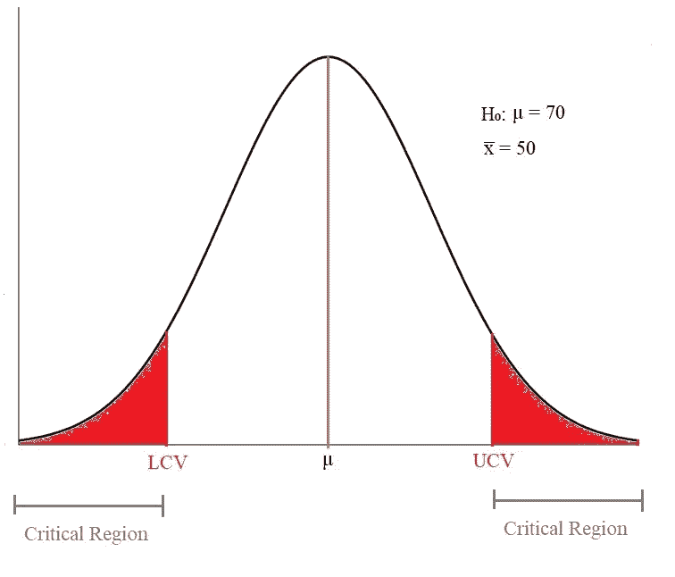
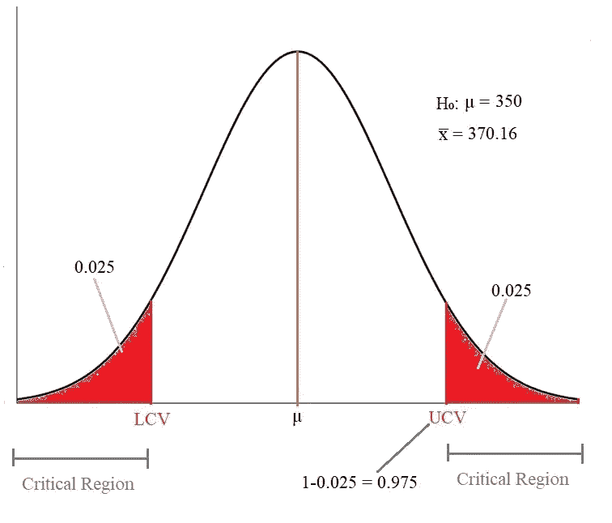
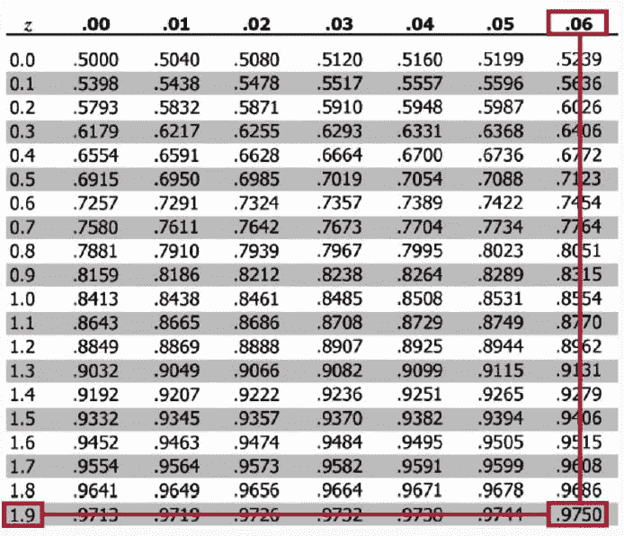
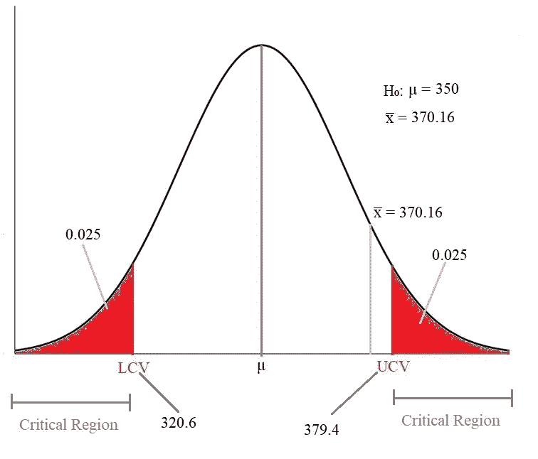
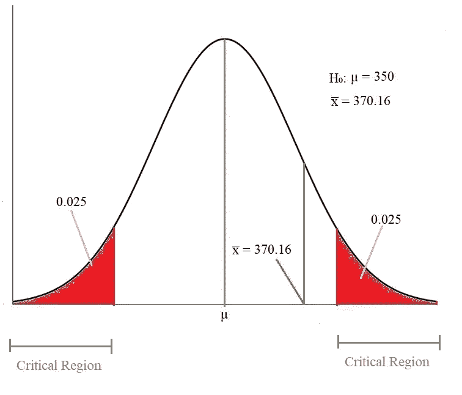
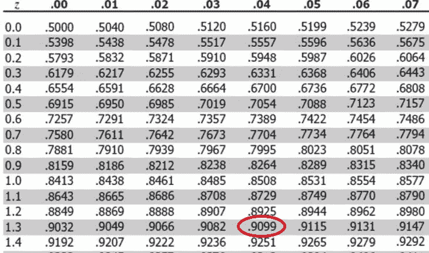

# 假设检验:数据科学

> 原文：<https://towardsdatascience.com/hypothesis-testing-data-science-1b620240802c?source=collection_archive---------19----------------------->

## 利用实验数据进行统计决策的一种统计方法

图片由[皮克斯拜](https://pixabay.com/?utm_source=link-attribution&utm_medium=referral&utm_campaign=image&utm_content=3963945)的 Gerd Altmann 提供

使用推断统计学，我们学会了如何分析样本数据，并对总体均值和其他总体数据做出推断。然而，我们无法证实我们对人口数据得出的结论。这就是为什么**假设检验**的概念出现了。

> 关于[推断统计](/inferential-statistics-data-analysis-e59adc75c6eb)和[中心极限定理](/central-limit-theorem-clt-data-science-19c442332a32)可以在我之前的文章中了解更多。

## 假设

使用推断性、描述性和探索性分析，我们对人口样本进行了一些研究。我们从样本中得出了一些见解，并对整个人口做出了断言。这些只是主张；它们并不完全正确。这种类型的主张或假设被称为**假设。**

## 假设检验

有一些方法或技巧来检查假设，如果假设是正确的，那么我们将它应用于整个人口。这个过程被称为**假设检验。**最终目标是是否有足够的证据证明假设是正确的。正如我们在推论统计学和中心极限定理(CLT)中已经看到的，我们将使用样本数据并在假设检验中证实我们关于总体的假设。

在假设检验中，我们提出两个假设:

*   **零假设(H₀)** :现状
*   **另类假设(H₁)** :挑战现状

## 零假设(H₀)

零假设是关于一个群体的普遍看法。它声明情况或索赔没有变化或差异。 **H₀** 表示零假设**。**

## **替代假设(H₁)**

**替代假设**是反对零假设的主张。H₁表示另一种假设。

例如，在刑事审判中，陪审团必须决定被告是无辜的还是有罪的。这里的无效假设是，被告是无辜的，就像指控之前一样。另一种假设是被告有罪，检察官会试图证明这一点。

## 假设检验的结果

在假设检验中，如果有足够的证据支持替代假设，我们拒绝零假设。如果替代假设没有足够的证据，我们就不能拒绝零假设。这就是我们索赔的方式。在任何情况下，我们都不应该说我们“接受”了零假设。要么我们拒绝，要么我们不能拒绝零假设，就是这样。

**举例:**

如果一家公司有 30000 名员工，声称员工每天到达办公室平均需要 35 分钟。

这里，
**空 Hypothesis(H₀)** :员工平均时间= 35 分钟
**候补 Hypothesis(H₁)** :员工平均时间≠ 35 分钟

## 制定无效和替代假设

有一个共同的规则来制定索赔声明的无效和替代假设。

*   **零假设**总是有以下符号: **=** 或 **≤** 或 **≥**
*   **交替假设**总是有以下迹象:≠或<或>

**例 1**

一家公司在一份声明中声称，其 2022 年 8 月的总估值至少为 200 亿美元。

上述主张的假设是:

*   **Null Hypothesis(H₀):** 总估值≥200 亿美元
*   **候补 Hypothesis(H₁):** 总估值<200 亿美元

**例 2**

另一家公司声称其 2020 年 8 月的总估值超过 200 亿美元。

上述主张的假设是:

*   **Null Hypothesis(H₀):** 总估值≤200 亿美元
*   **候补 Hypothesis(H₁):** 总估值>200 亿美元

正如我们从上面两个例子中所观察到的，我们不能从索赔陈述本身决定现状或制定无效假设。零假设从不包含≠或< or >符号。

在制定无效假设和替代假设之后，下一个最关键的步骤是**做出决定**拒绝或不拒绝无效假设。

## 决定

我们举个例子来理解如何决定拒绝还是不拒绝零假设。

**索赔:**员工到达办公室的平均时间是 70 分钟。我们从公司里随机挑选了一些人，计算出平均时间为 50 分钟。

*   **空 Hypothesis(H₀):** μ = 70
*   样本均值: x̅ = 50

现在，我们根据分布图做出决定，

作者图片

*   如果样本 mean(x̅位于**临界区域内，我们拒绝零 hypothesis(H₀。**
*   如果样本 mean(x̅位于**临界区域之外，我们无法拒绝零 hypothesis(H₀。**

无效假设和替代假设的公式决定了检验的类型和临界区在正态分布中的位置。

基于备选假设中的**“符号”,有三种类型的测试:**

*   ≠在 H₁ →双尾检验→分布两侧的拒绝/临界区域
*   < in H₁ → Lower-tailed test → Rejection/Critical region on the left side of the distribution
*   >h₁→上尾检验→分布右侧的拒绝区域

示例:

1.  如果平均通勤时间至少为 30 分钟，那么 H₀ ≥ 30，H₁ < 30, that means the test is a Lower Tailed test since the critical region will be on the left side of the distribution.
2.  If the average commute time is at most 30 minutes, then H₀≤ 30 and H₁> 30，这意味着测试是一个上尾测试，因为临界区域将在分布的右侧。
3.  如果平均通勤时间是 30 分钟，那么 H₀=是 30 分钟，H₁≠30 是 30 分钟，这意味着测试是一个双尾测试，因为临界区域将在分布的两侧。

为了找到临界区域的临界值，我们使用临界值方法或 p 值方法。

## 临界值法

使用临界值方法进行决策的步骤如下:

1.  制定假设，确定 **H₀** 和 **H₁** 并确认我们要做的测试类型。
2.  根据给定的α值(显著性水平)计算 z 临界值(Zc)的值。
3.  根据试验类型从 Zc 计算临界值(UCV 和 LCV)。
4.  该决定基于临界值的样本 mean(x̅)。

**使用示例查找临界值**

**声称:**假设天气预报声称一个国家的平均降雨量为 350 毫米，标准差(σ)为 90。现在，我们以全国 36 个城市为样本，计算出样本平均 mean(x̅为 370.16。我们不得不拒绝或未能拒绝 5%重要性的索赔。

现在，利用这些信息，我们需要计算临界值。

**1。制定假设**

*   零假设(H₀): μ = 350
*   替代假设(h₁)350

由于 H₁包含≠符号，因此该检验将是一个双尾检验，其临界区域位于正态分布的两侧。

**2。查找 Zc 值**

假设α = 0.05，由于这是一个双尾检验，临界区域位于分布的两侧，因此两侧的显著性水平都是 0.025。这意味着右侧临界区域的面积为 0.025。这意味着直到 UCV 的面积(直到该点的累积概率)将是 1–0.025 = 0.975。

按作者分类的图像—计算临界值

因此，我们需要使用 [Z 表](http://www.z-table.com/)找到值为 0.975 的 Z 得分。Z 分数将是 1.96

来源— [Z 表](http://www.z-table.com/) : Z 值为 0.975 时的得分

Zc = 1.96

**3。计算临界值**

计算临界值的公式为:
UCV =μ+(Zc *σx)
LCV =μ-(Zc *σx)

σx = σ/√n = 90/√36 = 90/6 = 15

UCV = 350+(1.96 * 15)= 379.4
LCV = 350-(1.96 * 15)= 320.6

现在，让我们将μ、x̅、UCV 和 LCV 的所有值绘制在分布图中，并做出决定。

按作者分类的图像—绘制分布图中的所有点

正如我们所看到的，样本 Mean(x̅位于临界区域之外。

**4。做决定**

由于样本均值位于临界区域之外，我们**无法拒绝零假设。**

这就是我们如何使用临界值方法来判断假设是否正确。接下来，我们将看到另一个叫做**的方法 p 值法。**p 值法很重要，在行业中使用更频繁。

## p 值法

简单来说，p 值定义为零假设不被拒绝的概率。这不是正式的定义；是为了更好的理解。

以下是我们使用 p 值法确定零假设时需要遵循的步骤:

1.  制定假设，确定 **H₀** 和 **H₁** 并确认我们要做的测试类型。
2.  计算样本平均值的 Z 值。
3.  使用 z 表计算给定 z 得分的 p 值。
4.  根据给定值σ(显著性)的 p 值做出决定

使用 z 得分计算 p 值。

**情况 1:** 如果样本均值在分布均值的右边，Z 值= +3.02，那么从 Z 表中，我们可以找到值= 0.9987

现在，

对于单尾检验→p = 1–0.9987 = 0.0013
对于双尾检验→p = 2(1–0.9987)= 0.0026

**情况二:**如果样本均值在分布均值的左侧，Z 值= -3.02，那么从 Z 表中，我们可以找到值= 0.0013

现在，

对于单尾检验→ p = 0.0013
对于双尾检验→ p =2*0.0013= 0.0026

**使用示例查找 p 值**

让我们以临界值法所用的同一个天气预报为例。我们有μ = 350，x̅ =370.16，σ=90，α = 5%

σx = σ/√n = 90/√36 = 15

**1。制定假设**

*   零假设(H₀): μ = 350
*   替代假设(h₁)350

由于 H₁包含≠符号，因此该检验将是一个双尾检验，其临界区域位于正态分布的两侧。

按作者分类的图像-分布图中的样本平均值

**2。计算样本平均值的 Z 得分值**

z =(x̅-μ)/σx =(370.16–350)/15 = 1.34

使用 [Z 表](http://www.z-table.com/)，我们将找到 Z 值的累积概率

来源— [Z 表](http://www.z-table.com/):Z = 1.34 时的概率

P(Z=1.34) = 0.9099

**3。计算 p 的值**

使用前面提到的两种情况，因为样本均值位于分布均值的右侧。

由于样本均值位于分布均值的右侧，并且检验是双尾检验，

p = 2(1–0.9099)= 0.1802

**4。做出决定**

由于 p 值(0.1802)大于α值(0.05)，我们**无法拒绝零假设。**

## 错误

在假设检验过程中，我们会犯两种错误:

1.  第一类误差
2.  第二类误差

**第一类错误**

当零假设正确时，第一类错误发生，但我们拒绝它，即当它为真时拒绝 H₀。
1 类错误的概率用 alpha(α)表示，通常为 0.05 或 0.01，即只有 5%或 1%的几率。第 1 类误差也称为**假设检验的显著性水平。**

第二类错误

当零假设为假时，第二类错误发生，但我们未能拒绝它，即，当它为假时，未能拒绝 H₀。实际上，这是我们可能犯的最严重的错误。第二类错误的概率用β表示。

# 结论

正如我们所看到的，假设是我们对一个或多个总体参数的主张或假设。有两种假设，零假设(H₀)和交替假设(H₁).基于这些假设，我们设计了三个检验:双尾检验、下尾检验和上尾检验。最后，借助临界值法和 p 值法，我们决定拒绝或不拒绝零假设。

还有许多其他的方法来做决策，如 t 分布法、双样本均值检验、双样本比例检验、A/B 检验等。一旦我们理解了假设是如何工作的，我们就可以探索更多的方法和技术。

**感谢您阅读**和**快乐编码！！！**

# 在这里查看我以前关于 Python 的文章

*   [**(CLT)中心极限定理:数据科学**](/central-limit-theorem-clt-data-science-19c442332a32)
*   [**推断统计:数据分析**](/inferential-statistics-data-analysis-e59adc75c6eb)
*   [**探索性数据分析(EDA): Python**](/exploratory-data-analysis-eda-python-87178e35b14)
*   [**使用 Python 对 Pandas 数据帧进行索引**](/indexing-in-pandas-dataframe-using-python-63dcc6242323)
*   [**Seaborn:Python**](/seaborn-python-8563c3d0ad41)
*   [**熊猫:蟒蛇**](https://levelup.gitconnected.com/pandas-python-e69f4829fee1)
*   [**Matplotlib:Python**](https://levelup.gitconnected.com/matplotlib-python-ecc7ba303848)
*   [**NumPy: Python**](https://medium.com/coderbyte/numpy-python-f8c8f2bbd13e)
*   [**数据可视化及其重要性:Python**](https://levelup.gitconnected.com/data-visualization-and-its-importance-python-7599c1092a09)

# 参考

*   **假设检验:**[https://www.statisticssolutions.com/hypothesis-testing/](https://www.statisticssolutions.com/hypothesis-testing/)
*   **假设检验在数据科学中的重要性:**[https://analyticsindiamag . com/Importance-Of-Hypothesis-Testing-In-Data-Science/](https://analyticsindiamag.com/importance-of-hypothesis-testing-in-data-science/)
*   **假设检验:**[https://365 data science . com/explainer-video/Hypothesis-testing-steps/](https://365datascience.com/explainer-video/hypothesis-testing-steps/)
*   **Z 评分表:**[http://www.z-table.com/](http://www.z-table.com/)