# 假设检验去神秘化

> 原文：<https://towardsdatascience.com/hypothesis-testing-demystified-e434a665e055?source=collection_archive---------32----------------------->

## 如何将数学翻译成简单的英语

图片由[在](https://pixabay.com/photos/?utm_source=link-attribution&amp;utm_medium=referral&amp;utm_campaign=image&amp;utm_content=1209640) [Pixabay](https://pixabay.com/ro/?utm_source=link-attribution&amp;utm_medium=referral&amp;utm_campaign=image&amp;utm_content=1209640) 上的免费照片提供

假设检验可能是统计研究中最有价值的阶段。这是你得出结论的地方，在这里你可以找到你一直在寻找答案的问题的答案。这些问题应该是简单的是/否问题。假设检验是统计研究的一个阶段，在这个阶段，你正在*将数学翻译成英语*。

假设检验很可能是你的老板希望你做的，如果你是一名统计学家的话。如果你去找他，只是说:“1 = 135，2 = 140”之类的话，那么他/她可能会说:“好吧。但是…这些数字对我的业务意味着什么？好吃吗？很糟糕吗？”。告诉他这样的话会好得多:“我发现统计证据表明，你的新营销策略比以前的策略给我们带来了更多的利润”。

在假设检验的这一点上，是时候把所有那些从你的数据集中获得的讨厌的数字转化成关于你感兴趣的问题的容易理解的陈述了。

## 与反证法的比较

假设检验与数理逻辑中最简单的证明方法之一有一些相似之处:矛盾证明。假设检验可以被认为是矛盾证明的概率对等物。

让我们先回忆一下这个方法。*反证法是如何工作的？*

假设我们想证明一个陈述，称之为 A。当我们用矛盾证明时，我们首先假设 A 的对立面(表示为~A 或非 A)为真，然后我们试图得出一个矛盾(一个总是假的陈述)。如果我们得出一个矛盾，那么这意味着我们的假设~A 为真，应该为假，因此 A 应该为真。

假设检验的思想类似于用矛盾证明的思想，但这一次～A 被称为“零假设”并由 H0 表示，而 A 被称为“替代假设”并由 H1 表示。达到一个矛盾(即得到一个**不可能为真**的结果)现在是达到一个**可以为真的低概率**的结果。这个概率应该有多低？一个常用的值是 0.05；这个阈值被称为**显著性水平**，用α表示。所以，如果给定零假设，你的观测数据的概率≤ α，那么你认为这个概率太低，H0 不可能是真的；所以，你将*拒绝* H0，因此*接受* H1。在假设检验的情况下，而不是**证明 H1** (即以 100%的置信度；数理逻辑证明就是这样)，你 **1-α确信 H1 为真**。

请注意，我们只能接受 H1，不能接受 H0。仅仅因为我们有时不能拒绝 H0，这并不意味着我们接受它。正如用矛盾证明的情况一样，仅仅因为我们假设~A 为真，我们可能不知道如何得出矛盾，这并不一定意味着~A 为真。

基于 H0 是真实的最初假设而得出 H0 是真实的结论是自相矛盾的，因此我们只能拒绝 H0。

## 统计公式

为了进行假设检验，我们首先需要做一些假设:*我们假设我们的观测值 X1，X2，…，Xn 是独立同分布的(独立同分布)，其概率分布为****pθ****；其中θ是一个固定但未知的参数(也可以是更多标量参数的向量)属于θ(大写 theta 所有可能参数的集合为* ***Pθ*** *概率分布族)。*

在假设检验的背景下，我们想对参数θ进行陈述。为此，我们取θ的两个不相交子集:θ0 和θ1，然后考虑以下两个假设:

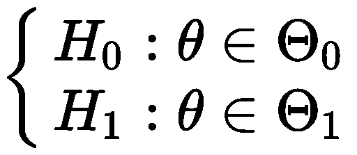

按照惯例，H0 应该被拒绝，而 H1 是我们想要接受的。

例如，考虑以下场景:

你想研究大学毕业生在申请大学之前是否最终得到了他们想要的工作，或者他们是否倾向于改变主意？为此，你去那里收集一些随机选择的 5 年前毕业的人的数据，对于他们每个人，如果他/她在大学前找到了他们想要的工作，你就写下 1，否则写下 0。然后，您将该数据视为 i.i.d .伯努利(p ),并想要测试 p >与否。所以，我们有这些假设:

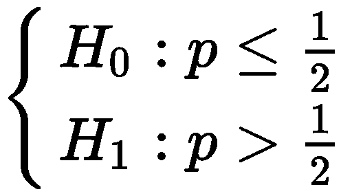

那么，我们如何决定是否拒绝零假设呢？我们使用一个随机变量*来做这个决定*。这个 r.v .(随机变量)是我们的数据的函数，只输出 0(不拒绝)或 1(拒绝)。对于固定参数θ，该 r.v .具有伯努利分布。*我们用来做决定的这个简历叫做* ***测试*** *，用ψ表示。*

测试通常有以下形式之一:

或者:

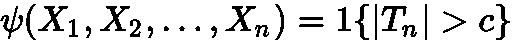

其中:ψ是观测数据 X 1，…，Xn 的函数，记法 **1{。}** 是一个指示器随机变量，当大括号内的表达式为真时取值 1，否则取值 0。Tn 是一个叫做**检验统计量**的随机变量，c 是一个常数。

第一种形式被称为**单侧测试**，因为只有当 Tn 在常数 c 的右侧时，测试才为 1。第二种形式被称为**双侧测试**，因为当 Tn 在 c 的两侧时，测试可以为 1；Tn > c 或 Tn < -c 将导致测试为 1。

## 测试误差

正如您在上面看到的，我们的测试依赖于我们观察到的数据，这些数据是随机的，我们将其建模为 r.v.s X1，…，Xn。所以，我们测试的结果是，嗯…，随机的。我们不能保证当我们应该拒绝 H0 时它总是给我们 1，或者当我们不应该拒绝 H0 时它总是给我们 0。无论我们选择什么样的测试，它都会给我们带来一些错误。

假设检验中可能出现两种错误:

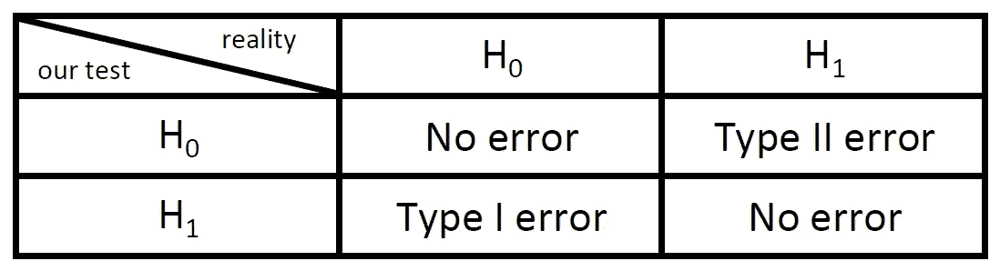

**I 型错误**发生在我们**拒绝 H0** 的时候，但实际上是真的。**第二类错误**是当我们**没有拒绝 H0** 的时候，其实是假的。

第一类和第二类错误的概率都取决于真参数θ，因此它们是θ的函数。

I 类误差的概率，用αψ表示:

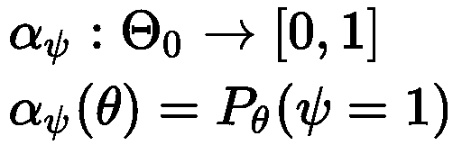

这是当真θ属于θ0 时，我们的测试指示 1 的概率。与θ0 不同的θ可以给出不同的 I 型误差概率。

第二类误差的概率，用βψ表示:

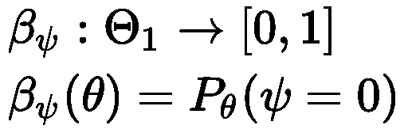

这是当真θ属于θ1 时，我们的测试指示为 0 的概率。θ与θ1 的每一个不同，都会给我们不同的第二类错误概率。

## 显著性水平和 p 值

我们希望我们的测试有小概率的错误。因此，我们希望选择检验统计量 Tn 和常数 c，使这两种错误的概率最小。但是同时最小化两种类型的误差是一个困难的问题。在真参数θ处于θ0 和θ1 之间的边界的最坏情况下，这两类误差的概率是互补的；当一个小的时候，另一个大，我们没有办法把两个都变小。

我们所做的是区分第一类错误的优先级。我们对第一类错误的概率设定了一个上限，这样我们也可以得到一个合理的第二类错误。

为什么我们优先考虑第一类错误？第一类错误是当 H0 为真时，我们拒绝它。在假设检验中，拒绝 H0 是导致“发现”的事情，证明我们最初的猜测(H1)。一个大的 I 型错误意味着我们证明了许多错误的东西。我们不希望这样。我们倾向于不那么频繁地总结 H1，但是当我们这样做的时候，要非常自信地认为我们的结论实际上是正确的。

我们确定的 I 型误差的上限被称为测试的**显著性水平**，用α表示，因此:

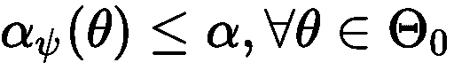

*测试ψ拒绝 H0 的最小水平α称为测试ψ的* ***p 值*** *。*

这可能一开始听起来有点混乱。α和 p 值有什么区别？α是一个你选择的数字，你提前确定它。你可以在收集任何数据或者做任何实验之前选择α。p 值是根据观察数据计算出来的，这是您可以为α确定的最小数值，因此，在根据观察数据计算测试后，您仍然可以剔除 H0。p 值越小，你越有信心拒绝 H0。

## 双样本测试

基于我们之前展示的测试公式:

我们可能会倾向于认为，我们到目前为止所讨论的内容仅适用于我们想要将单个样本的参数与常数进行比较的情况，并且 Tn 应该是该参数的某种估计量。

如果我们不想测试某个样本的参数如何与常数*进行比较，而是测试它如何与另一个样本*的参数进行比较，该怎么办？我们需要想出另一个公式来测试吗？不。我们可以使用相同的测试公式，并保持我们到目前为止讨论的所有内容有效。我们唯一应该做的是给 Tn 加上一个特殊的形式:

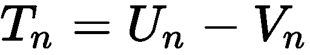

其中 Un 和 Vn 是基于不同的样本计算的。通过使用这个 Tn，我们可以测试 Un 是否大于 Vn。如果您只对 Un 和 Vn 之间的绝对差异感兴趣，只需将它们放在绝对值中，并使用双边测试。

## 利用中心极限定理进行假设检验

到目前为止，我们只是笼统地讨论了假设检验，没有描述具体的检验方法。在我们展示的测试公式中，Tn 可以是任何随机变量。任何基于我们的数据并能以最多α个误差概率拒绝 H0 的怪异和非直觉的随机变量都将是检验统计的良好候选。

然而，一种常用的方法是使用中心极限定理(CLT)来做假设检验。如果我们使用独立同分布随机变量(我们的数据)的平均值作为我们想要测试的参数的估计量，那么 CLT 暗示，当样本大小为 n → ∞时，这个平均值将具有正态分布。然后我们将这个量标准化(减去平均值并除以标准偏差)，并将其视为我们的测试统计量 Tn。以这种方式计算的 Tn 将具有标准正态分布。这是一个众所周知的概率分布，我们可以用它来确定我们的测试需要的常数 c，以满足我们选择的水平α。

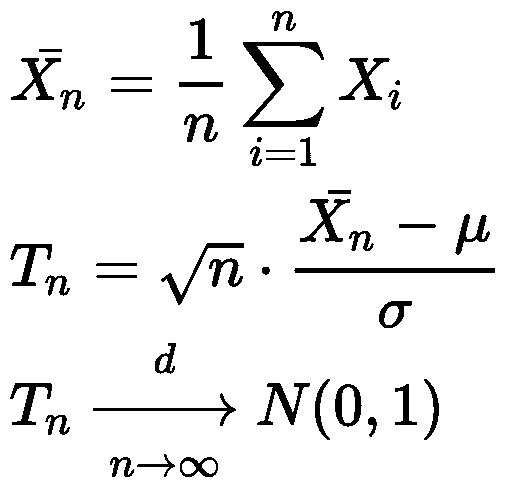

其中:

*   是 Xi 的期望值；这通常是在零假设中假设的
*   σ是 Xi 的标准差；这通常是基于样本的估计值，当 n 趋于无穷大时，它应该非常接近真实的标准差。
*   上面带“d”的箭头表示*分布收敛*。
*   N(0，1)表示标准正态分布

下面是单面情况下的图像:

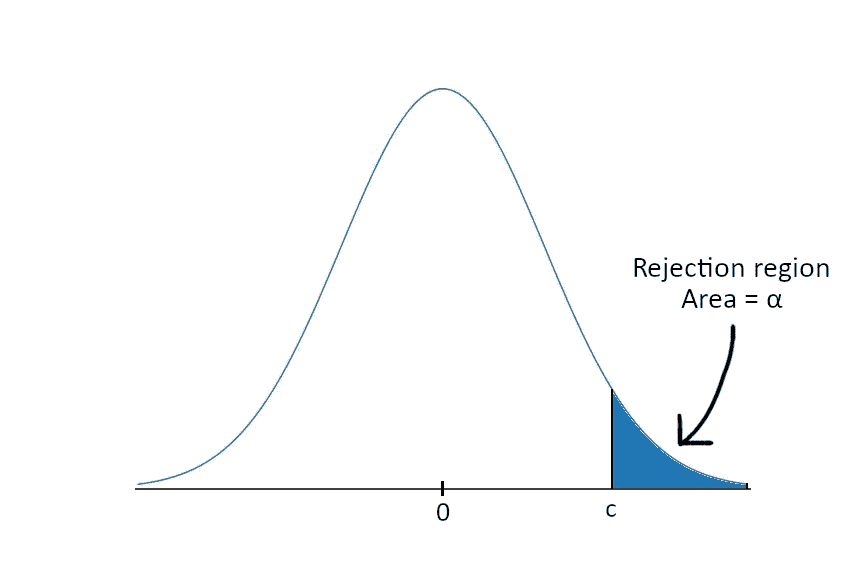

常数 c 是拒绝区域(蓝色)和非拒绝区域之间的阈值。如果 Tn > c (Tn 落在拒绝区域中),我们拒绝 H0，否则我们拒绝失败。c 是基于选择的α值计算的；经过计算，拒绝区域的面积为α。我们可以通过表格或计算器/软件包找到 c。

在这种情况下，p 值是我们得到的 Tn 值右边的区域面积。我们还可以测试 Tn < -c, in which case things would be similar, but the rejection region would be to the left of -c.

Below is illustrated a two-sided test:

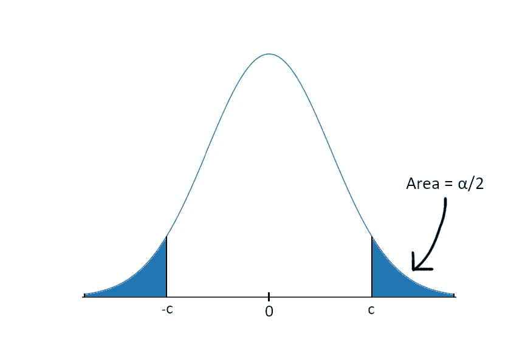

In the case of a 2-sided test, things would be similar, but α is now split between the 2 sub-regions: Tn < -c and Tn > c。这两个区域的面积都是α/2。

如果您有足够大的样本量(比如说，几百个)，那么您的测试统计量 Tn 将非常接近标准正态分布，并且样本方差将非常接近真实方差。因此，这种方法是进行假设检验的最简单、最好的方法之一。

## “学生”t 检验

用标准正态近似 Tn 的缺点是，它对于小样本量来说是不准确的。

在小样本的情况下，误差主要有两个来源:

*   X̅n 分布的形状可能不够接近正态分布
*   Xi 的估计方差σ hat 可能不够接近 Xi 的真实方差σ

那么，如果样本量相对较小，我们能做些什么呢？

我们可以用来克服估计方差问题的一种方法是**学生的 t 检验**。学生的 t-检验是一种 Tn 遵循学生的 t-分布的检验(学生这个名字来自于 1908 年威廉·希利·戈塞以笔名“学生”首次发表的事实)。

t 分布类似于标准的正态分布，但它有一个称为**自由度(df)** 的参数，它只是样本大小减一(df = n-1)。当 df 很大时(几百个数量级)，t 分布非常接近标准的正态分布。随着 df 变小，钟形曲线开始变平，让更多的概率出现在它的尾部。因此，当我们有一个小样本时，我们需要一个更大的 Tn 值来拒绝 H0，以便考虑方差估计可能产生的误差。

理论上，对于具有 t 分布的 Tn，随机变量 X1，…，Xn 需要正态分布。但是，在实践中，如果 n > 30(CLT 的经验法则)或者如果 X1，…，Xn 接近正态分布，则 t 分布应该足够好地模拟检验统计量 Tn。

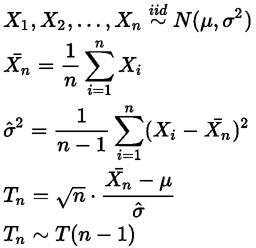

其中:

*   σ这是贝塞尔校正样本方差。我们除以 n-1，以便获得一个**无偏**估计量。如果我们按照直觉，只除以 n，估计值将会有偏差。

T(n-1)是具有 n-1 个自由度的 t 分布。

## 一个例子

让我们回到上面提到的一个例子:“我们想研究大学毕业生在申请大学之前是否最终得到了他们想要的工作，或者他们是否倾向于改变主意？”

我们将我们的数据建模为参数为 p 的 n i.i.d .伯努利随机变量。如果此人拥有他/她在大学之前想要的工作，则这些变量中的每一个都将具有值 1，否则为 0。参数 p 代表得到 1 的概率。

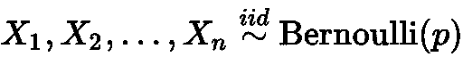

我们想得出结论，大多数人会改变主意。根据我们假设的模型，p < ½. So, we will state our hypotheses as follows:

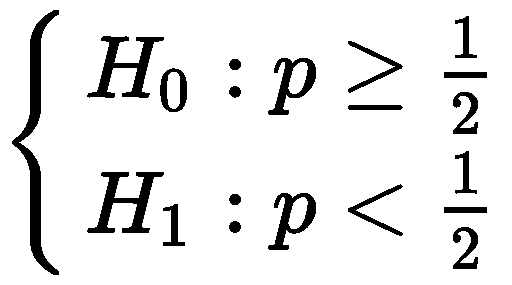

For this hypothesis test, we want to use a significance level of α = 0.05.

I do not have any real data for this, so I will just come up with some numbers as an example. Let us say the sample size is 81, sample mean is 0.4 and sample variance is 0.24\. For this sample size, we want to use a Student’s t-test.

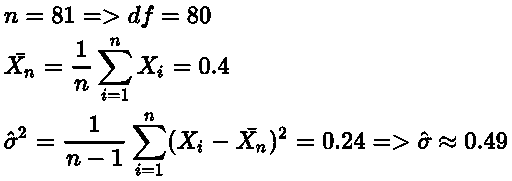

Now let us assume H0 to be true. This means that p ≥ ½. But we need only one value for p to use in computing Tn. We will choose the value of p from the interval [1/2, 1] that can lead to the biggest error: p = ½. We want to be cautious, that is why we assume the worst value of p for our test. In this way, if we reject, we can be really confident of our result.

Now, let us compute the test statistic:

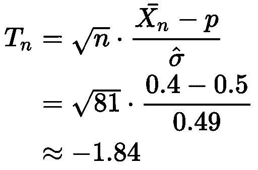

To see if this test statistic falls in the rejection region we will use a t-distribution table (like the one [在这里](https://www.sjsu.edu/faculty/gerstman/StatPrimer/t-table.pdf)):

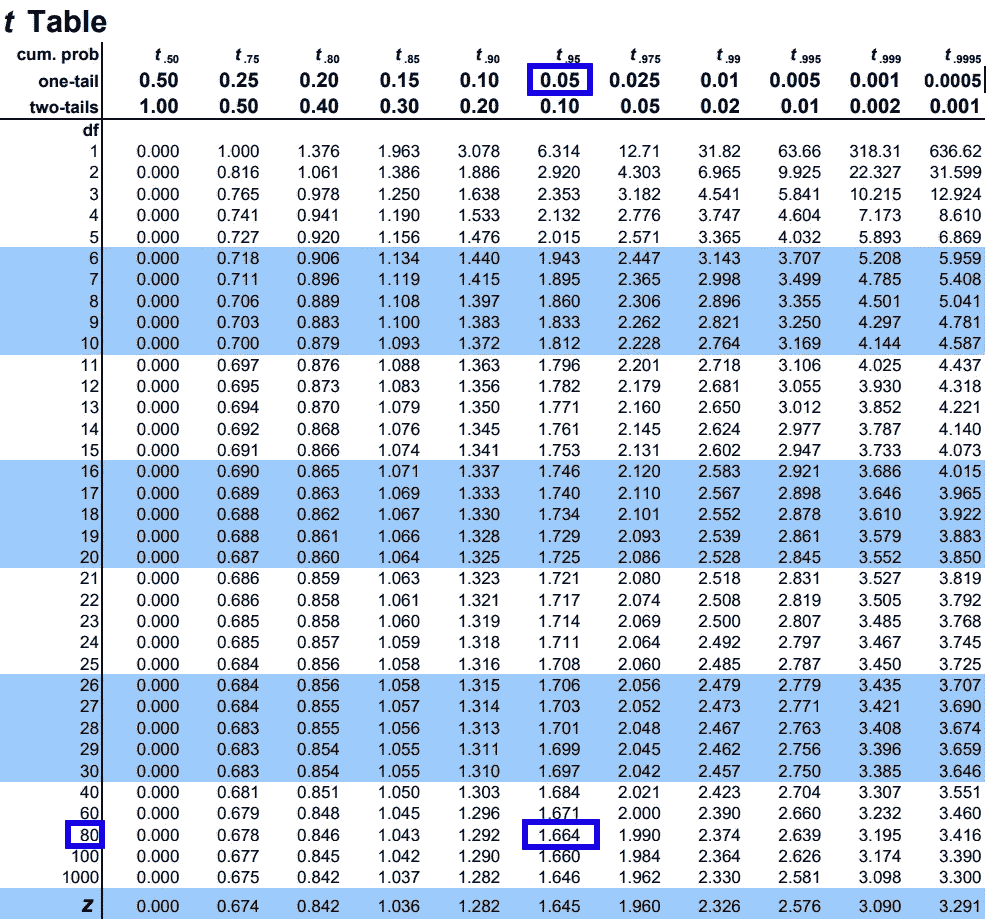

我们在表格的表头(在显示“单尾”的那一行，因为我们在做单侧测试)寻找我们选择的α，在我们的例子中是 0.05。然后我们用我们的自由度(80)寻找行。我们在表格中先前找到的列和行的交叉点处找到的值是我们的常数 c 的值，它是拒绝和非拒绝区域之间的阈值；在我们的例子中，这个值是 1.664。但是这些表是考虑到右边的拒绝区域而制作的。在我们的问题中，拒绝区域在左侧。因为 t 分布关于 0 是对称的，这并不重要，我们只取表中的负值。所以，c = -1.664 是我们的分隔符。如果 Tn < -1.664 we reject H0, otherwise we fail to reject.

Our test statistic was Tn ≈ -1.84 < -1.664, therefore we reject the null hypothesis and accept the alternative hypothesis H1\. So, we conclude that p < ½. In English, this would be:*“我们有统计证据表明，大多数人最终都有了不同于他们大学前最初想法的其他工作”*。

在我们的例子中，p 值是 t ≤ -1.84 处 t 分布曲线下的面积。为了计算这个数量，你可以使用在线计算器，比如这里的。

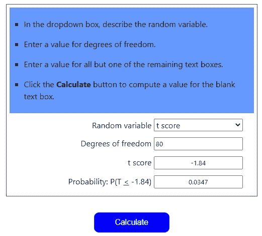

我们的 p 值是 0.0347，这是我们可以拒绝 H0 的最小α。

*我希望这些信息对你有用，感谢你的阅读！*

这篇文章也贴在我自己的网站[这里](https://www.nablasquared.com/hypothesis-testing-demystified/)。随便看看吧！