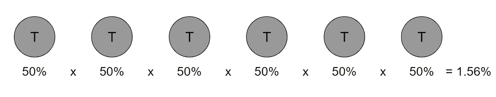

# 尽可能简单地解释假设检验

> 原文：<https://towardsdatascience.com/hypothesis-testing-explained-as-simply-as-possible-6e0a256293cf?source=collection_archive---------8----------------------->

## 数据科学家最重要的概念之一

图片来源:Pixabay 的 PIRO4D

# 目录

1.  [简介](#b6fc)
2.  [术语](#6611)
3.  [拒绝还是不拒绝？](#1a9a)
4.  [显著性检验的意义是什么？](#d1e0)
5.  [假设检验的步骤](#ade9)

# 介绍

如果您听说过术语*零假设*、 *p 值、* 和*α*，但并不真正知道它们的含义或它们之间的关系，那么您来对地方了！如果你从未听说过这些术语，我强烈建议你通读这篇文章，因为这是一个需要理解的重要话题。

我先举一个简单的例子:

想象你和你的朋友玩一个游戏。如果硬币正面朝上，你赢 5 美元，如果硬币反面朝上，他赢 5 美元。

作者创建的图像

假设前两次抛硬币都是正面朝上，意味着你的朋友赢了 10 美元。你应该担心他用的是作弊的硬币吗？嗯，硬币连续两次正面朝上的概率是 25%(见上图)，这不是不可能的。

作者创建的图像

如果硬币连续六次落在反面会怎样？发生这种情况的概率约为 1.56%(见上文)，这是极不可能的。在这一点上，假设硬币被操纵是公平的。通常，人们会设置一个阈值，通常是 5%，来确定一个事件是否是偶然发生的(*如果你以前学过这个，这就是所谓的 alpha！)*

# 术语

为了理解假设检验，你必须理解一些术语:

*   零假设:样本观察值纯粹是随机产生的假设。无效假设倾向于说明没有变化。
*   **备选假设:**样本观测值受某种非随机原因影响的假设。
*   **P 值:**假设零假设正确，获得某个检验的观测结果的概率；较小的 p 值意味着有更强的证据支持替代假设。
*   **α:**显著性水平；当零假设为真时拒绝零假设的概率—也称为**1 类错误。**

我将再次使用硬币的例子，以便您能更好地理解这些术语:

*   在我们的例子中,**零假设**是硬币是一个公平的硬币，观察结果纯粹是偶然的。
*   另一种假设是，硬币是**而不是**公平的，因此，观察结果不是偶然发生的。
*   连续 2 次翻转尾巴场景中的 **p 值**为 25%，连续 6 次为 1.56%。
*   显著性的**α**或**水平**将为 5%。

# 拒绝还是不拒绝？

确定是否拒绝空值的主要规则很简单，PGADRN

如果**P**-值大于 **A** lpha，则 **D** o not **R** 弹出 **N** ull。

在连续翻转两次尾部的情况下，我们不会拒绝空值，因为 25% > 5%。然而，在连续翻转 6 次尾部的情况下，我们会拒绝 1.56%以来的零假设< 5%.

# What is the point of Significance Testing?

So now that you understand the use of hypothesis testing through the coin toss example, know the relevant terminology, and know the main rule to determine whether to reject the null or not, let's dive into significance testing.

What is the point of significance testing? It’s used to determine how likely or unlikely a hypothesis is for a given sample of data. The last part of the statement, ‘for a given sample of data’ is key because more often than not, you won’t be able to get an infinite amount of data or data that represents the entire population.

# Steps for Hypothesis Testing

Here are the steps to performing a hypothesis test:

1.  State your null and alternative hypotheses. *重申一下，零假设通常表明一切都是正常的——没有任何变化。*
2.  设置你的重要性等级，阿尔法值。*这通常设置为 5%,但也可以根据情况和犯 1 型和/或 2 型错误的严重程度设置为其他水平。*
3.  收集样本数据并计算样本统计数据。
4.  计算给定样本统计的 p 值。*一旦得到样本统计数据，就可以通过不同的方法确定 p 值。最常用的方法是正态分布的 T 得分和 Z 得分。在这里* *了解更多关于 T 分和 Z 分的* [*。*](https://www.statisticshowto.datasciencecentral.com/probability-and-statistics/hypothesis-testing/t-score-vs-z-score/)
5.  拒绝或不拒绝零假设。

# 感谢阅读！

如果你喜欢我的工作，想支持我…

1.  支持我的最好方式就是在**媒体**这里关注我。
2.  成为第一批在**Twitter**T2 上关注我的人之一。*我会在这里发布很多更新和有趣的东西！*
3.  此外，成为第一批订阅我的新 **YouTube 频道** [这里](https://www.youtube.com/channel/UCmy1ox7bo7zsLlDo8pOEEhA?view_as=subscriber)！
4.  在 **LinkedIn** 上关注我[这里](https://www.linkedin.com/in/terenceshin/)。
5.  在我的**邮箱列表** [这里](https://forms.gle/UGdTom9G6aFGHzPD9)报名。
6.  看看我的网站，[**terenceshin.com**](https://terenceshin.com/)。