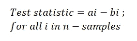
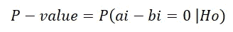

# 假设检验分三步进行

> 原文：<https://towardsdatascience.com/hypothesis-testing-in-3-steps-c23789e92a09?source=collection_archive---------32----------------------->

图片来自 [Pixabay](https://pixabay.com/photos/glasses-light-bulb-storage-3881396/)

## p 值，零假设，真实世界的例子等等

统计有助于分析大多数数据集合。假设检验也是如此，即使没有科学理论存在，它也能证明结论是正确的。

**在这篇文章中，我们将了解假设检验如何帮助我们分析数据、涉及的各种术语以及检验过程。此外，考虑一个现实世界的场景来执行假设检验。**

文章的流程如下，

1.  假设检验和各种术语
2.  假设检验过程
3.  真实世界场景

让我们开始吧！

# 假设检验:

假设检验是一种通过矛盾的**证明。**假设我们要证明一个陈述，比如说，X 为真，我们从假设 X 不为真开始。我们试图证明这一点。

这个“X 不为真”被称为**零假设(Ho)** 。而“X 是真的”被称为**(H1 的)**。X 称为**检验统计量(T)。**用于理解接受或拒绝检验统计的区域的界定值称为**临界值(**或**显著性水平)**

> 与想要证明的理论相矛盾的假设叫做零假设。与想要证明的理论相关的假设(通常是复合的)是另一种假设。

***p*-值**或**概率值**是检验统计量实际观察结果的概率，**假设**零假设是正确的。

> 小概率值意味着在零假设下观察值不太可能。这反过来意味着我们需要拒绝零假设。

# 假设检验过程:

从更广的角度来看，假设检验是通过这三个步骤实现的，

1.  状态零假设和替代假设
2.  决定测试统计和临界值
3.  计算 p 值。*如果 p 值小于临界值，拒绝零假设(意味着接受替代假设)。否则，接受零假设。*

考虑到这一点，让我们详细了解每个步骤是如何执行的。

## **第一步:**

*   在任何测试环境中，清楚地理解实验是第一步也是最重要的一步。
*   第一步是陈述相关的**无效**和**备选假设**。这一点很重要，因为错误的假设将会使整个过程变得混乱。

## **第二步**:

*   决定哪种测试是合适的，并说明相关的**测试统计量** T。
*   从假设中推导出零假设下检验统计量的分布。
*   选择一个临界值( *α* )，一个概率阈值，低于该阈值的无效假设将被拒绝。常见的数值是 5%和 1%。

## 第三步:

*   计算 p 值
*   决定拒绝无效假设(支持替代方案)或不拒绝它。

# 现实世界问题的假设检验过程:

考虑两个数据集，包括两个国家的人口高度，比如 C2 的 C1。问题陈述是为了理解这两个数据集(或分布)是否具有相同的均值(**均值**是所有数据点的*平均值*)。该信息可以进一步用于各种原因，如衣服或任何家具的销售。

## 第一步:

问题陈述是为了理解两个数据集均值之间的差异。所以零假设和替代假设如下，

*   零假设:这两个国家的平均值没有差异
*   **替代假设:**两个国家的均值有差异

## **第二步:**

这里的测试统计非常简单。需要大量的领域知识和研究来设置最佳临界值。让我们假设，0.05 (5%)左右的临界值是可以接受的。

*   **检验统计:**两个国家均值的差异。
*   **临界值:** 0.05(或 5%)

## **第三步:**

*   为了计算 p 值，我们需要两个国家全部人口的身高。但是，要获得全部数据，我们需要大量的时间、金钱和精力，这通常是不可行的。
*   因此，我们从每个数据集形成样本，并计算这些样本的平均值。比方说，我们计算了来自 C1 的 n 个样本的平均值，比如 a1，a2，a3，a4…an。来自 C2 的 n 个样本的平均值是 b1，b2，b3，b4…bn。
*   现在，从这些来自每个国家的 n 样本平均值中，我们计算出均值差异的检验统计量。

计算测试统计

*   在数学上， *P 值是假设零假设为真的检验统计的概率*。因此，P 值计算如下:

计算 p 值

*   从实验的观察来看，

—如果 ***p 值小于或等于 0.05(临界值)，则拒绝零假设*。因此，得出的结论是，两国人口的平均身高存在差异。**

—如果 ***p 值大于 0.05(临界值)，则接受零假设。*** 因此，得出的结论是*两国人口的身高均值*没有差异。

谢谢你的阅读。以后我会写更多初学者友好的帖子。请在[媒体](https://medium.com/@ramyavidiyala)上关注我，以便了解他们。我欢迎反馈，可以通过 Twitter [ramya_vidiyala](https://twitter.com/ramya_vidiyala) 和 LinkedIn [RamyaVidiyala](https://www.linkedin.com/in/ramya-vidiyala-308ba6139/) 联系。快乐学习！