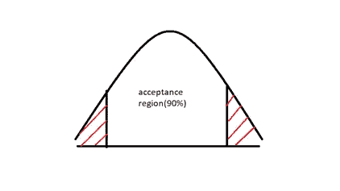
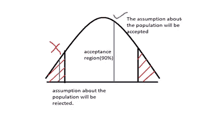

# 假设检验:直觉

> 原文：<https://towardsdatascience.com/hypothesis-testing-intuition-701852364717?source=collection_archive---------44----------------------->

## 直观地展开假设检验

通俗地说，假设检验是一种从统计学上验证我们对样本所来自的人群的假设是否正确的技术。我们如何做到这一点？我们使用样本统计的抽样分布知识(z、t 或其他)来检验我们的假设是否正确。

为了更好地理解，让我们先来看看什么是抽样分布。抽样分布是从总体中抽取样本计算出的统计值的分布。例如，样本均值的抽样分布是从总体中抽取的样本均值的分布。它遵循正态分布，均值=总体均值，标准差=总体标准差* sqrt(样本大小)/总体标准差。同样，让我们看看什么是零假设和备择假设:零假设是无差异的陈述，它通常是等式陈述，而备择假设是零假设的补充，它通常是不等于，小于或大于陈述。

假设检验背后的想法是什么？我们在假设检验中所说的是，考虑到所选样本来自我们假设的总体，那么，来自我们样本的统计值应该位于抽样分布的某些边界内。这种抽样分布对我们来说是已知的，并且是利用我们假设样本所属的总体的某些已知事实计算出来的。决策界限是基于由进行测试的人决定的显著性水平而建立的。在双尾检验的情况下，10%的显著性水平意味着我们将在曲线的两侧找到点，每个点在曲线下分离出 5%的区域。位于这两个点内的曲线区域是接受区域，位于这两个点外的区域是拒绝区域。下图显示了当抽样分布为正态时，双尾检验中 10%显著性水平的可接受区域。

作者图片

我们在尾部的两侧有一个 5%的区域，这是拒绝区域。只有当样本统计量位于这些尾值之间，或者换句话说，当零假设为真时，获得样本值的概率小于显著性水平，零假设才会被拒绝。也就是说，我们没有足够的信心说样本属于我们假设的总体。

作者图片

下面是一个直观的例子。萨姆最喜欢的颜色是红色吗？我们的无效假设是最喜欢的颜色是红色。另一个假设是最喜欢的颜色不是红色。假设，在我的经验中，喜欢红色的人一般有超过 2/5 的东西是红色的，也就是说，如果我们发现超过 2/5 的东西是红色的，我会接受萨姆喜欢红色的零假设，否则我们会拒绝。这是决策边界。现在，为了判断他是否喜欢红色，我们随机挑选了 5 样东西(样本)并检查它们是否是红色的。假设我们发现 5 样东西中有 2 样是红色的，那么我们有足够的证据说他喜欢红色吗？不，我们没有。所以，我们拒绝零假设，说我们没有足够的证据支持萨姆喜欢红色，或者我们可能想说也许萨姆不喜欢红色。但是，如果 3/5 的东西是红色的，那么我们就有一些他喜欢红色的证据，所以我们接受零假设，声称山姆喜欢红色。