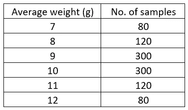
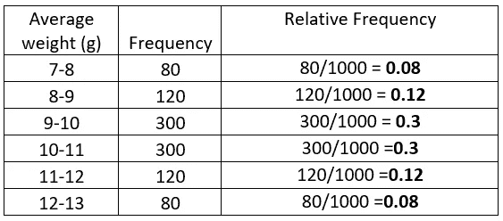
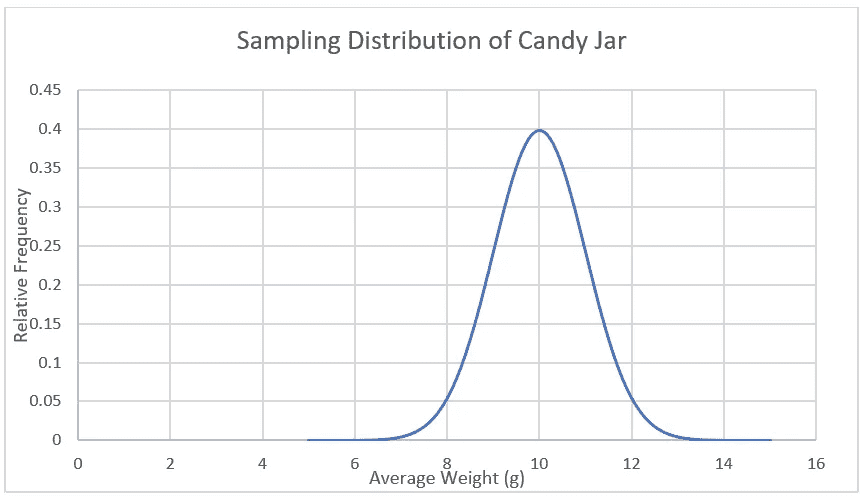
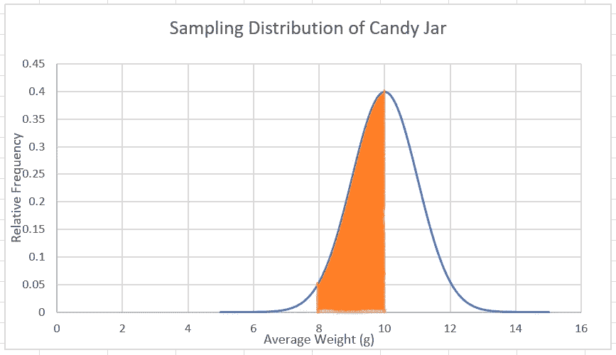
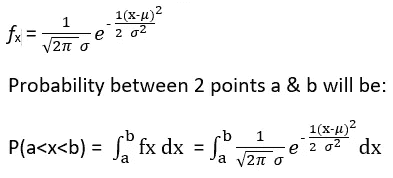
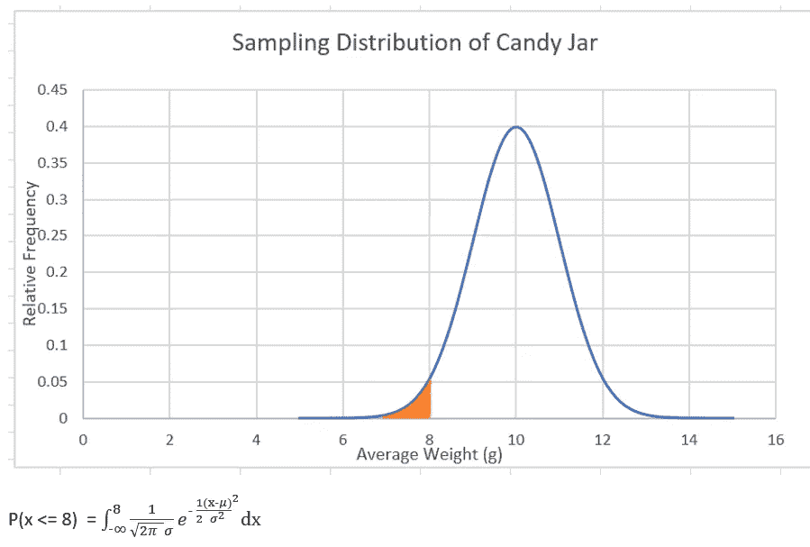
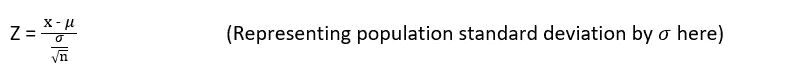
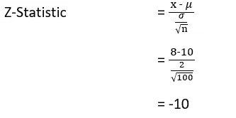

# 假设检验——了解根源

> 原文：<https://towardsdatascience.com/hypothesis-testing-learning-the-roots-93a150e07f2?source=collection_archive---------33----------------------->

莎伦·麦卡琴在 [Unsplash](https://unsplash.com/s/photos/candies?utm_source=unsplash&utm_medium=referral&utm_content=creditCopyText) 上的照片

**本文将尝试:**

*   涵盖假设检验的基础知识。
*   解释它对中心极限定理的依赖

**你应该已经知道的:**

*   概率论基础
*   [中心极限定理(CLT)](http://sphweb.bumc.bu.edu/otlt/MPH-Modules/BS/BS704_Probability/BS704_Probability12.html)
*   [高斯分布](https://www.mathsisfun.com/data/standard-normal-distribution.html)

如果你是统计学或商业研究、数据分析或商业分析的学生，你可能听说过很多关于这个术语“**假设检验**”。有可能你已经在应用它了，但对周围发生的事情还没有一个清晰的认识。你困惑于零假设是如何定义的，什么是零假设，它是如何以及何时被拒绝的，或者它的拒绝意味着什么，等等。如果你有以上任何一个疑问，并且直到现在还不能消除它们，那么你就来对地方了。这篇文章将试图消除围绕假设检验的疑云。

在谈任何技术问题之前，让我们先从一个简单的问题开始，以引起人们的好奇心。有人给了你一个装有成千上万颗糖果的大糖果罐，有人声称平均每颗糖果重 10 克。你必须证实这一说法。一种方法是称一下罐子里的所有东西，数一下里面有多少颗糖果，然后算出平均值。但是这种方法对你来说似乎有点不可行和不切实际，因为数成千上万的糖果会花费你几天的时间。你现在想出了另一个主意。你从里面拿出 100 颗糖果，称它们的重量，计算它们的平均值。一百颗糖果的平均重量却只有 8 克。现在摆在你面前的问题是，是接受还是拒绝他的要求。但是在你做出任何结论之前，请记住，他说的是整个糖果罐，而你刚刚证实了只有 100 颗糖果的说法。

要回答这些问题，有一种叫做假设检验的统计技术可以帮你。这个想法是这样的:

让我们假设罐子实际上装满了平均重量为 10 克的糖果，为了便于理解，让我们进一步假设您从罐子中取出了 1000 个这样的样品，每个样品有 100 颗糖果，正如您在第一个地方取出的一样，您得到的结果如下表所示:

上表显示，在 1000 个样品中，80 个样品的平均重量为 7 克，120 个样品的平均重量为 8 克，300 个样品的平均重量为 9 克，依此类推。我们只是根据共同的平均重量将样品分组。

现在，假设您的特定样本的平均重量为 8 克，您可以说，从随机选择的数千个样本中，只有 120 个样本是可能的。换句话说，你的样本的概率是 120/1000，即 12%。现在，如果 12%对你来说是一个很大的数字，可以说这个罐子的平均重量是 10 克。请注意，这是因为最初假设这个罐子实际上和那个人声称的一样，我们得到的平均重量分布表实际上来自这个罐子。

到目前为止，你可能已经对我们的发展方向有了一点了解。上述假设为这个话题扫清了一点阴霾，但仍有许多问题需要回答，如:

*   为什么只有 1000 个样本，从罐子里可能有无限个大小为 100 的随机样本。
*   罐子平均重量为 10 克的假设和样品表是如何连接的？

我将尝试连接这些点，但在此之前，是时候了解中心极限定理。为了清楚地理解这篇文章，你应该知道这个定理，但是让我们也稍微讨论一下这个定理。

**中心极限定理(CLT)**

中心极限定理描述了总体的抽样分布，其正式定义如下:

> I [如果你有一个均值为 **μ** 且标准差为 **σ** 的总体，并且你从该总体中抽取足够大的随机样本，那么样本均值的分布将近似为正态分布。不管源总体是否正常，这都是真实的。](http://sphweb.bumc.bu.edu/otlt/MPH-Modules/BS/BS704_Probability/BS704_Probability12.html)

此外，该特定抽样分布的平均值将等于总体的平均值，抽样分布的方差将等于总体的方差除以样本大小。这进一步表明，样本量越大，这种抽样分布就越趋向于常态。

我将试着把上面的陈述放到当前的场景中，使其易于理解。例如，从糖果罐中，如果你开始随机抽样大小为 100。每次你抽取一个样品，计算它的平均重量，然后把糖果放回去，再拿出一个样品，重复这个过程。您将获得所有可能的平均权重值，当根据常见的平均权重将它们分组时，您将获得类似于上图所示的表格。不过会有一点变化，你得到的数字不一定是整数，也可以是小数，比如 8.3 克。将所有的十进制数字分组是不可行的，因此平均重量的频率将根据班级间隔来确定。

例如，上表可以表示为:

这个频率表告诉我们，有 80 个样品的平均重量在 7 克到 8 克之间，120 个样品的平均重量在 8 克到 9 克之间，以此类推。平均体重等级将有发生的频率或次数。为了绘制分布图，频率值将被转换成相对频率或概率值。如果你把所有的相对频率加在一起，你会得到值 1。

如果将类间隔设置得非常小，并进行无限次采样，则中心极限定理表明平均权重类与概率值的关系如下所示:

以上剧情亮点:

*   剧情性质很正常。
*   该地块的平均值为 10 克。
*   该图的方差将是总体方差/100(样本量=100)。

重复采样后得到的这种分布图称为**采样分布**

所以现在，CLT 给了我们工具来检查糖果罐中所有可能的无限随机样本，而不仅仅是 1000 个。

**回到测试**

现在让我们回忆一下最初的问题，我们从 100 颗糖果中抽取一个样本，得到平均重量为 8 克。由于原始索赔的平均重量超过 8 克，我们将计算从总平均重量为 10 克的罐子中抽取随机样本时，获得平均重量为 8 克或更少的概率。如果概率足够高，我们可以得出结论，假设是正确的，或者换句话说，平均重量为 10 克的说法不能无效。如果概率值太小，这意味着从平均体重为 10 克的人群中获得该样本的机会太低&因为我们仍然获得了该样本，所以关于人群平均体重为 10 克的说法是值得怀疑的。到目前为止，通过抽样分布验证样本的概念必须是清楚的。我们现在将进行数学的东西和假设公式。

**假设检验**

回想之前的假设。糖果罐中糖果的平均重量是 10 克，根据 CLT，罐子的抽样分布将是正态的，其峰值在 10 克，如下所示(我知道我一直在重复这一点:p)。如您所知，对于正态概率分布，如果我们必须计算两点之间的概率，它由这两点之间的曲线下面积给出，如下图所示(概率在 8 和 10 之间):

如果我们想要解析地计算概率值，我们必须使用高斯方程:

应用于当前上下文，我们需要找到平均重量小于或等于 8 克的概率，这将由下式给出:

让我们检查一下上述方程中的各种参数

𝜇 =抽样分布的平均值

=人口的平均值

= 10 克

𝜎 =抽样分布的标准偏差

=总体的标准偏差/√n

=总体的标准偏差/√100

**将正常变为标准正常**

你可能知道，我们可以通过设置 x-均值/标准差= Z，将任何正态分布积分转换为标准正态积分

(z 将是标准正规方程中的新变量)

你可以在这里阅读更多关于正态分布和标准正态分布

*标准正态分布是均值为 0，标准差为 1 的分布。*

在上面的例子中，𝜇等于人口平均值，标准差等于𝜎/√n，所以我们有:

上述数量被称为 Z 统计量(Zee 统计量),并与假设检验直接相关。

从平均值和标准差计算 Z-statistic 的优点是，我们可以轻松地使用已经公式化的 Z 表来计算概率值。比如这里可用的。

此外，在大多数情况下，如目前的情况，我们不知道总体的标准偏差，在这种情况下，我们计算样本的标准偏差，并将其视为总体标准偏差。

**假设检验的步骤**

*   假设关于人口数据的声明是真实的(零假设)。
*   取一个样本，计算平均值和标准偏差。
*   使用以下公式计算 Z-统计量
*   使用 Z 统计从 [Z 表](http://www.z-table.com/)中计算概率值(称为 p 值)
*   基于 p 值拒绝或不拒绝零假设

**关于 p 值**

你可能会问这样一个问题，什么是概率值，低于这个值我们拒绝零假设。答案是:这取决于具体情况，完全取决于检验假设的人。被认为是阈值的概率值称为显著性水平。在大多数情况下，通常认为显著性水平为 5%。

**结案**

回到糖果罐。我们目前所知的是

样本平均值= 8 克

群体平均值= 10 克

总体标准偏差(让我们假设它的某个值，在实际场景中，你可以从你得到的样本中计算出来)= 2 克

样本量(n) = 100

显著性水平= 5%(让我们定在 5%)

上面的 Z 统计现在可用于计算 p 值(概率),以确定我们的样本有多重要。这里我们将使用可用的 Z 轴工作台。如果您查找 Z 表，您会发现 p 值非常低(远低于我们的显著性水平)。因此，我们可以安全地拒绝糖果罐平均重量为 10 克的无效假设。

**延伸阅读**

如果你觉得上面的概念很有趣，你可以进一步阅读下面的主题来了解更多关于这个统计学领域的知识。

*   [置信区间](https://en.wikipedia.org/wiki/Confidence_interval)
*   [t 统计量](https://en.wikipedia.org/wiki/Student%27s_t-test)

感谢你阅读这篇文章

过得愉快😊

这篇文章也发表在[这里](https://www.wildregressor.com/2020/03/hypothesis-testing-learning-roots.html)

分享