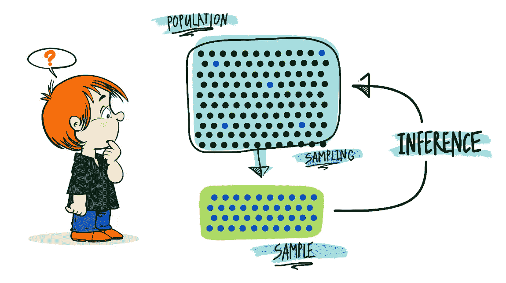
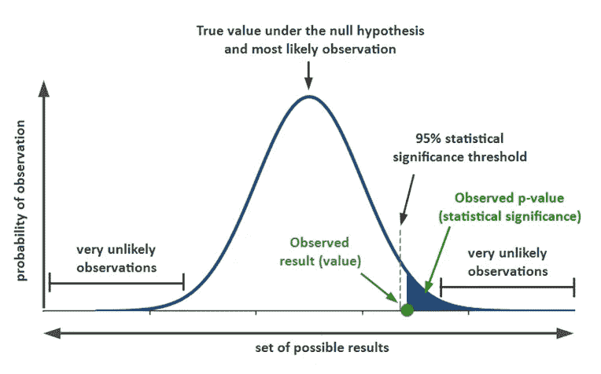

# 假设检验和 p 值

> 原文：<https://towardsdatascience.com/hypothesis-testing-p-value-13b55f4b32d9?source=collection_archive---------11----------------------->



图片来源:【luminousmen.comT2【clipartart.com】T4

最近，我在工作中采用了一种新的方法。我做了一些实验，分析了结果，并用一些统计计算证明，新的方法比现有的方法更好…

是的。！我做了假设测试！！！

> 我相信保持事情简单，这是理解假设检验的简化方法…

**假设检验…**

作为人类，我们总是对几乎所有的事情都有疑问。它可以是关于买一栋房子，一辆汽车或者仅仅是吃一个冰淇淋。我们总是认为，巧克力冰淇淋是否比香草好，或者一辆跑车是否比一辆简单的小货车好。同样，企业和研究人员也有一些问题，如新方法是否更好，新产品是否会比现有产品产生更多的收入等等…

为了能够回答这样的问题，我们需要将它们转化为所谓的假设。然后我们需要通过实验、调查和过程来收集数据。在执行一些统计测试之后，最终，我们可以回答所提出的问题。

> **假设检验**是一种统计方法，仅在样本数据的帮助下，用于对整个群体进行决策。为了做出这个决定，我们想出了一个叫做 **p 值**的值…

假设检验帮助企业和研究人员做出更好的基于数据的决策。

让我们一步一步来...

在这整篇文章中，让我们考虑一个例子，它使事情变得容易理解。

有一家 ABC 公司，想知道欢迎网页的新设计是否会导致更多的网站订阅。因此，让我们考虑下面的符号。

`N_new` =收到新设计的欢迎网页后，网站的平均订阅用户数

`N_old` =收到旧设计的欢迎网页后，网站的平均订阅用户数

假设检验用于了解总体参数，如均值和标准差。

**第一步:将问题转化为假设**

> 假设是一个论点，作为研究的基础…

要回答的问题转化为 2 个*竞争*和*非重叠*假设。我们必须做出以下两种类型的假设。


图片来源:[luminousmen.com](https://luminousmen.com/post/demystifying-hypothesis-testing)

*   ***【h₀】零假设***

甚至在我们收集任何数据之前，这就是我们认为正确的论点

在这个论证中，我们要检验的两组被认为是相等的或者它们之间没有差别。例如，巧克力冰淇淋和香草冰淇淋一样美味，或者一种新方法给出的结果和现有方法一样差或一样。

因此，该参数通常包含数学运算符，如=、≤或≥。

在我们的例子中，`H₀` : `N_new` ≤ `N_old`

*   ***【h₁】替代假设***

这就是我们想要证明为真的论点。例如，巧克力冰淇淋比香草冰淇淋味道更好，或者新方法产生的结果比现有方法更好。

因此，该参数通常包含数学运算符，如≦< or >。

在我们的例子中，`H₁` : `N_new` > `N_old`

**第二步:确定显著性水平**

***显著性水平是当原假设实际为真时，拒绝原假设的概率*** 。它用α表示。这是在进行实验之前确定的。

在许多统计分析中，我们观察到这样的东西——“具有 95%置信区间的*”。这个陈述实际上告诉了我们显著性水平，*

```
Confidence Interval = 1 — Significance Level
```

所以，这里“95%置信区间”告诉我们显著性水平是 0.05。这意味着在被比较的组中有 5%的概率存在差异，而实际上没有差异，即 5%是拒绝零假设的概率。

在我们的例子中，有 5%的概率是`N_new` > `N_old`，而实际上`N_new` ≤ `N_old`

因此，显著性水平用于确定是否应该拒绝或保留零假设。为了拒绝零假设，观察到的数据效应必须是显著的。而当观察到的效应显著时，仅仅意味着我们有信心它是真实的，不是偶然获得的。

通常，医学领域的显著性水平为 1%，研究和商业领域的显著性水平为 5%。

**第三步:计算 p 值**

***p 值是观察零假设结果的概率*** 。显著性水平是目标值，如果我们想保留零假设，就应该达到这个目标值。


图片来源:[luminousmen.com](https://luminousmen.com/post/demystifying-hypothesis-testing)

因此，只要 p 值小于显著性水平，我们就必须拒绝零假设。较低的 p 值意味着，总体或整个数据具有反对零假设的有力证据。

p 值是根据样本数据计算的。它评估样本数据支持零假设的程度。因此，较高的 p 值表明采样数据确实支持零假设。换句话说，在抽样数据中没有足够的证据来拒绝零假设。

然而，研究人员总是寻找低于显著性水平的 p 值。`p — value ≤ Significance Level`，意味着采样数据提供了足够的证据来拒绝零假设。换句话说，我们想要证明为真的另一种假设赢得了这场战斗。数据中观察到的效应在统计学上是显著的。

> 在推断统计学中，p 值有助于确定观察到的效应相对于零假设的显著性。它给研究者支持或拒绝零假设的信心。



图片来源:[索尔·麦克劳德](https://www.simplypsychology.org/p-value.html)

从图形上看，具有统计显著性的观测效应的 p 值位于上述概率分布中的阴影区域。“*极不可能观察值*的区域表示不支持零假设的观察结果。换句话说，当零假设`H₀`为真时，p 值是获得有利于替代假设`H₁`的观察统计的概率。

关于 p 值实际计算的更多说明可在[这里](https://www.tutorialspoint.com/python_data_science/python_p_value.htm)找到。

**第四步:做决定**

既然我们已经掌握了拼图的所有部分，现在是做决定的时候了。


布鲁诺·沃尔夫在 [Unsplash](https://unsplash.com/s/photos/crossroad-signs?utm_source=unsplash&utm_medium=referral&utm_content=creditCopyText) 上拍摄的照片

为了确定保留哪个假设，将 p 值与显著性水平进行比较。

```
If p - value **≤** significance level, we reject the null hypothesisIf p - value **>** significance level, we fail to reject the null hypothesis
```

拒绝零假设意味着我们接受另一个假设。

当我们观察采样数据时，我们可能会在决定保留或拒绝零假设时出错。这些错误的决定被转化为叫做*的错误*。我们不会在这里详细讨论这些错误，但这是两种错误的概述。

*   ***I 型错误:***

当拒绝零假设的决策出错时，就会出现这种错误。在这个错误中，当零假设`H₀`为真时，选择替代假设`H₁`。这也叫*假阳性*。

第一类误差通常用α`α`表示，即显著性水平。alpha `α`是我们愿意犯的第一类错误的百分比阈值。

*   ***第二类错误:***

当保留原假设的决策出错时，就会出现这种错误。在这个错误中，当替代假设`H₁`为真时，选择了零假设`H₀`。这个错误也被称为*假阴性*。

然而，这些错误总是存在于统计测试中，在解释结果时必须牢记在心。

感谢阅读！！

我希望，我用更简单的术语介绍了假设检验。如果你喜欢我的文章，给这篇文章一些掌声会让我有动力写更多。你可以在脸书、LinkedIn 和其他社交专业网络平台上自由分享这些信息，这样有需要的人就可以得到帮助。

我随时欢迎你的建议和问题。你可以在 [LinkedIn](https://www.linkedin.com/in/surajgurav17/) 、 [Twitter](https://twitter.com/17rsuraj) 和 [GitHub](https://github.com/17rsuraj) 上和我联系。