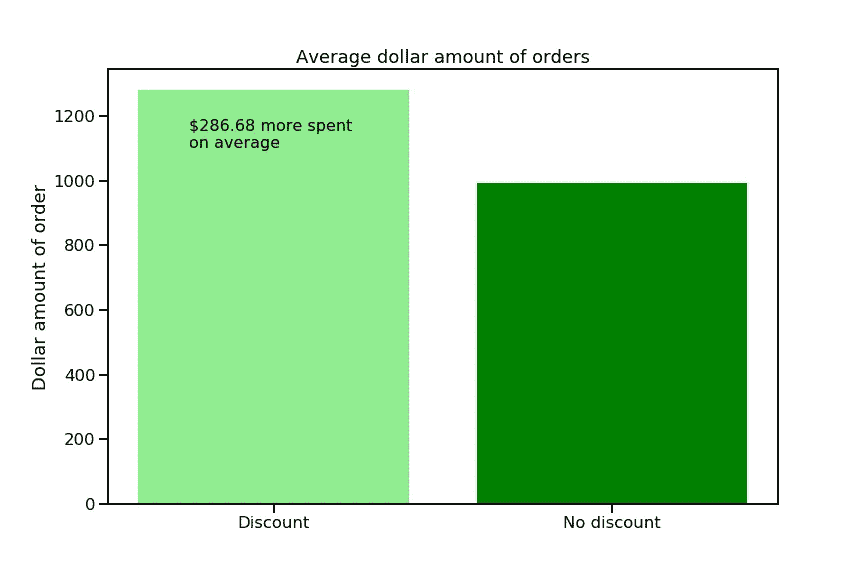

# 假设检验折扣的提高

> 原文：<https://towardsdatascience.com/hypothesis-testing-the-discount-bump-4b8b6b4c4fec?source=collection_archive---------17----------------------->

## 你的折扣策略是推动销售，还是只是让你花钱？

我打赌你知道这种感觉:一件你需要的东西正在打折，所以你高兴地把它放进你的购物车，然后开始想，“用我刚刚攒下的钱，我还能买什么？”几下点击(或在商店里转几圈)，你的购物车里就有了比你想要的更多的东西。

这是一个如此普遍的现象，以至于一些零售商公开利用它。亚马逊有那些“附加”商品，如果你将它们添加到一定规模的订单中，这些商品会更便宜(或者只有现货)。我很肯定我听说过 Target 广告，这些广告开玩笑地描述了这样一种体验:去商店买一些必需品，然后带着一车你并不需要但却想要的东西离开，一旦你看到你得到了多么划算的东西。

在我的数据科学训练营的一个项目中，我被要求使用一个包含产品和销售数据的数据库来形成和测试一些假设，这些数据来自一个虚构但现实的精细食品经销商。这是 Northwind 数据库，微软创建了它作为学习如何使用他们的一些数据库产品的样本。虽然这些数据并不*真的*真实，但它是真实的，所以大多数时候它的表现就像你所期望的真实销售数据一样。它也非常非常干净，这在数据科学中是不寻常的。

在这篇文章中，我将带你通过一个假设检验，使用[韦尔奇的 t 检验](https://en.wikipedia.org/wiki/Welch%27s_t-test)来确定顾客在得到折扣后是否会花更多的钱(剧透:他们会的！)，如果是，他们又多花了多少钱。

如果“打折促销”是一个广为人知的现象，你可能会问，为什么我还要测试它存在的假设呢？嗯，如果你是一家企业，而你的折扣没有让人们花更多的钱，难道你不想知道吗？如果你的顾客真的利用折扣作为省钱的机会，而不是花同样多的钱购买更多的产品，那会怎样？在我的项目中，我定义了一个商业案例，在这个案例中，Northwind 公司的整个折扣策略正在接受检查；高管们想知道什么在起作用，效果如何，这样他们就可以在必要时做出改变。

# 假设来说

在继续之前，我想明确地陈述我的假设。

我的无效假设是，没有打折商品的订单的平均总金额等于至少有一个商品打折的订单的平均总金额。

我的另一个假设是，没有折扣商品的订单的平均总金额*小于至少有一个商品折扣的订单的平均总金额*。

因为我试图确定一个分布的均值是否大于另一个分布的均值，所以这将是一个单尾测试。

现在让我们准备好数据。

# 推购物车

在我从 Northwind 数据库收集的数据中，每个观察都代表客户订单中的一个独特产品。我的表中的每一行都包括订单的标识符、产品的标识符、产品的数量和单价、应用的折扣百分比(如果有的话)、产品的名称、类别(例如，“饮料”)以及代表类别的数字。我添加了一个 boolean 列来记录是否有折扣(以便于以后排序),并添加了一个计算产品单价乘以数量再乘以折扣(如果有)的列来获得订单中该产品的总价。看一看:


来自 Northwind 数据库的数据

对于我的分析，我需要按订单编号对观察结果进行分组，然后将订单分为两组:有一个或多个折扣项目的订单，以及没有折扣项目的订单。

```
# Assume my data is stored in a DataFrame called `df`

# Get list of orders where no items are discounted
group_by_discount_bool = pd.DataFrame(df.groupby('OrderId')['Discount_bool'].sum())
ids_no_disc = group_by_discount_bool[group_by_discount_bool.Discount_bool == 0]
ids_no_disc = list(ids_no_disc.index)

# Get list of orders with at least one discounted item
ids_with_disc = group_by_discount_bool[group_by_discount_bool.Discount_bool > 0]
ids_with_disc = list(ids_with_disc.index)

# Subset products by whether they occur in orders with discounts or not
orders_discount = df[df.OrderId.isin(ids_with_disc)]
orders_no_discount = df[df.OrderId.isin(ids_no_disc)]

# Group by order; these orders contain ONE OR MORE discounted items
orders_discount = orders_discount.groupby('OrderId')['ProductTotal'].sum()

# Group by order; these orders contain NO discounted items
orders_no_discount = orders_no_discount.groupby('OrderId')['ProductTotal'].sum()
```

这留给我两个一维数组( *orders_discount* 和 *orders_no_discount* )，分别包含有折扣和没有折扣的订单的总美元值。我的假设检验的目的是确定这两个数组的均值是否显著不同。

但在此之前，我们先来看看分布本身。

# 扭曲的观点


核密度估计图。y 轴值是概率密度值。

啊哦。

这是一些强大的积极倾斜！看起来大多数订单总额低于 5000 美元，但一些大订单给了两种分布长的右尾。我担心这些巨额订单可能并不能代表大多数客户的行为。

让我们更详细地检查一下这些分布，看看发生了什么。


有折扣和无折扣订单的箱线图和核密度估计图。

核密度估计图(右栏)告诉我，这两种分布确实有很长的右尾。盒须图(左栏)让我们更容易看到这些极值落在哪里。我想剔除这些大订单，这样我就可以把我的分析重点放在绝大多数顾客的购买行为上。

为了修整分布，我将删除超出右须的值，右须代表每个分布的四分位数范围(第 25 和第 75 个百分点之间的距离)的 1.5 倍。在这些分布的情况下，这种调整相当于可用值的 7–8%。这是我愿意做出的牺牲。

```
# Calculate the cutoff point (1.5*IQR + 75th percentile) for non-discounted
iqr = stats.iqr(orders_no_discount)
upper_quartile = np.percentile(orders_no_discount, 75)
cutoff = 1.5 * iqr + upper_quartile

# Remove outliers from non-discounted sample
orders_no_disc_trimmed = orders_no_discount[orders_no_discount <= cutoff]

# Calculate the cutoff point (1.5*IQR + 75th percentile) for discounted
iqr = stats.iqr(orders_discount)
upper_quartile = np.percentile(orders_discount, 75)
cutoff = 1.5 * iqr + upper_quartile

# Remove outliers from non-discounted sample
orders_disc_trimmed = orders_discount[orders_discount <= cutoff]
```


修剪分布的箱线图和核密度估计图

那更好。现在离群值少得多(也不那么极端)，虽然分布仍然是正偏的，但它们比以前看起来更正常。

快速 Levene 检验表明这两个样本的方差在统计上没有差异。这对于我以后想要计算统计检验的能力来说是个好消息，但是 Welch 的 t 检验也可以。

# 测试一下

不幸的是，没有一个方便的 Python 包来执行 Welch 的 t-test，所以我编写了自己的包，并将其包装在另一个包中，该包将 t-statistics 与我选择的 alpha 值进行比较，并让我知道我是否可以拒绝(或无法拒绝)零假设。

这就是它的作用:


这产生了 p 值 0.00000355，远低于我选择的 alpha 值 0.05。我拒绝无效假设！假设没有潜在的变量在起作用，我可以自信地认为有折扣和没有折扣的订单的平均总金额之间存在统计上的显著差异。

# 那个肿块有多大？

现在我们知道，包含打折商品的订单往往比没有打折商品的订单要大，但是它们有多大的不同呢？为了找到答案，让我们看看效果大小，或者有折扣的平均订单和没有折扣的平均订单之间的差异。

我给自己写了一些函数来计算一个原始效果大小，用它来[计算一个标准化的效果大小(科恩的 *d* )](https://rpsychologist.com/d3/cohend/) ，然后把它传递给[一个能量分析](https://www.statsmodels.org/dev/generated/generated/statsmodels.stats.power.TTestIndPower.solve_power.html#statsmodels.stats.power.TTestIndPower.solve_power)。请注意，我针对 Cohen 的 *d* 的函数考虑了两个样本可能具有不同长度和方差的可能性，并且我的功效分析将两个样本的平均长度作为观察次数(“nobs1”)。代码如下:

```
# Define a function to calculate Cohen's d
def cohen_d(sample_a, sample_b):
    """Calculate's Cohen's d for two 1-D arrays"""

    diff = abs(np.mean(sample_a) - np.mean(sample_b))
    n1 = len(sample_a) 
    n2 = len(sample_b)
    var1 = np.var(sample_a)
    var2 = np.var(sample_b)
    pooled_var = (n1 * var1 + n2 * var2) / (n1 + n2)

    d = diff / np.sqrt(pooled_var)
    return d

# Define a function to calculate effect size and power of a statistical test
def size_and_power(sample_a, sample_b, alpha=0.05):
    """Prints raw effect size and power of a statistical test, 
       using Cohen's d (calculated with Satterthwaite 
       approximation)
       Dependencies: Numpy, scipy.stats.TTestIndPower"""

    effect = abs(np.mean(sample_a) - np.mean(sample_b))
    print('Raw effect size:', effect)

    d = cohen_d(sample_a, sample_b)
    power_analysis = TTestIndPower()

    sample_length = (len(sample_a) + len(sample_b)) / 2
    power = power_analysis.solve_power(effect_size=d, 
                                       alpha=alpha,       
                                       nobs1=sample_length)

    print('Power:', power)
```

这就是它的作用:


286.68 的原始效应大小意味着有折扣的平均订单总数和无折扣的平均订单总数之间的差异是 286.68 美元。0.995 的幂意味着我只有 0.05%的机会犯第二类错误(也就是假阴性)。我希望幂至少为 0.8，所以我对这个结果很满意。很有可能是我正确的检测到了一个真实存在的现象——woohoo！



TL；大卫:如果你给他们打折，他们会花更多的钱。

如果我们想知道 286.68 美元是否是一个很大的差异，我们可以对这两个样本运行我的 *cohen_d()* 函数，得到的值是 0.33。在科恩的 *d* 值的世界里，我们通常会说 0.2 是小影响，0.5 是中等影响，0.8 及以上是大影响，但这都是相对的。如果我们每年都进行这个测试，并且总是得到大约 0.2 的科恩的 *d* 值，那么有一年得到 0.33，我们可能会认为这在我们的特定环境中是一个很大的影响。

你可以在我的 GitHub repo 中查看我在 Northwind 数据库[上的其余项目。因为我发现它既有用又漂亮，这里的](https://github.com/jrkreiger/evaluating-discount-strategy)[是一个非常好的可视化工具，可以帮助你理解样本大小、效果大小、alpha 和功效是如何联系起来的](https://rpsychologist.com/d3/NHST/)。

*跨贴自*[*jrkreiger.net*](http://jrkreiger.net)*。*