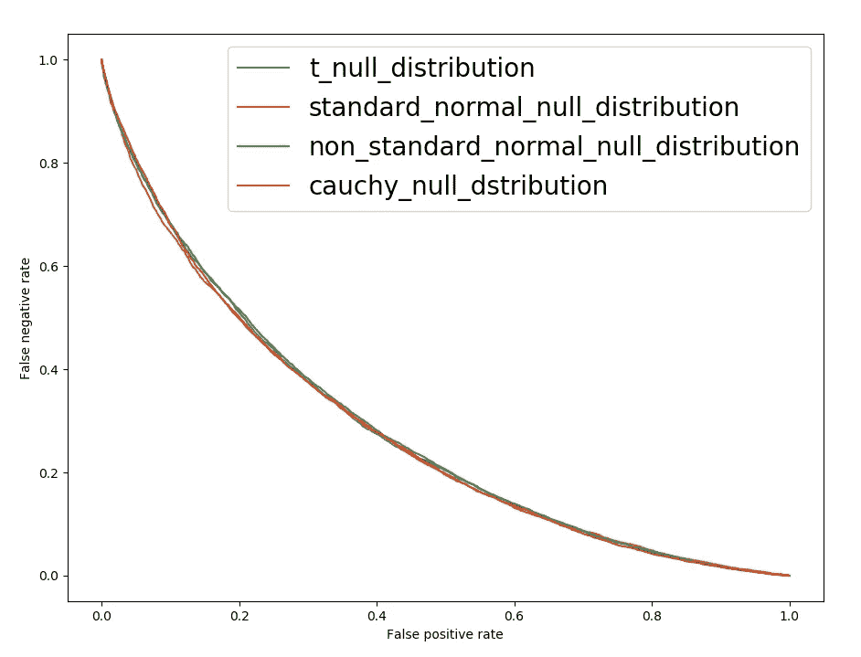
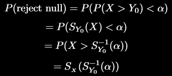
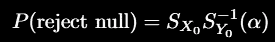
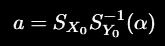
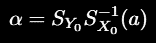
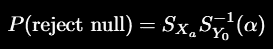
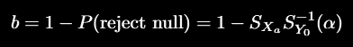
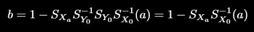

# 假设检验:分布不重要(！)

> 原文：<https://towardsdatascience.com/hypothesis-testing-the-distribution-doesnt-matter-79882ba62f54?source=collection_archive---------39----------------------->

## 进行 t 检验，扔掉 t。剩下的也一样整洁。

# 1.索赔

我在网上读到过(所以这肯定是真的)优秀作家与众不同的地方在于，他们甚至在开始写作之前就知道自己的故事将如何结束。知道结局提供了方向、清晰和目标，因为他们知道他们的目标是什么。所以，我会给你这个故事的结局，妙语就在这里(此后称为“索赔”)——进行两个样本的 t 检验(或任何假设检验)；现在扔掉 t 分布(零假设的分布——我们将讨论它是什么),用世界上任何其他分布代替它。新的分布可能是高斯分布，也可能是某种奇怪的多模态形状，这无关紧要。现在，如果您对任何数据使用这种“修改”的假设检验，您最终会得到与原始检验相同的性能(错误率)。从表面上看，这就像打开一辆法拉利，拆掉它的引擎，换上其他车的引擎。这辆“改装”法拉利的性能依然如故，就好像我们没有改变任何东西一样！？怎么会？

## 1.1 背景

好的，在这次旅程中，你需要基本的假设检验。如果你感到生疏，请点击此处。虽然这种说法适用于任何假设检验(我们将会证明)，但我们将使用双样本 t 检验作为模板来比较均值，因为它是更广为人知的假设检验之一。

什么是假设检验？让我们举一个两样本 t 检验的具体例子。假设我们有一个生产给定尺寸坚果的生产流程。当然，没有一个过程是完美的，因此，生产的坚果在大小上有一些小的差异。昨天引入了一种新的自动化流程，使这一流程更加高效。我们担心这可能会改变坚果大小的分布，这是不可接受的。双样本 t 检验为我们提供了一种比较新旧流程平均规模的方法。如果新流程的平均规模有显著差异，这将是一个问题。我们所需要的是得到一些用旧工艺生产的坚果和一些用新工艺生产的坚果，并将与它们的大小相关的数据输入假设检验。

假设检验就像一个守望者，密切关注我们制造过程的质量，并在它被破坏时提醒我们。这就引出了一个问题——谁来监视守夜人？就像制造过程不是完美的一样，我们用来判断方法是否不同的假设检验也不是完美的。它可能会出错。它会犯两种错误。它可能会忽略方法上的真正差异，说实际上没有差异，或者它可能会发出错误的警报，说实际上没有差异，但实际上有差异。第一种错误被称为假阴性(我们将其标记为 b)，第二种错误被称为假阳性(我们将其标记为 a)。这两种错误之间总是有一个权衡。例如，从不说有差异(测试从不返回阳性，所以没有假阳性)来获得完美的(零)假阳性率是微不足道的。但是，这种策略会导致 100%的假阴性率。类似地，可以得到零假阴性率，但是会导致 100%的假阳性率。有用的测试通常介于这两个极端之间。测试预测阳性越积极，假阳性率越高，假阴性率也越低(真正的差异不太可能被遗漏)。假阳性率和假阴性率之间的这种权衡可以在任何测试中绘制出来(见下面的图 1)。如果 test-1 的曲线低于 test-2 的曲线，我们可以说 test-1 产生的错误更少，比 test-2 更好(也称为“更强大”)。现在，让我们用双样本 t 检验来比较平均值。给了我们一个误差率的图表。如果我们用另一个任意分布来代替测试中的 t 分布，那么图表肯定会变得更糟吗？让我们看看会发生什么。

## 1.2 测量误差

要了解我们的测试表现如何，我们不必等待来自人造坚果的真实世界数据。只有两种可能；要么新过程导致均值改变(零假设)，要么不改变(替代假设)。假设我们要做一个实验，用旧的生产工艺生产 30 个坚果，用新的生产工艺生产 30 个，并将数据传递到我们的测试中。嗯，我们可以首先假设新流程没有改变平均大小，并模拟 30 个对应于旧流程的大小和 30 个来自相同分布的新流程的大小(例如，平均大小设置为适当值和一些附加方差的正态分布)。我们知道在这种情况下各组之间没有区别，因为我们是这样模拟数据的。如果测试开始，并说它发现了均值的差异，我们知道这是一个假阳性。类似地，我们从旧流程中生成 30 个尺寸，然后从新流程中生成 30 个尺寸，这一次为新流程设置一个不同的(比如稍微高一点)值。然后，我们也将这些数据点传递给测试。我们现在希望我们的测试能找到不同之处。如果不符合，这就是假阴性。我们将我们的测试应用到这些有不同倾向的数据点上(“触发快乐”)，并多次重复这个过程。这给了我们测试的假阳性对假阴性率的权衡。

## 1.3 插图

现在，我们继续进行上一节中描述的模拟，使用按原样应用的 t 检验，具有正确的分布。但是接下来，我们通过将测试中使用的 t 分布与其他任意分布交换来“修改”测试。我们可能预期这些修改对测试的有效性有不利影响(因此错误率更高，意味着假阳性对假阴性的权衡曲线应该向上移动)。

但是当我们实际绘制这些曲线时，下图是我们得到的结果:

图 1:用于比较平均值的双样本 t 检验框架中插入的各种零假设分布的假阳性率与假阴性率的权衡。

在该图中，我们首先使用 t 分布(根据测试要求，平均值为 0，标准差为 1)，接下来我们将 t 分布替换为具有相同平均值和标准差的正态分布。接下来，我们用均值为 1、标准差为 2 的正态分布来代替它。最后，我们用均值为 0，标准差为 1 的柯西分布来代替它。对应于这些测试的假阳性率对假阴性率的线如图 1 所示。令人惊讶的是，它们都在彼此之上。因此，将 t 分布与其他不相关的分布交换对测试的性能没有任何影响！现在让我们来看看用来绘制这个图的代码。

# 2.创造情节

现在，让我们探索一下用来创建上面这个情节的代码。由于我们要进行 t 检验，并用其他分布替换 t 分布，所以“uno”步骤是从头开始实现双样本 t 检验。这是基于这里的描述[。](https://www.itl.nist.gov/div898/handbook/eda/section3/eda353.htm)

从零开始的两个样本 t 检验。参见 gist at:[https://gist . github . com/Ryu 577/6146 e88b 347 BC E5 a 66 DDA 168 BC 5 cefe 0](https://gist.github.com/ryu577/6146e88b347bce5a66dda168bc5cefe0)

接下来，我们将它包装在一个函数中，该函数可以使用两个数组来代替原始的均值和方差。

将数组作为输入的双样本 t 检验的包装。我们也可以通过分布来作为零假设。参见 gist at:[https://gist . github . com/Ryu 577/b 18 fcddaa 73216448 ef 72593 a 76 a2 d 15](https://gist.github.com/ryu577/b18fcddaa73216448ef72593a76a2d15)

现在，我们实现了一个函数，该函数模拟来自零假设和替代假设的数据，并在不同的显著性水平上生成假阳性和假阴性率，从而绘制出 alpha-beta 曲线。

在双样本 t-检验中交换各种分布来代替 t 的函数。参见代码:[https://gist . github . com/Ryu 577/925 FB 03 bb2a 1869 a 60037 EEC 74 ddf cf 5](https://gist.github.com/ryu577/925fb03bb2a1869a60037eec74ddfcf5)

最后，将所有这些放在一起，使用两样本 t-检验中的零假设的不同分布绘制α-β图。

这将生成与我们在上一节中看到的图形非常相似的东西。

如果你不喜欢数学，这就是你把新的知识添加到你的收藏中，并骑向夕阳的地方。否则，留下来..

# 3.索赔的证据

首先，我们定义一些符号。我们将假设我们的测试是单侧的，另一个假设是第二总体在某些度量上更大(比如双样本 t-检验的均值)。

我们感兴趣的假设检验操作如下:

1.  我们想知道一组的某些性质是否比另一组的大。
2.  我们计算一个检验统计量(X ),如果第二组的性质确实比第一组大得多，那么这个检验统计量将会取大值。
3.  我们从两组中随机收集一些样本，并根据这些样本计算这个检验统计量。
4.  如果检验统计量如此之大，以至于看到某个事物等于或大于它的概率小于某个显著性水平α，我们拒绝零假设，并得出结论，第二组可能对所讨论的属性具有更大的值。

各种情况下测试统计量 X 的分布:

X_0:零假设下检验统计量的分布(假设我们感兴趣的度量没有差异；假设无罪——所有的审判都是从这个开始的。

Y_0:在我们测试的完美世界中，在零假设下测试统计量的分布——我们测试的所有分布假设都完全满足，独角兽跨越彩虹。

X_a:当两组之间的感兴趣度量存在差异时，交替假设下检验统计量的分布。

## 3.1 错误率

根据上述第四点，我们拒绝零假设的标准是(在某个显著性水平，α):P(X≥y0)< α. But the left hand side is the probability that Y_0 will be greater than some value, which is the survival function of Y_0 (denoted S_{Y_0}). So, the probability of rejecting the null hypothesis becomes:

where in the last step, we used the fact that the survival function of any distribution is monotonically decreasing. When the null hypothesis is true, the distribution of the test statistic, X is: X ∼X_0\. So the probability above becomes:

But under the null hypothesis, rejecting the null is by definition an error. So the probability above is an error rate; the rate of erroneously rejecting the null when it is true. Let’s call this false positive rate, a.

So, the significance level that leads to a false positive rate, a is given by:

Eq (1): The significance level that leads to false positive rate, a.

Similarly, under the alternate hypothesis, the distribution of the test statistic becomes: X ∼ X_a. So the probability of rejecting the null becomes:

In the case of the alternate hypothesis, we’d be making an error if we *不拒绝零假设*。所以，当我们应该拒绝空值时，误差率 b 变成:

等式(2):假阴性错误率。

现在，我们希望 b 是 a 的函数(假阴性率是假阳性率的函数)。因为实际误差率的权衡才是最重要的。为了得到这个，我们可以将等式(1)代入等式(2 ),这样我们得到:

等式(3):假阴性对假阳性率的权衡。

等式(3)告诉我们，当使用假设检验时，在我们的检验的零假设中使用的分布 Y_0 与假阴性与假阳性率之间的权衡无关。这证明了我们开始写这个博客时的说法。换句话说，不管我们在双样本 t 检验中使用的 Y_0 是 t 分布，还是正态分布或柯西分布。假阴性对假阳性率的权衡(如等式(3)给出的 b 作为 a 的函数)将保持完全相同。