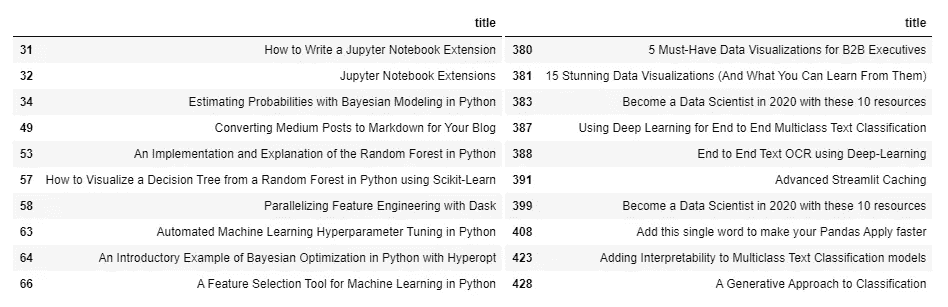
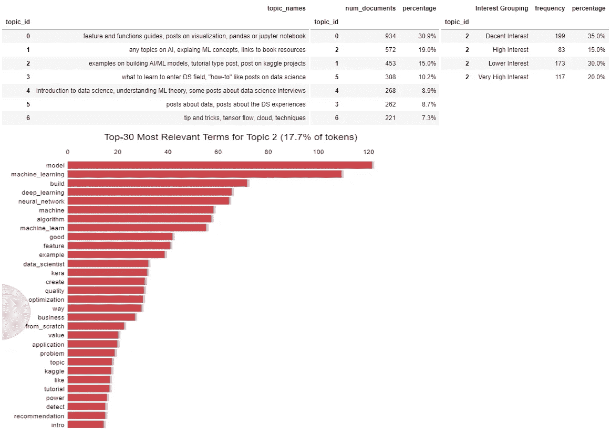
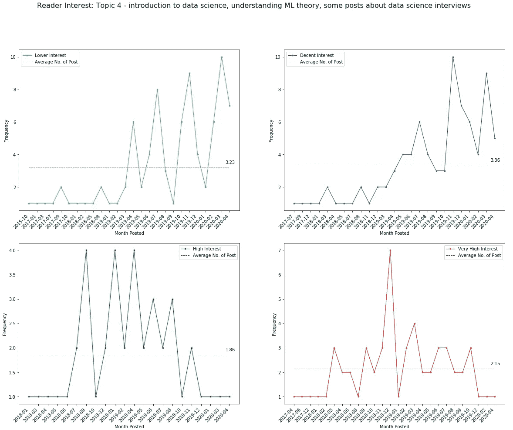
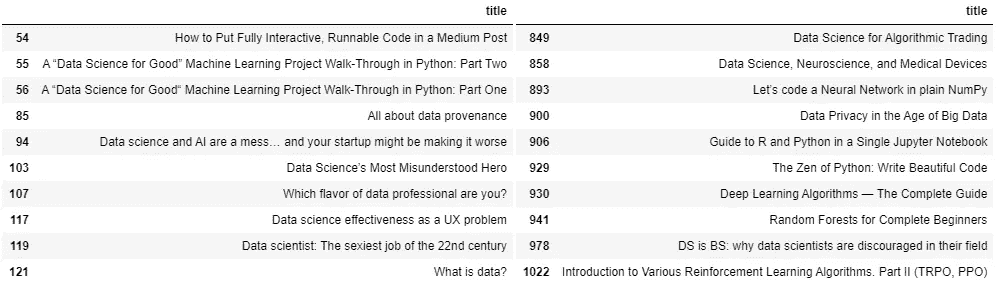
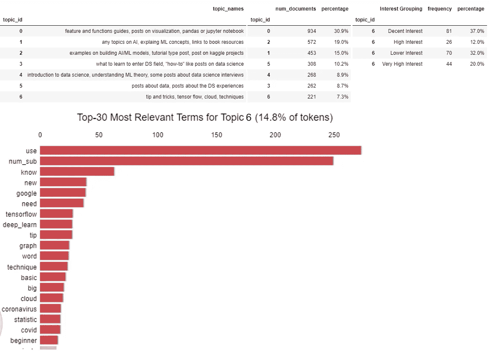

# 我分析了数据科学帖子的标题，以了解读者感兴趣的内容——以下是我的发现

> 原文：<https://towardsdatascience.com/i-analyzed-towards-data-science-post-titles-to-understand-what-readers-were-interested-in-here-9e49b2a96474?source=collection_archive---------40----------------------->


[钳工](https://unsplash.com/@benchaccounting?utm_source=medium&utm_medium=referral)在 [Unsplash](https://unsplash.com?utm_source=medium&utm_medium=referral) 上拍照

作为一名作家，我总是想知道读者对什么帖子感兴趣，以及是否有办法让我了解这一点。

**事实证明，我可以。**

我所需要的只是相关的数据，并充分利用我的数据科学知识！

在这篇文章中，我将分享我通过分析 3000 多篇文章标题和它们相关的掌声所得到的发现。

和我的其他作品一样，比如:

[](/using-a-generalised-translation-vector-for-handling-misspellings-and-out-of-vocabulary-oov-words-494cd142cd31) [## 使用广义翻译向量来处理拼写错误和不在词汇表中(OOV)的单词…

### 我的实验和结果是用一种新颖的方法来处理拼写错误和 OOV 单词。希望你能找到他们…

towardsdatascience.com](/using-a-generalised-translation-vector-for-handling-misspellings-and-out-of-vocabulary-oov-words-494cd142cd31) [](/are-deeper-networks-better-a-case-study-6ee9bcb0725b) [## 网络越深越好吗？案例研究

### 网络越深越好吗？为什么偏差/方差和预测结果的下游影响是什么？

towardsdatascience.com](/are-deeper-networks-better-a-case-study-6ee9bcb0725b) 

这篇文章主要是关于数据驱动的，有很多代码片段和结果可以查看。

就这样，让我们开始吧！

# 研究问题

在这个项目中，有几个问题我想知道答案。

1.  作家发布了什么帖子？
2.  读者对哪些帖子感兴趣？

# 数据清理


照片由 [Gaelle Marcel](https://unsplash.com/@gaellemarcel?utm_source=medium&utm_medium=referral) 在 [Unsplash](https://unsplash.com?utm_source=medium&utm_medium=referral) 上拍摄

有 3153 篇帖子的发布者被贴上了“走向数据科学”的标签。

数据清理过程并不太困难。

对于非文本列，我只需要过滤、删除空白行并转换日期。

对于文本专栏，我做了小写、删除标点符号、单词替换、词汇化，并将有意义的二元模型转换为一元模型。

以下是用于清洁过程的相关包。

正如您所看到的，典型的 numpy、pandas、re、nltk、spacy、gensim 和 maplotlib 肯定会被使用。

这里值得注意的是 pyLDAvis。

这个包为你的 LDA 模型输出提供了一个漂亮的仪表板。

它看起来会像这样:


pyLDAvis 输出示例

你可能注意到的下一件事是“*display _ side _ by _ side(…)*”定义。

这允许我在同一个单元格内输出两个数据框，从而非常容易地显示参考表。


display_side_by_side 定义示例

最后，我将显示列宽扩展到 100 个字符，以便能够看到完整的文章标题。

## 清理日期列

为了清理日期列，我简单地创建了一个定义，在将所有日期转换为日期时间格式之前，将年份“2020”附加到日期中。

没什么特别的。

以下是清理后的输出:


带有清除日期的数据帧的输出

## 清理标题列

为了清理标题，我使用了小写字母、删除标点符号、单词替换、词汇化，并将有意义的双字母词转换为单字母词。

## 小写、删除标点符号和替换单词

我做了两种类型的替换:

1.  将版本号替换为“版本号”
2.  将所有数字替换为“num_sub”

我做了这些替换，因为我想保留版本号和数字号可能带来的信息。

例如，在一些帖子的标题中，有很多标题看起来像“ *10 种做…* ”或“ *5 种做…* 的技巧和诀窍”。

从分析中移除这些数字将会丢失关于这些帖子标题是如何撰写的信息。我不放心删除这些数字，因此，我用“*num _ sub*token”替换了它们。

至于版本号，一些帖子的标题被写成“… *Tensorflow 2.0 …* ”或其他类似的版本。

同样，我认为最好完整地保存这些信息，以便进行分析。

下面是替换后的输出示例。


令牌替换的示例

## 词汇化

我只应用了词汇化，并去掉了词干以保持标记的可读性。

对于那些不熟悉这两者的人来说，下面的例子可以清楚地说明两者的区别。

```
Stemming:
trouble -> troubl
troubling -> troubl
troubled -> troublLemmatization:
trouble -> trouble
troubling -> trouble
troubled -> trouble
```

我用 Spacy 做了引理化。

运行该程序后，示例结果将如下所示:


词汇化的例子

## 将有意义的二元模型转换为一元模型

在进行主题分析之前，我做的一件不寻常的事情是将有意义的二元模型放在一起。

我是在和[新加坡式英语](/creating-word-embeddings-for-out-of-vocabulary-oov-words-such-as-singlish-3fe33083d466)合作的时候学会这个窍门的。

我意识到单独分析某些令牌没有意义。

以 unigrams、*神经*、*网络*vs bigram、*神经网络*为例。

把 bigram " *神经网络*"放在一起做题目分析不是更好吗？

也就是说，将类似于"*神经网络*的二元模型转换成类似于"*神经网络*的一元模型。

进行这种转换将有助于使主题更具可读性、可理解性和准确性。

那么，你将如何做到这一点呢？

为此，您需要利用 NLTK 库。

您可能希望使用搭配包，通过逐点相互索引(PMI)来查找共现标记。

第一步是在运行 NLTK 搭配包之前将所有句子标记成一个列表，以获得每个二元模型的 PMI 分数。

下面是"*finder . score _ ngrams(score)*"的输出:

```
[(('neural', 'network'), 65.91936507936508),
 (('datum', 'science'), 63.632571637945574),
 (('machine', 'learning'), 40.09489351902355),
 (('artificial', 'intelligence'), 35.65887096774193),
 (('how', 'to'), 27.32665009222873),
 (('in', 'python'), 17.652721482339317),
 (('deep', 'learning'), 16.500750302833072),
 (('time', 'series'), 14.835164835164836),
 (('part', 'num_sub'), 13.934801929913661),
 (('jupyter', 'notebook'), 12.422360248447205),
...]
```

注意 NTLK 如何输出一组有意义的二元模型以及相关的分数？

在我的例子中，对于任何高于 1 分的 PMI，我创建了一个有意义的二元词典，如下所示:

```
{'neural network': 'neural_network',
 'datum science': 'datum_science',
 'machine learning': 'machine_learning',
 'artificial intelligence': 'artificial_intelligence',
 'how to': 'how_to',
 'in python': 'in_python',
 'deep learning': 'deep_learning',
 'time series': 'time_series',
 'part num_sub': 'part_num_sub',
 'jupyter notebook': 'jupyter_notebook',
...}
```

一旦我创建了这样一个字典，我就创建了一个定义，用它各自的 unigram 替换每个有意义的二元模型。

下面是替换后的示例:


有意义二元模型替换的例子

注意“ *scikit learn* ”现在是“ *scikit_learn* ”。二元模型已被转换为一元模型。

有了所有这些清洁步骤，我现在准备好了我的主题分析。

# 基于潜在狄利克雷分配和网格搜索的主题分析

回想一下，这里的目标是回答这些问题:

1.  作家发布了什么帖子？
2.  读者对哪些帖子感兴趣？

为了回答这些问题，我首先需要将文章标题分解成不同的主题。

为了实现这一点，我用网格搜索运行了 LDA 主题模型。

这里是使用的 sklearn 包。

第一步是通过术语矩阵为 LDA 创建文档。

为了进行矢量化，我使用了 sklearn 的 CountVectorizer 函数。

输出形状是稀疏度为 1.32%的(3018，169)稀疏矩阵。即 1.32%的单元是非零的。

接下来要做的事情是建立我的网格搜索和绘制相关的情节。

我运行了 18 个不同的 LDA 模型，从 5 个主题到 10 个主题，学习衰减率不同——0.5，0.7 和 0.9。

之后，我提取了每个组合的对数似然分数，并绘制它们以找到最佳的主题数量。


网格搜索的结果

选择的最佳主题数量实际上是 5 个，但在试验了不同的主题后，我觉得学习衰减 0.5 的 7 个主题是一个更好的设置。

因此，我选择了后者。

看看这 7 个主题在视觉化时是如何分开的。


7 个主题在 0.5 学习衰减时的 LDA 可视化

另外，请注意将有意义的二元模型转换成一元模型是多么有用。

如您所见，LDA 现在可以将“*深度学习*”、“*神经网络*”和“*数据科学*”视为单个令牌，这使得主题更具可读性。

为了获得每个主题的术语相关性的表格视图，我们总是可以为它创建一个数据框。


每个主题的前 12 个术语

下一个合乎逻辑的步骤是根据相关术语标记主题类别。这比看起来要难。

以下是我标注的主题名称。(我试过了)


手动创建的主题名称

但是样本中主题的分布是怎样的呢？


主题分布输出

在这里，我们可以清楚地看到，大多数帖子属于主题 0—“*特性和功能指南，关于可视化、熊猫或 jupyter 笔记本的帖子*”

然而，从宏观层面来看这种主题分布是不够的。

我觉得最好是从更细的层面来看待这些话题。

**跨月。**

会有什么模式吗？

为了进行这种分析，我必须准备相关的分析表。

首先，我将主题表合并到主数据框中。接下来，我将日期拆分成月份。


为进一步分析准备的表格

一旦我得到了这个工作表，就该进一步分析数据了。

# 作家发布了什么帖子？

为了按月绘制折线图，matplotlib 接受 2 个变量列表来绘制 X 和 Y 轴。

因此，我需要执行一些分组处理来提取相关信息以形成这些列表。

处理完成后，我简单地将结果绘制出来。


每月发布的主题频率


参考表格

乍一看，你可以看出，对于主题 0，TDS 作者从 2019-01 年开始才开始发表更多关于这个主题的文章-请注意峰值

主题 1 也是如此。

为了获得更好的视角，这里是单独的地块。


每月发布的主题频率(分开)

从单个情节来看，就为主题 3 和主题 6 撰写的帖子而言，它们似乎越来越受欢迎。

而主题 2 和 5 似乎呈下降趋势。

话虽如此，这里的混淆变量是新冠肺炎疫情。

注意到大多数话题是如何在 2020 年 3 月达到峰值的吗？

我猜所有国家的封锁导致了这些峰值。

但有人可能会说，如果封锁确实是一个混淆变量，那么人们应该预计在**所有**话题中都会出现峰值，但这显然不是这里的情况。

尽管我相信上面的情节很好地概括了 TDS 作者所写的内容。

它仍然没有告诉我们 TDS **的读者**对什么帖子感兴趣。

为了了解这一点，我决定通过鼓掌的次数来估算读者的兴趣。

# 读者对哪些帖子感兴趣？


照片由 [Unsplash](https://unsplash.com?utm_source=medium&utm_medium=referral) 上的[思想目录](https://unsplash.com/@thoughtcatalog?utm_source=medium&utm_medium=referral)拍摄

了解读者兴趣的唯一方法是通过他们给每篇文章的掌声。

因此，我决定将拍手分成 4 个不同的类别。

> 很高兴趣:≥1000 拍
> 高兴趣:500 ≤拍<1000
> 过得去兴趣:150 ≤拍< 500
> 低兴趣:< 150 拍

有了这些类别箱来代理读者的兴趣，我简单地创建了一个名为“*兴趣分组*”的新专栏。


增加了“兴趣分组”一栏

一旦分组形成，我必须为每个主题创建子组，以获得在折线图上绘制每个主题所需的所有输入。

有了所有相关的信息，是时候逐个主题地查看结果了。

对于每个部分，我将显示每个主题的 3 个结果集。

1.  每个兴趣组的帖子频率的折线图
2.  参考表和术语相关性图
3.  给定主题的帖子标题示例

## 读者兴趣分析—主题 0


主题 0 兴趣小组的频率


主题 0 的参考表



主题 0 中的文章标题示例

在这里你可以看到这个话题的大部分帖子属于“*低兴趣*”和“*高兴趣*”组。

同样清楚的是，与“*高兴趣*”或“*非常高兴趣*”组相关的帖子似乎呈下降趋势——帖子频率已降至平均水平以下。

过去一个月，与“*体面兴趣*”群体相关的帖子频率也有所下降。这可能预示着下降趋势的开始。

关于“*低兴趣*”组的帖子，有越来越多的作家发布与此话题相关的帖子。

在宏观层面上，你也可以看到趋势是如何转变的。

这个话题的高兴趣时代是从 2018 年到 2019 年年中。到 2020 年，读者的兴趣转移了，但作家似乎仍在这个主题上发表了很多文章。

**这对 TDS 写手意味着什么？**

*   这些趋势表明，读者不再对阅读与这个话题相关的帖子感兴趣。
*   如果你想为你的读者写一篇引人入胜的文章，你的文章可能仍然会引起不错的兴趣，但这种趋势正在迅速消失。我再等几个月。

## 读者兴趣分析—主题 1


主题 1 兴趣小组的频率


主题 1 的参考表


主题 1 中的文章标题示例

对于“*非常高兴趣*”群体，读者对该主题的兴趣似乎仅在 2018-10 至 2019-04 期间达到峰值。

几个月过去了，读者兴趣从 2019–04 年转移到 2019–09 年的“*高兴趣*”群体。

从 2019-04 年到 2020-03 年，可以看到从“*高兴趣*”群体到“*体面兴趣*”群体的另一次兴趣转移。

最后，从 2020 年到 2003 年，随着关于这个主题的文章数量增加，读者的兴趣减少，并落入“*低兴趣*”组。

**这对 TDS 写手意味着什么？**

*   如果你的计划是在这个话题上获得高参与度，这条船似乎早就起航了。很多关于这个话题的文章正在被撰写，但是大部分都属于“低兴趣”一类。

## 读者兴趣分析—主题 2


主题 2 兴趣小组的频率



主题 2 的参考表


主题 2 中的文章标题示例

在宏观层面上，如果我们看一下过去 4 个月所有利益群体，似乎作家们就这个主题发表的文章越来越少——注意所有折线图中的下降趋势。

除此之外，即使发表了文章，它们似乎也不属于“*高兴趣*”或“*非常高兴趣*”群体。

**这对 TDS 作家来说意味着什么？**

有两种方法可以解释这种趋势:

1.  **机遇**。随着关于这个主题的文章越来越少，这可能是一个发表关于这个主题的杀手级帖子的好时机，这个帖子肯定会从读者倾向于在他们的提要中看到的所有其他主题中脱颖而出。
2.  **不是好兆头**。或许，作者感觉到读者不再有兴趣阅读这些类型的帖子。你仍然可以发表与这个主题相关的帖子，但是你可以期待更低的参与度。

## 读者兴趣分析—主题 3


主题 3 兴趣小组的频率


主题 3 的参考表


主题 3 中的文章标题示例

这个话题很有趣，因为就跨兴趣组的帖子分布而言，23%的文章属于“*非常高兴趣*”组。

在过去的几个月里，你也可以清楚地看到“*低兴趣*”组中许多关于这个主题的文章。

除此之外，没有任何其他明确的趋势/模式。所有的趋势似乎都是零星的。

**这对 TDS 写手意味着什么？**

*   如果你专注于写关于这个主题的好的高质量的文章，你可能会得到很高的参与度。然而这个话题是一个拥挤的空间——2 个月内写的 60 篇文章在“*低兴趣*”组。

## 读者兴趣分析——主题 4



主题 4 兴趣小组的频率


主题 4 的参考表


主题 4 中的文章标题示例

这很难看出，但如果你关注 2018 年 7 月至 2019 年 8 月的日期范围，你会注意到大多数文章都属于“*非常高兴趣*”和“*高兴趣*”组。

几个月过去了，利息水平开始下降，主要集中在“*合理利息*”一组。

**这对 TDS 写手意味着什么？**

*   看起来这个话题对 TDS 的读者来说还是很有趣的。我认为很多读者对进入数据科学的故事感兴趣。无论是理论知识还是数据科学访谈的故事。

## 读者兴趣分析—主题 5


主题 5 兴趣小组的频率


主题 5 的参考表



主题 5 中的文章标题示例

这是我在解释什么类型的文章属于这个主题时最纠结的话题。

从趋势来看，在过去 3 个月中，对“*体面兴趣*”群体的兴趣水平呈下降趋势。在此期间，没有多少文章属于“*高兴趣*”或“*非常高兴趣*”组。

**这对 TDS 写手来说意味着什么？**

*   结果似乎表明读者对这个话题的兴趣下降了。如果你发表与这个话题相关的文章，你可以期待更低的参与度。

## 读者兴趣分析—主题 6


主题 6 兴趣小组的频率



主题 6 的参考表


主题 6 中的文章标题示例

这个话题只占所有文章的 7.3%，而且*似乎*正在引起人们的兴趣；尽管是零星的。

从宏观的角度来看，作家们似乎在这个话题上发表了很多。(回想一下之前关于主题 6 的图表，作者发布的帖子数量在增加)

但是从读者兴趣的角度来看，我看不到一个清晰的模式。

也许，这个题目里有“*高息*”。

**这对 TDS 写手来说意味着什么？**

*   我不确定。我认为有某种形式的兴趣。但也许，这根本就是一个糟糕的话题。我应该添加术语“*使用*”作为停用词，并且不应该用“ *num_sub* ”替换数字。

# 结尾注释

我们终于来到了帖子的末尾！

我想在我结束这篇文章之前，我想补充一些免责声明。

**本帖的结果，如果可能的话，应该掉以轻心。**

在这次分析中，我没有考虑到很多令人困惑的变量。即新冠肺炎、Medium 在 2019 年的算法变化或 Medium 随时间的增长率。

例如，由于算法的变化，鼓掌行为可能从 2019 年末开始发生了巨大变化。如果事实确实如此，那么利用掌声来引起读者兴趣的方法是有缺陷的。

除此之外，我无法解释这些年来 TDS 作者数量增加的 TDS 增长率。从逻辑上讲，更多的作者等同于更频繁的文章计数。

最后，在详细查看了所有 7 个主题之后，我可能犯了一个错误，没有在 5 个主题上停下来。理解第五题和第六题变得相当困难。

无论如何，我仍然希望你喜欢这篇文章！

所有代码都可以在我的 GitHub 中找到:

[](https://github.com/timtan-github/TDS-Post-Title-Analysis-with-Latent-Dirichlet-Allocation-and-Gridsearch) [## timtan-github/TDS-使用潜在的 Dirichlet 分配和网格搜索的后标题分析

### 这是一个分两部分的项目:数据收集数据分析的数据收集代码可以在这个…

github.com](https://github.com/timtan-github/TDS-Post-Title-Analysis-with-Latent-Dirichlet-Allocation-and-Gridsearch) 

祝写作愉快，下一期再见！😄

再见了，朋友们！

LinkedIn 简介:[蒂莫西·谭](https://www.linkedin.com/in/timothy-tan-97587190)