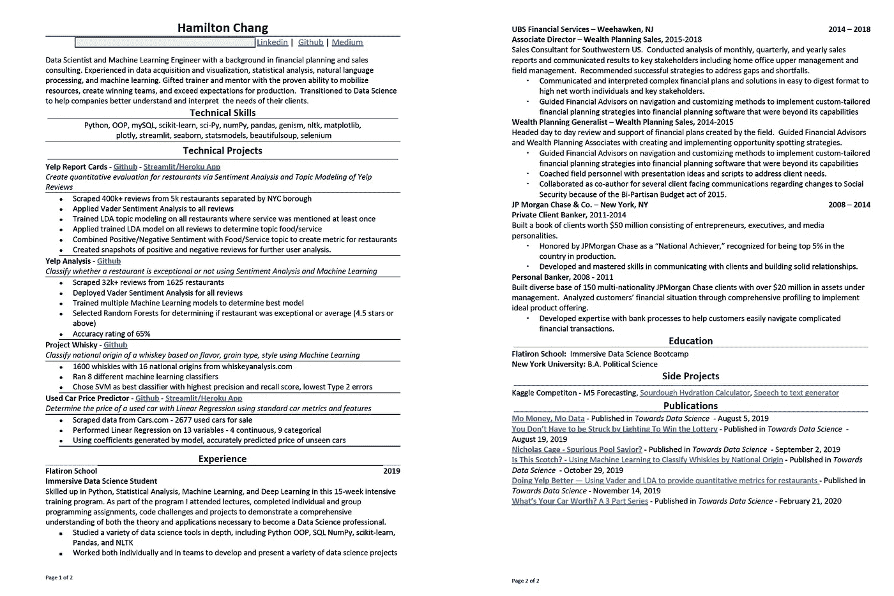
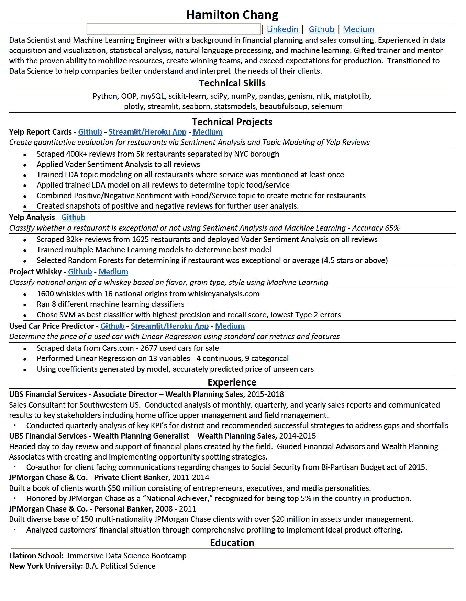

# 从熨斗学校毕业后，在数据科学领域找到一份工作

> 原文：<https://towardsdatascience.com/i-attended-flatiron-school-and-got-a-job-in-data-science-aeda2b69b02b?source=collection_archive---------19----------------------->


阿德里安·特林考斯在 [Unsplash](https://unsplash.com/s/photos/circle-spiral?utm_source=unsplash&utm_medium=referral&utm_content=creditCopyText) 上拍摄的照片

## [办公时间](https://towardsdatascience.com/tagged/office-hours)

## 结束我的数据科学传奇

大家好，有一段时间了。对于那些一直关注我的数据科学训练营之旅的人来说，这将是我的数据科学之旅现阶段的最后一章。希望这不会是我发表的最后一篇博客，但是我想和你分享我旅程的最后一步。

两年前，也就是 2018 年 8 月，我从瑞银的理财规划师和销售顾问的工作岗位上被裁了。在意识到很难找到进入另一家公司的道路一年后，我决定通过帮助指导战略来实现我的愿望，即能够改变人们的生活。良好的策略和决策是通过对可用数据的仔细分析而制定的，而良好的商业决策也是通过这种分析而制定的。

考虑到这一点，2019 年 7 月，我在熨斗学校的沉浸式数据科学项目中开始了我的数据科学之旅。如果你一直关注我所有的博客，你会知道这是一个艰难的旅程，但我学到了难以置信的东西。我获得了许多硬技能，我可以磨练和发展这些技能，使自己成为更有吸引力的候选人，其中许多技能可以应用于不止一个行业。

很多阅读我博客的人可能会问，这很好，但是汉密尔顿现在在哪里？他毕业后是什么样子的？真的像他们广告宣传的那样神奇吗？更重要的是，人们想知道，你找到工作了吗？

是的，我做到了。

# 熨斗之后的艰难之路

由于博客会有点长，我将从熨斗学校为你提供的资源开始，以及毕业后的第一个 90 天是什么样子。在我的下一篇文章中，我将谈一谈我的求职过程，它有多令人沮丧，以及我最终是如何找到工作的。

所以让我们来谈谈毕业后的生活是什么样子的。首先，你必须习惯于早上不早起，不去绞尽脑汁解决前一天晚上你积极思考的数学或编码问题。第二，你必须习惯不被你的同学、你的同路人控制，在艰难的上坡路上到达终点。十五周的压力、痛苦、自我怀疑会让人们团结起来，这是任何团队建设练习都无法完成的。毕业后的第一个早晨，我深切地感受到他们的缺席。

# 熨斗的研究生资源

接下来你需要知道的是，毕业后，Flatiron 有两个机构帮助他们的毕业生找到工作。第一个是雇主合伙组织。第二是他们的职业指导服务。我将在下面为你一一列举:

***雇主合伙集团* :** 熨斗学校雇佣的猎头。他们与潜在雇主交谈，帮助协商最初的工资期望，或者安排与潜在雇主的面试，或者在某些情况下，只是给你发送一个职位空缺的链接。他们的素质因人而异。有些人试图帮你找到你梦想中的工作，有些人只是想把你塞进任何空缺的职位中，这就是“任何工作都重要”的方法。我们通常会收到他们发来的电子邮件，宣布一个空缺职位，如果你感兴趣，请回复邮件。

**职业教练服务:**熨斗学校聘请的职业教练。这些人会每周和你联系，通常是通过视频电话。他们将帮助构建求职策略，进行模拟文化面试，帮助你整理简历和 LinkedIn，并检查你的心理健康状况。他们是你的私人啦啦队长，你永远不会意识到你一直需要一个，直到你有一个。通过代理，他们也是熨斗学校毕业后的代言人。他们会检查你的每周工作追踪，以确保你符合退款保证的要求。一旦你得到退款保证，你就失去了与他们的联系。

# 熨斗招聘事件

毕业后你要做的第一件事就是清理你的 github，完成你的最终项目，因为雇主肯定会想谈论它。与你的教练会面，检查你的个人品牌，建立或重新格式化你的简历，让你的 LinkedIn 闪闪发光。接下来是准备熨斗的招聘活动，对我的班级来说，是在毕业后两个星期。

招聘活动是什么？Flatiron 的雇主伙伴关系小组每季度举办一次招聘会。本质上，你和所有其他软件工程和数据科学毕业生都在 WeWork 空间见面，EP 为你安排了 15 分钟的面试，面试对象是希望招聘熨斗毕业生的公司。这些基本上都是速配约会，而且会如你所料。在规定的 15 分钟内，你必须拿出你最强的“准备好给人留下深刻印象”来说服这些人让你进入下一轮更严肃的面试。我会见了三家公司。一家是基于人工智能的抵押贷款处理公司，第二家是一家主要的服装零售商，最后一家是专门为投资银行提供研究和建模的金融科技公司。其他人会见了一家与内容创作者合作的公司 Frederic Fekkai(美发沙龙/美容集团)，以及一家帮助其他企业识别市场机会的公司。没有特别的主题，他们会将你与你提前指明的行业偏好相匹配。

说实话，我们都没有为招募活动做好准备。这将是我们许多人毕业后的第一次面试经历。我们都去了，因为首先“如果我真的找到工作了呢？”其次，我们都认为，即使没有任何结果，我们至少可以从数据科学面试过程中获得一些经验。我们很努力，但我们觉得比我们先毕业的那一届在这方面有更多的面试经验，很可能会进入下一轮。我们班有 10 人参加了招聘活动，6 人参加了后续面试，3 人进入了第三轮，2 人收到了录用通知，1 人被录用。

# 模拟面试

招聘活动结束后，我安排了熨斗公司给新毕业生的模拟技术面试。模拟面试是由一家名为 Skilled Inc .的公司运营的。他们通过签约的专业人士为各种行业提供模拟技术面试，这些专业人士希望将他们的经验货币化，并为像我这样的新手提供一些帮助。熨斗免费提供一个模拟技术，如果你想要更多，你必须自己付费。

关于我个人的模拟面试，我不打算讲太多细节。每个面试官都是不同的，他们的经历是不同的，因此他们的面试风格也是不同的。我的没有问编码或数学问题，而是详细介绍了我的项目、它的商业应用，以及如何最好地将其扩展为一个持续工作的模型。有趣的是，由于我来自销售和业务开发背景，这是一种我非常熟悉的方法。我的一个同学有一个亚马逊工程师，这对于一些严肃的 DFS 和 BFS 算法编码以及真正困难的亚马逊级 DS 问题来说是难以置信的困难。

对于那些想知道的人来说，这些面试的目的是不要成功，尽管如果你成功了那就太好了。关键是要接触到在真实面试中可能会被问到的问题类型，并突出你可能有的和需要努力的知识差距。我觉得我的面试没有让我在这方面做好准备。这在一些面试中行得通，但不是大多数。对于我那位得到了 Amazon guy 的同学来说，他在加强编码方面得到了大量有用的反馈，但在数学部分有所欠缺，直到今天他仍然对此感到有点不舒服。

在模拟技术面试之后，我和我的教练进行了模拟文化面试。这是我感觉更舒服的一种方式，在这种方式中，你努力向潜在的面试官展示你的品牌和价值。如果你对找工作认真一点，你会花大量时间打造你的品牌和信息。你应该准备好回答的最简单的问题是“告诉我关于你自己的情况”，“你为什么想在这里工作？”“你为什么从事这个职业？”

在模拟文化面试中，我拿到了一份类似上述的常见面试问题清单，并被告知要做好准备。然后我的采访被录了下来，录音被发给我进行评论。我的教练给了我极大的帮助，让我的脚本变得更加用户友好，我应该和不应该使用的时髦词汇，我过度使用的单词或短语，以及调整我的语气或肢体语言。她还给了我一些建议，告诉我雇主希望在他们的潜在候选人身上看到什么样的东西，以及一系列可以问潜在雇主的好问题。

最后，还有简历和 LinkedIn 评论。这两点通常是潜在雇主对你的第一印象，也是唯一的印象。Flatiron 为软件工程师和数据科学家提供了首选的技术简历格式。这种格式包括从对你和你的信息的标准描述开始，然后列出你的关键词搜索技巧。然后它会深入到你的项目列表中，包括使用的技术和结果。最后，列出你的工作经历，以及你希望作为附录包括的任何其他内容。看一看:



现在这种格式有几个问题，有些对我来说是特殊的，有些是一般的问题。如你所见，我的简历有两页，这很不寻常。我今年 37 岁，在银行业 10 多年，升职频繁。通常，如果我申请一份银行工作，这将是一个很好的事件序列。然而，作为一名职业改变者，我需要人们看到我的项目，并证明我有能力成为一名数据科学家，所以我的项目占据了很大的空间，我简历的其余部分致力于显示我在其他工作中做了 DS 类型的“东西”。

雇主伙伴关系对此有很大的问题，因此我没有收到他们的很多来信。他们希望我大幅缩减简历的可读性，尽管熨斗的指导方针规定，如果你有 5 年以上的工作经验，两页纸是可以接受的。因此，在我找工作大约 5 个月后，当 Flatiron 评估我的情况时，他们问 EP 为什么我没有被录用，他们指出我的简历长度是一个问题。这是我专门为 EP 准备的简历。



我将在这里花一点时间，就这个问题大声疾呼。当然，EP 有很多候选人需要他们去筛选。另一方面，我是 10 月份从 Flatiron 毕业的，到 11 月份我清理好的简历就在他们手里了。然而，不知何故，在他们整理简历、推荐工作等的整整 7 个月里，没有人费心与我或我的教练沟通，这是一个潜在的障碍？在这整整 7 个月的时间里，当我看着我的就业缺口逐月扩大时，我预算着每一分钱，担心被录用？提到我的简历太长确实是他们最起码能做的，但没人会在意？不，相反，他们只是去找那些容易跳槽的毕业生，去他妈的这个家伙和他长长的简历。

我跑题了。第二个问题是，对于许多人力资源人员来说，这种格式有点令人困惑。我不确定这种格式是否是一种标准，但我的很多回复和招聘信息都是这样的:

```
*“So tell me about the work you did at Yelp…”*.At which point the conversation devolves into: *“Actually, I didn’t work at Yelp, my final project utilized data from Yelp to…”* Followed by:*“Oh, I see, well we really need someone who has* (insert random skill here)*, I’ll pass on your resume and maybe we’ll reach out…”***end call**
```

我不知道这是谁或什么造成的，懒惰的人力资源人员还是糟糕的申请人跟踪软件。无论哪种方式，每个人都受到影响。也许我会造一个更好的 ATS，卖几百万。

# 开始的结束

我的求职之旅的第一部分就这样结束了。我一定会在我的下一篇帖子中写下我的求职经验和策略！下次见！