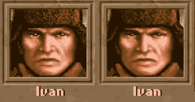
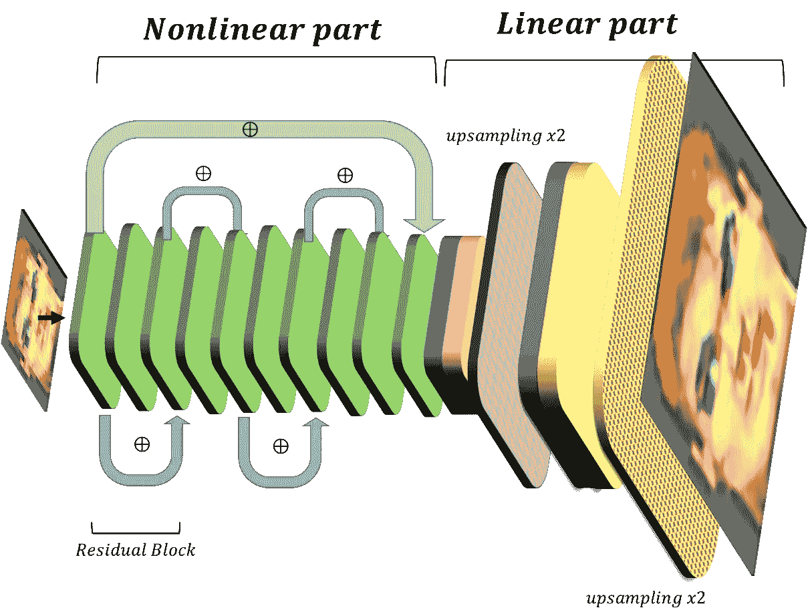
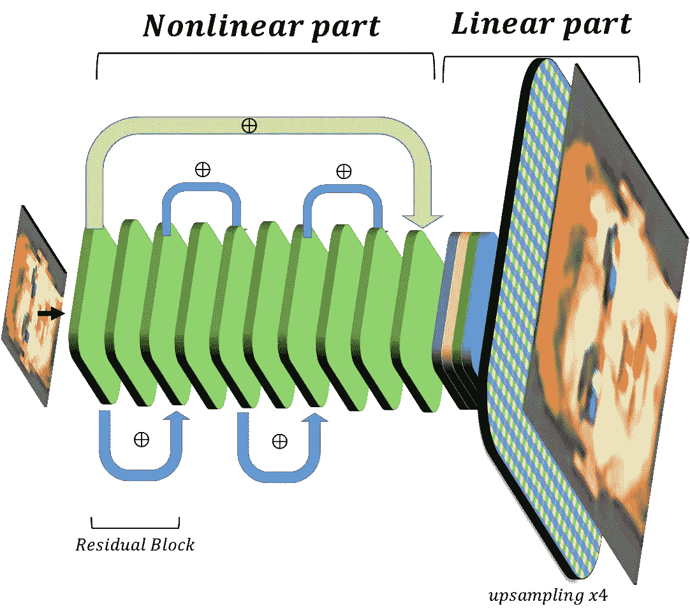
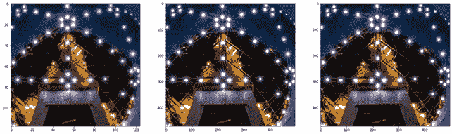
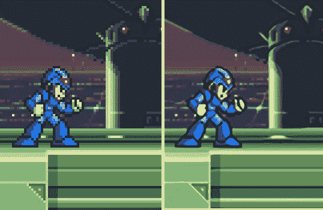
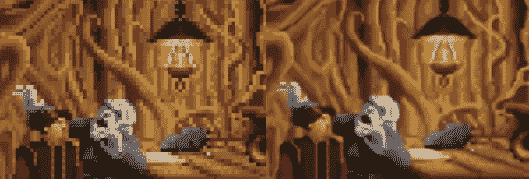
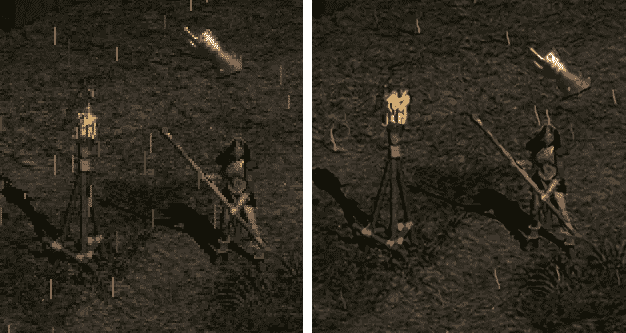
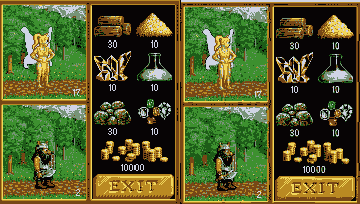

# 我给你带了些高清图！神经网络如何改进旧游戏

> 原文：<https://towardsdatascience.com/i-brought-you-some-hd-grphics-how-neural-net-can-improve-old-games-7a8b97dffd61?source=collection_archive---------21----------------------->

## 用于实时超分辨率的神经网络



铁血联盟截图(*图片作者*)

用于游戏图形增强的实时超分辨率(RTSR)神经网络(仅限 Nvidia GPU)

在 90 年代，当我还是个孩子的时候，我喜欢在我的电脑上玩视频游戏。在俄国，那时个人电脑还不太多，所以我的第一个游戏站是 ZS Spectrum，里面有游戏磁带。色彩鲜艳明亮的 DOS 游戏后来成了我真正的发现。对我来说，大多数现存的流派都是从 90 年代开始的。在有点怀旧之后，我决定回忆一下我的青春，在 Dosbox 模拟器上运行一个旧游戏，但受到了巨大像素和低分辨率的不愉快打击。虽然大像素的旧图形可能有其魅力，但许多人现在对这种质量不满意。

对于游戏玩家来说，提高图形质量通常至关重要。育碧在 2014 年花了大约六个月的时间为高清游戏《英雄 3》重绘纹理，并引发了人们对这款游戏的兴趣

【https://trends.google.com/trends/explore? 日期= 2012-06-01% 202020-06-25&q = % 2Fm % 2f 056 _ 97，%2Fm%2F065pfn

同样的情况也发生在 CNC 系列第一场由于高-its res remaster(红线)([https://www . ea . com/ru-ru/games/command-and-conquer/command-and-conquer-remastered](https://www.ea.com/ru-ru/games/command-and-conquer/command-and-conquer-remastered))。

并不是每个游戏都值得高清重制，因为重绘图形需要花费很多精力。另一种方法是算法增强。

为了提高分辨率，消除游戏中的大像素和台阶，目前使用了各种后处理和反走样算法(更多详细信息，请参见[https://vr.arvilab.com/blog/anti-aliasing](https://vr.arvilab.com/blog/anti-aliasing))，但反走样算法会导致所有令人讨厌的“模糊”图片，这往往比大像素的棱角更不可取。

但是你可以尝试使用超分辨率技术来提高图像质量。超分辨率的想法是使用神经网络来提高图像的分辨率，绘制丢失的像素。现在已经取得了令人印象深刻的结果，类似于改进 Bladerunner 电影中的图像的场景

超分辨率技术改善了图像的视觉感知，例如，这里的[https://github.com/tg-bomze/Face-Depixelizer](https://github.com/tg-bomze/Face-Depixelizer)，但是给图像带来了新的信息。它可以用来提高电影质量【https://www.youtube.com/watch?v=49oj2JUtn0A[【https://www.youtube.com/watch?v=3RYNThid23g】T5。然而，大多数算法都是资源密集型的，而且相当慢，我想创建一个脚本来实时改善游戏。](https://www.youtube.com/watch?v=3RYNThid23g)

# 一点理论

以下所有内容将适用于卷积神经网络([https://en.wikipedia.org/wiki/Convolutional_neural_network](https://en.wikipedia.org/wiki/Convolutional_neural_network))，这是一种用于处理图像的神经网络子类型。首先，让我们看看神经网络如何解决超分辨率问题。该任务非常类似于自动编码器任务的解决方案([https://en.wikipedia.org/wiki/Autoencoder](https://en.wikipedia.org/wiki/Autoencoder))。为了在输出端得到相同的图像，有必要将图像输入到网络输入端。然而，自动编码器通常用于解决高效数据压缩的问题，因此，其架构的一个特点是瓶颈——瓶颈，即具有少量神经元的网络层。这种层的存在使得剩余部分学习信息的有效编码和解码。为了训练超分辨率网络，首先有意降低高质量图像的分辨率，并将其输入神经网络。预期的输出是高质量的源图像。超分辨率任务定义了所用网络的架构。

通常，输入和输出数据之间有一个连接(跳过连接)，这大大加快了学习速度。输入数据的像素大小增加，并被添加到卷积网络的输出中。因此，你不需要完全从头开始训练网络来把图像变成几乎一样的。这种联系允许训练画出通过增加像素尺寸而放大的图像和真实的高清图像之间的差异。在不同级别和通过不同层数的跳跃连接的想法是非常有效的，并导致了网络的剩余网络类的出现。如今，几乎所有流行的建筑都采用了这种连接方式。在这里可以找到解决超分辨率问题的最新架构的很好的概述([https://github.com/krasserm/super-resolution](https://github.com/krasserm/super-resolution))。我的任务是创建一个神经网络来实时解决超分辨率问题。

具有四个残差块的 edsr 架构被选择为分辨率增加 4 倍(标准 edsr 具有 16 个块)。在研究和优化之后，其尺寸显著减小(非线性部分的尺寸减小了 4 个块，并且线性上采样步骤被优化而没有优化质量损失),并且速度被提高而没有显著的质量损失。一般网络架构如图所示。每个块是一个 X * Y * N 图像，其中宽度对应于通道的数量。转换—对应于 3×3 卷积(在 res 块之后激活非线性 ReLU 的情况下)。升级步骤——由于渠道变平而导致的维度增加。



超分辨率的 EDSR 卷积网络(*图片作者*



我提出的 RTSR 建筑(更快)(*作者图片*)

高质量的照片已经从[https://data.vision.ee.ethz.ch/cvl/DIV2K/.](https://data.vision.ee.ethz.ch/cvl/DIV2K/)下载，一般任何照片都可以。训练的代码在这里(有一些来自[https://github.com/krasserm/super-resolution](https://github.com/krasserm/super-resolution)的函数用于数据生成器)。用于更好工作的图像大小调整是像素化游戏中最接近[的](https://pillow.readthedocs.io/en/stable/reference/Image.html)方法

我要指出的是，裁员方法对培训质量影响很大。下采样的最佳方法是最近邻或中值滤波。包括像素平均的方法通常不适用。

之后，移除。/cache 文件夹并用我们的数据重新创建生成器(适当缩小)

输出是具有简单架构的相对较小(2.6 MB)的神经网络。同时，该检查给出了与预训练的 16 块网络的细微差别:



左侧—初始图像，右侧—16 块 edsr，中间 rtsr。低分辨率图像来自 Github [项目](https://github.com/krasserm/super-resolution)。增强图像是*作者图像*

# 运行网络

我已经在一个支持 cud nn(https://developer.nvidia.com/cudnn)的显卡(我有一个 GTX 1060 3 Gb)上启动了最终的网络，以获得高性能。以下是与 RTSR 一起玩的链接:

【https://github.com/Alexankharin/RTSR 

用于推断的管道如下:

1.从区域或窗口捕捉图像

2.经由 RTSR 的图像增强

3.在新窗口中绘制增强图像

在开发过程中，我发现当在 DOSBox 模拟器中启动游戏时，分辨率是 640x480 像素，但大多数情况下它是通过将像素大小加倍来产生的，因此在增强之前，可能需要可选的初始 320x240 图像恢复步骤(我后来发现了详细信息[https://www . dosgamers . com/dos/dos box-dos-emulator/screen-resolution](https://www.dosgamers.com/dos/dosbox-dos-emulator/screen-resolution))。

截图使用 Linux 中的 mss 库或 windows 中的 d3dshot 库

图像处理和绘图——使用 OpenCV-python 和 PIL 库。要关闭窗口，激活它并按 q 键。

脚本写在 superres_win.py 文件中。

我的 1060 3GB 笔记本电脑在 320x240 图片下提供 20–22 FPS，我发现它对于大多数类型的游戏都是可以接受的。根据基准测试[http://ai-benchmark.com/ranking_deeplearning_detailed.html](http://ai-benchmark.com/ranking_deeplearning_detailed.html)GTX 1070 和 1080 在类似的任务应该超过 1060 近 2 倍(也没有真正测试)！对于舒适的游戏来说，大约 40 的 FPS 应该足够了。下面是一段视频，展示了街机游戏的质量改进:

安装了 GTX 1060 3 GB 和 Linux 的固定 PC 只能提供 17 FPS(我还没有发现为什么模型运行得更慢)。
对于主线任务来说已经足够了:

它甚至对一些平台游戏也很有效:

如何使用:

你需要一个支持 cuda 和 cud nn([https://developer.nvidia.com/cuda-gpus](https://developer.nvidia.com/cuda-gpus))以及已安装的 cuda / cudnn 库的显卡。需要安装 python 3.7 和 TensorFlow(有 GPU 支持的 2.0 以上版本)。这可能是一项艰巨的任务，兼容性问题(【https://www.tensorflow.org/install/source_windows】T2)可能会发生。最简单的方法是安装 Anaconda 发行版(【https://www.anaconda.com/products/individual】T4)，然后打开 Anaconda 提示符命令行并编写

```
conda install tensorflow-gpu
```

如果因为冲突而没有成功，那么

```
conda install cudnnpip install tensorflow-gpu
```

应该管用。

可以使用 pip 安装其他库:

```
pip install opencv-python
pip install mss
pip install d3dshot
pip install pywin32
```

D3dshot 库安装可能需要额外的步骤[https://github . com/SerpentAI/d3d shot/wiki/Installation-注意:-Laptops](https://github.com/SerpentAI/D3DShot/wiki/Installation-Note:-Laptops)

从 https://github.com/Alexankharin/RTSR[下载并解包 EDSR 脚本和模型](https://github.com/Alexankharin/RTSR)

使用命令运行 superres_win.py

```
python superres_win.py
```

在 7 秒钟内，你应该激活游戏窗口。将会出现一个窗口，增强您显示器的游戏区域。调整窗口捕获区域 WSAD 键。捕捉区域的大小可以用 IJKL 键来改变。将捕获区域放置到游戏中后，按 0 启动超分辨率模式。1 键或 2 键定义最初捕获的图像是否有大(2x2)像素。制作一个窗口，让你的游戏活跃起来，开始玩吧！

# 例子



增强前后的 MegaMan X screeenshots(图片由作者提供)


真人快打 3 屏幕截图(图片由作者提供)



凯兰迪亚传说截图(*图片作者*)



暗黑 2 截图(图片由作者提供)



英雄无敌截图(*图片作者*)