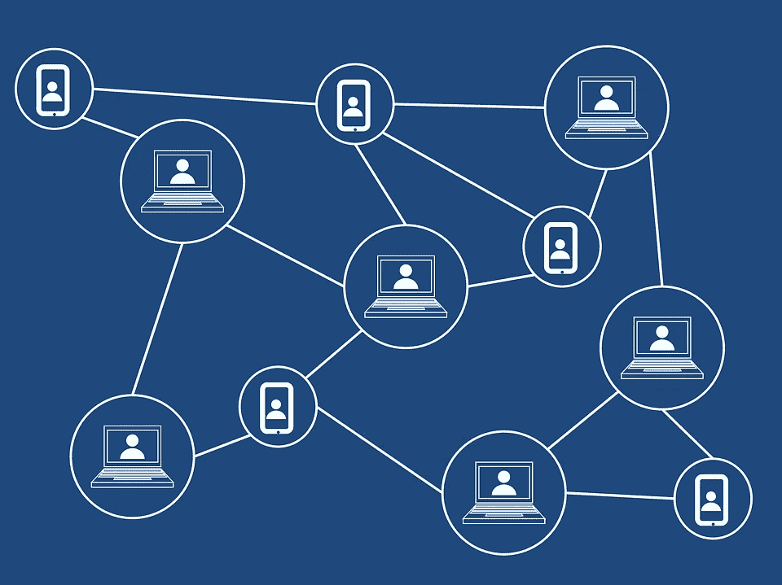

# 我建立了一个区块链，而我得到的只是一篇 17 页的研究论文

> 原文：<https://towardsdatascience.com/i-built-a-blockchain-and-all-i-got-was-a-17-page-research-paper-c85987228f4c?source=collection_archive---------50----------------------->

## 我的成绩是通过血、汗和泪获得的，但我不禁感到悲伤的是，这个项目并没有多少现实生活中的奖励。

由图米苏于[pixabay.com](https://pixabay.com/nl/illustrations/blockchain-blok-chain-technologie-3019120/)

我目前是一名大学生。哇，在学校的时光真美好(感谢我要毕业了)。碰巧的是，这个故事的主要焦点发生在上学期，在所有新冠肺炎的东西加速之前。

作为一名计算机科学专业的学生，我需要完成一门名为高级研究的学期课程。这是一个非常(故意)模糊的课程名称，在这个课程中，他们希望你做的是，选择一个你认为可以应用计算机科学的问题，并研究解决方案。哦，让我们不要忘记项目的高潮，论文和演示。

# 该项目

我的教授(嗨！如果你正在读这篇文章)，让我们根据项目想法分组(为了他和我们的利益)。我很乐意承认，我的项目想法不是我想出来的，是我的合伙人想出来的。然而，我确实热情地推动了这个项目的建设，直到今天，我的合作伙伴还会高兴地取笑我。你问的这个神秘项目是什么？

我们想建立一个使用区块链的投票系统。

点击这里查看 GitHub [上的项目(如果你想看的话，那里也有论文和演示文稿的副本)。](https://github.com/ltucker284/Basic-Chain)

## 为什么？

嗯，我的合作伙伴对技术的信息安全领域非常感兴趣(对政治学也有热情)，我喜欢挑战。这个想法引起了我的兴趣。这个挑战嘲弄了我。事实上，由于压力，我度过了许多不眠之夜，还长了几绺头发。

我们决定使用 [Hyperledger Fabric](http://hyperledger.org) (HF)来构建项目(没有 Composer)。最终，由于项目的操作系统相关部分的问题，实际的链变成了我的项目部分，我的合作伙伴在概念证明 Merkle-tree 上做了一点工作(很抱歉，但我仍然无法解释它是如何准确工作的)。

那个学期的大部分时间，我都在试图完成这个链条上的基本功能。我重新开始了很多次。我筛选了目前存在的关于 vanilla Fabric 的少量文档，试图找到答案，尽我所能进行故障排除——其中一些是中型文章，我将在下面链接。那个项目极大地考验了我的耐心，但我太固执了，无法从不那么困难的事情重新开始。

## 但是为什么要有投票系统呢？

我相信很多人都不知道，目前(在美国)使用的大多数投票系统/机器都经过研究，发现非常不安全。没有用确切的术语来说明原因。可能是因为很难确定这些机器是在由第三方测试之前制造和销售的。

本质上可以归结为三个可能的原因。

*   开发人员没有多少安全培训或经验。
*   公司为了省钱，偷工减料。
*   该公司几乎没有进行任何测试。

所以，这门课的目的是尝试将我们的计算机科学知识应用到现实世界的问题中，为什么不采用投票系统呢？

## 为什么是区块链？

由于区块链的整个前提是成为一个不可编辑的、仅附加的账本，由一个对等网络来维护，还有什么更好的办法来解决安全问题呢？由于投票被认为是一个几乎符合圣经的民主进程，再多的安全措施也不过分，对吗？

区块链的真理是，安全性的大小取决于有多少对等体参与到网络中来维护账本的完整性。由于这一点，你仍然必须满足拜占庭将军问题的要求，以便有效地保护网络，参与的对等体数量越大，欺骗网络就越困难。

# 一个新兴的竞争者？

所以第无数次，我让步了，重新开始，直接使用了 HF 的一个例子，并尽可能少的修改以使它工作。而且成功了！我们写了论文，做了期末报告，并获得了分数。突然之间，这个项目除了一个奇怪的一次性副业项目之外，再也没有任何意义了。在撰写论文的最后阶段，我们甚至发现弗吉尼亚州实际上有一个由 Hyperledger Fabric 支持的公开可用的(尽管是私下维护的)电子投票应用程序。

第一反应是，这让我们的项目失去了意义。然而，它没有。为什么？因为那是出于“安全原因”而私下维护的我们的是开源的。重要的区别是，我们没有任何方法来研究他们是否改善了我们发现的关于旧的(尽管目前仍在使用)投票系统的研究论文所带来的安全条件。开源 it 的想法是让维护者对社区发现的漏洞负责，并在需要的地方寻找社区人才。

# 经验教训

最后，我学到了新的东西，克服了巨大的挑战，并为自己做了一些我仍然感到自豪的工作。完全公开，我花了大部分时间做前端开发，我已经作为一名开发人员/初级软件工程师工作了将近两年。

我给你的建议是，新程序员，当你把基础做好了，挑战你自己。想一些非常有挑战性的事情，甚至可能是稀奇古怪的事情，经历碰壁和重新开始的动作。挑战会迫使你发现你需要解决问题的深度，或者迫使你放弃。

无论哪种方式，即使没有真正的、有形的回报——不幸的是，我仍然不能把这 100 英镑存到银行——它也会让你更多地了解你自己和你用来实现你的解决方案的技术，这比在堆栈溢出中寻找你真正在寻找的解决方案的零零碎碎要好得多。

 [## 区块链 Hyperledger 结构—错误和解决方案

### 你好，在这篇文章中，我想分享一些你可能面临的错误和可能的解决方案。

medium.com](https://medium.com/coinmonks/hyperledger-fabric-composer-errors-solutions-827112a3fce6)  [## Hyperledger Fabric 链码测试教程

### 大家好！我在这里向您解释我是如何创建测试环境，使我能够真正…

medium.com](https://medium.com/coinmonks/tutorial-on-hyperledger-fabrics-chaincode-testing-44c3f260cb2b)  [## 在 Node.js 中开始开发 Hyperledger 结构链代码

### 用 Node.js 编写链代码的初学者指南

medium.com](https://medium.com/coinmonks/start-developing-hyperledger-fabric-chaincode-in-node-js-e63b655d98db)  [## 了解 Hyperledger 结构-认可事务处理

### Hyperledger Fabric 与许多其他区块链平台之间的一个关键区别是交易的生命周期。在…

medium.com](https://medium.com/kokster/hyperledger-fabric-endorsing-transactions-3c1b7251a709)