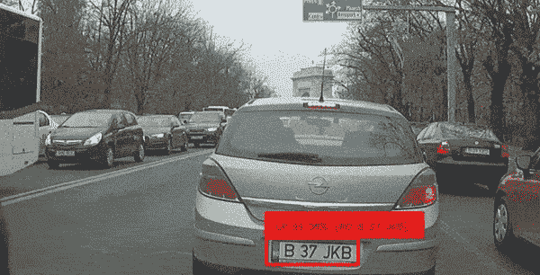
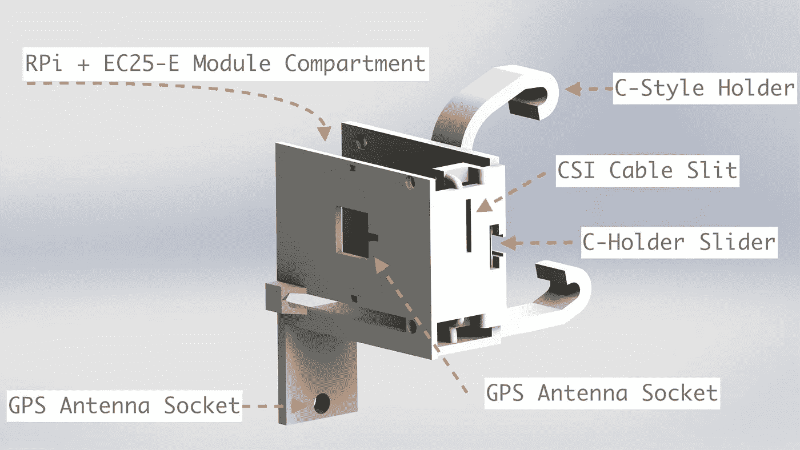
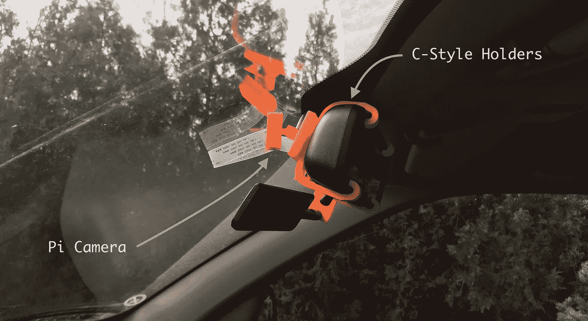
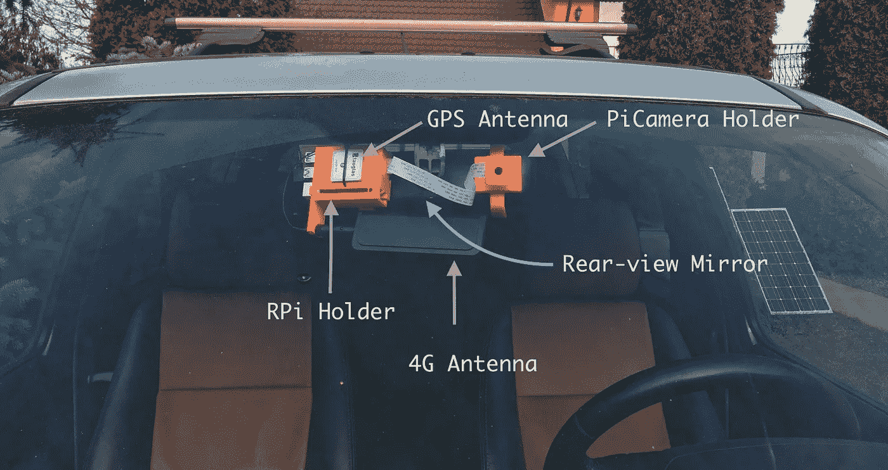
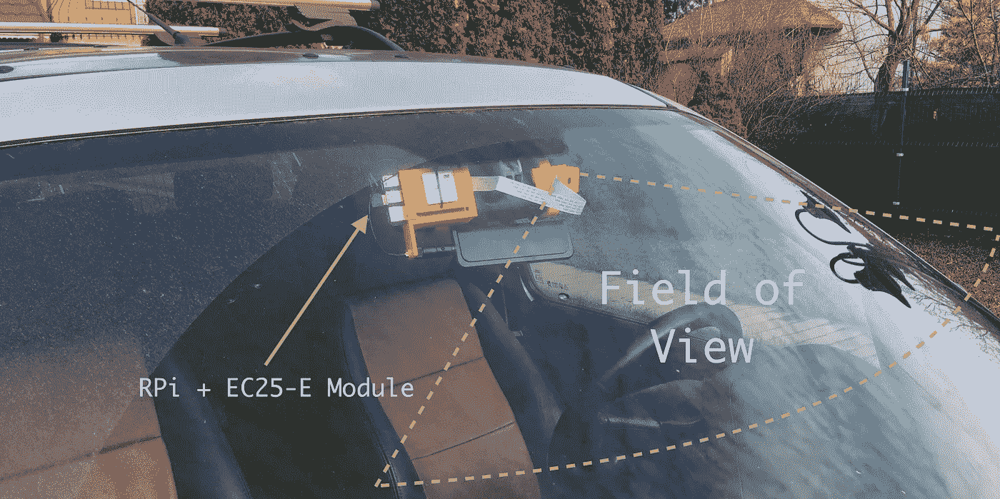
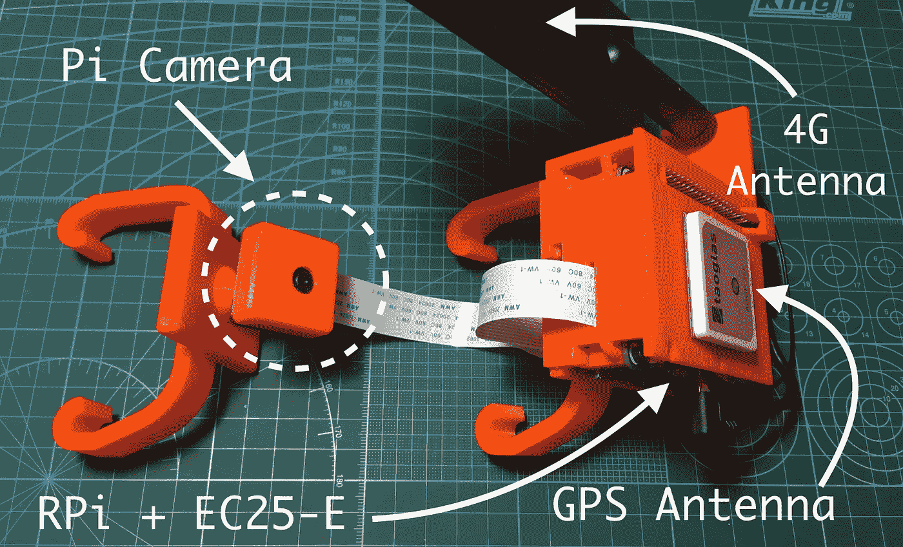
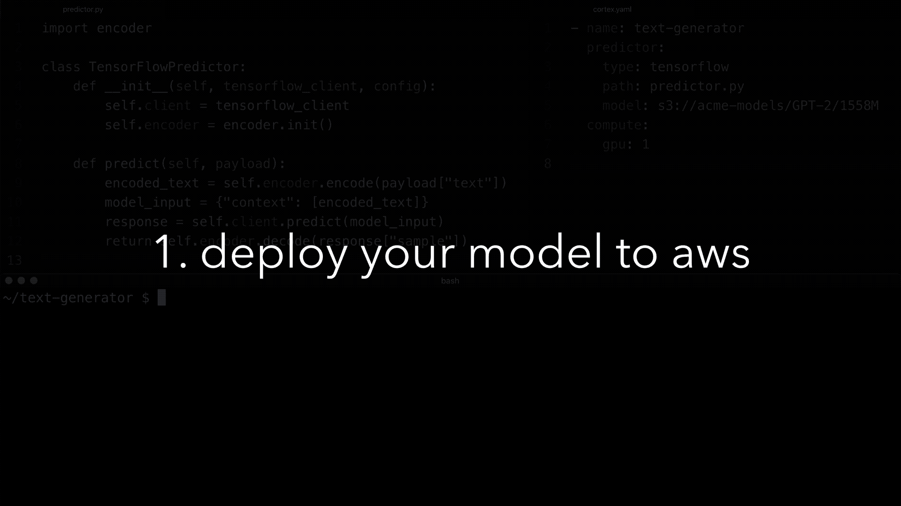
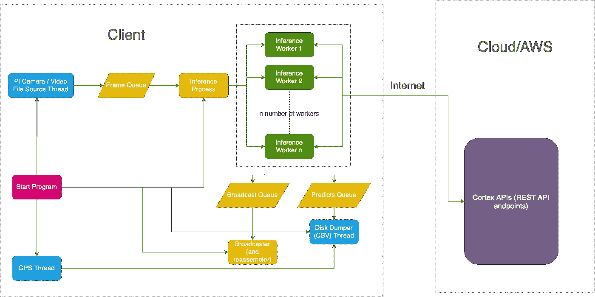

# 我用树莓派和机器学习做了一个 DIY 车牌阅读器

> 原文：<https://towardsdatascience.com/i-built-a-diy-license-plate-reader-with-a-raspberry-pi-and-machine-learning-7e428d3c7401?source=collection_archive---------0----------------------->

## 机器学习终于变得可行了



GIF 来自预测[视频](https://www.youtube.com/watch?v=gsYEZtecXlA)。检查结果部分。

几个月前，我开始考虑让我的汽车具有探测和识别物体的能力。我很喜欢这个想法，因为我已经看到了特斯拉的能力，虽然我不想马上买一辆特斯拉( *Model 3 看起来越来越多，我不得不说*)，但我想我会尝试满足我的梦想。

所以，我做到了。

下面，我记录了项目中的每一步。如果你只是想看探测器运行的视频 GitHub 链接，跳到底部。

# 第一步。确定项目范围

我开始思考这样一个系统应该有什么能力。如果说我一生中学到了什么的话，那就是从小处着手永远是最好的策略:循序渐进。所以，除了明显的车道保持任务(每个人都已经做过了)，我想到的只是在开车时简单地识别车牌。该识别过程包括 2 个步骤:

1.  检测车牌。
2.  识别每个牌照的边界框内的文本。

我认为，如果我能做到这一点，那么转移到其他任务应该是相当容易的(如确定碰撞风险、距离等)。甚至可能创建一个环境的向量空间表示——这将是 dope。

在过多担心细节之前，我知道我需要:

*   一种机器学习模型，将未标记的图像作为输入，并检测车牌。
*   某种硬件。粗略地说，我需要一个连接到一个或多个摄像机的计算机系统来查询我的模型。

首先，我着手建立正确的对象检测模型。

# 第二步。选择正确的型号

经过仔细研究，我决定采用以下机器学习模型:

1.  *yolov 3*——这是迄今为止最快的车型，可与其他最先进的车型相媲美`mAP`。该模型用于检测物体。
2.  *CRAFT* 文本检测器——用于检测图像中的文本。
3.  *CRNN* —基本上是递归的 *CNN* (卷积神经网络)模型。它必须是递归的，因为它需要能够将检测到的字符以正确的顺序组成单词。

这三种模式如何协同工作？嗯，操作流程是这样的:

1.  首先， *YOLOv3* 模型检测从摄像机接收的每一帧中的每个牌照的边界框。建议预测的边界框不要太精确，包含比检测到的对象更多的内容是个好主意。如果太窄，那么后续流程的性能可能会受到影响。这与下面的模型是相辅相成的。
2.  *CRAFT* 文字检测器从 *YOLOv3* 处接收裁剪下来的车牌。现在，如果被裁剪的帧过于狭窄，那么很有可能会遗漏部分车牌文本，这样预测就会失败。但是当边界框更大时，我们可以让 *CRAFT* 模型检测字母在哪里被发现。这给了我们每个字母非常精确的位置。
3.  最后，我们可以将每个单词的边界框从 *CRAFT* 传递给我们的 *CRNN* 模型来预测实际的单词。

有了我的基本模型架构草图，我可以转移到硬件上。

# 第三步。设计硬件

知道我需要低功率的东西让我想起了我的旧爱:树莓派。它有足够的计算能力预处理帧在一个体面的帧速率，它有 Pi 相机。Pi 相机是树莓 Pi 的实际相机系统。它有一个非常棒的图书馆，非常成熟。

至于互联网接入，我可以只扔在一个 EC25-E 的 4G 接入，也有一个 GPS 模块嵌入从我以前的一个项目。下面是第[篇](https://www.robertlucian.com/2018/08/29/mobile-network-access-rpi/)讲的就是这个盾。

我决定从圈地开始。把它挂在汽车的后视镜上应该效果不错，所以我最终设计了一个双组件支撑结构:

1.  在后视镜的一侧，树莓 Pi + GPS 模块+ 4G 模块会留下。查看我在 EC25-E 模块上的文章，了解我对 GPS 和 4G 天线的选择。
2.  另一方面，我有一个 Pi 摄像机，通过一个带有球形接头的臂来支撑。

这些支架/外壳将由我信赖的 *Prusa i3 MK3S 3D 打印机*打印。



图 1—Raspberry Pi+4G/GPS 屏蔽外壳


图 2 — Pi 摄像机支架，带有用于定向的球形接头

*图 1* 和*图 2* 显示了渲染时的结构。请注意， *C 型支架*是可插拔的，因此 Raspberry Pi 的外壳和 Pi 摄像头的支架不附带已经印刷好的支架。它们有一个插座，灯座插在上面。如果我的一个读者决定复制这个项目，这将非常有用。他们只需调整支架，就能在汽车后视镜上工作。目前，持有人在我的车上工作得很好:这是一辆路虎神行者。



图 3-Pi 摄像机支撑结构的侧视图



图 4—Pi 摄像机支撑结构和 RPi 支架的前视图



图 5——摄像机视野的想象图



图 6 —包含 4G/GPS 模块、Pi 摄像头和 Raspberry Pi 的嵌入式系统特写照片

显然，这些需要一些时间来建模——我需要几次迭代来使结构坚固。我在 200 微米的图层高度使用了`PETG`材质。`PETG`在 80-90 度(摄氏度)下工作良好，抗紫外线辐射能力很强——虽然没有`ASA`好，但也很强。

这是在 SolidWorks 中设计的，所以我所有的`SLDPRT` / `SLDASM`文件以及所有的`STLs`和`gcodes`都可以在这里[找到](https://www.dropbox.com/sh/fw16vy1okrp606y/AAAwkoWXODmoaOP4yR-z4T8Va?dl=0)。也可以使用它们来打印您的版本。

# 第四步。训练模型

一旦我有了硬件，我就开始训练模型。

不出所料，最好不要多此一举，尽可能重用别人的作品。这就是迁移学习的意义所在——利用来自其他超大型数据集的见解。一个非常恰当的迁移学习的例子是几天前我在这篇文章中读到的。在中间的某个地方，它谈到了一个隶属于哈佛医学院的团队，该团队能够微调一个模型来预测*“从胸片中预测长期死亡率，包括非癌症死亡”*。他们只有一个只有 50，000 张标记图像的小数据集，但他们使用的预训练模型( *Inception-v4* )在大约 1400 万张图像上进行训练。他们花的时间不到原始模型训练时间的一小部分(时间和金钱)，但他们已经达到了相当高的精度。

那也是我打算做的。

# YOLOv3

我在网上寻找预训练的车牌模型，并没有我最初预期的那么多，但我找到了一个对大约 3600 张车牌图像进行训练的模型。虽然不多，但也比什么都没有强，除此之外，它还在 Darknet 的预训练模型上进行了训练。我可以利用这点。这是那家伙的[型号](https://github.com/ThorPham/License-plate-detection)。

由于我已经有了一个可以记录的硬件系统，我决定用我的在镇上开几个小时，收集帧来微调上面那个家伙的模型。

我用 [VOTT](https://github.com/microsoft/VoTT) 给收集到的帧做了注解(当然还有车牌)。我最终创建了一个由 534 张图片组成的小型数据集，并为车牌添加了带标签的边框。这里是[数据集](https://github.com/RobertLucian/license-plate-dataset)。

然后我找到了 YOLOv3 net 的这个 Keras 实现。我用它来训练我的数据集，然后将我的模型预测到这个 repo 中，这样其他人也可以使用它。我在测试集上得到的*图*是 *90%* ，这确实很好地给出了我的数据集有多小。

# 克拉夫特和 CRNN

在无数次试图找到一种好的网络来识别文本之后，我偶然发现了 [keras-ocr](https://github.com/faustomorales/keras-ocr) ，这是 CRAFT 和 CRNN 的打包和灵活版本。而且还附带了他们预先训练好的模型。太棒了。我决定不对模型进行微调，让它们保持原样。

最重要的是，用`keras-ocr`预测文本非常简单。基本上只有几行代码。查看他们的主页，看看是怎么做的。

# 第五步。部署我的车牌检测器模型

我可以采用两种主要的模型部署方法:

1.  在本地进行所有的推理。
2.  在云中进行推理。

这两种方法都面临着挑战。第一个意味着有一个大的“大脑”计算机系统，这是复杂和昂贵的。第二个挑战是延迟和基础设施，特别是使用 GPU 进行推理。

在我的研究中，我偶然发现了一个叫做`[cortex](https://github.com/cortexlabs/cortex)`的开源项目。这对于游戏来说是相当新的，但它肯定是人工智能开发工具进化的下一步。

基本上，`cortex`是一个只需轻轻一按开关，就可以将机器学习模型部署为生产 web 服务的平台。这意味着我可以专注于我的应用程序，剩下的交给`cortex`来管理。在这种情况下，它在 AWS 上做所有的准备工作，我唯一要做的就是使用模板模型来编写我的预测器。更牛逼的是，每个型号我只需要写几十行。

这是从他们的 [GitHub repo](https://github.com/cortexlabs/cortex) 中截取的`cortex`在终端中的动作。如果这不是美丽和简单的，那么我不知道该叫它什么:



来源: [Cortex GitHub](https://github.com/cortexlabs/cortex)

由于这个计算机视觉系统不是由自动驾驶仪使用的，所以延迟对我来说并不重要，为此我可以选择`cortex`。如果它是自动驾驶系统的一部分，那么使用通过云提供商提供的服务就不是一个好主意，至少现在不是。

使用`cortex`部署 ML 模型只是一个问题:

1.  定义`cortex.yaml`文件，这是我们的 API 的配置文件。每个 API 将处理一种类型的任务。我分配的`yolov3` API 用于检测给定帧上的车牌边框，`crnn` API 用于使用*工艺*文本检测器和 *CRNN* 预测车牌号码。
2.  定义每个 API 的预测值。基本上，在`cortex`中定义一个特定类的`predict`方法来接收一个有效载荷(所有的 *servy* 部分都已经被平台处理了)，使用有效载荷预测结果，然后返回预测结果。就这么简单！

在不深入我是如何做到这一点的具体细节的情况下(为了让文章保持一个适当的长度)，这里有一个经典虹膜数据集的预测器的例子。cortex 实现这两个 API 的链接可以在[上找到，他们的资源库在这里](https://github.com/cortexlabs/cortex/tree/master/examples/tensorflow/license-plate-reader)——这个项目的所有其他资源都在本文的末尾。

```
# predictor.pyimport boto3
import picklelabels = ["setosa", "versicolor", "virginica"]
class PythonPredictor:
    def __init__(self, config):
        s3 = boto3.client("s3")
        s3.download_file(config["bucket"], config["key"], "model.pkl")
        self.model = pickle.load(open("model.pkl", "rb"))    def predict(self, payload):
        measurements = [
            payload["sepal_length"],
            payload["sepal_width"],
            payload["petal_length"],
            payload["petal_width"],
        ]        label_id = self.model.predict([measurements])[0]
        return labels[label_id]
```

然后做一个预测，你就像这样用`curl`

```
curl [http://***.amazonaws.com/iris-classifier](http://***.amazonaws.com/iris-classifier) \
    -X POST -H "Content-Type: application/json" \
    -d '{"sepal_length": 5.2, "sepal_width": 3.6, "petal_length": 1.4, "petal_width": 0.3}'
```

预测响应看起来像这样`"setosa"`。很简单！

# 第六步。开发客户端

有了`cortex`来处理我的部署，我可以继续设计客户端——这是棘手的部分。

我想到了以下架构:

1.  从 Pi 摄像机中以 30 FPS 的速度采集分辨率合适的帧( *800x450* 或 *480x270* )，并将每一帧推入一个公共队列。
2.  在一个单独的进程中，我将从队列中取出帧，并将它们分发给不同线程上的许多工作线程。
3.  每个工作线程(我称之为推理线程)都会向我的`cortex`API 发出 API 请求。首先，向我的`yolov3` API 发出一个请求，然后，如果检测到任何牌照，向我的`crnn` API 发出另一个请求，请求一批被裁剪的牌照。响应将包含文本格式的预测车牌号码。
4.  将每个检测到的牌照(有或没有识别的文本)推送到另一个队列，最终将其广播到浏览器页面。同时，还将板号预测推送到另一个队列，以便稍后保存到磁盘(以`csv`格式)。
5.  广播队列将接收一堆无序的帧。其消费者的任务是在每次向客户端广播新的帧时，通过将它们放置在非常小的缓冲区(几个帧大小)中来对它们进行重新排序。该使用者正在单独运行另一个进程。这个消费者还必须设法将队列的大小保持在一个指定的值，以便帧能够以一致的帧速率显示，即 30 FPS。显然，如果队列大小下降，那么帧速率的下降是成比例的，反之亦然，当队列大小增加时，帧速率也成比例地增加。最初，我想实现一个滞后函数，但我意识到这会给流一种非常不稳定的感觉。
6.  与此同时，在主进程中会有另一个线程运行，从另一个队列中提取预测和 GPS 数据。当客户端收到终止信号时，预测、GPS 数据和时间也被转储到一个`csv`文件中。

这里是与 AWS 上的云 API 相关的客户端的流程图。



*图 7 —客户端流程图以及配备 cortex 的云 APIs】*

在我们的例子中，客户端是 Raspberry Pi，推理请求发送到的云 API 是由 AWS 上的`cortex`提供的( *Amazon Web Services* )。

客户端的源代码也可以在其 [GitHub 库](https://github.com/RobertLucian/cortex-license-plate-reader-client)上查看。

我必须克服的一个特殊挑战是 4G 网络的带宽。最好降低该应用程序所需的带宽，以减少可能的挂起或对可用数据的过度使用。我决定在 Pi 摄像头上使用非常低的分辨率:`480x270`(我们可以使用小分辨率，因为 Pi 摄像头的视野非常窄，所以我们仍然可以轻松识别车牌)。尽管如此，即使在这个分辨率下，一帧的 JPEG 大小在 10 兆比特时也有 100KB 左右。乘以每秒 30 帧得到 3000KB，大约是 24 Mb/s，这还不包括 HTTP 开销——这是一个很大的数目。

相反，我做了以下几招:

*   将宽度缩小到 416 像素，这正是 YOLOv3 模型调整图像的大小。规模显然保持完整。
*   已将图像转换为灰度。
*   移除图像顶部 45%的部分。这种想法是，车牌不会出现在画面的顶部，因为汽车不会飞，对吗？据我所见，剪切掉 45%的图像不会影响预测器的性能。
*   再次将图像转换为 JPEG，但质量较低。

最终得到的帧大小约为 7–10KB，非常好。这相当于 2.8Mb/s。但是加上所有开销，大约是 3.5Mb/s(包括响应)。

对于`crnn` API，即使没有应用压缩技巧，裁剪后的车牌也不会占用太多时间。他们坐在大约 2-3KB 的一块。

总而言之，要以 30FPS 的速度运行，推理 API 所需的带宽大约是 6Mb/s。这个数字我可以接受。

# 结果

有用！

上面的例子是通过`cortex`运行推理的实时例子。我需要大约 20 个配备 GPU 的实例才能顺利运行。根据集群的延迟，您可能需要更多或更少的实例。从一帧被捕获到广播到浏览器窗口的平均延迟大约为 *0.9 秒*，考虑到推断发生在很远的某个地方，这真是太不可思议了——这仍然让我感到惊讶。

文本识别部分可能不是最好的，但它至少证明了这一点——通过提高视频的分辨率、缩小摄像头的视野或进行微调，它可以更加准确。

至于高 GPU 数量，这可以通过优化来减少。例如，转换模型以使用混合/全半精度( *FP16/BFP16* )。一般来说，让模型使用混合精度将对精度产生最小的影响，所以我们不会有太大的损失。

T4 和 V100 GPUs 具有特殊的张量核，在半精度类型的矩阵乘法上速度超快。与单精度运算相比，半精度运算在 T4 上的加速比约为 8 倍，在 V100 上为 10 倍。这是一个数量级的差异。这意味着，已经转换为使用单精度/混合精度的模型进行推理所需的时间可以减少 8 倍，而在 V100 上只需十分之一的时间。

我没有将模型转换为使用单精度/混合精度，因为这超出了本项目的范围。在我看来，这只是一个优化问题。我最有可能在`cortex`的版本`0.14`发布时这样做(具有真正的多进程支持和基于队列的自动伸缩)，这样我也可以利用多进程 web 服务器。

总而言之，如果所有优化都到位，将集群的大小从 20 个配备 GPU 的实例减少到只有一个实例实际上是可行的。如果适当优化，甚至不可能最大化一个配备 GPU 的实例。

为了让成本更容易接受，在 AWS 上使用[弹性推理](https://aws.amazon.com/machine-learning/elastic-inference)可以减少高达 75%的成本，这是一个很大的数目！打个比方，你可以花一毛钱买一个管道来实时处理一个流。不幸的是，目前`cortex`还不支持弹性推理，但我可以预见在不久的将来它会得到支持，因为它已经引起了他们的注意。见票[cortexlabs/cortex/issues/618](https://github.com/cortexlabs/cortex/issues/618)。

*注意:YOLOv3 和 CRNN 模型，可以通过在更大的数据集(大约 50-100k 个样本)上对它们进行微调来大大改进。在这一点上，即使帧的大小可以进一步减少，以减少数据的使用，而不会失去太多的准确性:“补偿某处，以便能够从其他地方”。这与将所有这些模型转换为使用半精度类型(以及可能的弹性推理)相结合，可以构成一个非常高效/划算的推理机。*

## 更新一

有了支持 web 服务器多进程工作器的`cortex`版本`0.14`，我能够将`yolov3` API 的 GPU 实例数量从 8 个减少到 2 个，将`crnn` API(在 *CRNN* 和 *CRAFT* 模型上运行推理)的 GPU 实例数量从 12 个减少到 10 个。这实际上意味着实例总数减少了 40%，这是一个非常好的收获。所有这些实例都配备了单个 T4 GPU 和 4 个虚拟 CPU。

我发现计算最密集的模型是 *CRAFT* 模型，它是建立在大约 138 米重的 *VGG-16* 模型之上的。请记住，每一帧通常需要多个推断，因为在一个镜头中可能会有多个检测到的车牌。这大大增加了 it 的计算需求。从理论上讲， *CRAFT* 模型应该被淘汰，取而代之的是改进(微调)CRNN 模型，以更好地识别车牌。通过这种方式，`crnn` API 可以缩小很多——减少到只有 1 或 2 个实例。

## 更新二

其他一些可以显著降低计算成本的因素包括:

1.  使用 *TinyYOLOv3* 代替 *YOLOv3* 。运行一个推理大约需要 12 倍的时间。运行不太复杂的模型时丢失的*映射*可以通过在更全面的数据集上训练模型来恢复。
2.  使用对象跟踪来避免必须检测每一帧上的牌照。这大大减少了两个 API 所需的推理总数。目标跟踪应该在本地完成，因为它在计算上是廉价的。
3.  此外，我们不一定需要所有类型的锚盒为*约洛夫 3* 。我们只需要那些符合车牌形状的。减少数字可以使推断更快。
4.  为输入源选择更高的帧速率，并在处理时只选取第*个*帧。例如，如果摄像机以 120 FPS 的速度运行，只需每隔 4 帧选取一帧，仍然可以得到 30 FPS。这允许更清晰/清晰的帧，从而导致更准确的预测。快速行驶的汽车是文本识别的罪魁祸首。
5.  用 [OpenALPR](https://github.com/openalpr/openalpr) 代替 *CRAFT + CRNN。我不完全确定这是不是一个完全好的主意，但是从我从别人那里听到的来看，这非常快。*
6.  知道发送到文本识别 API 的每一批帧都是车牌，我可以看到如何使用*自动编码器*来大幅度压缩图像以进行数据传输。或者如果不是这样，那么至少它们可以用来从这些帧中去除噪声。由于自动编码器运行起来通常非常便宜，我可以看到如何在 Raspberry Pi 上使用它们来预处理帧。然后它们会在 API 级别被解码。

这里的[这里的](https://news.ycombinator.com/item?id=22398872)、这里的、这里的或者这里的讨论了这些改进。

至于产生的 AWS 集群成本，我有以下想法:

*   在当前配置下，运行此操作的成本约为 4.00 美元/小时。只有使用 spot 实例才有可能。
*   假设所有的改进都到位了，成本可能会下降到 *~0.2 美分/小时*。实际上，只需要大约 1%的 T4 GPU 的能力来运行这些。这也是一个非常粗略的数字。这当然可以通过运行 spot 实例来实现。

# 结论(以及 5G 如何融入所有这些)

我看到设备开始越来越依赖云计算，尤其是计算能力有限的边缘设备。由于 5G 目前正在部署，理论上它应该使云更接近这些计算受限的设备。因此，云的影响力应该随之增长。5G 网络越可靠，越普及，人们就越有信心将所谓的关键任务的计算转移到云上，比如无人驾驶汽车。

我从这个项目中学到的另一件事是，随着在云中部署机器学习模型的流线型平台的出现，事情变得多么容易。5 年前，这可能是一个相当大的挑战:但现在，一个人可以在相对较短的时间内做这么多。

# 资源

*   3D 打印支架的所有`SLDPRTs` / `SLDASMs` / `STLs` / `gcodes`都可以在[这里](https://www.dropbox.com/sh/fw16vy1okrp606y/AAAwkoWXODmoaOP4yR-z4T8Va?dl=0)找到。
*   这个项目的客户端实现可以在找到[。](https://github.com/RobertLucian/cortex-license-plate-reader-client)
*   这个项目的`cortex`实现在这里[找到。](https://github.com/cortexlabs/cortex/tree/master/examples/tensorflow/license-plate-reader)
*   *Keras* 中 *YOLOv3* 模型的库在[这里](https://github.com/experiencor/keras-yolo3)找到。
*   用于*工艺的库*文本检测器+ *CRNN* 文本识别器在[这里找到](https://github.com/faustomorales/keras-ocr)。
*   欧洲车牌的数据集(由我的 Pi 相机拍摄的 534 个样本组成)在这里找到。
*   *Keras*(*license _ plate . H5*)和*saved model*(*yolov 3*folder/zip)格式的 *YOLOv3* 模型在这里找到[。](https://www.dropbox.com/sh/4ltffycnzfeul01/AACe85GoIzlmjEnIhuh5JQPma?dl=0)