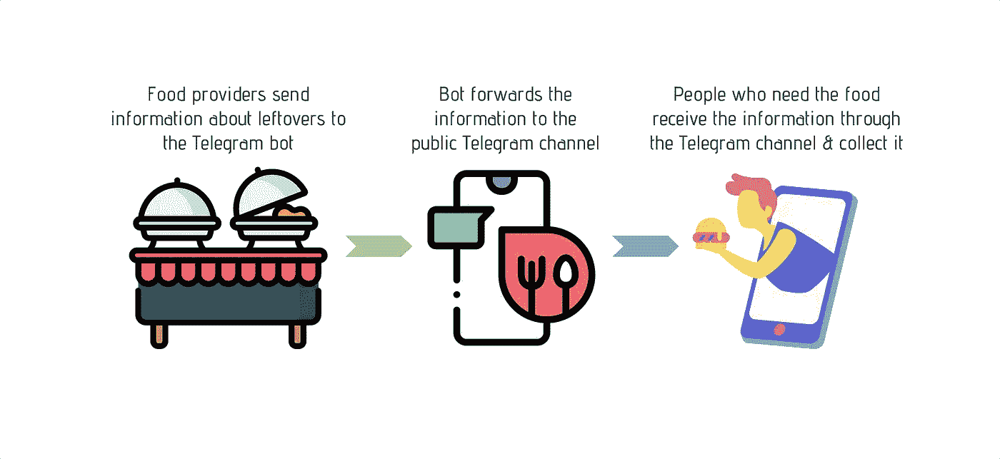
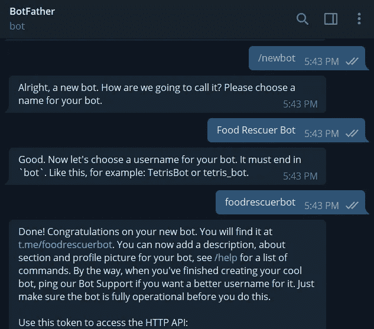
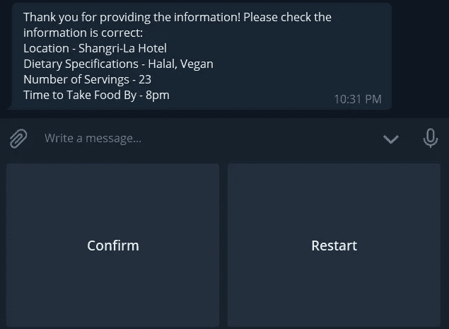
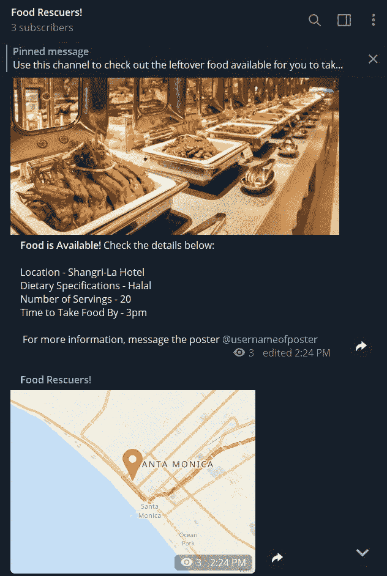
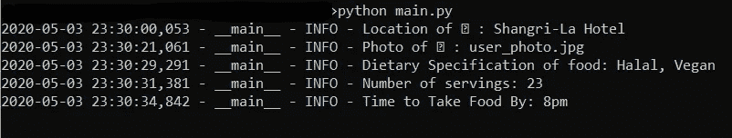

# 我做了一个电报机器人来对抗食物浪费——下面是我的方法

> 原文：<https://towardsdatascience.com/i-built-a-telegram-bot-to-combat-food-wastage-heres-how-293259a1bd32?source=collection_archive---------19----------------------->

## 使用 python-telegram-bot 创建电报机器人的完整 Python 指南

elegram 机器人现在风靡一时——从让你玩游戏、寻找朋友、寻找新机器人，甚至创造新机器人的机器人——可能性是无穷无尽的。今天，我将介绍我如何构建一个电报机器人来消除食物浪费，提供一个完整的教程，从(1) **如何使用 BotFather 创建一个电报机器人**，赋予它(2) **提问**，(3) **接收和存储用户响应和图片**，(4) **将此**信息发布到公共电报频道**，同时(5) **调用谷歌地图 API** 来显示**

代码可以在我的 Github 库[这里](https://github.com/liuhh02/food-waste-bot)找到。代码进一步在 Heroku 上部署了这个机器人，你可以在这里阅读我的关于我如何部署这个机器人的教程。

# 食物浪费——一个荒谬的问题

根据联合国粮食及农业组织(FAO)的统计，全球每年大约有 13 亿吨的食物被浪费掉，相当于所有人类消费食物的三分之一。一些常见的罪魁祸首包括自助餐，餐馆，甚至家庭，原因包括购买了太多，甚至更荒谬的是，食物看起来不好吃。


照片由 [Yukiko Kanada](https://unsplash.com/@okikuy0930?utm_source=medium&utm_medium=referral) 在 [Unsplash](https://unsplash.com?utm_source=medium&utm_medium=referral) 上拍摄

然而，与此同时，每天有 8.2 亿人挨饿。这似乎是矛盾的——我们怎么能浪费这么多食物，而同时让世界上这么多人挨饿？这归结为剩饭剩菜和需要食物的人之间缺乏沟通。当然，有慈善组织接受食物捐赠，但是在需要食物的人和有剩菜的人之间没有直接的交流。再加上令人沮丧的错综复杂的监管程序，毫不奇怪，在食品捐赠和它们真正惠及最需要的人之间存在着巨大的时间差。

考虑到这个问题，为什么不促进剩饭剩菜和需要食物的人之间的交流呢？这将有助于把那些有剩菜的人直接联系到那些需要食物的人。这样，需要食物的人可以很快收到食物，不会有任何明显的时间延误。

# 电报机器人简介

当然，这听起来不错，但是我们如何去实现它呢？这就是电报机器人和频道提供轻量级解决方案，将食品供应商与需要食品的人联系起来的地方。

食物供应商可以首先与电报机器人聊天，提供关于食物的关键信息，如食物的位置、饮食规格等。收集完这些信息后，机器人会将它们的食物列表发布到公众可以访问的电报频道上。一旦食物被发布在频道上，有需要的人可以简单地收集食物。所有这些都可以在没有任何明显时间延迟的情况下完成——事实上，将食品邮寄给收到信息的最终用户的整个过程只需不到 10 秒钟！



食品过账流程图解

为此，机器人将从食物海报中询问以下问题:

1.  食物的位置。使用 Google Maps API，位置将被转换为相应的纬度和经度坐标，然后可以显示在地图上，使用户可以轻松地导航到该位置。
2.  食物的图片。
3.  饮食规格，即食物是否是清真的、素食的等等。
4.  可供食用的食物数量。
5.  食物被清除前必须收集的时间。

食物海报将回答这些问题，机器人将把这些回答汇编成一条消息。有了这个摘要消息，在发帖人确认输入的细节是正确的之后，机器人将把信息转发到公共频道。

# 创建你的机器人

既然我们已经了解了这个过程是如何工作的，那就让我们来看看本质的细节吧！

首先，我们将创建一个机器人。为此，通过电报向[机器人父亲](https://t.me/botfather)**发送/newbot 命令。它将提示您输入 bot 的名称，后面是用户名(必须以 bot 结尾)。您可以使用/setname 命令轻松地更改 bot 的名称，但不可能通过 BotFather 更改 bot 的用户名，因此如果您不确定，可以先用随机用户名创建一个测试 bot，一旦您测试了所有功能并确保 bot 正常工作，就用您想要的用户名创建一个新 bot。**



与机器人父亲的第一次交流——“一个机器人统治所有人”！

创建 bot 后，BotFather 将向您发送 bot 的 API 密钥(在“使用此令牌访问 HTTP API:”行下)。把这个 API 密匙留给你自己，因为它可能被任何拥有 API 密匙的人滥用来控制你的机器人，这是你不希望发生的！你可以向机器人之父发送一堆命令来定制你的机器人，包括改变机器人的描述，它的简介图片等等，这些都是不言自明的，所以我会让你在[官方电报文档](https://core.telegram.org/bots#6-botfather)上阅读它。

# 使用 python-telegram-bot 与机器人交互

已经创建了我们的机器人，是时候给它一些额外的功能了！由于目标是创建一个与食物海报交互的机器人，该机器人必须能够向海报发送问题，以提示所需的信息，然后在转发到公共频道之前存储这些信息。为此，我们可以使用一个非常方便的 python 包装器， [python-telegram-bot](https://github.com/python-telegram-bot/python-telegram-bot) 。Github [页面](https://github.com/python-telegram-bot/python-telegram-bot/blob/master/examples/README.md)提供了许多使用该包装器编写的机器人示例，所以请查看该页面，看看是否有满足您的用例的示例！

首先，我们将安装所需的软件包。因为我们调用 Google Maps API 来提供食物位置的地图，所以我们还将安装 googlemaps python 包。如果你不想使用谷歌地图，你可以跳过这个包的安装。

在终端/命令提示符下，键入以下命令来安装这两个库:

```
pip install python-telegram-bot # using version 12.7
pip install googlemaps # using version 4.3.1
```

现在我们已经安装了这两个库，让我们开始研究代码吧！下面是代码(以防你想直接跳到它)，我将在下面详细介绍。

电报机器人的完整代码，包括调用谷歌地图 API

首先，我们导入相关的库:

```
import logging
import telegram
from telegram import (ReplyKeyboardMarkup, ReplyKeyboardRemove)
from telegram.ext import (Updater, CommandHandler, MessageHandler,  Filters, ConversationHandler)
from googlemaps import Client as GoogleMaps
```

我们正在导入日志记录，以显示用户在终端中与机器人交互时的日志消息，以及 python-telegram-bot 下的各种模块。我们也在导入谷歌地图，在地图上显示食物的位置。

接下来，我们配置日志记录设置如下:

```
# Enable logging
logging.basicConfig(format='%(asctime)s - %(name)s - %(levelname)s - %(message)s', level=logging.INFO) 
logger = logging.getLogger(__name__)
```

接下来，我们定义六个状态，这六个状态决定了机器人将提出的问题:食物的位置、照片、饮食规格、份数、领取食物的时间，以及与海报的确认。

```
LOCATION, PHOTO, DIET, SERVINGS, TIME, CONFIRMATION = range(6)
```

对于确认，将有一个回复键盘，用户将能够选择两个选项:确认信息是正确的或重新开始整个过程。



确认并重启按钮

因此，我们使用 python-telegram-bot 模块中的 ReplyKeyboardMarkup 模块指定了这两个选项，代码如下:

```
reply_keyboard = [['Confirm', 'Restart']]
markup = ReplyKeyboardMarkup(reply_keyboard, one_time_keyboard=True)
```

之后，我们指定一些变量，包括你的 Telegram bot 的 API(你从 BotFather 获得的)，以及 Google Maps 的 API。

为了获得谷歌地图应用编程接口，你需要一个谷歌云平台账户。创建帐户后(会有免费的信用点数，所以只要你不超过限额，这应该是免费的)，转到谷歌云平台[控制台](https://console.cloud.google.com/)并执行以下操作:

1.  在搜索栏中搜索 **API &服务**。
2.  点击搜索栏正下方的蓝色加号按钮**启用 API 和服务**。
3.  搜索**地理编码 API** 并启用。
4.  在 **API &服务**下，转到**凭证**并选择**创建凭证** > **API 密钥**。

将会生成一个 API 密钥，所以只需复制这个密钥。这将是您的谷歌地图 API 令牌。再说一遍，保管好这个！地理编码 API 提供了 200 美元的免费积分，这应该足够满足您的需求了。

```
TOKEN = 'YOURTELEGRAMBOTTOKEN'
bot = telegram.Bot(token=TOKEN) GMAPSAPI = 'YOURGOOGLEMAPSAPITOKEN'
gmaps = GoogleMaps(GMAPSAPI)
```

现在我们已经定义了变量，让我们深入研究代码的实际部分！首先，我们定义一个函数来总结食物海报提供的信息，如下所示:

```
def facts_to_str(user_data):
    facts = list()
    for key, value in user_data.items():
        facts.append('{} - {}'.format(key, value))
    return "\n".join(facts).join(['\n', '\n'])
```

当这个函数被调用时，它将以 key-value 的格式返回信息(例如，饮食规范- Halal)。

接下来，我们定义当用户启动机器人时会发生什么。这是通过使用命令/start 来完成的(它的工作方式类似于您使用命令/newbot 和 BotFather 来创建您的 bot)。当海报启动 bot 时，我们希望 bot 问候用户并提示他发送食物的位置，因此我们将 start 定义如下:

```
def start(update, context):
    update.message.reply_text("Hi! I am your posting assistant to help you advertise your leftover food to reduce food waste. To start, please type the location of the leftover food.")
    return LOCATION
```

前一个函数返回 LOCATION，这是下一个函数，因为 bot 将存储用户提供的位置，以便在最后创建一个摘要。在函数 *location* 中，代码做了几件事:首先，它告诉机器人有一条来自用户的新消息，然后它将用户提供的信息存储在键“location”下，以便以后打印摘要时参考。接下来，记录器将记录用于调试目的的信息，以防出错。最后，机器人会回复一条信息，要求提供食物的照片。然后，函数返回 PHOTO，这是下一个函数。

```
def location(update, context):
    user = update.message.from_user
    user_data = context.user_data
    category = 'Location'
    text = update.message.text
    user_data[category] = text
    logger.info("Location of %s: %s", user.first_name, update.message.text)
    update.message.reply_text('I see! Please send a photo of the leftovers, so users will know how the food looks like, or send /skip if you don\'t want to.')
     return PHOTO
```

在下一个函数中，用户有两个选择:要么给食物拍照并发送给机器人，要么如果没有准备好图像就跳过。

```
def photo(update, context):
    user = update.message.from_user
    photo_file = update.message.photo[-1].get_file()
    photo_file.download('user_photo.jpg')
    logger.info("Photo of %s: %s", user.first_name, 'user_photo.jpg')
    update.message.reply_text('Great! Is the food halal? Vegetarian? Please type in the dietary specifications of the food.')
     return DIET def skip_photo(update, context):
    user = update.message.from_user
    logger.info("User %s did not send a photo.", user.first_name)
    update.message.reply_text('Is the food halal? Vegetarian? Please type in the dietary specifications of the food.')
    return DIET
```

同样，机器人首先接收来自用户的消息，然后从用户那里获取照片文件，然后保存为 user_photo.jpg。然后，记录器记录信息，机器人用下一个关于食物饮食规格的问题进行响应。

下面几行遵循和以前一样的结构，因为机器人询问饮食规格、份数、收集食物的时间。您会注意到相同的结构:机器人首先接收来自用户的消息，然后将用户响应存储在 *user_data* 中，接着进行日志记录，然后机器人做出响应，提示用户下一个问题。

```
def diet(update, context):
    user = update.message.from_user
    user_data = context.user_data
    category = 'Dietary Specifications'
    text = update.message.text
    user_data[category] = text
    logger.info("Dietary Specification of food: %s", update.message.text)
    update.message.reply_text('How many servings are there?')
    return SERVINGS def servings(update, context):
    user = update.message.from_user
    user_data = context.user_data
    category = 'Number of Servings'
    text = update.message.text
    user_data[category] = text
    logger.info("Number of servings: %s", update.message.text)    update.message.reply_text('What time will the food be available until?')
     return TIMEdef time(update, context):
    user = update.message.from_user
    user_data = context.user_data
    category = 'Time to Take Food By'
    text = update.message.text
    user_data[category] = text
    logger.info("Time to Take Food By: %s", update.message.text) 
    update.message.reply_text("Thank you for providing the information! Please check the information is correct:{}".format(facts_to_str(user_data)), reply_markup=markup)
    return CONFIRMATION
```

从海报中获得所有必要的信息后，是时候总结信息并与海报进行确认了。首先，机器人合并信息，然后使用我们在上面定义的函数 *facts_to_str(用户 _ 数据)*发出摘要。

如果用户选择“确认”，机器人会将信息转发到公共频道。bot.send_photo 的 chat_id 参数代表频道的链接。

```
def confirmation(update, context):
    user_data = context.user_data
    user = update.message.from_user
    update.message.reply_text("Thank you! I will post the information on the channel now.", reply_markup=ReplyKeyboardRemove())
    bot.send_photo(chat_id='@nameofchannel', photo=open('user_photo.jpg', 'rb'), caption="<b>Food is Available!</b> Check the details below: \n {}".format(facts_to_str(user_data)) +  "\n For more information, message the poster {}".format(user.name), parse_mode=telegram.ParseMode.HTML) geocode_result = gmaps.geocode(user_data['Location'])
    lat = geocode_result[0]['geometry']['location'] ['lat']
    lng = geocode_result[0]['geometry']['location']['lng']
    bot.send_location(chat_id='@nameofchannel', latitude=lat, longitude=lng)
```

此外，我们现在调用谷歌地图来精确定位海报提供的确切位置。当用户回答关于位置的第一个问题时，位置已经存储在 user_data['Location']中，所以现在我们将使用 google maps 提取位置的纬度和经度。有了这些信息，机器人将位置和地图一起发送到由 *@nameofchannel* 指定的频道。



bot 在公共频道上发布的消息；自助餐图片摘自[https://my fave . com/johor-Bahru/V8-hotel-johor-Bahru-V8-hotel-johor-Bahru-晚餐-自助餐-1 人份-成人-64925](https://myfave.com/johor-bahru/v8-hotel-johor-bahru-v8-hotel-johor-bahru-dinner-buffet-for-1-adult-64925)

以下是一些帮助功能，以防用户取消与机器人的对话或出现错误:

```
def cancel(update, context):
    user = update.message.from_user
    logger.info("User %s canceled the conversation.", user.first_name)
    update.message.reply_text('Bye! Hope to see you again next time.', reply_markup=ReplyKeyboardRemove())
     return ConversationHandler.ENDdef error(update, context):
    """Log Errors caused by Updates."""
    logger.warning('Update "%s" caused error "%s"', update, context.error)
```

我们到了代码的最后一段！这里，代码定义了机器人应该为六种状态中的每一种状态做什么。最后，我们开始投票，这基本上使我们能够从海报中获取信息。python-telegram-bot 的 [Github wiki](https://github.com/python-telegram-bot/python-telegram-bot/wiki/Introduction-to-the-API) 在解释这里的代码方面做得更好，所以如果你不确定每一行是做什么的，一定要检查一下！

```
def main():
    updater = Updater(TOKEN, use_context=True)
     # Get the dispatcher to register handlers
    dp = updater.dispatcher
     # Add conversation handler with the states LOCATION, PHOTO, DIET, SERVINGS, TIME and DONE
    conv_handler = ConversationHandler(entry_points=[CommandHandler('start', start)],states={            
LOCATION: [MessageHandler(Filters.text, location)],             PHOTO: [MessageHandler(Filters.photo, photo),                             CommandHandler('skip', skip_photo)],             
DIET: [MessageHandler(Filters.text, location)],             
SERVINGS: [MessageHandler(Filters.text, bio)],             
TIME: [MessageHandler(Filters.text, time)],             
CONFIRMATION: [MessageHandler(Filters.regex('^Confirm$'), done),            MessageHandler(Filters.regex('^Restart$'), start)]        },         fallbacks=[CommandHandler('cancel', cancel), CommandHandler('start', start)]    )
    dp.add_handler(conv_handler)     # log all errors
    dp.add_error_handler(error) # start the bot
    updater.start_polling() # Run the bot until you press Ctrl-C  
    updater.idle() if __name__ == '__main__':
    main()
```

要启动您的 bot，只需进入终端/命令提示符并执行 python 文件。执行完文件后，进入 bot 并键入/start。你的机器人应该响应并问你上面编码的问题！当您响应时，您还应该看到出现以下日志:



记录在命令行中看到的张贴者的响应

原来如此！如果你想看看我创建的机器人，你可以在 [@foodrescuerbot](https://t.me/foodrescuerbot) 找到它。公共频道的链接是 https://t.me/foodrescuers 的。

试试这个！我希望你能从中得到乐趣，并告诉我进展如何！如果你需要任何澄清，请随时提问。让我们都三思而后行，我们是否可以在购买之前吃完食物，并努力减少食物浪费~

如果你正在寻找免费的 ***部署机器人*** ，请点击[这里的](/how-to-deploy-a-telegram-bot-using-heroku-for-free-9436f89575d2)获取一个关于如何在本地成功运行机器人后在 Heroku 上部署机器人的教程。