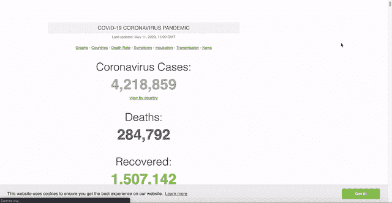
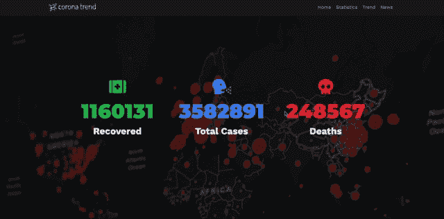
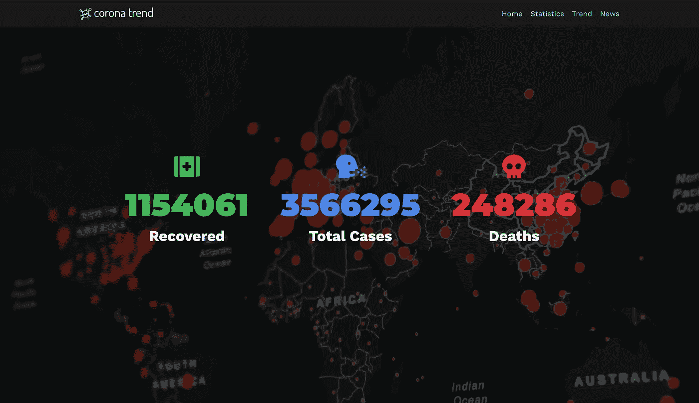
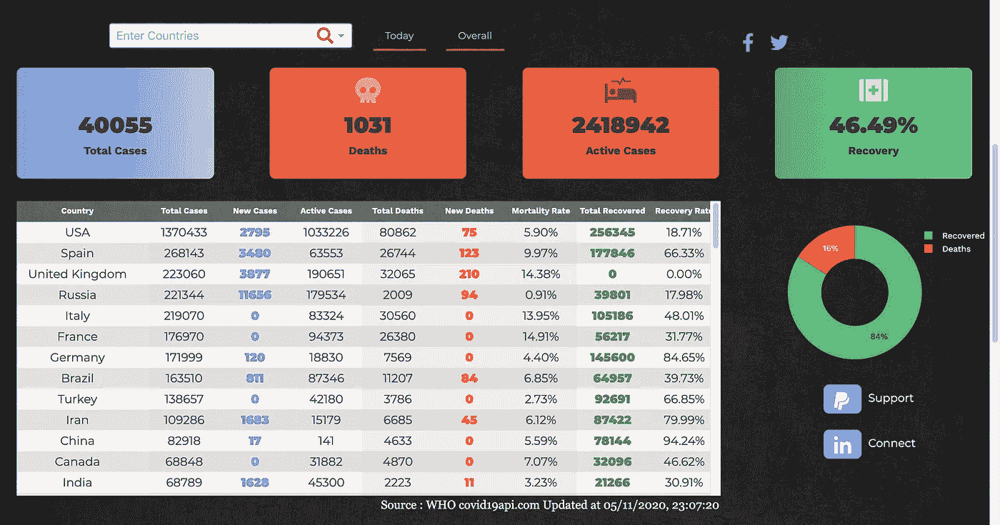

# 我建了一个网站来可视化冠状病毒

> 原文：<https://towardsdatascience.com/i-built-a-website-to-visualize-coronavirus-a367b8140871?source=collection_archive---------66----------------------->

## 展示冠状病毒趋势、统计数据和新闻的交互式 Covid19 仪表板

[粘土银行](https://unsplash.com/@claybanks?utm_source=medium&utm_medium=referral)在 [Unsplash](https://unsplash.com?utm_source=medium&utm_medium=referral) 拍摄的照片

大家好，
我希望每个人都尽自己的一份力量呆在家里，保持健康。我们再次被放回野外只是时间问题，一线工人可以放松一下了。

当呆在家里时，我明白事情似乎有点模糊不清。我们不确定外面发生了什么，这感觉就像生活在岩石下。你很幸运，我在这里为你提供**完美的解决方案**。一个冠状病毒网站。

来自[tenor.com](http://www.tenor.co/search/atomicmari-gifs)的 gif

我创建了一个互动网站，跟踪全球冠状病毒的**统计**、**趋势**和**新闻**。该网站每 30 分钟更新一次，为其浏览器保持几乎实时状态。它具有流畅的用户体验，非常适合你监控你的国家发生了什么，等等。

 [## 电晕病毒 Covid19 交互式仪表板

### 电晕趋势提供最新的趋势，新闻和数据可视化的死亡，感染和恢复的情况下，由于…

corona-trend.com](http://corona-trend.com/) 

在这篇文章中，我将谈谈我为什么建立网站。我将谈论它背后的动机，我决定在它里面包括什么，以及我在每件事情背后的思考过程。这是为了与你们分享我的旅程，也许会激励你们做得更好。开始了。

# 问题是

奥拉夫·阿伦斯·罗特内在 [Unsplash](https://unsplash.com?utm_source=medium&utm_medium=referral) 上拍摄的照片

已经有一些网站和我的网站有着相似的目的。你可能熟悉像 [**Worldometers**](https://www.worldometers.info/coronavirus/coronavirus-death-toll/) 和 [**世卫组织冠状仪表板**](https://covid19.who.int/) 这样的网站，它们在显示冠状病毒的当前数据方面做得很好。

这些网站的问题是它们提供了冠状病毒现状的全球视角。这很好，但是有些用户只对某个国家的数据感兴趣。通常，当我寻找关于冠状病毒的数据时，我发现自己在搜索一个特定的国家，以真正了解该国是如何恢复的。

据谷歌首席执行官桑德尔·皮帅在[的一篇帖子](https://blog.google/inside-google/company-announcements/coronavirus-covid19-response)称，冠状病毒搜索结果将被改变。谷歌努力展示与政府等机构相关的搜索结果。因此，在搜索冠状病毒时，像 [**这样的网站会频繁出现。**](https://www.worldometers.info/coronavirus/coronavirus-death-toll/)

冠状病毒搜索结果截图

我知道一些网站使用地理布局来展示全世界冠状病毒的规模。然而，很多时候，我们甚至不知道自己感兴趣的国家在世界地图上的位置，找起来很麻烦。

例如，我们都读过关于冠状病毒如何在美国传播的新闻。知道了这一点，我去任何网站寻找冠状病毒在美国的统计数据，但还没有找到一个流畅的体验。

[worldometers.com](https://www.worldometers.info/coronavirus/)

我也对我的国家的具体表现感兴趣。我住在**马来西亚**，目前处于**运动控制令**中。这里的政府已经一周又一周地延长了这个命令，没有人知道这什么时候会结束。话虽如此，我发现自己经常查找关于马来西亚的数据，这在一些网站上很难找到。

# 解决方案

照片由 [NeONBRAND](https://unsplash.com/@neonbrand?utm_source=medium&utm_medium=referral) 在 [Unsplash](https://unsplash.com?utm_source=medium&utm_medium=referral) 上拍摄

在多次搜索特定的国家之后，我想为什么不自己做点东西呢。一个冠状病毒仪表板，允许用户获得全球视图，并能够顺利地深入到特定国家的数据。

该网站采用了简单的设计，用多种颜色来代表新病例、死亡和康复。用户能够清楚地查找全球数据，也能够搜索感兴趣的国家。表格、图表和数字会根据用户指定的国家自动更新**。**

****

**【corona-trend.com **

**我发现自己刚刚进入网站，搜索马来西亚日报。通过观察趋势和数字，我对马来西亚的复苏情况有了很好的了解。为了好玩，我把新加坡和菲律宾等邻国包括进来，以比较我们的复苏情况。看起来马来西亚并没有那么糟糕。**

# **布局**

**这是我对冠状病毒互动网站的看法。这可能并不适合所有人，所以如果你不好意思留下反馈或发邮件给我，请随意。**

**共有 3 页:**

*   **登录页面**
*   **统计页面**
*   **趋势和新闻页面**

## **登录页面**

****

**[corona-trend.com](http://corona-trend.com/)**

**登陆页面显示 3 个数字。总病例数、死亡数和痊愈数。
它们的意思与它们所显示的完全一样，即全球范围内冠状病毒导致的总病例数、死亡人数和康复人数。这是全球冠状病毒情况的一瞥。**

## **统计页面**

****

**[corona-trend.com](http://corona-trend.com/)**

**这就是有趣的地方。该页面以一种有组织的方式**向您展示了几乎所有您需要知道的数据，同时在顶部有一个搜索栏。输入你感兴趣的国家，页面会随之改变。****

## **趋势和新闻页面**

**趋势部分提供了关于各国如何复苏的见解。有 3 个主要图表通过搜索栏更新来显示这一点，但我想强调一下**新案例与新恢复**图表。如果绿色持续高于读数，这意味着你选择的国家(默认为全球)正在走向全面复苏。**

****

**[corona-trend.com](http://corona-trend.com/)**

**根据另外两个图表，你可以大致猜测你的国家将在多长时间内开始运转。我每天都追踪这个，以估计我什么时候可以去理发。**

****

**来自 [romainlaurent](https://giphy.com/channel/romainlaurent) 的 gif**

**新闻版块是一个不错的版块，展示了所有关于冠状病毒的最新消息。它是从 Reddit 的一个名为“冠状病毒”的子论坛上刮下来的，这个子论坛展示了来自著名来源的新闻，如 **BBC** 和**卫报**。**

## **在幕后**

**在后端，有每 30 分钟更新一次网站的代码。该代码从 Covid19api.com、世卫组织、Reddit 等来源收集最新数据，以填充图表、表格和新闻。这是为了确保用户在浏览网站时获得最新的数据。**

# **动机**

****

**克拉克·蒂布斯在 [Unsplash](https://unsplash.com?utm_source=medium&utm_medium=referral) 上拍摄的照片**

## **企业家精神**

**我是千禧一代。我们都有内在的企业家精神。
我很自豪地说，这个项目**极大地满足了我内心的企业家精神。****

**通常，像我这样的年轻人并不真正知道生产一个可用的数字产品是什么感觉。我们中的一些人认为这只是代码。我处理网站从设计，前端和后端，产品，部署和营销的一切。这对我来说是一次很好的经历，我很自豪地说，我从这次经历中学到了很多。**

**这个网站已经开通快一周了，已经收集了大约 5000 个会话。我积极地从用户那里寻求反馈来改进我的网站。我了解到不同的目标受众对某个产品有不同的看法，我需要考虑这些来改进我的网站。**

**就拿我爸妈来说吧，他们其实不太会看数据。他们不能真正翻译图表。因此，他们发现这个网站非常令人困惑。另一方面，我的同事发现这个网站非常有用。他们还提到颜色在表现不同的统计数据方面做得很好。**

**来自 [warnerarchive](https://giphy.com/channel/warnerarchive) 的 gif**

**作为产品负责人，这帮助我确认了我的目标受众。它还为我提供了关于不同用户如何看待我的产品的宝贵反馈，以及我如何为每个人改进它。**

## **提供价值**

**该网站的主要目标从来不是赚钱，而是提供价值。我发现了一个问题，并认为如果我能为某人解决这个问题，他们会发现这个问题是有价值的。**

**如果我从这个网站赚了一点钱，那很酷。然而，这不是我的主要目标。有比提供一个没有广告的免费网站更好的商业模式。**

**简单地说，这是我第一次通过解决一个我认为很多人都面临的问题来提供价值。不管那是不是真的，我们很快就会知道了。**

## **建造一些很酷的东西**

**我的职业是数据科学家/数据工程师。我一直想做一些很酷的东西。这个网站只是一个开始。**

****

**照片由[克莱门特·H](https://unsplash.com/@clemhlrdt?utm_source=medium&utm_medium=referral)在 [Unsplash](https://unsplash.com?utm_source=medium&utm_medium=referral) 上拍摄**

**通过为网站写**所有的**代码，我学到了很多关于前端和后端如何工作的知识。我学到了新的框架，如何通过我的代码优化页面加载速度和移动响应。**

**有趣的事实:当我最初完成这个网站时，它几乎花了 **20 多秒**来加载，这是完全不能接受的。现在，平均大约需要**3-5 秒**。**

**我将在网站上发表一篇关于技术细节的文章，你们中的一些人可能会对此感兴趣。**

# **未来**

 **[## 电晕病毒 Covid19 交互式仪表板

### 电晕趋势提供最新的趋势，新闻和数据可视化的死亡，感染和恢复的情况下，由于…

corona-trend.com](http://corona-trend.com/)** 

**这就差不多概括了。以上是**链接**再次链接到我的网站。看看它，告诉我它对你是否有用。如果你认为这对你亲近的人有帮助，就和他们分享吧。**

**我希望这本书对你来说是有趣的/鼓舞人心的。我在制作这个网站的时候玩得很开心，我希望你在使用它的时候也玩得开心。**

# **在你走之前**

**我们的旅程还没结束。请继续关注，我正在网站上写关于技术细节的文章。与此同时，请随意查看我的其他[文章](https://medium.com/@nickmydata)来暂时填补您对数据的渴望。**

**像往常一样，我引用一句话作为结束。**

> **当你认为一件事足够重要时，即使成功希望渺茫你也会去做。——埃隆·马斯克**

## **订阅我的时事通讯，保持联系。**

*****感谢*** *的阅读！如果你想与我取得联系，请随时通过 nickmydata@gmail.com 或我的* [*LinkedIn 个人资料*](https://www.linkedin.com/in/nickefy/) *联系我。也可以在我的*[*Github*](https://github.com/nickefy)*中查看之前写的代码。***