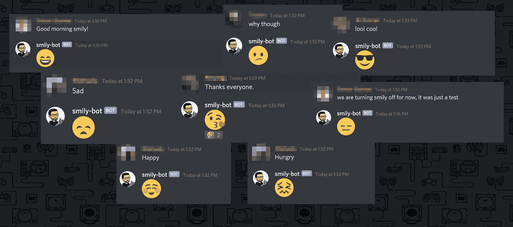

# 我创造了一个深度学习驱动的不和谐机器人来和 smily 反应😎

> 原文：<https://towardsdatascience.com/i-created-a-deep-learning-powered-discord-bot-to-react-with-smily-fec831d30d1b?source=collection_archive---------37----------------------->

## 检测信息的情绪、情感和讽刺，并以适当的微笑回复。



和我的同事一起微笑

# 动机

我最近看了很多论文，大部分是关于深度学习的，RNN，CNN，LSTM[1]，Transformer(注意力是你需要的全部)[3]，BERT 等等。这个名单只会越来越长。但是学习任何东西的最好方法是体验它。此外，如果我用我的脸部署一个机器人，在我的办公室服务器上，它有时可以在我忙于阅读时为我提供代理。😜开玩笑的。作为一个有经验的软件开发人员，这只是一种实现新知识的冲动。

但是有一些很大的障碍。我上哪去弄这么多数据来训练一个神经网络？即使我管理数据，我也需要一台高保真配置的机器，或者至少需要一个强大的 GPU 来用数据训练我的模型。但是，有志者事竟成。🤓经过一番研究我发现， [DeepMoji](https://github.com/bfelbo/DeepMoji) 🧙🏻‍♂️.我们可以使用像 [DeepMoji](https://github.com/bfelbo/DeepMoji) 这样的预训练模型来实现我们的机器人。现在，在一个预先训练好的模型上工作，并根据需要使它变得更好是一种常见的做法。

对我来说，这是一个制作不和谐机器人(因为我的办公室交流是不和谐的)的绝佳机会，也是体验 NLP 过程如何使用各种 [LSTM](https://www.bioinf.jku.at/publications/older/2604.pdf) 和注意力机制的绝佳机会。这个机器人可以监听所有正在接收的消息，并用表情符号做出反应。

# DeepMoji

DeepMoji 是建立在 Keras 上的模型，后端在 Tensorflow 上。Deepmoji 基于这篇由 Bjarke Felbo、Alan Mislove、Anders sgaard、Iyad Rahwan 和 Sune Lehmann 开发的论文。

本文表明，通过将远程监督扩展到更多样化的噪声标签集，模型可以学习更丰富的表示。通过对包含 64 种常见表情符号之一的 12 亿条推文数据集进行表情符号预测，他们使用单一预训练模型在情绪、情感和讽刺检测的 8 个基准数据集上获得了最先进的性能。

# **火炬手**

[TorchMoji](https://github.com/huggingface/torchMoji) 是由 [huggingface](http://huggingface.co) 构建的 DeepMoji 模型的 pyTorch 实现。DeepMoji 构建在 python 2.7 之上。所以我们将使用 TochMoji，它是 python3 中的一个实现。所以我们将使用 torchmoji 来实现。

# 设置

对我来说，这次旅程中最紧张的部分是准备工作。因为我找不到任何合适的例子来在项目中实现 torchMoji。所有的例子都是在 [jupyter](http://jupyter.org) 笔记本中使用的测试用例。但是我特别感兴趣的是使用我的 VS 代码在一个项目中实现它，这样我就可以用我的 discord BOT 连接它，并从那里发送响应。

这里可以看到我的完整代码:
[https://github . com/anuragbhattacharjee/discord-NLP-smily-bot/](https://github.com/anuragbhattacharjee/discord-nlp-smily-bot/tree/master)

***在 github 库上给予⭐️之星帮助我们共同成长。你将获得项目的所有更新，我将获得更新项目的灵感。

那我们开始吧。

## 1.设置不和谐机器人

设置不和谐机器人很简单。导航至[应用页面](https://discord.com/developers/applications)。创建一个应用程序，然后在您的应用程序下创建一个 bot。

创建机器人后，您将看到机器人的几个设置。您将需要在您的 BOT 设置下使用“BOT Token”来从您的代码连接它。

如果你进入 OAuth2 设置，你可以创建一个需要权限的链接，通过点击链接，一个不和谐的服务器所有者可以将机器人添加到他们的服务器。出于测试目的，我为自己创建了一个服务器，并在我的办公室服务器上测试之前先添加了 bot。

此时，您应该看到机器人已经加入到您的服务器中。但是离线了。因为我们还没有把它和我们的代码联系起来，赋予它生命。🤖❤

如果您在创建 discord bot 时遇到任何问题，请遵循以下链接中的详细可视步骤:

[](https://discordpy.readthedocs.io/en/latest/discord.html) [## 创建 Bot 帐户- discord.py 1.4.0a 文档

### 为了使用这个库和 Discord API，我们必须首先创建一个 Discord Bot 帐户。正在创建…

discordpy.readthedocs.io](https://discordpy.readthedocs.io/en/latest/discord.html) 

## 2.设置 python 环境

我在这里呆了很长时间。因为火炬手说要用[康达](https://conda.io)来酝酿项目。但是当我试图下载所有的依赖项时，遇到了一系列的错误。

虽然你可以使用任何你喜欢的环境管理工具(conda/venv)，你只需要知道如何使用它。Conda 在数据科学中使用时最受青睐，因为它们可以一次性设置所有需要的环境包。哪个更容易。但是我认为 Venv 更灵活。

不管怎样，经过几次反复试验失败后，我终于找到了一种方法。我下载了 torchMoji 项目，并在我的项目中作为一个包使用。我使用 venv 进行环境管理。你可以跟着我的 github repo 进行设置。[https://github . com/anuragbhattacharjee/discord-NLP-smily-bot/](https://github.com/anuragbhattacharjee/discord-nlp-smily-bot/)

## 3.测试预测

设置完成后。现在是做一些测试的时候了。我必须对 torchMoji 库进行一些修改，以便在我的代码模块中正常工作。

现在编写一个代码来使用 torchMoji 来预测微笑是非常简单的:

我们可以通过在终端中运行来测试它

```
python3>>> from emojize import Emojize
>>> e = Emojize()
>>> e.predict("I am doing great today!")
:smile:
```

## 4.连接到不和谐机器人

这就是乐趣的开始。在您的项目设置好之后，现在是时候连接到您的 bot 并进行一些测试了。

要连接到 discord，我们需要安装 discord.py 包，如果您安装了 requirements.txt，那么这个包应该已经安装了。

现在要连接到不和谐机器人，我们需要做一个。env 文件并将我们的密钥放在。env 文件作为 DISCORD_TOKEN。我制作了一个 env.demo 文件，并把它放在我的 git repo 中，这样你就可以使用它了。😁

设置好令牌后，我们可以连接到`discord.Client()`并监听客户端的几个事件。

我做了一个简单的实现，只需发送一个 smily 消息并对所有消息做出反应。但是我们可以通过检查消息来让它变得更聪明，如果我被提到了，或者如果消息中有我的名字，只是为了让它更人性化，因为什么样的开发者会回复帖子中的每一条消息。🤷🏻‍♂️

但是我会根据您的需要来实现它。如果需要，不要忘记分叉和启动回购。

以下是您可以使用的不一致事件的详细信息:

 [## API 参考- discord.py 1.4.0a 文档

### 以下部分概述了 discord.py 的 API。请注意，该模块使用 Python 日志记录模块来记录诊断…

discordpy.readthedocs.io](https://discordpy.readthedocs.io/en/latest/api.html#event-reference) 

参考资料:

[1] **长 SHORT􏰀-TERM 记忆**
作者 Hochreiter 和 Schmidhuber，1997；苏茨基弗等人，https://www.bioinf.jku.at/publications/older/2604.pdf2014􏰅􏰊􏰊􏰈

[2] **使用数百万个表情符号来学习任何领域的表达，以检测情绪、情感和讽刺**
作者:比亚克·费尔博、艾伦·米斯洛夫、安德斯·索加德、伊亚德·拉万、苏内·莱曼
[https://arxiv.org/abs/1708.00524](https://arxiv.org/abs/1708.00524)

阿希什·瓦斯瓦尼、诺姆·沙泽尔、尼基·帕尔马、雅各布·乌兹科雷特、莱昂·琼斯、艾丹·戈麦斯、卢卡斯·凯泽、伊利亚·波洛舒欣
、T4

【4】**deep moji**
[https://github.com/bfelbo/DeepMoji](https://github.com/bfelbo/DeepMoji)

 **[https://github.com/huggingface/torchMoji](https://github.com/huggingface/torchMoji)**

**我希望你喜欢这个博客。这是我正在写的关于 NLP 的几个主题的系列的第二个故事。如果你想看更多我的博客，你可以在这里关注我。**

**我是阿努拉格。从 2014 年开始专业从事软件工程师工作。我目前正在为我现在的雇主做一个 NLU 微服务。最近，我正在研究论文，以了解更多关于自然语言处理。在我的空闲时间，我喜欢开发简单有用的网络和移动应用程序。您可以在此与我联系:**

**🔗[https://www.linkedin.com/in/anuragbhattacharjee/](https://www.linkedin.com/in/anuragbhattacharjee/)t20】🕸[http://anuragbhattacharjee.com](http://anuragbhattacharjee.com)**

**快乐编码😀**

****

**阿努拉格·巴塔查尔吉**