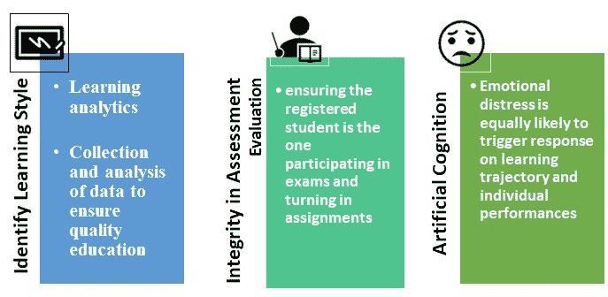
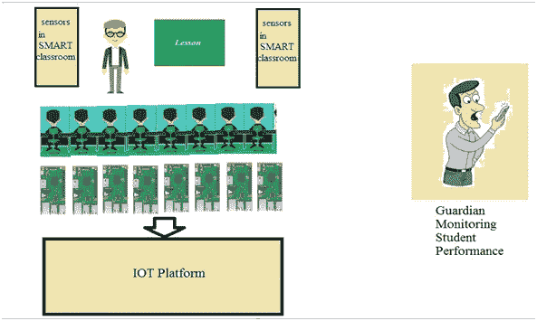

# 我设计了一个人工智能系统，可以预测“学术不诚实”，准确率很低

> 原文：<https://towardsdatascience.com/i-designed-an-ai-system-that-can-predict-academic-dishonesty-with-marginal-accuracy-daf165426aed?source=collection_archive---------47----------------------->

## AIEMS 项目

## 第一章

未来的虚拟现实辅助课堂【照片由[克里斯蒂安·弗瑞格南](https://unsplash.com/@christianfregnan?utm_source=unsplash&utm_medium=referral&utm_content=creditCopyText)在[Unsplash](https://unsplash.com/s/photos/virtualreality?utm_source=unsplash&utm_medium=referral&utm_content=creditCopyText)上拍摄】

**标识 *AIEMS(人工智能教育监控系统)***

***项目名称:“AIEMS(人工智能教育监控系统):网络教育高级人工智能(AI)监控与反馈系统开发”***

# 第一章

# **智慧课堂与人工智能技术**

作为一名电气工程专业的研究生，我喜欢接受挑战，接受不同的项目来帮助解决现实世界的问题。随着新冠肺炎的实施，有几个机构转向了在线教育，因为该平台在疫情期间既方便又安全。然而，尽管在线教学有许多优点，但该系统仍然缺乏“强大”的基础设施来应对面对面的传统课堂所带来的挑战。

> 据预测，未来 5 年，在线教育可能达到 3250 亿美元

## 1.1 面对面和在线课堂教学的挑战

1 个性化及其对学习能力的影响长期以来一直是人们感兴趣的焦点[1]。然而，仅在美国；由于课堂人数的巨大差异，一个教育工作者在计划他们的课程时很难遵循一个*【标准技术】【2】。有各种因素可以解释学习过程的有效性[3，4]。作为一名研究生助教，我有过直接教学和与学生一起工作的经验，我意识到学生的范围和确保优质教育是一个挑战。问卷经常被用作预测个人学习风格的工具[5–8]。学习分析，包括收集、分析和使用这些数据[9]，也被认为可以改善学生的学习体验。然而，在大多数情况下，这些评估特别用于概括一个班级群体的整体学习模式，而不是利用它们来称赞任何一个学生的学习风格。*

*除了学习风格的要素之外，一个重要的标准是学术评估并确保其完整性。根据发表在*学术和商业伦理杂志上的一项研究，*强调了在线教育者努力确保在线学生成绩的完整性。挑战包括:(一)确保注册学生参加考试并上交作业。(ii)个人作业在提交过程中不会受到影响。*

*在线记录和现场监督是最近几个学期大多数教师采用的各种方法，以确保在线评估的完整性。然而，当学生在他们的方法中变得有创造性时，有效地监控就变得困难了。因此，人工智能驱动的监考可能更有效，并有助于机构教育的整体质量。*

*3 博尔特*等人*调查了情绪状态对直觉判断能力的影响。该研究得出结论，消极情绪会限制直觉一致性判断。由疫情引起的情绪困扰的影响同样可能引发对学习轨迹和个人表现的反应。然而，据我们所知，在这种危机或类似的刺激环境下没有进行重大研究。了解动态变化对单个学生表现的影响，可以有效地帮助开发人工智能(AI)系统，从而帮助提高在线教学的质量。*

**

*教学和评估中的挑战*

## *1.2 人工智能与[智慧课堂](/integration-of-ai-technology-in-classroom-a-blessing-in-disguise-bfb4dce59071)*

*疫情新冠肺炎严重影响了传统的或地区性的课堂学习。这种中断更有可能成为我们历史上著名流行病的频繁中断，包括黑死病、西班牙流感、霍乱、淋巴腺鼠疫和疫情流感，或者第二波可能发生。疫情期间的核心任务之一包括避免社交聚会，社交聚会严重影响传统课堂的学习和评估行为。在完全或部分过渡到在线学习的过程中，人工智能(AI)可以在创新当前教育系统方面做出重大贡献。应用推理或认知技能和评估程序可以用来开发一个先进的人工智能系统，以补充我们现有的审议。在新冠肺炎疫情期间，很可能会在学生群体中引发情绪反应。这可能会极大地影响个别学生的学习轨迹。*

*人工智能(AI)技术已经获得了广泛的普及，因为它能够以边际精度进行预测，并具有解决复杂问题的潜力。在智能教室环境中使用人工智能的几个优势之一是它的认知潜力。人工智能开发中使用的算法最终可以帮助具有不同学习风格和能力的学生实现个性化学习节奏的目标。Lo 等人利用多层前馈神经网络(MLFF)开发了一个基于网络的学习系统，重点关注学生的认知风格[10]。Curilem 等人还提出了一个基于学生行为的智能教学系统(ITS)的数学模型[11]。*

*除了人工智能的认知能力之外，该系统还允许选择预测，这对预测至关重要。使用人工智能进行时间序列预测之前已经在金融行业[12–14]和医疗决策过程[15]中使用过。同样，在教育行业，人工智能已经被用于预测辍学[16]或逃避电子学习课程[17]。*

*在智能教室环境中利用 *AI 的架构的概念肯定会提高理想场景中的学习质量。**设计的架构面向参加传统和/电子学习的工程专业学生**。因此，该系统需要对其最初的概念设计进行修改，以适应普通学生群体的需求，这些学生要么是高中学生，要么是最近才进入大学**。****

***1.3 智慧课堂的概念***

*智能教室的概念是一个不断研究的领域，它能够利用硬件和软件组件来适应学生的需求[18，19]。Aguilar 等人[20]提出，在智能教室环境中利用机构的学习分析可以产生更有效的结果。无线传感器和物联网(IoT)在智能教室环境中分析社会和行为模式的应用也在几个测试平台中得到解决[21–25]。因此，随着技术的发展，现在更容易预测个人的学习情况，从而相应地分析和提供学习情况。这最终会提高学生的学习成绩和学习动力。*

**

*不同学习能力的学生参加同一堂课的典型课堂环境*

## *1.4 拟议概念项目的科学价值和意义*

*主要目标是开发一个先进的人工智能驱动的在线学习系统，补充我们现有的在线方法。人工智能已经成为大多数教育机构采用的课题。*

> *最近，微软进行了一项调查，强调了以下统计数据:99.4 %的人同意人工智能是机构竞争力的组成部分，92 %的人同意对该技术进行实验。*

*因此，改进我们当前的在线学习系统将提高我们与其他领先机构的竞争力。电子学习是教育的未来，即使在疫情结束后，无论从短期还是长期来看，这都是一项不错的投资。据预测，未来 5 年，在线教育可能达到 3250 亿美元。由于地区壁垒不再是一种义务，投资改进这种技术可能会产生潜在的收入流(国内和国际)。根据乔治梅森大学和斯基德莫尔学院的一份报告，除其他因素外，导致学生和教师对在线学习不满的主要因素包括:
“监管和实质性的学生-教师互动是在线教育质量的关键决定因素，可提高学生满意度、学习和成果。”
教授们对在线课程表达的另一个担忧包括:
“但当这些学生参加微积分或遗传学的期末考试时，他们的教授如何知道远处笔记本电脑上的考生正在做自己的作业，而不是向谷歌先生寻求帮助。”*

***总而言之，任何教育机构要想成为在线教育领域的全球领先企业，都需要应对以下挑战:( I)及时且经济高效的学生反馈机制;( ii)增强在线监督机制，以确保学术诚信。***

****注:下一章重点介绍架构设计和流程图来理解模型。****

## *参考*

*[1]史密斯、琳达 h .和约瑟夫 s .伦祖利。"学习风格偏好:课堂教师的实用方法."*理论到实践* 23，第 1 期(1984):44–50。*

*[2]好吃，喜英。“学习风格偏好”。*

*[3]苏塔托，佐科。"等效教育学习过程和学习成果有效性的决定因素."*社会科学、教育和人文学科进展* (2017)。*

*[4] Rahman、Roselainy Abdul、John H. Mason 和 Yudariah Mohamad Yusof。“影响学生改变学习行为的因素。"*过程社会学和行为科学*56(2012):213–222。*

*[5]奥尔蒂戈萨、阿尔瓦罗、佩德罗·帕雷德斯和皮拉尔·罗德里格斯。" AH 问卷:学习风格的适应性分层问卷."*计算机&教育* 54，第 4 期(2010):999–1005。*

*[6] Tzouveli、Paraskevi、Phivos Mylonas 和 Stefanos Kollias。“基于学习者档案和学习资源调整的智能电子学习系统。”*计算机&教育* 51，1 号(2008):224–238。*

*[7]沃森、马克、米歇尔·麦克索利、谢丽尔·福克斯克罗夫特和安德里亚·沃森。"探索大学一年级学生的动机取向和学习策略."*高等教育&管理* 10，第 3 期(2004):193–207。*

*8 Petocz、Peter、Anna Reid、Leigh N. Wood、Geoff H. Smith、Glyn Mather、Ansie Harding、Johann Engelbrecht、Ken Houston、Joel Hillel 和 Gillian Perrett。“大学生的数学概念:一项国际研究。"*《国际科学与数学教育杂志》* 5，第 3 期(2007):439–459。*

*[9]阿尔莫纳德、弗洛伦西亚、爱德华多·费尔南德斯、阿德尔·梅利特和索特里斯·卡洛吉鲁。"基于人工神经网络的聚光光伏技术电特性技术综述."*可再生和可持续能源评论*75(2017):938–953。*

*[10]罗家俊、陈亚珍和修杰楷文。“根据在线确定的学生认知风格，设计一个自适应的基于网络的学习系统。"*计算机&教育* 58，1 号(2012):209–222。*

*[11] Curilem、S. Glória、Andréa R. Barbosa 和 Fernando M. de Azevedo。"智能教学系统:作为自动机的形式化和使用神经网络的界面设计."*计算机&教育* 49，第 3 期(2007):545–561。*

*[12] Schierholt，Karsten 和 Cihan H. Dagli。"股票市场预测使用不同的神经网络分类结构."金融工程的计算智能，1996 年。IEEE/IAFE 1996 年会议记录，第 72-78 页。IEEE，1996 年。*

*[13] *本特兹 Y* ，*布恩 L* ，*康纳 J* 。*用卡尔曼滤波器和神经网络模拟股票收益对经济因素的敏感性*。金融工程中的计算智能会议录。纽约州 : IEEE 出版社，1996 年*。**

**[14]布劳纳、埃里克·奥、朱迪思·戴霍夫、孙晓云和沙伦·霍姆比。"黄金交易模型的神经网络训练技术."金融工程计算智能(CIFEr)，1997 年。IEEE/IAFE 1997 年会议录，第 57-63 页。IEEE，1997 年。**

**[15] Loch、Tillmann、Ivo Leuschner、Carl Genberg、Klaus Weichert-Jacobsen、Frank Küppers、Evangelos Yfantis、Michael Evans、Valeri Tsarev 和 Michael Stö ckle。"前列腺经直肠超声的人工神经网络分析."*前列腺* 39，3 号(1999):198–204。**

**[16]马丁尼奥、瓦尔基利亚·里贝罗·德卡瓦略、克洛多瓦尔多·努内斯和卡洛斯·罗伯托·米努西。"基于人工神经网络的高校课堂辍学风险群体智能预测系统."在*人工智能工具(ICTAI)，2013 IEEE 第 25 届国际会议上*，第 159–166 页。IEEE，2013 年。**

**[17] Lykourentzou、Ioanna、Ioannis Giannoukos、Vassilis Nikolopoulos、George Mpardis 和 Vassili Loumos。“通过结合机器学习技术在电子学习课程中进行辍学预测。”*计算机&教育* 53，第 3 期(2009):950–965。**

**[18]阿吉拉尔、何塞、普里西拉·巴尔迪维索、豪尔赫·科尔德罗和曼努埃尔·桑切斯。"基于多智能体系统的智能教室概念设计."载于【T2 人工智能国际会议论文集(ICAI)】，第 471 页。2015 年世界计算机科学、计算机工程和应用计算大会(WorldComp)指导委员会。**

**19 何塞·阿吉拉尔。"大学的智能教室是电子社会的支柱之一."在*电子民主&电子政务(ICEDEG)，2016 年第三届国际会议上*，第 138–144 页。IEEE，2016。**

**20 阿吉拉尔、何塞和普里西拉·巴尔迪维索-迪亚斯。“在智能教室中学习分析，提高教育质量。”在 *eDemocracy &电子政务(ICEDEG)，2017 年第四届国际会议上*，第 32–39 页。IEEE，2017。**

**[21]维纳、劳拉·r 和杰里米·库珀斯托克。"智能教室:在不断发展的技术环境中改变教与学."*计算机&教育* 38，第 1 期(2002):253–266。**

**[22]斯蒂费尔哈根、莱纳、妮可·贝纳丁、哈齐姆·凯末尔·埃克内尔、j .麦克多诺、凯·尼克尔、迈克尔·伏伊特和马蒂亚斯·沃尔费尔。"一位讲师在智能研讨室的视听感受."*信号处理* 86，12 号(2006):3518–3533。**

**23 亚历克斯·彭特兰。“社会意识、计算和交流。”*计算机* 38，3 号(2005):33–40。**

**[24]马丹、安摩尔、罗恩·卡内尔和亚历克斯·桑迪·彭特兰。“GroupMedia:分布式多模态接口。”第六届国际多式联运接口会议论文集，第 309–316 页。美国计算机学会，2004 年。**

**[25] Gligori、Nenad、Ana Uzelac 和 Srdjan Krco。“智慧课堂:讲座质量实时反馈。”在*普适计算与通信研讨会(PERCOM Workshops)，2012 IEEE 国际会议上*，第 391–394 页。IEEE，2012 年。**

*****注:下一章重点介绍架构设计和流程图来理解模型。*****