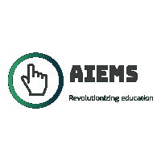
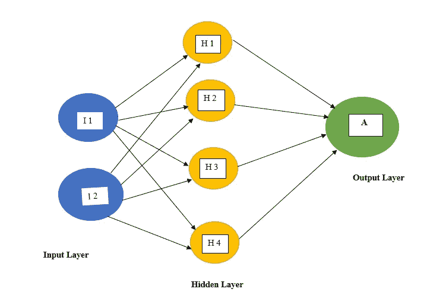
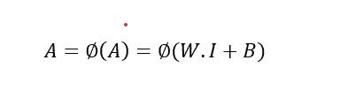
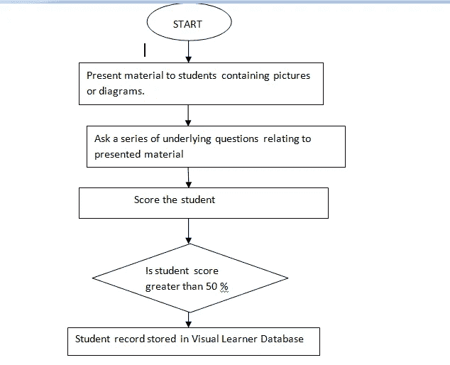

# 我设计了一个人工智能系统，它可以以边际准确度预测‘学术不诚实’(智能教室)

> 原文：<https://towardsdatascience.com/i-designed-an-ai-system-that-can-predict-academic-dishonesty-with-marginal-accuracy-smart-162b29523f5e?source=collection_archive---------45----------------------->

## AIEMS 项目

## 第 2 章，第 1 部分，人工神经网络架构

未来的虚拟现实辅助课堂【照片由[克里斯蒂安·弗瑞格南](https://unsplash.com/@christianfregnan?utm_source=unsplash&utm_medium=referral&utm_content=creditCopyText)在[Unsplash](https://unsplash.com/s/photos/virtualreality?utm_source=unsplash&utm_medium=referral&utm_content=creditCopyText)上拍摄】

**标识 *AIEMS(人工智能教育监控系统)***

***项目名称:“AIEMS(人工智能教育监控系统):网络教育高级人工智能(AI)监控与反馈系统开发”***

# 第二章

## 人工神经网络体系结构

在我们之前的第[章](/i-designed-an-ai-system-that-can-predict-academic-dishonesty-with-marginal-accuracy-daf165426aed)中，我们重点介绍了具有嵌入式人工认知能力的智能教室的概念。由于疫情仍然有效，课堂转移主要在网上进行，智能教室的架构应该提供创新，并解决传统教育平台的挑战。

我们强调了在线教育的两个主要挑战:( I)加强在线监督机制，确保学术诚信;( ii)提供及时且具有成本效益的学生表现反馈机制。

作为教育工作者的另一个主要挑战是识别学生的学习风格。大多数学生可以很容易地分为以下几类:

(1)口头:他们更喜欢通过关键词**来学习。**

(2)视觉:他们更喜欢通过**图片**来学习。

(3)听觉:他们更喜欢通过**声音/节奏**来学习。

(4)身体/亲缘美学:他们更喜欢通过身体接触来学习。

(5)逻辑/数学:他们更喜欢通过**推理**来学习。

作为一名教育工作者，在教案中不可能总是涉及所有不同的学习风格。人工智能(AI)技术可以将这一挑战转化为现实，并提供更多灵活性。本章主要关注在开发我们的项目 **AIEMS 中使用的人工神经网络(ANN)架构。AIEMS 的动机是开发一个智能虚拟教室，为其学生成员提供全面的学习体验。同时，它将通过人工智能增强的监考机制来解决学术不诚实的挑战。**

深度学习(DL)已经在这个特定的模型应用程序中用于开发 **AIEMS** 平台，因为它可以很容易地应用于多层神经网络。*人工神经网络(ANN)* 是一种数学模型，其灵感来自于*神经元(我们大脑的基本工作单元*)的架构。人工神经网络的基本结构如下所示:

人工神经网络(ANN)的体系结构

数学上，单层神经网络可以由下面的等式(1)表示

神经网络方程

学习分析需要处理大数据。因此，自适应计算算法可以通过管理模式并同时将新的输入数据累积到该模型中来进行有效的分析。深度学习(DL)已经在 [fintech](/can-ai-facilitate-fintech-algorithm-to-manage-your-finances-2c11a1afec74) 行业显示出应用和范围，并不断用于检测欺诈活动。

## 了解平台的基础设施

AIEMS 是一个虚拟的电子学习平台，将有助于智能教室环境中的几个主要目的之一:

***识别学生的认知学习风格。***

这一点尤其重要，因为在大多数教室里，导师或教育者讲授的课程通常是标准化的，并偏向具有特定学习风格或能力的学生听众。这最终对一个学生的全部潜力的发展有很大的影响。在人工神经网络的帮助下，可以准确地识别学生固有的学习风格，从而可以为学生提供对他们的学习和发展理想的学习材料风格。同样，教育工作者需要通过分析和预测智能教室(或虚拟教室)中发生的学术和社会变化来了解他们的表现。

为了便于理解学生的认知学习风格，可以用流程图来补充。下面的流程图可以用来识别学生是否是视觉学习者。

确定可视学习者并将学生记录存储在数据库中的流程图

所附流程图是用于确定视觉学习者的模型的简化表示。由于视觉学习者通过图片和图表适应学习过程，因此教师可以提供包含图片的课程计划。在材料呈现给学生后，可以问他们一系列与材料相关的问题。如果学生能够以 50%及以上的分数准确回答，那么该学生可以被视为视觉学习者。

尽管这可能不是一个非常准确的模型，并且存在潜在的挑战。然而，它确实提供了一个机会来推进当前提供给学生和导师的学习平台。

## **网页参考资料**

[1][https://sites . Google . com/site/holistic app education/engaging-different-learning-styles](https://sites.google.com/site/holisticappeducation/engaging-different-learning-styles)