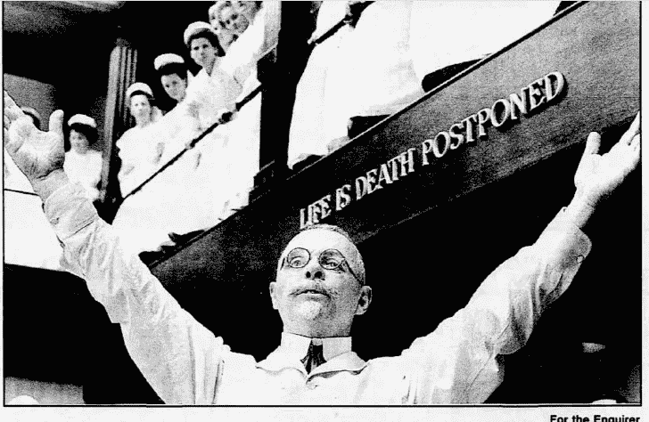
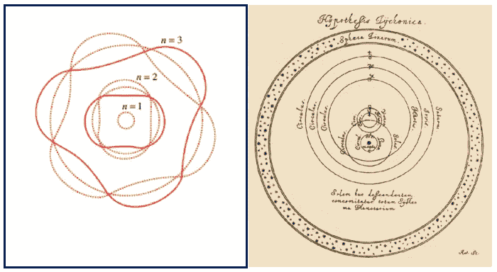
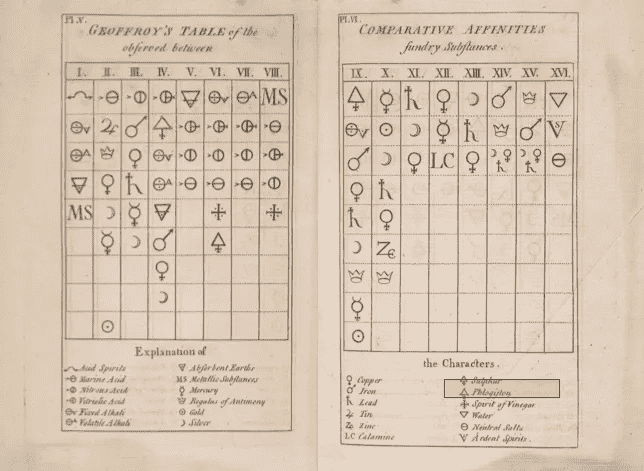
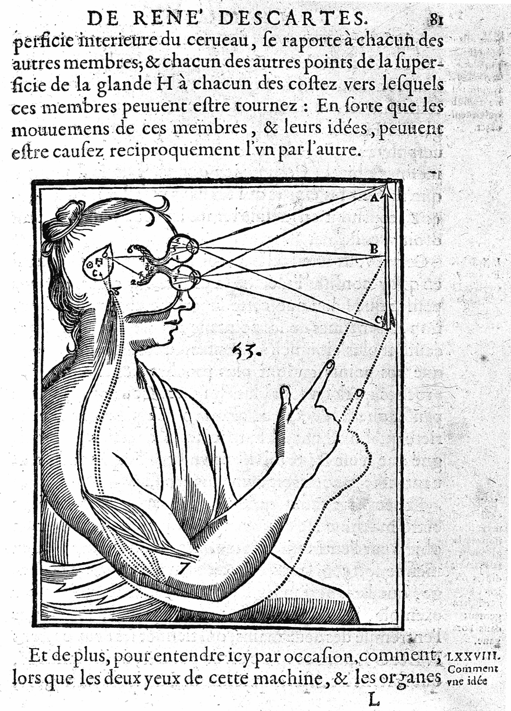

# 我不相信电子

> 原文：<https://towardsdatascience.com/i-dont-believe-in-electrons-8f1b59adc1ec?source=collection_archive---------12----------------------->

## …不要让我开始谈论“共识”科学

约翰·哈维·凯洛格医生，由安东尼·霍普金斯扮演，在 1994 年电影《威尔维尔之路》的一个场景中成功完成手术后图片:巴特尔克里克询问者

所以，我参加了加州大学进化生物学系的员工会议。本周最大的担忧是校园被基督徒占领。史蒂文·j·古尔德被传唤去做一次演讲，谴责神创论(有点矫枉过正)。这在当时是一项非常流行的活动——丹尼尔·丹尼特和理查德·道金斯正在互相超越，以证明谁的无神论最纯粹。其中一个教授问房间里的人，“你们今天看了*的报纸* 了吗？35%的美国人不相信进化论！”我控制不住自己——我脱口而出:“太好了！”他们都盯着我，好像我放了个屁。我不是在交朋友，所以我解释说，“50%的美国人相信占星术。我们赢了！”

他们一点也不觉得这有趣。因此，我在那里默默忍受了余下的学业。也许我全错了，但我不认为科学中的任何问题是“信仰”的问题。科学家应该是专业的怀疑论者。的确，可能问科学家最烦人的问题是他们是否相信一个理论。更令人不安的是询问普通大众，他们是否相信科学家无法证明的事情:“真相。”

科学到底是什么？

从童年开始，我们都被灌输了科学的童话观点 *:*

科学在人类的努力中是独一无二的，因为它是累积的和进步的。将科学与其他形式的知识区分开来的是一种被称为“科学方法”的东西，在这种方法中，观察到的事实通过逻辑演绎或假设得到扩展，通过归纳产生，并被测试和验证。新的科学理论包含并取代了旧的理论，如 matryoshka 玩偶，扩大了范围、应用和预测的准确性，永远朝着真理前进。

这是一个神话，任何有思想的科学家都知道。然而，所有从事实践的科学家都在积极地延续这种虚构，以一种枯燥的、假设性的演绎叙述(观察、假设、方法、结果、结论)发表他们的工作，而不管想法是如何产生的，或者工作实际上是如何完成的。

卡尔·波普尔(Karl Popper)在标准观点(逻辑实证主义或逻辑经验主义)中戳出了巨大的漏洞，令人信服地指出，科学理论永远无法被证明，我们所能期望的最好结果是*证伪*一个科学理论。普拉特认为，科学家应该应用“多重假设的方法”，在这种方法中，他们提出尽可能多的替代解释，并着手根据每一个 other⁴.来检验它们

托马斯·库恩在他对科学 revolutions⁵.的历史分析中挑战了科学进步是知识的稳定积累的观点库恩区分了“正常”科学和“革命”科学的阶段。正常科学在一个普遍的理论共识(“主导范式”)内运作，很像经典观点。库恩将正常科学时期的科学进步比作“解谜”，在这种情况下，群体得出理论的含义，类似于演绎推理。当出现当前理论无法解释的异常或不一致时，科学家不一定会放弃该理论，但往往会开发出*特设*假设来修正当前理论(例如，在托勒密轨道或玻尔原子模型中添加本轮[图 2])。

**图二:*特设*还是辉煌？** **左:**玻尔原子模型:允许电子占据离散轨道，对应驻波。**右:**太阳系的第谷模型:地球为中心，月球和太阳围绕地球运行，其他行星围绕太阳运行。这在数学上等同于哥白尼体系，没有一些我们感觉不到地球旋转的怪异现象。作为一名天文学家和炼金术士，布拉赫是科学史上最古怪的人之一，他养了一只宠物驼鹿，雇佣了一名矮人灵媒，还和女王有一腿。可悲的是，他的驼鹿死了，因为它喝醉了，掉进了 stairs⁷.图片:维基共享

历史并不总是善待被抛弃的理论或临时的假设，认为它们是毫无理性基础的无稽之谈。费耶阿本德庆祝他们的发明。摆脱了教条，科学革命充满了创造力。特别的理论使停滞不前的领域恢复生机和活力。他们受到启发，为激进的新思想和理论铺平道路。

另一方面，新的或竞争的理论可以解释异常现象，但抛弃了以前理论的大部分范围。一个很好的例子是从炼金术到化学的转变(图 3)。库恩和费耶阿本德都没有达成一致的范式(共同的前提、观察、定义、范围、价值)，理论之间的争论是不相称和不合理的。新的价值观、论点、方法、美学、对大众媒体的吸引力，都变成了公平的游戏(费耶阿本德称之为“一切皆有可能”)。费耶阿本德提倡方法论无政府主义，认为不存在科学 method⁶.这样的东西

**图 3:燃素理论**炼金术士 J.J .贝尔彻(1667 年)、皮埃尔·约瑟夫·麦克克尔、格奥尔格·恩斯特·斯塔尔(1731 年)开始对元素进行系统分类，对早期化学做出了贡献，其中包括 phlogiston⁸.燃素理论提供了一个结合燃烧(如火)和腐蚀(如锈)的一般理论。氧气的发现(约瑟夫·普利斯特列和安托万·拉瓦锡 1774 年)是炼金术终结的开始。可以说，炼金术正在进步，如果你愿意接受燃素具有负质量。图片:布朗大学干草展览[8]

**图 4:勒内·笛卡尔的肌肉收缩气动理论。【2000 多年来，肌肉收缩理论经历了几次范式转变。盖伦(公元 129-200 年)指出，肌肉以激动剂/拮抗剂对的形式发挥作用，由“动物精神”驱动(动画是动物区别于植物的能力)。勒内·笛卡尔在 1664⁹.提出了肌肉的液压机制(气球)理论 1667 年，Jan Swammerdam 证明肌肉收缩时体积不变。加尔瓦尼(1791 年)证明了电可以引发肌肉收缩，从而产生了电动理论(灵感来自玛丽·雪莱的《弗兰肯斯坦》中的动画)*。*蛋白质折叠或蛋白质弹簧理论主导了 200 年。目前的滑动灯丝理论是在 1954 年才建立起来的。这些理论中的每一个都具有深刻的创造性，并得到了很好的支持。每一个都对我们的知识有所贡献，尽管并不正确。图片:维基共享**

科学辩论的一个不受重视的方面是所使用的修辞，这通常远非理性。第谷·布拉尼年轻时在一次决斗中失去了鼻子，戴着黄铜假肢。这给了他在辩论中的巨大优势，就好像一个演讲者提出了一个相反的观点，他会不经意地移开并擦亮他的鼻子，分散观众的注意力。伽利略的文章充满了讽刺和嘲笑，即使对现代人来说也很有趣。他用意大利方言而不是学术性的拉丁语发表论文，以面对更广泛的读者⁰.对大众媒体和名人的吸引力一直延续到现代，不管是好是坏。

在波普尔、库恩和费耶阿本德之后，新实证主义“死了，或者说像一场哲学运动一样死了。”除了证伪之外，科学家们对于什么是科学、什么是独立于理论的事实、什么方法是发展理论的有效方法、当在理论之间做出决定时应该应用什么价值观都没有达成共识，并且很少有人轻率地宣称他们的理论在任何客观意义上都是“真实的”。公开的问题是，科学理论是否至少是对现实的真实描述，以及相信不可观察的实体是否合理——比如我们的朋友电子。

**实用主义**

许多科学家的谨慎立场是对理论的真实性采取不可知论的立场，同时重视其成果。由于量子力学的怪异，大多数物理学家已经放弃了形而上学。量子力学被接受是因为它与实验相符；就是这样。在礼貌的谈话中，人们会回避它的意思或它是否为“真”。(“闭嘴算了。”)

实用主义者对科学的主张没有那么夸张:一个理论的价值是功利的——它有预测价值，并使应用成为可能。理论只是“理论”，而不是事实或定律。通常，“模型”一词被用来代替“理论”，部分是为了避免认识论的包袱。(模型被弱定义为“某事物的数学或统计表示或近似。”)事实上，模型被视为现实的有用类比或图像。经常使用的一个生动的比喻是从巴勃罗·毕加索那里借用的——“艺术是帮助我们看到真理的谎言。"

**一个不那么深奥，但更有趣的世界**

这种世界观比听起来更乐观。考虑到另一种现实主义观点最终会导致科学的完成。1996 年，*《科学美国人》*记者约翰·霍根在*中同样暗示了科学的终结*，大部分科学中的重大问题都将得到解答的时刻即将到来。一旦物理统一了，就可以推导出化学，解释出生物学。留给科学的只是细节的逻辑推理，即解谜。那有什么好玩的？在不可知论者的观点下，真理永远无法被知晓，科学探索是一种更加人性化的活动，科学辩论也是无穷无尽的有趣。

你必须亲眼目睹，才能相信吗？

利用望远镜，伽利略看到了月球上的山脉、太阳上的斑点以及围绕木星运行的卫星。这可能被视为可验证的科学，因为原则上，一个人可以到月球上去看看山。但是微观世界呢？起初，望远镜和显微镜似乎没有什么区别。也许我们可以相信光学显微镜…在某种程度上。但如果你接受当前的理论，微观领域与宏观领域完全不同，物理定律也有完全不同的表现形式。没有办法像月球上的山一样，用我们的感官直接体验这个世界。我们看到的东西有多少取决于我们对所看到的东西的理论？我们*没有*看到什么？

理性经验主义也因复杂性而受挫。你可能很难找到一个了解大脑如何工作的神经科学家或者一个了解免疫系统如何工作的免疫学家。我们还不清楚疫苗是如何起作用的，也不清楚为什么免疫系统不能在一连串的免疫反应中自我消化。有数百种类型的细胞、分子受体、细胞因子和神经递质——所有这些都在一个组合的连接网络中相互作用，往往产生与它们在体外*单独作用截然相反的效果*。神经科学中充满了神秘和冒险。一个关于所有认知系统的令人沮丧的说法是“也许一个事物最简单的表现就是它本身。”

那么，我们如何看待这一切呢？很明显，科学发现了一些东西。牛顿力学仍然被用来解决绝大多数的工程问题，尽管它是“错误的”在发现 DNA 的 100 年前，基因是假设的、不可观察的实体，具有非凡的预测能力。它们现在*几乎*可见，那么我们应该‘相信’它们吗？我想是的——你难倒我了。

另一方面，我们对电子含义的理解在 100 年里已经发生了多次转变。电子既不是粒子也不是波，或者也许它们是场中的扰动。它们有电荷和自旋，但没有质量(它们只是从希格斯玻色子那里‘借用’了质量)。他们既不在这里也不在那里。你踢一个，另一个就掉在 60 光年之外。相信电子是双重思考的练习:同时持有相互矛盾的想法。我们只能同意电子是一个有用的概念。当你死的时候，你可以问上帝它们是什么。

你不会真的相信这一切吧？

费耶阿本德在我伯克利的哲学专业朋友中非常受欢迎。年轻的时候做一个反传统的人很有趣。我觉得我错过了，所以我在研究生院旁听了他的一些讲座。他非常有趣。下课后，我抓住他，诚恳地告诉他我一直在读他的一本书。他问我:“哪一个？”当我告诉他，“*反对方法*”时，他似乎很惊慌。“天哪，我太尴尬了。那是一本可怕的书。”

费耶阿本德从未把自己看得那么重，他在《科学的终结》中告诉约翰·霍根，“我认为西方科学能够为自己辩护。”库恩发现自己与库恩派分道扬镳，坚称自己不支持一种文化相对主义。建设性的经验主义者认为，科学已经取得了如此多的成就，并做出如此准确的预测，而没有一些真理内容，这将是一个“奇迹”。

但是费耶阿本德对暴政科学教条的警告受到了广泛关注。教条限制了自由的思想和辩论。教条很无聊。鹦鹉学舌不是学习。教条可能是错误的。唯一仍然有效的认识论原则是可证伪性。学术界和媒体的伪善让我们所有人都支持他们被证明在从气候变化到碳水化合物的所有事情上*都是错误的。在他的自传《⁴》中，他哀叹道，“我常常希望我从未写过那本该死的书。”我很高兴他这么做了。*

**信念的意志**

这让我想起了教员会议。在实践中，科学家认为什么是“真”并不重要。公众认为科学家们相信什么更不重要。在员工会议上，高度敏感的研究生对著名科学家伪造上帝的努力充满敬意。

一个可能很重要的问题是“有自由意志这种东西吗？”在笛卡尔物理学的时钟宇宙下，答案似乎是“不”。量子力学给我们留下了一些关于相信什么的可怕选择:从不可证伪和不相关的“多世界”解释到悲观的超级决定论观点。这两个极端都不允许自由意志。我当然希望自由意志存活下来，因为我发现宿命论令人沮丧。在那之前，我仍然坚定地站在实用主义者一边。正如威廉·詹姆斯所宣称的，“我自由意志的第一步就是相信自由意志。”

改变我的想法。

Russell Anderson 拥有加州大学的生物工程博士学位和电子工程学士学位。他的学术研究涉及生物系统(神经、免疫和进化)中的学习。他在洛斯阿拉莫斯和利弗莫尔国家实验室、加州大学(伯克利、旧金山、戴维斯和尔湾)、史密斯-凯特尔维尔眼科研究所和加州卫生部进行研究生研究。他曾在 IBM、Opera Solutions、HNC Software、KPMG、NICE/Actimize、HCL、Mastercard、JP Morgan Chase 和苏格兰哈利法克斯银行担任首席科学家。他发表了 30 多篇科学论文，拥有 5 项商业预测系统专利。

后记:对⁵ [的回复和讨论的总结](/i-dont-believe-in-electrons-the-sequel-ffa1b76ec7a)

欢迎提问/评论:anderson.transactionanalytics@outlook.com

**脚注:**

1.理查德·道金斯(2006 年)。[神痴](https://archive.org/details/goddelusion00dawk)。波士顿:霍顿·米夫林

2.在加州大学,“报纸”指的是《纽约时报》。当地报纸的所有标题都是关于辛普森的慢速汽车追逐，它发生在大约 15 英里以外(1994 年 6 月)。

3.卡尔·波普尔 *(1935，1959)。科学发现的逻辑*

4.约翰·r·普拉特(1964)。强有力的推论。科学第 16 期，第 146 卷，第 3642 期，第 347-353 页

5.托马斯·s·库恩(1962)。*科学革命的结构* (1962)芝加哥大学出版社

6.保罗·费耶阿本德(1975 年)。*反对方法:一种无政府主义知识论的提纲。纽约州纽约市 Verso 图书公司。*

7.JLE·德雷耶(1890 年)。第谷·布拉尼:一幅 16 世纪科学生活和工作的图画。爱丁堡的亚当和查尔斯·布莱克。第 210 页

8.Pierre Macquer，《化学理论与实践的要素》，第二版，第 1 卷， *Hay 展品*，2020 年 1 月 9 日访问，[https://library.brown.edu/exhibit/items/show/7](https://library.brown.edu/exhibit/items/show/7)。

9.m .科布(2002 年)。[《时间线:驱走动物灵魂:简·斯瓦默达姆论神经功能》](https://web.archive.org/web/20050515053936/http:/janswammerdam.net/NRN.pdf) *(PDF)* 。自然评论神经科学。**3**(5):395–400。

10.斯蒂尔曼·德雷克(1957)。[伽利略的发现和见解](https://archive.org/details/discoveriesopini00gali_0)。纽约:双日。

11.约翰·帕斯莫尔(1967)。逻辑实证主义，哲学百科全书。).纽约:麦克米伦

12.约翰·霍根(1996 年)。*科学的终结:在科学时代的黄昏面对知识的极限*。艾迪森-韦斯利

13.巴斯·范·弗雷森(1980)。“我认为当前科学理论的成功不是奇迹。这对科学(达尔文主义者)来说并不奇怪。因为任何科学理论都诞生于激烈竞争的生活中，是一片满是牙齿和爪子的丛林。只有成功的理论幸存下来——那些事实上抓住了自然界实际规律的理论。”*《科学的形象* (1980)，第 40 页。

14.保罗·费耶阿本德(1995) *消磨时间*。芝加哥大学出版社。

15.我不相信电子——续集(2020 年 3 月)。*走向数据科学*。[https://towards data science . com/I-don-t-believe-the-sequel-FFA 1 b 76 EC 7 a](/i-dont-believe-in-electrons-the-sequel-ffa1b76ec7a)