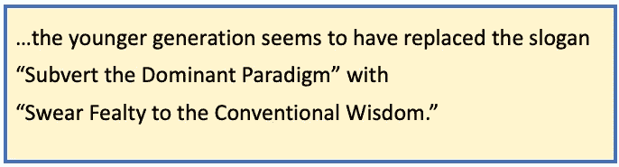

# 我不相信电子——续集

> 原文：<https://towardsdatascience.com/i-dont-believe-in-electrons-the-sequel-ffa1b76ec7a?source=collection_archive---------42----------------------->

## **戴上你的金属头盔…今天是粉丝感谢日**

作者:“危险”和“有毒”照片:霍克电影公司

上个月，我发表了一篇调皮的文章《*我不相信电子*》，鼓吹不可知论的科学观，贬低其现代崇拜([https://towards data Science . com/I-Don-Don-Believe-in-electronics-8f1b 59 ad C1 EC](/i-dont-believe-in-electrons-8f1b59adc1ec))。来自资深科学家同行的如此多的积极回应让我不知所措。感谢您的所有评论和交流。其中一个例子是奥利弗·赖辰斯坦(@reichenstein)的这条慷慨的推文:*【这是我几个月来读到的最顽强的文章。充满了伟大的引用位。是的，费耶阿本德在娱乐*。但是，第一名是约瑟夫·赫茨林格(@赫茨利)，他完美地抓住了这种精神:

*“每当科学家说‘我不相信电子’，某个地方就会有一个电子死去。”*

现实主义的捍卫者在哪里？

最令人惊讶的结果是，似乎没有多少现实主义者存在……或者至少没有人能够提出一个论点。我对此感到失望，因为我渴望听到他们的反驳意见。为什么要冒风险宣称确定呢？在大自然的奇迹面前，我更喜欢谦逊。

好的。现在到了有趣的部分。异议者…有两种口味。

**#1。不要把我们的脏衣服挂在公共场合**

有相当多的回应，如“我不反对你，但这样的论点可能会被公众滥用。”争论大概是这样的:“在大众的手中，反现实主义可能被用来支持扁平地球论者、神创论者、勒德分子、反恐怖分子，[或者其他真实的或想象的威胁]。”这些批评者似乎害怕科学民主化，害怕失去公共资金或什么的。也许我们应该恢复用拉丁文出版。

我从未见过“地球是平的”，我怀疑他们只存在于社交媒体的想象中。我见过各种各样的神创论者。我不害怕它们，也不认为它们是医学进步的威胁。大多数轻度摄入咖啡因的人认为科学和信仰之间没有冲突，但我坚持我的开放立场:科学不是信仰的问题。

**#2。但是……*科学！***

少数直言不讳的人变得完全精神错乱，大喊“危险”和“有毒”等形容词，但带有悲剧性的反驳。最令人愤怒的反应似乎来自年轻人和非科学家。作为慈善机构，大多数人似乎混淆了反现实主义和反科学。再一次说明:暂时接受一个理论及其效用并不等同于相信它是正确的。

当我在大学的时候，教授们只是假设你已经读过*科学革命的结构，*并且他们已经听厌了。我也这么认为，因为这本书比大多数机场小说卖得都多。我记得我的一位教授抱怨说，“实用主义在美国如此占主导地位，真奇怪他们还在教哲学。”(我认为他是一个现实主义者，他认为不可知论是懒惰的)。所以，令我惊讶的是，这些读者中有许多人从未听说过反现实主义。在一个奇怪的传统颠倒中，年轻一代似乎已经用“发誓忠于传统智慧”取代了“颠覆主导范式”的口号。

**有趣的困惑**

最令人困惑的海报向我解释说，一个“电子是真正的数学对象。”我不知道从哪里开始。

另一个被贴上标签的复杂性理论是“伪科学”。我指的是数学中使用的复杂性，它至少在一个方面不同于科学:*数学命题可以被证明为真。*

另一位读者想象他看到了安·兰德(真的！)并认为这篇文章具有“经典计算视角”(大概这是某种*坏科学*)。他向我们保证有一种科学方法，但没有向我们透露秘方。但是他至少为溯因推理的*方法*的局限性提供了一个*绝技*演示。他继续宣称“可重复的发现是科学中的基本‘真理’。”我很高兴他澄清了这一点。

我希望这些反对意见大多只是酒后发短信。但是，当我努力去理解它们的时候，我又一次想起了保罗·费耶阿本德，有人问他:“为什么你被认为是科学最大的敌人？“⁴”他的回答，带着顽皮的笑容:“我不知道。”

*Russell Anderson 拥有加州大学生物工程博士学位和电气工程学士学位。他的学术研究涉及生物系统的学习(神经、免疫和进化)。他在洛斯阿拉莫斯和利弗莫尔国家实验室、加州大学(伯克利、旧金山、戴维斯和尔湾)、史密斯-凯特尔维尔眼科研究所和加州卫生部进行研究生研究。他曾在 IBM、Opera Solutions、HNC Software、KPMG、NICE/Actimize、HCL、Mastercard、JP Morgan Chase 和苏格兰哈利法克斯银行担任首席科学家。他发表了 30 多篇科学论文，拥有 5 项商业预测系统专利。*

欢迎提问/评论:anderson.transactionanalytics@outlook.com

1.r 安德森(2020)我不相信电子。*走向数据科学*【https://medium.com/me/stats/post/8f1b59adc1ec 

2.托马斯·s·库恩(1962)。*科学革命的结构。*芝加哥大学出版社

3.约翰·霍根(1996 年)。*科学的终结:在科学时代的黄昏面对知识的极限*。艾迪森-韦斯利