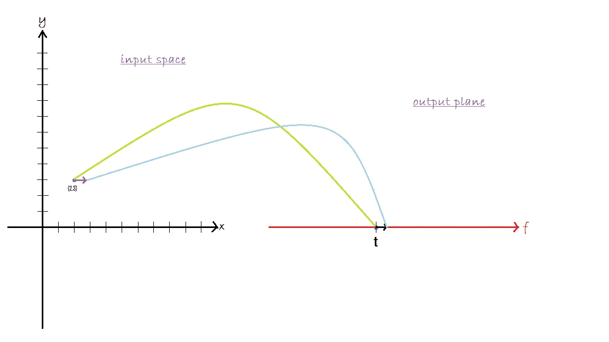
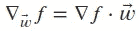
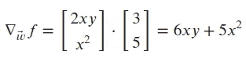
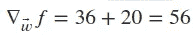
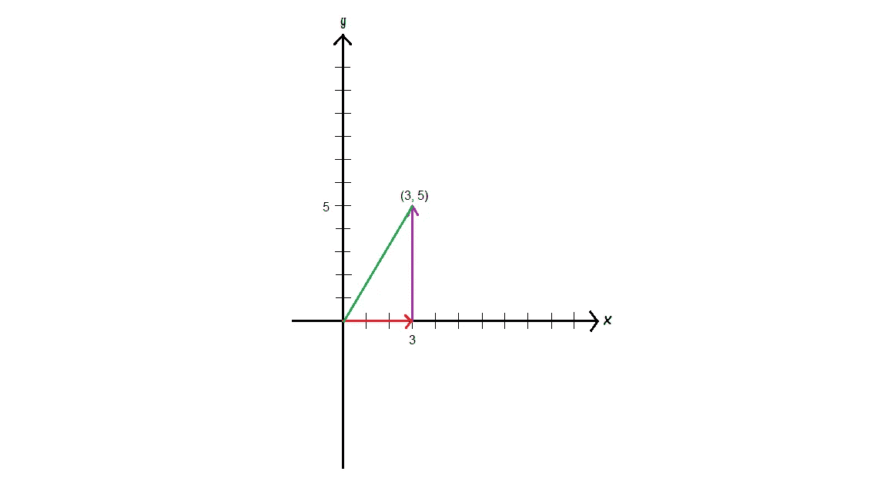
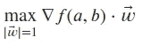
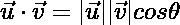
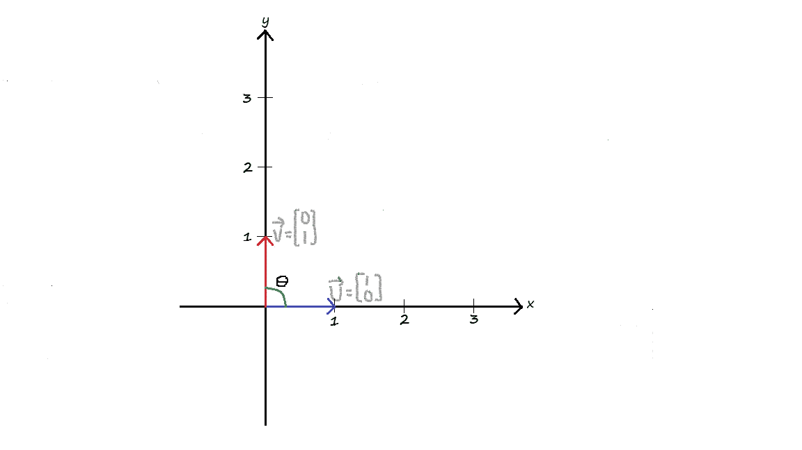
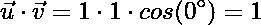

# 我终于明白了反向传播:你也可以…

> 原文：<https://towardsdatascience.com/i-finally-understood-backpropagation-and-you-can-too-44f7dd98ff52?source=collection_archive---------30----------------------->

## 为什么梯度是最陡上升的方向。

照片由[在](https://unsplash.com/@thisisengineering?utm_source=medium&utm_medium=referral) [Unsplash](https://unsplash.com?utm_source=medium&utm_medium=referral) 上拍摄

反向传播算法是训练神经网络的关键因素之一，但它也可能是理解事物实际工作方式时最难掌握的概念。至少在我自己的经历中，这是我一直努力去深入理解的一件事。在这个主题的大量材料之间变戏法之后，我有了自己的灵光一现，所有的东西都到位了。像我一样，你也可能通过在线课程自学，可能已经完成了几个项目，但你仍然会感觉到那种 ***一知半解、*** 模糊理解训练神经网络(或任何其他机器学习模型)时实际发生的事情的痛苦。

在这篇博文中，我将让你了解我的直觉，希望你能在此基础上更好地理解这个非常重要的概念。我还提供了对我有很大帮助的资源的链接。

# 让我们从梯度下降开始

*但是为什么呢？因为这是我最容易忽略的一点。许多在线课程会告诉你梯度下降法找到了损失函数相对于权重的`partial derivative`(即。梯度)并在与该梯度相反的方向上迈出一步；因为*坡度指向最陡上升*的方向，向相反方向迈一步将意味着我们向*最陡下降*的方向移动。但他们从不说明为什么，我是说为什么的为什么。我们朝着与梯度相反的方向迈出一步，因为它指向最陡上升的方向，但问题是:为什么梯度是最陡上升的方向？*

## 查看渐变

梯度只是一个包含函数所有偏导数的向量。因此，这里的关键思想实际上是`partial derivatives`的概念。偏导数告诉我们，当我们保持除一个输入变量之外的所有输入变量不变，并向不固定的那个变量的方向稍微移动时，函数会改变多少。

另外，典型的神经网络包含数千个参数，但是为了简单和易于可视化，我们将考虑具有两个变量的函数:𝑓(𝑥,𝑦).幸运的是，我们在这里所做的一切可以很好地推广到任何数量的维度。

对于我们的两个变量的情况，偏导数告诉我们，如果我们保持𝑦变量不变，并在𝑥方向稍微移动一下，函数的输出会改变多少，反之亦然。

**具体来说**

作者图片

我们在输入空间中的点`(2, 3)`处，该点对应于输出平面中的特定点`t`，即对于输入`(2, 3)`，我们的函数的输出为`t`。相对于𝑥的偏导数告诉我们，如果我们保持𝑦固定在`3`并稍微向𝑥方向移动，会导致多少变化。类似地，当𝑥固定在`2`并且我们向𝑦方向移动一点点时，对𝑦的偏导数测量了由此产生的产出变化。

我们来考虑一下函数:𝑓(𝑥,𝑦)=*x*y。相对于 *x* ，∂f/∂x 的偏导数为 2 *xy* ，即。我们保持 *y* 为常数，并对整项进行微分。同样，关于 *y* ，∂f/∂y 的偏导数是 *x* 。

记住梯度把所有的偏导数打包成一个向量，这个函数的梯度是:∇𝑓 = [2𝑥𝑦，𝑥 ]。在点`(2, 3)`，梯度将是∇𝑓=[12，4】。因此，纯粹在`x`方向上的轻微推动将导致函数输出发生`12`倍的变化，而在`y`方向上的类似变化将导致函数输出发生`4`倍的变化。

尝试推导函数的偏导数:𝑔(𝑥,𝑦)=3𝑥𝑦。希望不难看出这个函数的梯度是:∇𝑔=[3𝑦，9𝑥𝑦】。

偏导数的问题在于，它们只告诉我们，如果我们只朝一个方向运动，事情会如何变化。偏导数是`partial`，因为它们都没有告诉我们，当输入改变时，函数 *f* ( *x* ， *y* )是如何变化的。然而，我们不仅想知道当我们沿 *x* 或 *y* 方向移动时，事物是如何变化的，我们还想知道如果我们在输入空间内沿任意方向移动，事物会发生多大的变化。这正是`directional derivatives`的作用。

# 方向导数

一个方向上的方向导数，比如说𝑤⃗，告诉我们，如果我们在向量𝑤⃗.的方向上轻微移动，函数的输出会改变多少方向导数是通过取函数的梯度和𝑤⃗ ie 的`dot product`得到的。我们想要前进的方向。

如果𝑤⃗ =[3，5]，那么方向导数:

评估点`(2,3)`的方向导数:

这意味着，假设我们在输入平面上的点`(2, 3)`，在向量`(3, 5)`的方向上迈出一小步，我们函数的输出就会改变`56`倍。看待这一点的另一种方式是考虑在我们的输入平面(即 x，y 平面)，该平面中的任何点或方向都可以被认为是𝑥和𝑦方向上的运动的组合。

作者图片

在上图中，𝑤⃗ =[3，5]是𝑥方向的 3 步和𝑦方向的 5 步的组合。因此，直觉上，沿着某个任意方向迈出一步，会导致 x 轴和 y 轴的变化。取方向导数的点积，将 x 轴和 y 轴上的变化相加。

现在我们有了方向导数，它本质上是偏导数的推广，用来处理输入平面上的任意方向。在训练神经网络时，我们寻求解决的问题是:假设我们处于某个点，比如说对应于损失(我们函数的输出)为`t`的`(2, 3)`，我们想知道导致我们损失最大增加的**方向**？一旦我们知道这个**方向**，我们就向相反的**方向**迈出一步，这将导致损失的最大减少。请注意，我有意强调了单词**方向**。我们正在寻找最佳方向，幸运的是，我们已经有了一个工具，可以衡量一个特定方向有多好(或多坏)，正如你可能已经猜到的那样，这就是`directional derivative`。

有了方向导数，我们可以解决这个问题的一个方法是找到所有可能运动方向的方向导数。最佳方向将是具有最大方向导数的方向。但是计算起来太慢了，想想我们可能移动的方向，这个列表是无穷无尽的。但是，想法是好的，我们只是需要一个更简单的方法，找到方向导数最大的方向。

# 寻找最陡上坡的方向

我们现在的目标是找到:

请注意，上式中的向量的大小或长度为 1。从某种意义上来说，这确保了我们不会因为向量比其他向量大而选择错误的向量，从而最大化点积，即使它指向错误的方向。

如前所述，方向导数是通过梯度和指向我们想要的方向的矢量的点积得到的。点积有一个非常好的性质，可以让我们找到最大化方向导数的方向，而不必考虑所有可能的方向。点积衡量两个向量之间的相似性。它给两个向量在同一方向上的移动量打分。形式上，两个向量𝑢⃗和𝑣⃗之间的点积是:

其中𝜃是两个向量之间的角度。

作者图片

在上图中，当𝑢⃗ =[0，1]和𝑣⃗ =[1，0]时，他们的点积为 0，因为他们之间没有相似性，𝑢⃗完全指向𝑥方向(它没有𝑦分量，而𝑣⃗也完全指向𝑦方向)。它们之间的角度是 90 度(它们是垂直的)，𝑐𝑜𝑠(90 = 0 度。当𝑢⃗ =[0，1]和𝑣⃗ =[0，1]时，点积最大化，因为它们指向相同的方向。在这种情况下，点积是 1，因为它们之间的角度是 0。

向量的大小不会影响点积的结果，因为两个向量的大小都是 1。因此，使用上述公式的点积结果取决于两个向量之间的角度。从前面所述，我们不难理解这样一个事实，即对于单位长度的矢量，当两个矢量平行时，即它们指向相同的方向或它们之间的角度为 0°时，点积最大。

为了提醒我们的目标，我们希望找到使方向导数最大化的向量:

方向导数也是一个点积，所以从我们对点积的理解中可以很自然地得出，使方向导数最大化并导致函数最大增量的向量，是指向与梯度相同方向的向量，也就是梯度本身。这就是为什么坡度是上升最陡的方向。梯度下降朝相反的方向迈出了一步，因为我们在训练中的目标是使损失函数最小化，而不是最大化。

希望你从这篇文章中获得了一些有用的见解，帮助你巩固对神经网络和其他机器学习算法的基础的理解。下一篇博文将着眼于链式法则，这是反向传播背后的另一个主要概念。

# 资源

偏导数和方向导数:[可汗学院:多元微积分](https://www.khanacademy.org/math/multivariable-calculus/multivariable-derivatives)
点积:[可汗学院:线性代数](https://www.khanacademy.org/math/linear-algebra/vectors-and-spaces/dot-cross-products/v/vector-dot-product-and-vector-length)微积分: [3Blue1Brown](https://www.youtube.com/watch?v=WUvTyaaNkzM&list=PLZHQObOWTQDMsr9K-rj53DwVRMYO3t5Yr)