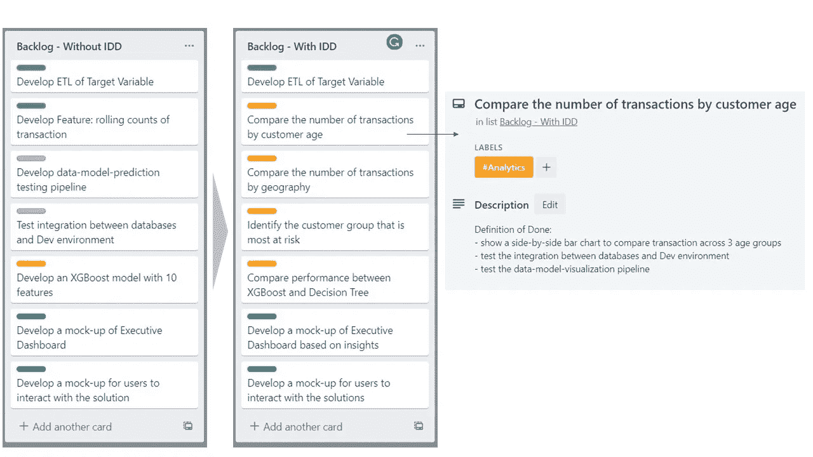
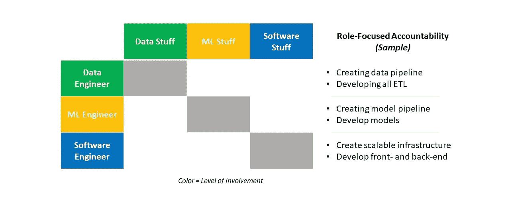
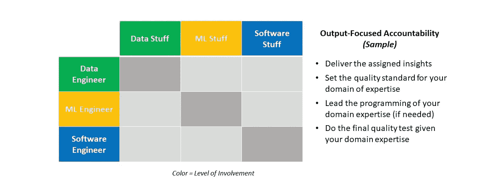
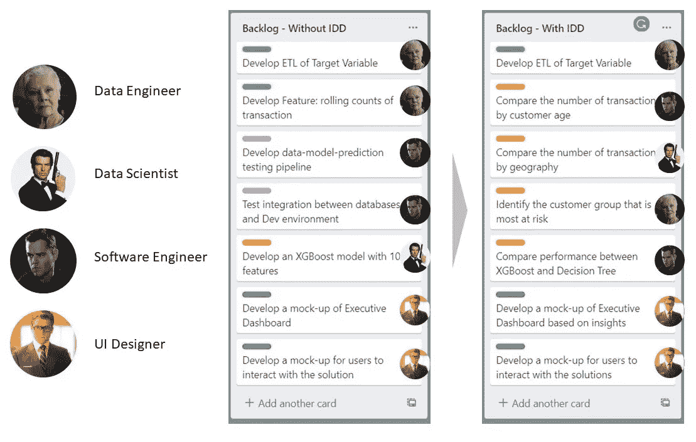

# 你被解雇了

> 原文：<https://towardsdatascience.com/i-fired-a-data-scientist-a137fca5b80e?source=collection_archive---------19----------------------->

## 如何发展和管理一个快乐的数据科学团队

艾伦·布兰科·特耶多尔在 [Unsplash](https://unsplash.com/?utm_source=unsplash&utm_medium=referral&utm_content=creditCopyText) 上的照片

**TLDR:** 大多数 ML 团队不喜欢做数据和基础设施方面的工作，因为这不如建模有趣。对这个问题管理不当会导致高流动率和有害的团队氛围。我想分享一个叫做洞察驱动开发(IDD)的解决方案，几个例子，以及采用它的五个步骤。IDD 的目标是创建一个高绩效、敬业、快乐的数据科学团队，该团队既接受有趣的 ML 内容，也接受非 ML 工作。

***喜欢读什么？*** *跟我上* [*中*](https://medium.com/@ianxiao) *，* [*领英*](https://www.linkedin.com/in/ianxiao/) *，* [*推特*](https://twitter.com/ian_xxiao) *。查看我的《* [*用机器学习影响*](https://www.bizanalyticsbootcamp.com/influence-with-ml-digital) *》指南。它有助于数据科学家更好地交流。*

***免责声明*** *:这篇文章没有得到我工作的任何公司的支持或赞助。我交替使用术语分析、数据科学和 ML。*

## 你被解雇了！

“嘿，伙计，没用的。我们必须让你退出这个项目。不好意思。”亚历克斯，一个能干的数据科学家，不带感情地看着我。我感到无助、紧张和悲伤。

他可能在用最激烈的语言诅咒我。

因此，我刚刚“解雇”了项目中两位数据科学家中的一位。 ***为什么？亚历克斯讨厌做数据工作。他对此直言不讳。他用各种借口把它“卸”给别人。我们讨论过这个问题。他仍然做着半吊子的工作。其他人感到沮丧，抱怨为什么只有亚历克斯可以做酷的事情。如果这种情况继续下去，我们作为一个团队将会失败。那么，我们到了。***

“嘘*t 老兄。我很抱歉。”亚历克斯说，终于。该死，真尴尬。

## 问题是

“亚历克斯问题”在数据科学团队中相当普遍。许多数据科学家[感到无聊和没有动力](/data-science-is-boring-1d43473e353e)。**我认为有两个根本原因:**

1.  数据科学团队想要做的事情与我们在现实世界中需要做的事情之间存在差距
2.  非数据科学家希望培养最受欢迎的技能

## 解决方案

那天，我“处理”了 Alex 的问题，我感到很紧张。那一刻，**建立高效、敬业、快乐的数据科学团队**成了我的使命。

至少，我想要一个鼓励数据科学团队接受非 ML 工作并从中获得乐趣的系统。好吧，显而易见的解决办法就是强迫人们去做(我们都是拿工资去工作的，对吧？).但这是不可持续的。因此，解决方案必须是**实用的、愉快的、自我激励的**。

在接下来的几年里，我开始了尝试和混合来自产品管理、敏捷软件开发和管理咨询的核心思想的旅程。我想我找到了解决方案:**洞察驱动开发(IDD)。**

## 本文的范围

通常，有两种类型的 ML 项目:以业务为中心的和基于软件的项目。在本文中，让我们在**以业务为中心的 ML 项目的背景下讨论 IDD 的原则。**这些项目的输出通常是管理层的演示或仪表板。团队需要使用特定的 ML 技术，从简单到复杂，以找到一些洞察力。

取决于这篇文章如何做，我可以深入研究 1)IDD 如何在项目的早期、中期和后期阶段工作，以及 2)如何使 IDD 适应以软件为中心的 ML 项目(例如，输出是与核心操作集成的全栈解决方案)。

## 关于团队的假设

要利用 IDD，你要么需要一个有经验的团队，他们有独特的手艺，有尝试新事物的动力，要么需要一群初级通才，他们有动力，能把事情做好，有可塑性。如果不是，IDD 不适合你的团队(你应该重新审视一下你的招聘策略)。

## 让我们进入正题:缺碘症原则

IDD 归结为做两件不同的事情:

1.  **如何确定每个团队成员的**工作范围(例如，也称为“工作包”，每个人都需要交付的东西)。
2.  **如何根据人的力量分配责任**

首先，让我们通过一个示例来看看工作包是如何被不同地定义的。下面是同一个项目的两个[积压](https://www.atlassian.com/agile/scrum/backlogs)无 IDD 和有 IDD *，在同一个* [*冲刺*](https://www.atlassian.com/agile/scrum/sprints) *，有相同的近期目标。*

无(左)和有(中)IDD 的工作包比较；详细的工作包定义(右)；作者自己的分析

**我们通常如何管理 ML 项目？**在大多数 ML 项目中，我们将工作包分为四组:

1.  数据
2.  分析(我将此作为**一个涵盖探索性分析和模型开发的总括术语**)
3.  软件(如系统集成、基础设施设置和 CICD)
4.  UI 设计和开发。

如果是管理咨询类型的约定，一些项目可能有业务垂直。

**有什么变化？**在 IDD 中，最明显的变化是有了更多的“分析”项目(黄色的东西)。在一种分析中，每个分析项目都被仔细地措辞；每个分析都旨在驱动出有趣的见解；基于我们的假设，每一个洞察都有助于解决更大的业务问题。因此，这种方法被称为洞察驱动开发。

**数据和基础设施工作会发生什么变化？**如果我们仔细观察，在*“完成的定义”中，每个分析项目都包括 ETL 和基础设施*数据和基础设施工作仍然非常关键。我们并没有回避它们，而是把它们作为洞察之旅的一部分。这种方法有一定的注意事项。例如，一些数据和基础设施工作必须是独立的，尤其是在项目的早期阶段。我们将在后续文章中讨论更多内容。

我们如何分配工作？与分析相关的项目似乎更多了。将它们全部分配给数据科学家是不现实的。人们有不同的优势、经历和兴趣。因此，这就把我们带到了 IDD 的第二个方面:**责任分配。**

通常，角色定义了人们的责任。例如，数据工程师拥有并处理所有数据，并且可能只处理与数据相关的东西。

无 IDD:ML 项目所有权结构示例；作者自己的分析

在 IDD 中，每个人的责任从他们的直接角色转移到产出。该团队“围绕一种洞察力开展工作”每个人都拥有最终交付的见解。为了保持质量的平衡，每个专家设定标准，领导程序设计(如果需要的话)，并成为其领域专业知识的最终质量把关人。

IDD:ML 项目所有权结构示例；作者自己的分析

考虑到这一点，无论有无 IDD，工作分配都会是这样的。主要的区别在于，人们可以在他人的支持下领导他们直接角色和领域之外的工作。

角色类型(左)，不带 IDD 的分配(中)和带 IDD 的分配(右)；作者自己的分析

请注意，特定的工作仍然需要高度专业化的技能，最好分配给专家。作为项目负责人，您需要监控工作量，并为领导其专业知识之外的工作的人(例如，创建客户分析的数据工程师)提供足够的指导。每个团队成员都需要紧密合作，并交流期望和时间安排。

## 好处

我一直在与具有不同经验的业务分析师、数据专家、数据科学家和软件工程师团队一起，在以业务和软件为重点的 ML 项目中使用 IDD。它一直工作得很好，我将继续使用和完善 IDD。具体来说，IDD 之所以有效，是因为它让每个人都可以:

1.  参与解决问题的过程(更有趣)
2.  了解他们的工作如何直接有助于最终目标的实现(更加投入)
3.  了解如何在给定更多上下文(更多质量)的情况下改进他们的设计
4.  获得在新领域工作的机会(更多学习)
5.  继续成为他们领域的专家(同样确定)

每个公司的每个团队都有不同的工作方式。所以，请接受这些原则，并相应地应用它们。做好一些困惑、紧张和不确定的准备。耐心点，事情会好起来的。

## 行动计划

如果你喜欢这种方法，这里有一些你可以在你的公司采用 IDD 的方法。

**第一步。**确保您的团队和朋友了解 IDD。所以，把这篇文章以**“必读”为题分享给你的朋友和团队**😉

**第二步。**选择一个以商业洞察力为中心的小型 ML 项目(例如，使用 ML 寻找新的客户群并评估潜力)。理想情况下，这应该是一个由 5 名经验丰富的工程师组成的团队可以在 2-4 个月内完成的事情。

**第三步。召集你的精英团队。核心团队应该是你(作为项目负责人)，数据工程师，机器学习工程师，软件工程师，UI 设计师。您可能需要业务分析师和 IT 人员的兼职支持。**

**第四步。与团队一起喝杯咖啡或饮料，并与这种方法保持一致(我发现当我们不在办公室时，人们更容易接受新想法)。**

**第五步。**启动项目。抵制回到旧的工作方式的诱惑。给团队一些时间去学习(和失败)。注意个人如何传递 IDD。

## 奖金

这里有一些**不要做的事情**可以让你避免一些尴尬的时刻:

*   不要选择大型的关键任务项目。
*   不要选择以软件为中心的 ML 项目
*   不要将 IDD 引入正在进行的项目。
*   除非每个人都同意，否则不要开始这个项目。
*   如果人们不喜欢，不要强迫他们引领洞察力的发展(你可以教，但不能强迫人们)。

如果你对这个话题感兴趣，我们在 Neptune 的朋友写了一篇关于[如何建立机器学习团队来交付](https://bit.ly/32wUJXB)的精彩博客。

我希望你喜欢这个。我很想听听 IDD 如何为您的团队工作(以及如何不工作)。**可以在** [**中**](https://medium.com/@ianxiao)**[**LinkedIn**](https://www.linkedin.com/in/ianxiao/)**，或者**[**Twitter**](https://twitter.com/ian_xxiao)**上与我取得联系。****

**取决于这篇文章的表现，我将继续讨论 IDD 如何为**以软件为中心的 ML 项目**工作(例如，输出是与核心操作集成的全栈解决方案)。**

# **你可能也会喜欢这些…**

** [## 最有用的 ML 工具 2020

### 每个懒惰的全栈数据科学家都应该使用的 5 套工具

towardsdatascience.com](/the-most-useful-ml-tools-2020-e41b54061c58)  [## 被遗忘的算法

### 用 Streamlit 探索蒙特卡罗模拟

towardsdatascience.com](/how-to-design-monte-carlo-simulation-138e9214910a)  [## 12 小时 ML 挑战

### 如何使用 Streamlit 和 DevOps 工具构建和部署 ML 应用程序

towardsdatascience.com](/build-full-stack-ml-12-hours-50c310fedd51)  [## 越狱

### 我们应该如何设计推荐系统

towardsdatascience.com](/how-to-design-search-engines-24e9e2e7b7d0)  [## 数据科学很无聊

### 我如何应对部署机器学习的无聊日子

towardsdatascience.com](/data-science-is-boring-1d43473e353e)  [## 我们创造了一个懒惰的人工智能

### 如何为现实世界设计和实现强化学习

towardsdatascience.com](/we-created-a-lazy-ai-5cea59a2a749)  [## ML 和敏捷注定的联姻

### Udacity 的创始人巴斯蒂安·特龙毁了我的 ML 项目和婚礼

towardsdatascience.com](/a-doomed-marriage-of-ml-and-agile-b91b95b37e35)  [## 抵御另一个人工智能冬天的最后一道防线

### 数字，五个战术解决方案，和一个快速调查

towardsdatascience.com](/the-last-defense-against-another-ai-winter-c589b48c561)  [## 人工智能的最后一英里问题

### 许多数据科学家没有充分考虑的一件事是

towardsdatascience.com](/fixing-the-last-mile-problems-of-deploying-ai-systems-in-the-real-world-4f1aab0ea10)**