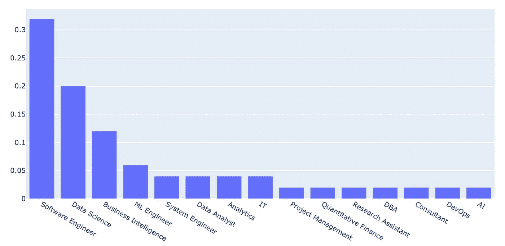
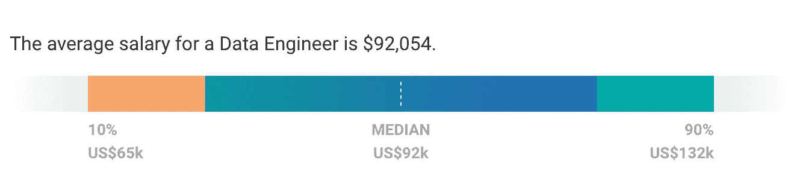
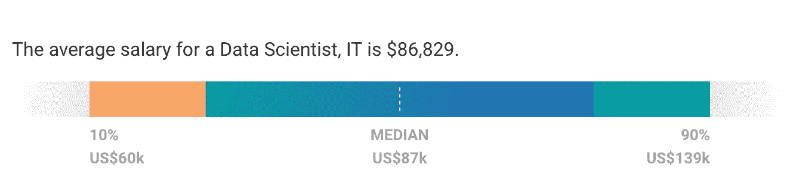
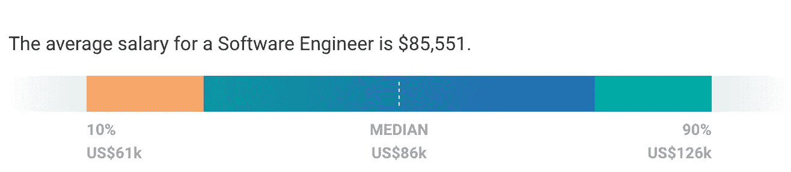
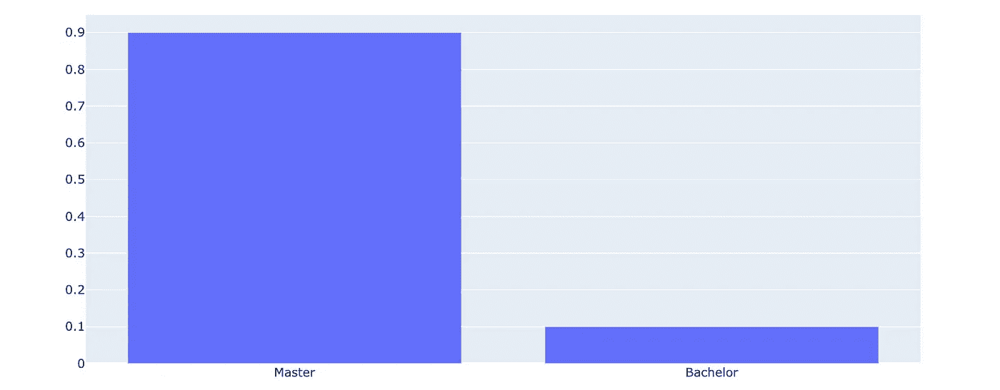
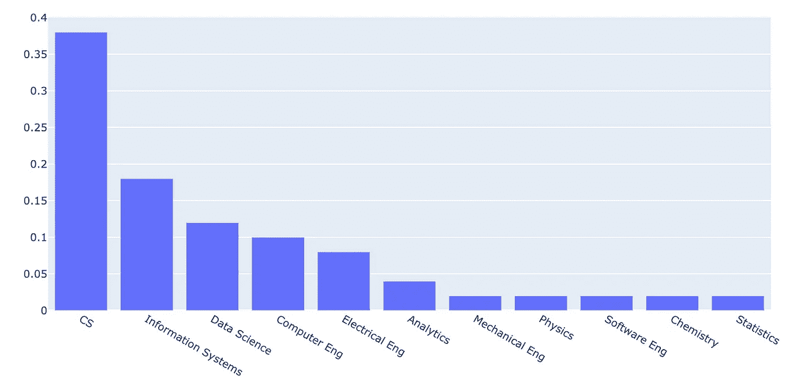
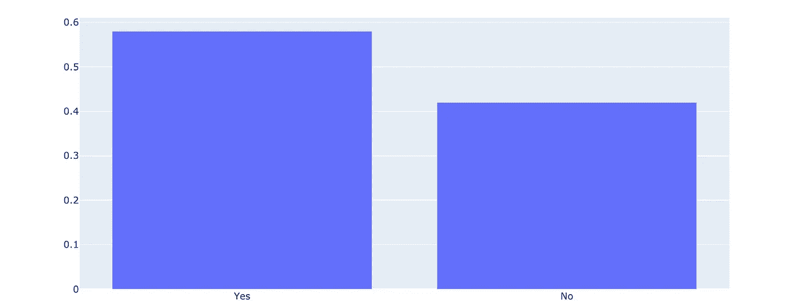
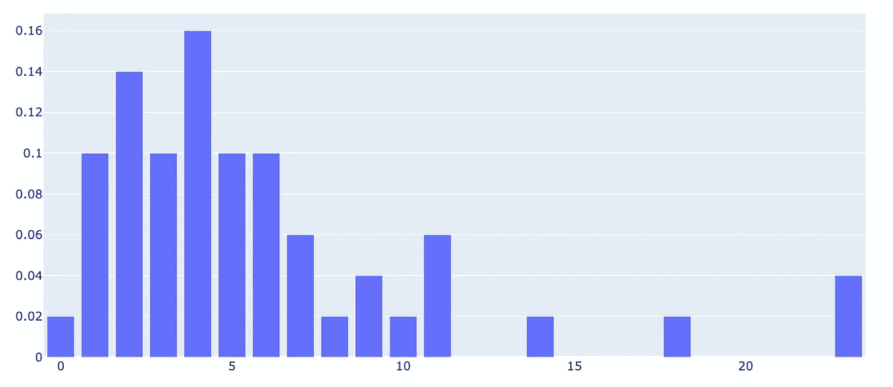

# 我跟着数据工程师的简历学习如何进入这个领域

> 原文：<https://towardsdatascience.com/i-followed-data-engineer-resumes-to-learn-how-to-break-into-the-field-78019ece7887?source=collection_archive---------19----------------------->

## 数据工程

## 以下是 50 名数据工程师的简历中关于经验和教育要求的内容

来自[突发事件](https://burst.shopify.com/office?utm_campaign=photo_credit&utm_content=Free+Freelance+Designer+Working+On+Laptop+Image%3A+Browse+1000s+of+Pics&utm_medium=referral&utm_source=credit)的[莎拉·普鲁格](https://burst.shopify.com/@sarahpflugphoto?utm_campaign=photo_credit&utm_content=Free+Freelance+Designer+Working+On+Laptop+Image%3A+Browse+1000s+of+Pics&utm_medium=referral&utm_source=credit)的照片

每个人都想成为数据科学家。

但是没有人谈论**数据工程师**。

利用跨软件工程、devops 和数据科学的专业知识，这无疑更加有趣。

我分析了 50 名数据工程师的简历，看看怎样才能找到工作。

我们来调查一下。

# 以前的工作

**数据工程师在担任第一个数据工程职位之前从事什么工作？**

大多数以前的角色涉及编码。与[数据科学](/i-followed-data-scientists-resumes-to-see-what-they-did-before-data-science-730ec54d95d4)相比，我们看到的学术和“数学”背景要少得多。

超过 50%的先前职位属于软件工程(SDE)、数据科学(DS)和商业智能(BI)。

## 我有两个假设可以解释这种分布:

1.  数据工程涉及大量使用云基础设施，最好通过实践而不是在学校里学习。SDE、DS 和 BI 角色提供了获得这些技能的机会。
2.  由于数据工程支持 SDE、DS 和 BI，后一种角色的经验也可以产生对数据工程的兴趣，引导人们进入这个领域。

因此，如果你对数据工程感兴趣，先成为软件开发人员或数据科学家可能是有意义的。

# 平均工资

**数据工程师的平均工资是多少？**

根据 [Payscale](https://www.payscale.com/) ，数据工程职位的平均薪酬(92k 美元)高于软件工程(86k 美元)和数据科学(87k 美元)职位。

我们知道平均值有误导性，但是 6000 美元的差异意义重大。

[工资等级](https://www.payscale.com/research/US/Job=Data_Engineer/Salary)

[工资等级](https://www.payscale.com/research/US/Job=Data_Scientist%2C_IT/Salary)

[工资等级](https://www.payscale.com/research/US/Job=Software_Engineer/Salary)

我怀疑这部分归因于数据工程师的职位平均比 SDE 和 DS 职位高。资深候选人和少量人才库可能会推高价格。

也就是说，你可能不应该进入数据工程(或任何角色？)只是为了钱。

# 最高教育水平

**在获得数据工程职位之前，最高学历是多少？**

50 份简历中，90%有硕士学位，10%有学士学位，没有一份有博士学位。

这个角色可以说没有数据科学那么“学术”。因此，博士的缺乏并不令我惊讶，但硕士学位的高比例令我惊讶。

这可能是由于一个坏的样本，但我怀疑这背后有一些基本原理。

如果有人煽动，我很想听听！

# 学位专业

**最高学历期间学的是什么专业？**

所有专业都是 STEM，大部分都是 CS 相关。

与数据科学相比，经济学、商学和数学专业的学生要少得多。

我怀疑以前的角色是一个比教育程度更强的合适性指标，但分布仍然很有趣。

# 相关认证

**数据工程师是否持有数据工程相关认证？**

几乎 60%的人会。实际数字可能更高，因为这只考虑了简历上列出的证书。

我一直建议不要为了获得工作资格而收集证书。还有[更好的方法](https://medium.com/better-programming/advice-from-someone-who-hires-on-getting-your-first-software-engineering-job-81a328dd302b)。

但是我认为数据工程和 devops 是这个规则的例外。

软件工程面试中的算法挑战给出了一些关于编码能力的信号。但是提供云服务的能力更难测试。

出于这个原因，大型云提供商(GCP、AWS、Azure……)提供的认证计划实际上可能是交流能力的一个好途径。

# 从毕业到第一次担任数据工程师的时间

**从完成本科学位到获得数据工程职位，数据工程师有多少年的工作经验？**

几乎没有数据工程师在毕业后直接进入角色。

这支持了我的假设，即数据工程不是一个入门级的工作，需要在其他角色中得到最好发展的能力。

相比之下，我猜想 SDE 和 DS 的相同图表会显示数据向左移动。

# 这一分析的问题

*   这些结果不具有统计学意义。只审查了 50 份简历，可变性很高。
*   我们只分析了最前面的角色和教育。先前的角色和教育也可能影响获得数据工程角色。
*   所有数据均来自美国，可能不适用于其他国家的招聘实践。

# 结论

如果任何数据工程师有任何纠正或见解，我都乐意倾听！

如果你想自己完成某件事，先看看别人是如何完成同样的任务的。这就是我在这里试图做的。

虽然数据点的数量很少，但它提供了在数据工程中工作的个人类型的一些想法。

如果你喜欢这个，你可能会对我的[数据科学分析](/i-followed-data-scientists-resumes-to-see-what-they-did-before-data-science-730ec54d95d4)感兴趣。