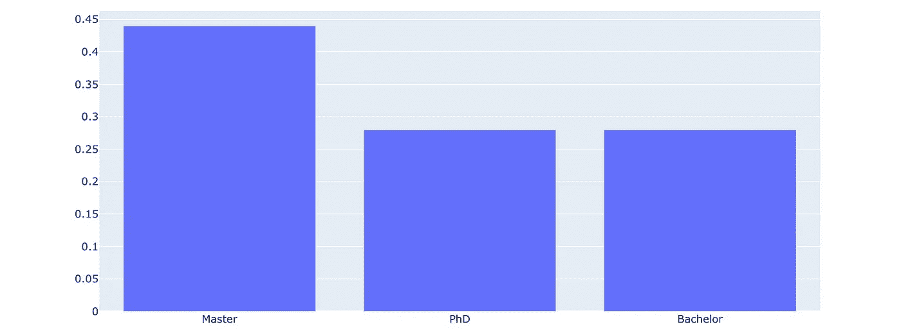
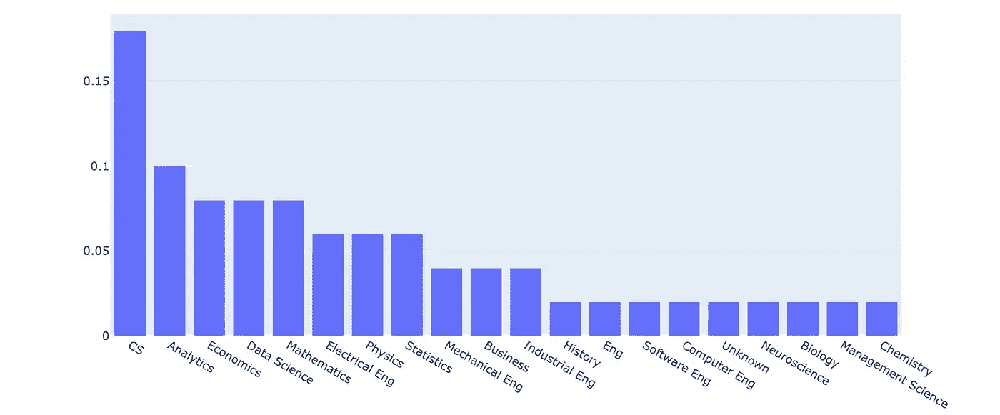
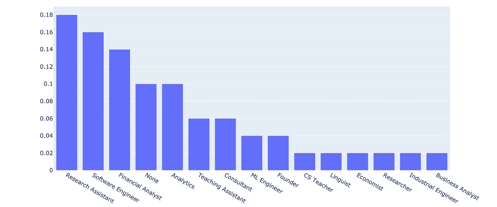

# 我跟踪了数据科学家的简历，看看他们在数据科学之前是做什么的

> 原文：<https://towardsdatascience.com/i-followed-data-scientists-resumes-to-see-what-they-did-before-data-science-730ec54d95d4?source=collection_archive---------14----------------------->

## 你可以从任何背景进入数据科学领域

照片由来自[佩克斯](https://www.pexels.com/photo/photography-of-woman-using-laptop-1181681/?utm_content=attributionCopyText&utm_medium=referral&utm_source=pexels)的[克里斯蒂娜·莫里洛](https://www.pexels.com/@divinetechygirl?utm_content=attributionCopyText&utm_medium=referral&utm_source=pexels)拍摄

非 STEM 毕业生经常问我是否有可能进入数据科学领域。

我的回答永远是“是”。尽管我仍然相信[成为一名软件开发人员](/dont-become-a-data-scientist-ee4769899025)对于那些没有技术背景的人来说是一个更好的选择。

我认为调查人们在闯入数据科学之前的经历会很有趣。

这是 50 个数据科学家在数据科学之前做的事情。

# 最高教育水平

闯入数据科学之前获得的最高学历是什么？

博士学位和学士学位的比例相当，硕士学位的比例略高。

有趣的是，这与我所看到的相符。

和我聊过的博士数据科学家的普遍共识是，博士在工作中没什么用，但它确实有助于获得面试机会。

根据上面的推断，你可能不应该仅仅为了成为一名数据科学家而攻读更高的学位。花在工作和社交上的时间可能更有价值。

# 教育专业

在达到的最高教育水平期间学习了什么专业(前数据科学)。

数据科学家大多毕业于 STEM 学位。但我们也看到许多非 STEM 学位，如商业和经济学(社会科学)。

品种比我预想的高一点。

这支持了你不需要 STEM 学位就能进入数据科学的观点。

也就是说，这个领域有很多变化。一个物理学毕业生可能在做与经济学毕业生完全不同的工作。

# 之前的职位

数据科学家在进入数据科学职位之前从事什么工作？

研究、软件和财务职位构成了之前职位的大部分。

大量的金融分析师、分析专家和顾问让我相信，许多数据科学角色并没有过多的技术性，可能更重视解释和呈现数据，而不是建模。

又来了。你能从任何领域进入数据科学吗？是的，很可能。但是，您的数据科学角色可能与其他背景不同的人完全不同。

# 数据科学相关证书

数据科学家的简历中有任何数据科学、分析或机器学习证书吗？

接近 2/3 的数据科学家在他们的简历上列出了证书。

我一直觉得证书对获取知识有用，但对找工作没用。有趣的是，我怀疑面试官并不重视这些。

也就是说，数据科学家似乎觉得证书足够重要，可以写进他们的简历。

# 这一分析的问题

很多。

*   我只回顾了在成为数据科学家之前所获得的最高学历和工作。其他之前的工作和教育都被忽略了。
*   所有的数据点都来自美国和加拿大。
*   没有进行统计意义上的计算。

# 结论

这并不是一项严肃的研究。探索很有趣，所以我想分享一下我的成果。不要把这个看得太重。

也就是说，我认为它总体上支持这样一种观点，即你可以从任何背景进入数据科学。