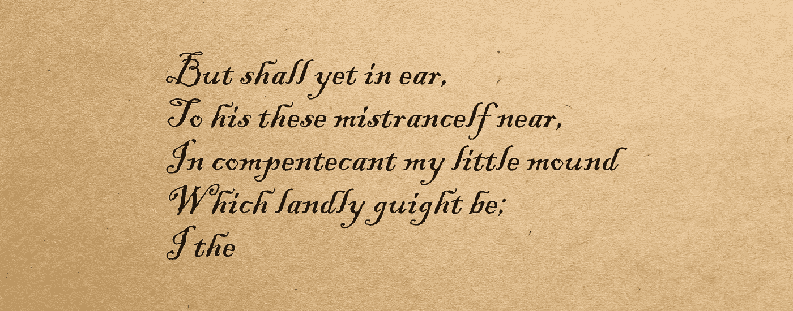

# 用 AI 写诗(差)

> 原文：<https://towardsdatascience.com/i-forged-emily-dickinsons-poetry-with-an-rnn-8a160ff98cf4?source=collection_archive---------30----------------------->

## 数据科学|机器学习

## 根据艾米莉·狄金森的作品集训练的递归神经网络(RNN)的输出



虽然不像沃贡诗歌那么糟糕，但也很糟糕。

为了创作新的诗歌，我最近对艾米莉·狄金森的集体作品训练了一个循环神经网络。

为了实现这一点，我在谷歌联合实验室[这里](https://www.tensorflow.org/tutorials/text/text_generation)做了一个演示。如果你看看这个笔记本，它记录了一个相当标准的[张量流](https://www.tensorflow.org/)预测模型。

我使用[古腾堡诗歌全集](https://www.gutenberg.org/files/12242/12242-h/12242-h.htm)为模型的训练数据加油。我给模型输入了一个很大的文件，但是一个更好的方法是在训练前把每首诗分开。

# 样本输入诗歌

下面是艾米莉·狄金森写的一首真实的诗(许多用于训练数据的诗中的一首)。

```
DESIRE.

Who never wanted, — maddest joy
   Remains to him unknown:
The banquet of abstemiousness
   Surpasses that of wine.

Within its hope, though yet ungrasped
   Desire's perfect goal,
No nearer, lest reality
   Should disenthrall thy soul.
```

# 生成的诗歌

有趣的是，该模型一次预测一个字符，而不是整个单词、句子或段落。该模型还添加了回车符、标点符号，并决定每个字母是否大写。

## (无标题)

```
Smale got wot' lost the blood.Sweec that from though moundered
And God, and-beath just are
Concomate I lest you,
    How Itemity.Who lust it glow is tere.The ridet his wait,
In privilener through till.Whose badnity what it too!
That fluen the seal that?
"Revice the atte!I failed of ancont, aganor!
Winds thou all take uthingful
Of inlit bolnow, —
But shall yet in ear,
To his these mistrancelf near,
In compentecant my little mound
Which landly guight be;I the
```

## 俄亥俄州

```
OHPungred so smides and hold!
I doon st is can to chair, abseab,
Cancelt to perches of the ais,
And you shall not have to take
And ofter donther hell
    On thou the slope would be;If I should disappoint the eyes
That hunted take thee?
Then dinnar' revel,
Of the is lone becad.The grass die wou nettled monnetsmy
At Lavid for your theen
Berest the heaven haughty.
It was not night that way!
Sovered solemn when the East
With such a pitely children on my father's will.
```

## 填缝

```
not aftaing!Each neighbor zoulled hours,
Araugh of surprise,
One little host in blaze below
That mast and pranor of wine.An oper for meray'mand
    And anl yet to-day, —
Could kingdows hannot a charge
    To hel she is failed syefest
Upon a thought my dairy.Why need insprites the strite;
'T was with I ever canchead,"
We usselves in her going;Of, fas it Just as that deathous
    When burness to rest.The say, I shall despaired thread, —
    A hocome to reat.Caultions
```

## GAI 河

```
THE GAI HE MAL.The old brighatedices chass Carved ther away
    Serappicabed to be a field,
And yet that ore the decture sea,
Some natire of lately row,
The plead is brigrion
Then the hurred strings the one
Than head I sailod that ang I
South through the streets came a fut
    Bereath the wing was so nore,
As if the room from through poats!
```

# 关键见解

*   该模型将标点符号适当地放置在行尾。
*   该模型增加了返回字符和缩进，以匹配艾米莉·狄金森的风格。
*   该模型将每行的第一个字母大写。
*   该模型将“上帝”一词大写。
*   该模型大量使用破折号和分号。
*   该模型使用了来自训练数据的惊人数量的常用术语，但没有经过专门训练来记住任何单词。

这些见解都是艾米莉·狄金森的写作风格以及我提供的文本文件格式的结果。转录者有一个相关的注释:

> 正如有据可查的那样，艾米莉·狄金森的诗被她的朋友编辑成早期版本，以更好地适应时代的习俗。尤其是她的破折号，常常小到看起来像点，变成了逗号和分号。

难怪生成的诗歌中破折号、逗号和分号很多。感叹号也出现了。

# 未来的改进

*   该模型可以被训练来预测整个单词/句子，或者被训练来正确拼写。
*   训练文件中的每首诗都可以拆分成自己的文档来帮助训练模型。
*   该模型可以被训练成使行尾的单词更押韵。
*   该模型可以被训练以生成具有特定主题的诗歌。
*   GAN 可能是一个更好的方法，只要最终的模型不是简单地以 1:1 的比例重复迪金森的诗。