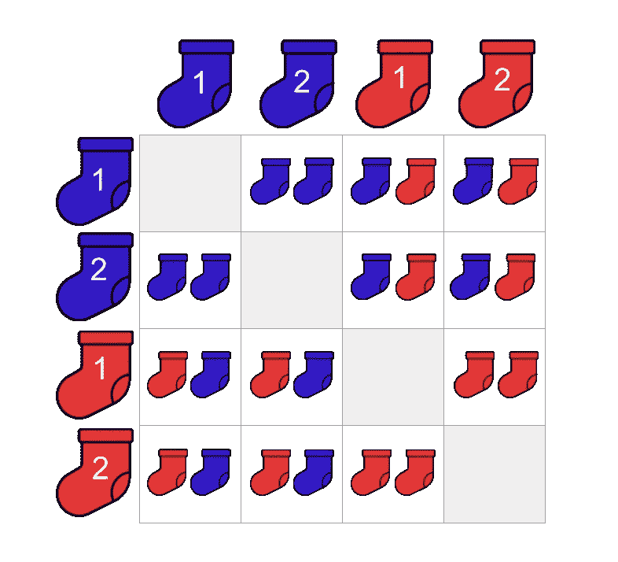

# 我对袜子有意见

> 原文：<https://towardsdatascience.com/i-have-a-problem-with-socks-636740675dcf?source=collection_archive---------13----------------------->

## 让我们来学习如何回答著名的概率面试问题。

在网上看到过一个很有名的面试问题。事情是这样的:

```
I have 'x' blue socks and 'y' red socks in a drawer. I take 2 socks from the drawer without looking. What is the probability that I have drawn a pair of matching coloured socks?
```

对于那些没有花太多时间思考概率的人来说，这种问题可能看起来令人困惑。如果你是那种人，我希望给你展示一个直观的思考这类问题的方法。

# 让我们简化这个问题

**不要从 10 只蓝袜子和 10 只红袜子开始，而是从每双袜子 2 只开始**。

我们将在一个矩阵中描述袜子抽屉的内容。记住**我们将画几双袜子**。矩阵中的行将代表我们配对中选择的第一只袜子。这些柱子将代表我们选择的第二只袜子。


我们将描绘这样一双特殊的袜子:


# 取样…无替换

假设我们从抽屉里抽出一只袜子，结果是第一只蓝色的袜子。我们把它放在一边(**，也就是说，我们不把它放回抽屉**)。当我们从抽屉里挑选第二只袜子时，`blue-1`在我们小小的袜子世界里，我们再也无法选择了！

为了描述这种没有替换的**采样**，我们将矩阵中的对角线灰化。也就是说，如果我们选择`blue-1`作为我们配对的第一只袜子，`blue-1`就不能形成我们配对的第二只袜子。


# 现在谈谈逻辑

让我们通过一些场景来更好地理解我们的问题。

## 场景一:我们选择“蓝色-1”

在这个场景中，我们挑选了第一只袜子，结果是`blue-1`。我们将`blue-1`放在一边(即，在挑选第二只袜子之前，我们不会将它放回抽屉中)。在选择第二只袜子之前，我们停下来想一想:

> "此时抽屉里还有哪些袜子？"

这是一个很容易回答的问题！第二只袜子我们有三个选择:

*   `blue-2`
*   `red-1`
*   `red-2`

假设我们已经选择了`blue-1`作为我们的第一双袜子，那么我们可以用剩下的袜子组成哪双袜子呢？


如果我们计算一下在这种情况下我们可以做多少对，我们可以做 3 对！

## 场景二:我们选择蓝色-2

我们在精彩的游戏中点击“重置”按钮，重新开始。

我们选择第一只袜子。这次正好是`blue-2`。我们把`blue-2`放在一边。我们停下来，再次思考:

> "此时抽屉里还有哪些袜子？"

“这很容易，”你想。我们只有三个选择:

*   `blue-1`
*   `red-1`
*   `red-2`

假设我们已经选择了`blue-2`作为我们的第一双袜子，那么剩下的袜子可以做成哪些双呢？


计算这些线对，我们可以看到，在这个场景中，我们还可以制作 **3 对**！

## 填充矩阵

让我们重复上述过程，直到我们填写我们的矩阵。



# 我们总共能做几双？

在这里，我们想弄清楚我们的袜子微观世界的大小。如果我们只是简单地计算 2 双蓝色袜子和 2 双红色袜子可以做成多少双袜子，我们可以忽略“颜色匹配”的限制。如果没有这种限制，我们可以将一双蓝色袜子和一双红色袜子搭配在一起。这些是我们可以建立的可能配对:


数一数没有“匹配颜色”限制的可能配对，我们发现有 **12** ！这恰好等于排列的数量:


# 有多少双相配的袜子？

观察袜子的微观世界，我们可以数出包含相同颜色袜子的袜子的数量:


把它们数起来，我们发现有 **4 双相配的袜子**！

让我们再深入一点，从不替换的角度考虑我们的配套袜子。对于我们的第一只袜子，我们有 4 只袜子可供选择。我们从抽屉里拿出一只袜子，放在一边。对于下一只袜子，需要考虑两种情况:

## 我们的第一只袜子是蓝色的

如果我们画了一只蓝色的袜子作为我们的第一只袜子，我们可以从抽屉里剩下的袜子中挑选哪一只来做一双相配的袜子？我们必须画另一只蓝袜子！也就是说，**我们的第二只袜子**只剩下一个选择，可以组成一双相配的蓝袜子。

## 我们的第一只袜子是红色的

如果我们的第一只袜子是红色的，那么我们必须画另一只红色的袜子！也就是说，**我们的第二只袜子**只剩下一个选择，可以组成一双相配的红袜子。

我们选择哪只袜子作为我们的第一只袜子并不重要。为了做出一双相配的袜子，我们只剩下第二只袜子的一个选择——**剩下的同色袜子！**对于我们的例子，我们有:


看看上面的矩阵，说服自己这是有道理的！

# 大揭秘

为了回答我们最初的问题，如果我们盲目地从抽屉里拿出两只袜子而不替换，抽出一双相配的袜子的概率是:


不错吧？

## 如果我们增加袜子的数量呢？

让我们把这个问题(看起来)变得更难。这次我们有 **100 只蓝袜子和**100 只红袜子。要解决这个，我们要做的就是遵循同样的逻辑！

总共有多少对？

*   对于我们的第一只袜子，我们总共有 100+100 = 200 只袜子可供选择。
*   我们拿一个放在一边。
*   我们在寻找抽屉里的袜子能做成多少双。这意味着我们的第二只袜子有 199 种选择。
*   因此，我们抽屉里的袜子总共有 200*199 = 39，800 双可供制作。

**有几双相配的袜子？**

*   第一只袜子又有 200 种选择。
*   我们注意到袜子的颜色，并把它放在一边。
*   现在我们知道了第一只袜子的颜色，我们也知道了剩下多少只袜子可供选择来制作一双相配的袜子！我们必须有 100–1 = 99 双袜子可供选择，作为第二只袜子。
*   所以我们有 200 * 99 = 19800 双搭配的袜子。

那么从这个抽屉里抽出一双相配的袜子的概率是多少呢？答案如下:


## 如果我们改变颜色的比例会怎么样？

在上面的例子中，我们在抽屉里放了同样数量的蓝色和红色袜子。如果我们让蓝袜子的数量和红袜子的数量不一样呢？假设我们现在有 **100 只蓝袜子和**25 只红袜子。

**总共有多少对？**

*   我们从抽屉里的 125 只袜子开始。
*   我们拿起第一只袜子，把它放在一边。
*   我们的抽屉里还有 124 双袜子。
*   因此，我们总共有 125 * 124 = 15500 对。

有多少双相配的袜子？

*   我们有两种情况要考虑:第一只袜子是蓝色的，第一只袜子是红色的。
*   如果我们的第一只袜子是蓝色的，那么我们最初有 100 只袜子可供选择。我们有剩下的 99 只蓝袜子可供选择，组成一双相配的蓝袜子。因此，有 100 * 99 = 9900 双可能的蓝袜子。
*   如果我们的第一只袜子是红色的，那么我们有 25 只袜子可供选择。我们还有剩下的 24 只红袜子可以选择，组成一双相配的红袜子。因此，有 25*24 = 600 双可能的红袜子。

为了得到我们在这种情况下可以形成的配对袜子的数量，我们简单地将配对的蓝色和红色袜子的数量相加:


那么抽到一双相配的袜子的概率是多少？这是我们的答案:


# 让我们从经验上测试一下

我们可以用 Python 模拟上面的场景！是的，是的，是的——做这件事有更有效的方法。然而，我试图解释一个概念，而不是展示我的工程肌肉，所以请容忍我的冗长。

我们将使用的唯一软件包是`NumPy`。我们设置随机种子，因为我们将执行一些随机抽样！

```
import numpy as npnp.random.seed(123)
```

我们定义袜子的数量和我们想要重复模拟的次数:

```
NUM_BLUE_SOCKS = 100
NUM_RED_SOCKS = 25
NUM_TRIALS = 100_000
```

我们创建了两个袜子清单，我们将从中取样。

```
blue_socks = ['B' for _ in range(NUM_BLUE_SOCKS)]
red_socks = ['R' for _ in range(NUM_RED_SOCKS)]print(f"blue_socks:\n\n{blue_socks}")
print()
print(f"red_socks:\n\n{red_socks}")
```

这是输出:

```
blue_socks:['B', 'B', 'B', 'B', 'B', 'B', 'B', 'B', 'B', 'B', 'B', 'B', 'B', 'B', 'B', 'B', 'B', 'B', 'B', 'B', 'B', 'B', 'B', 'B', 'B', 'B', 'B', 'B', 'B', 'B', 'B', 'B', 'B', 'B', 'B', 'B', 'B', 'B', 'B', 'B', 'B', 'B', 'B', 'B', 'B', 'B', 'B', 'B', 'B', 'B', 'B', 'B', 'B', 'B', 'B', 'B', 'B', 'B', 'B', 'B', 'B', 'B', 'B', 'B', 'B', 'B', 'B', 'B', 'B', 'B', 'B', 'B', 'B', 'B', 'B', 'B', 'B', 'B', 'B', 'B', 'B', 'B', 'B', 'B', 'B', 'B', 'B', 'B', 'B', 'B', 'B', 'B', 'B', 'B', 'B', 'B', 'B', 'B', 'B', 'B']red_socks:['R', 'R', 'R', 'R', 'R', 'R', 'R', 'R', 'R', 'R', 'R', 'R', 'R', 'R', 'R', 'R', 'R', 'R', 'R', 'R', 'R', 'R', 'R', 'R', 'R']
```

我们通过合并这两个列表来创建我们的 sock universe:

```
all_socks = blue_socks + red_socksprint(f"all_socks:\n\n{all_socks}")
```

这是我们漂亮的袜子抽屉:

```
all_socks:['B', 'B', 'B', 'B', 'B', 'B', 'B', 'B', 'B', 'B', 'B', 'B', 'B', 'B', 'B', 'B', 'B', 'B', 'B', 'B', 'B', 'B', 'B', 'B', 'B', 'B', 'B', 'B', 'B', 'B', 'B', 'B', 'B', 'B', 'B', 'B', 'B', 'B', 'B', 'B', 'B', 'B', 'B', 'B', 'B', 'B', 'B', 'B', 'B', 'B', 'B', 'B', 'B', 'B', 'B', 'B', 'B', 'B', 'B', 'B', 'B', 'B', 'B', 'B', 'B', 'B', 'B', 'B', 'B', 'B', 'B', 'B', 'B', 'B', 'B', 'B', 'B', 'B', 'B', 'B', 'B', 'B', 'B', 'B', 'B', 'B', 'B', 'B', 'B', 'B', 'B', 'B', 'B', 'B', 'B', 'B', 'B', 'B', 'B', 'B', 'R', 'R', 'R', 'R', 'R', 'R', 'R', 'R', 'R', 'R', 'R', 'R', 'R', 'R', 'R', 'R', 'R', 'R', 'R', 'R', 'R', 'R', 'R', 'R', 'R']
```

我们编写了一个简单的函数来绘制袜子:

我们编写另一个程序来计算配对对总数的比例:

然后我们调用我们的函数:

```
results = draw_pairs(NUM_TRIALS) 
calc_prop_matching_pairs(results)
```

我们密切关注我们的结果:

```
running trial number: 0 
running trial number: 10000 
running trial number: 20000 
running trial number: 30000 
running trial number: 40000 
running trial number: 50000 
running trial number: 60000
running trial number: 70000 
running trial number: 80000
running trial number: 90000prop valid pairs over 100,000 trials: 0.68
```

我们看到我们的结果相匹配。我们坐下来微笑。

# 结论

我想这篇文章的目的绝不是向你展示如何数一双相配的袜子。我们学到了比这更有价值的东西！

我们已经看到，一个看似困难的问题，可以通过简化来解决。一旦我们找到了解决简单问题的方法，我们就可以看到我们的逻辑是否适用于更复杂的问题。

另外，如果你在面试中被问到这个问题，你可以沾沾自喜地告诉面试官:

> “我知道如何回答这个问题。但你难道不应该着眼于大局吗？”

下次见。

贾斯廷

# 信用

这篇文章中使用的袜子图片来自 Noun 项目的用户`ibrandify`。谢谢大家！

*原载于 2020 年 3 月 16 日【https://embracingtherandom.com】[](https://embracingtherandom.com/probability/python/i-have-a-problem-with-socks/)**。***