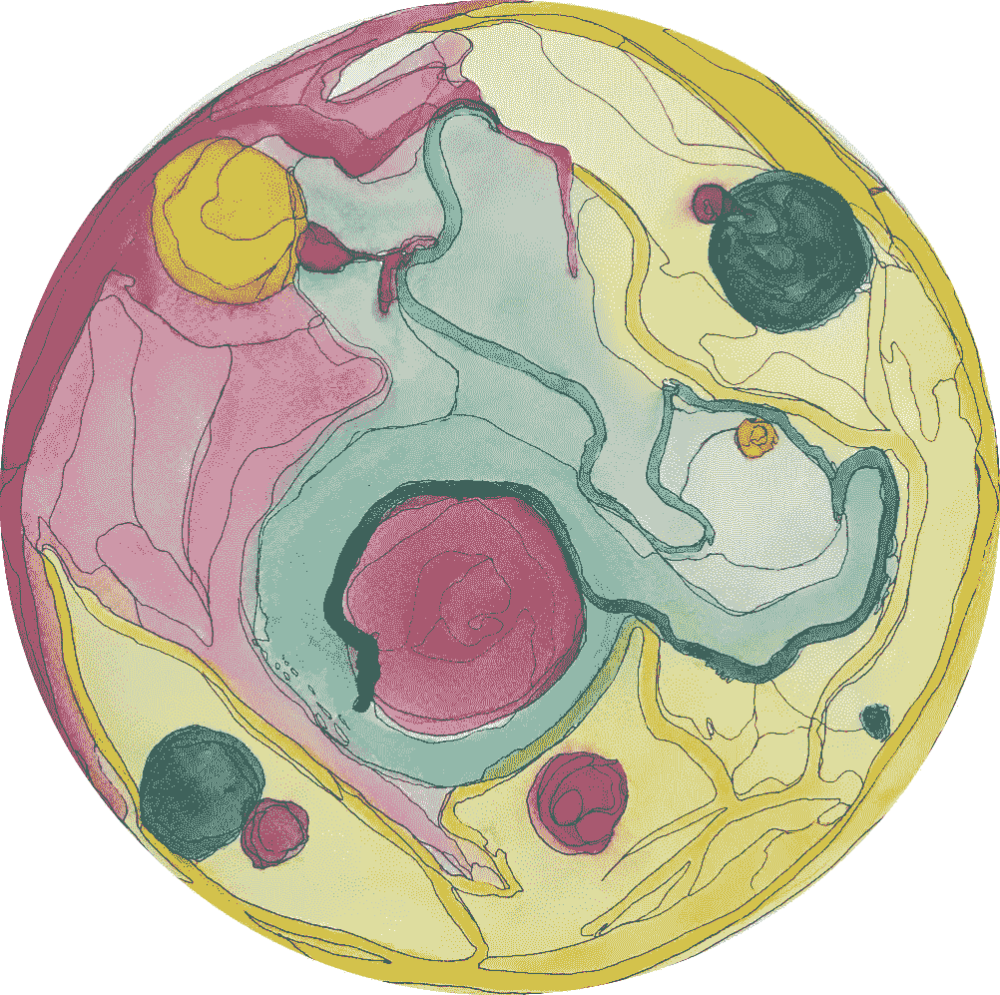
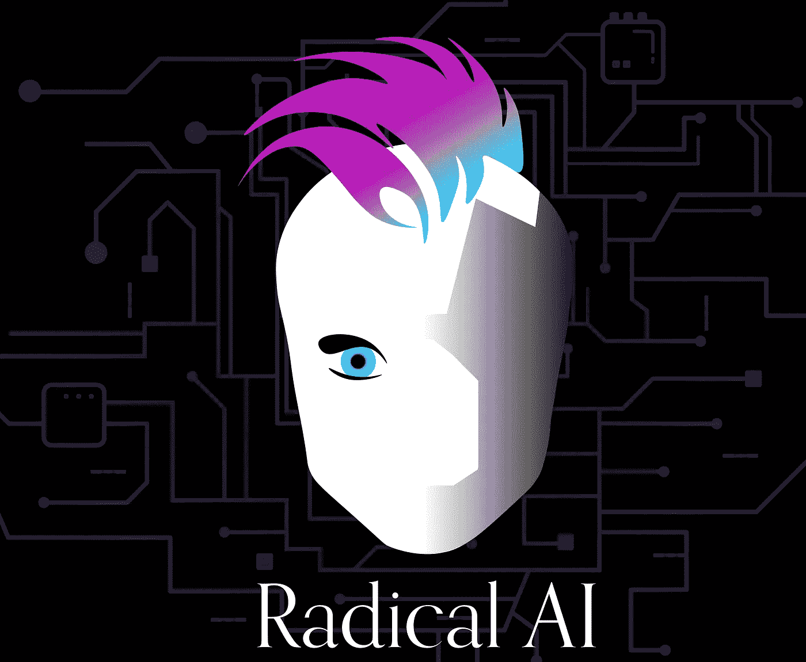
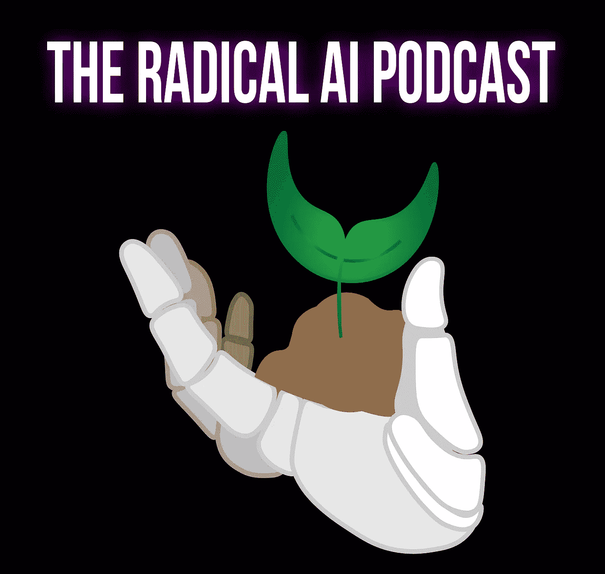

# 我主持了一个流行的人工智能伦理播客:我从商标设计失败中学到的 3 个教训

> 原文：<https://towardsdatascience.com/i-host-a-popular-ai-ethics-podcast-3-lessons-i-learned-from-failing-at-our-logo-design-d7ba6810b921?source=collection_archive---------80----------------------->

## 以及它们如何帮助你设计更道德的技术

我共同主持了一个流行的人工智能伦理播客，名为[“激进的人工智能播客”](http://radicalai.org)在我们发布后的第一个半月，我们收到了近 5000 次独立下载，在 iTunes 上的“新的和值得关注的”技术播客列表中排名很高。由于 Twitter 上人工智能伦理社区的惊人支持，我们得以采访全球人工智能伦理领域最具影响力的学者和行业领袖。

第一个标志

我们开始时是一个小项目，任务很简单，“创建一个吸引人的、专业的、有教育意义的和可访问的平台，集中产业和学院中边缘化或激进的声音，进行对话、合作和辩论，共同创造人工智能伦理领域。”我们预计只有几十个听众，并为此做了准备。我雇佣了一名博士生来设计我们的第一个标志，希望只有少数人能看到。这个标志适用于一个小项目，但我和我的共同主持人很快意识到我们需要一个新的标志，来代表我们对这个项目和我们试图提升的社区的未来的愿景。

我们雇佣了一位平面设计师，他是我的搭档，之前和他一起工作过，我们开始构思一个新的标志。一开始是一个快速的项目，很快就升级为我们关于技术、工业、平面设计和我们价值观的深度学习体验。本着脆弱性和教育的精神，我想和你们分享我在为我自己的流行播客创作标志的一个月的过程中所学到的三个教训。

## 第一课:语言很重要

播客的标题“激进的人工智能”首先出现在科罗拉多州博尔德的一家酒吧。大约两周前，在巴塞罗那的一次关于人工智能公平、问责和透明的会议(FAT*/FAccT 2020)上，我刚刚见过我即将成为的共同主持人，我们进行了后续会议，讨论我们的研究和联系。当我们坐下来喝啤酒时，很明显，我们不仅相处得很好，而且我们也对人工智能伦理在会议和媒体上的突出表现感到沮丧；即。它被著名的白人男性学者所控制。

根据我们的经验，我们知道，在人工智能伦理空间，特别是人工智能伦理播客中，历史上被强调的那些人，只代表了学术界和工业界从事开创性人工智能伦理工作的不可思议的人们的冰山一角。简单地说，我们有一个共同的挫败感，那就是即使在一个以道德为名的行业里，那些历史上被边缘化的人的故事(例如妇女、黑人、有色人种等等)仍然被如此骇人听闻地埋葬着。我在结束谈话时不假思索地说，“嗯，我在考虑开一个播客，这个播客是……因为没有更好的词，关于人工智能伦理的更激进的。”

大约一个星期后，我们再次见面进行计划，“激进的人工智能播客”诞生了。问题是，我们仍然不完全确定“激进”一词在我们工作的上下文中是什么意思。当我住在纽约市时，我来自一个社区组织和诗歌背景，我对我所说的“激进”有一些印象，但很难找到语言。这个项目既是一个提升优秀学者的采访空间，也是一个让我们收集一系列“激进人工智能”定义的空间。

当我们开始采访人们时，加利福尼亚的一个组织联系了我们，这个组织已经开始在“激进人工智能”的旗帜下组织起来我们会见了他们，不仅讨论了可能的合作伙伴关系，还想看看我们对“激进人工智能”的定义是否相似。他们的定义如下:激进的人工智能始于一个共同的理解，即社会分配权力不均衡——将有色人种、黑人、土著人、妇女、同性恋、穷人、残疾人和其他许多群体推向边缘。从这些根源开始，激进的人工智能研究了人工智能如何重新安排权力，并批判性地与激进的希望接触，即我们的社区可以梦想出不同的人/人工智能系统，帮助将权力放回到人们手中。

使用这个定义作为起点，我们开始计划我们的标志设计。我们希望设计具有包容性，代表我们希望提升的人民和价值观，并体现我们对权力再分配的呼吁。对我们来说不幸的是，这个起点没有考虑到“激进”可能具有的全部含义，我们即将犯下一个我们很快就会后悔的错误。

## 第二课:身份表示很重要

我们想要一个有着莫霍克发型的酷儿朋克雌雄同体机器人。你不能编造这些东西。杰斯和我都是白人，直男，身体健康。我们设计标志的第一步是告诉我们的平面设计师模仿尚未发布的《赛博朋克 3030》中的一个角色。让我们开门见山地说:**这是一个巨大的错误。我们拥有它。**

标志的尝试:巨大的失误版

我们的心肯定是好的。他们的想法是‘好吧，如果我们试图提升现状之外的身份，那就大胆地去做，把这些身份放在我们的标志中心。’不幸的是，正如许多通往地狱的道路一样，这条路是由良好的意愿铺成的。起初，我们看不到，我们不仅狭隘地定义了可能符合“激进”泡沫的身份，从而成为简化论者，我们还创造了我们都不代表的身份的品牌。

值得庆幸的是，在发布这个标志之前，我们与人工智能伦理领域的几位朋友和导师进行了交谈。我们可以很快看出他们对我们采取的方向不满意。他们很有帮助，诚实地指出了我们的盲点。特别是，他们有助于将“激进”的概念从任何一个群体或一组身份中分离出来，转而将其根植于我们植根于权力和共同价值观的原始定义中。

我们无意中让我们隐藏的偏见和对身份分组的假设妨碍了创建一个更具包容性的标志。所以我们又回到了起点。

## 第三课:有时候简单是最好的

我们与我们的设计师合作，回归到我们对激进人工智能的最初定义以及支撑它的价值观。从那里，我们确定了隐喻，代表了我们认为作为播客的基本项目。我们想出了诸如“奉献”、“播种”和“根除滥用权力的制度”等短语。然后我们想出了一些符号来概括这些隐喻，最后落在了:一只手、土壤和一棵树苗。当我们朝着最终形象努力时，我们有三个目标:

1.对于图像来说，帮助听众能够有空间来解释和定义自己的“激进的人工智能”。

2.标志代表了韧性和希望。

3.为标志要简单，而不是规定性的或过于复杂。

经过几周的反复，我们想出了下面的标志，这是现在激进的人工智能的标志:

标志马赫 3:我们结束了

我们喜欢这个标志是因为它简单，代表了我们的价值观，并创造了一种运动，弹性和希望的感觉。虽然我们对来自我们社区的反馈保持谦虚和开放的态度，但是到目前为止，我们已经收到了积极的反馈，并且对这个项目的结束感到满意。

## 结论:这和技术设计有什么关系？

在技术领域，我们经常忘记这三条经验: ***语言很重要，身份表示很重要，有时(通常)简单的解决方案是复杂问题的最佳解决方案。***

通过尝试、失败和从这个标志设计过程中的错误中学习，我意识到我们这些设计和消费技术的人把这些教训记在心里是多么重要。

道德的核心是关于我们如何将我们的价值观融入世界。这包括我们如何创造和消费技术。对于我们这些处于设计岗位或创造公共品牌岗位的人来说，我们必须对我们使用的语言、我们可能无意识地带入工作中的偏见、我们分享的图像对下游的影响，以及我们给简单可能更好的解决方案带来的复杂程度保持警惕。