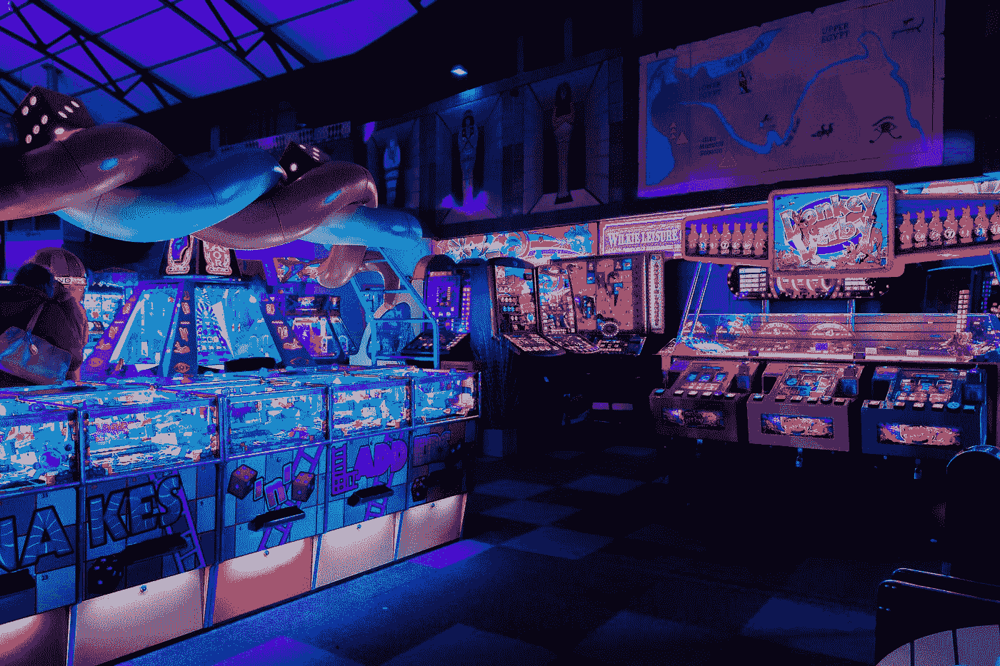
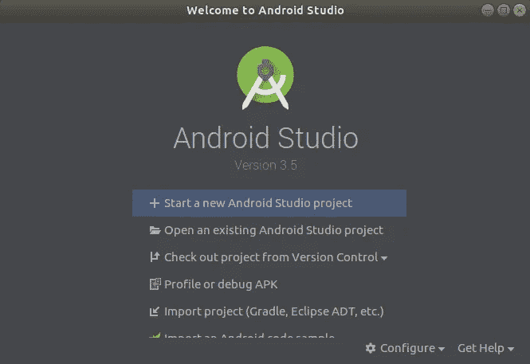
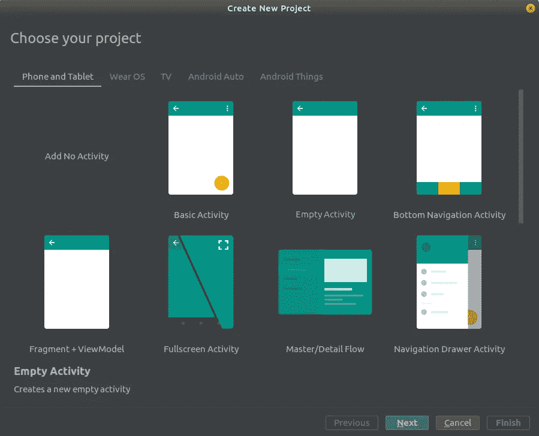
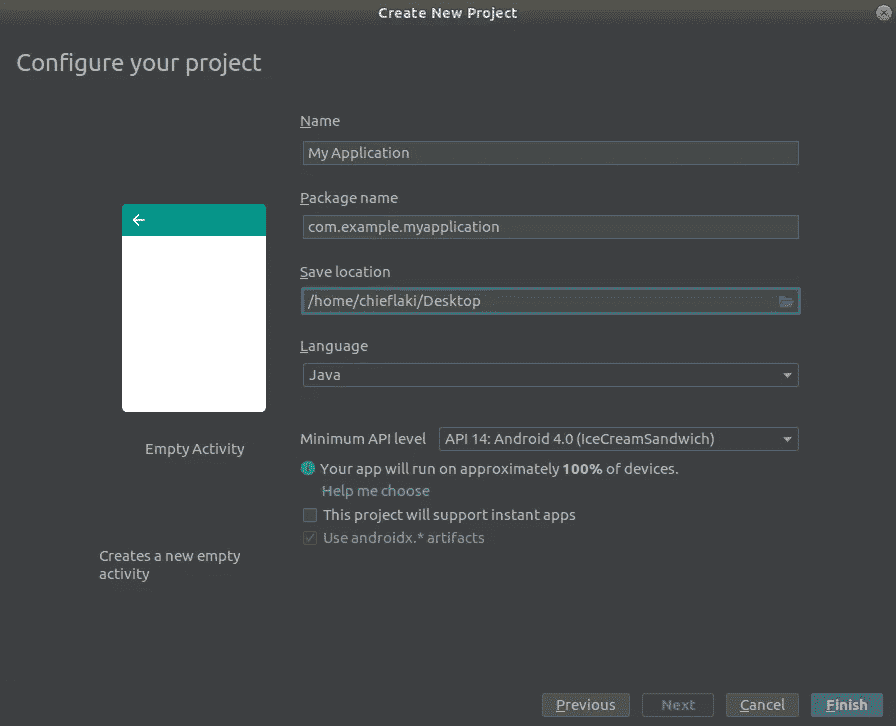
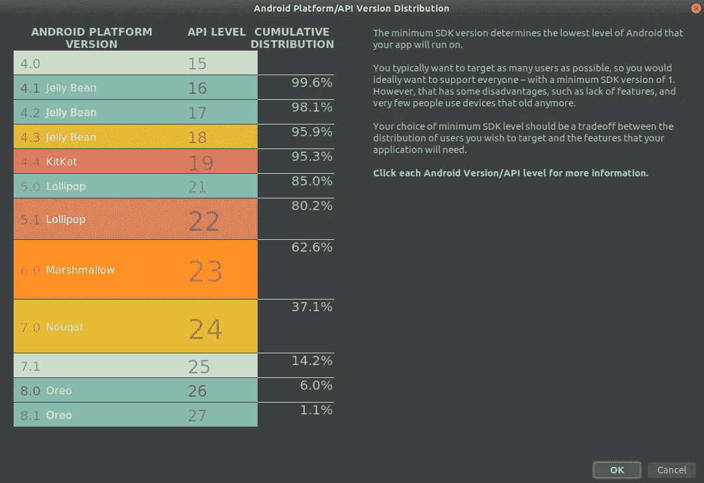
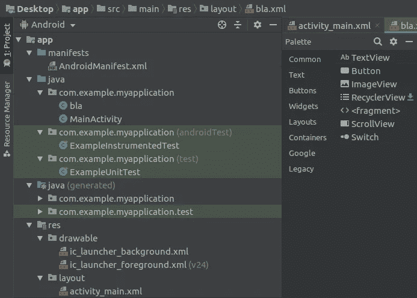
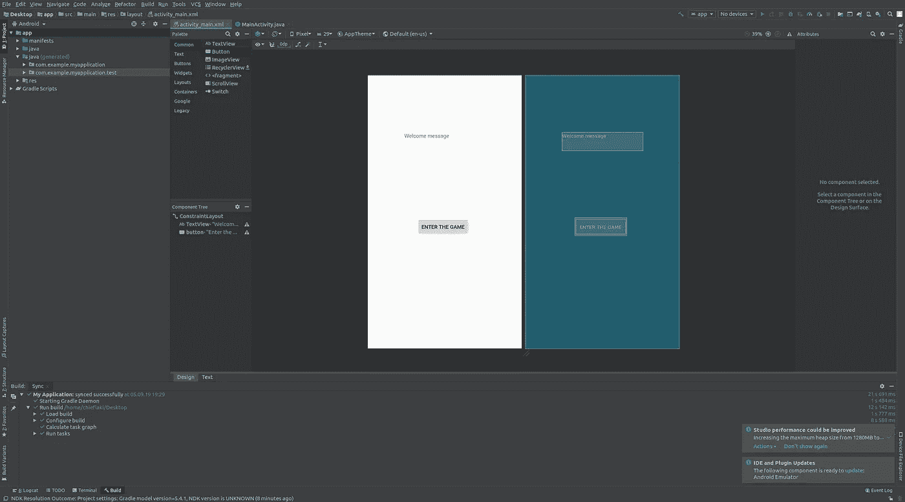
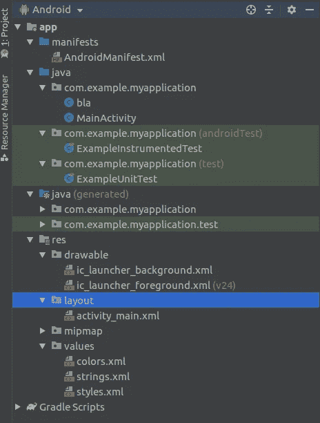
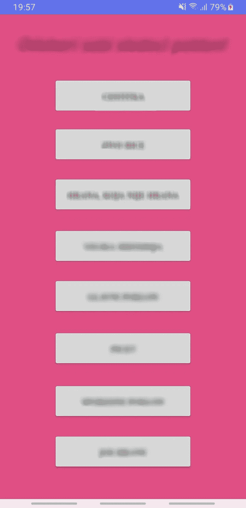

# 我为我的女朋友做了一个游戏作为我们周年纪念的礼物。你也能做到

> 原文：<https://towardsdatascience.com/i-made-a-game-6beb4d35593d?source=collection_archive---------18----------------------->

## 为你爱的人提供简单的应用程序

所以你决定为你爱的人创造一些神奇的东西，却对自己应该做什么毫无想法。好了，不要再看了，因为我要带你做你的第一个问答游戏，这让每个人都很惊讶。

当我和我女朋友的一周年纪念日即将到来时，我不得不想出一些非常好的东西。我是学计算机科学的，所以自然地，把我日常教育生活中的技能包括进来是有意义的。在思考这个问题的时候，我知道我想做一些和我们夫妻有关的东西，但也要有趣和容易“玩”

这是我想到的:

> 智能手机应用程序。小测验。奖励。

卡尔·劳在 [Unsplash](https://unsplash.com?utm_source=medium&utm_medium=referral) 上的照片

看起来很简单，对吧？实际上是。你的伴侣所要做的就是打开田地，做一个小谜语(这对你们的关系有意义)，然后你奖励他们一份礼物。

我们谈完了，让我们开始这个项目吧。

# 写下问题和奖励的想法

拿一张纸，立即开始写下你能想到的与你和他们有关的一切。开一些有趣的玩笑，但也要给神秘感留些空间，让他们猜猜会有什么回报。

这个礼物可以由许多小礼物组成，比如鲜花、项链、糖果等等。

# 应用程序本身

我在[安卓工作室](https://developer.android.com/studio)创建了这个应用。它可以免费使用，并且非常容易安装和设置。

## 创建新项目

Android Studio 的欢迎屏幕

打开 AS 时，启动一个新的 Android Studio 项目。

接下来它会问你，你想要什么样的项目，你应该从一个“空活动”开始。

项目类型

你可以给你的项目命名，选择位置，还可以告诉 AS，你想要哪个 android 版本，它会告诉你设备的兼容性。

项目配置

android 设备图表

当你设置好一切，点击完成，这就是全部，一个新的窗口将会打开，让你开始。

## 项目开始

一旦开始，就没有限制，工作室里的一切都是你可以使用的，你的想象力必须能够拓宽你的应用程序的视野，并获得令人惊叹的效果！

Android Studio 中至关重要的是 Pallete 和文件概述。

从调色板中添加元素并查看每个文件(活动、布局、字符串、图像……)。

就我的想法而言，我将提出以下几点:

## 欢迎屏幕

让他们有家的感觉，用一点信息告诉他们你有多爱他们，并添加一个按钮进入游戏。

此外，添加一个背景图片，使其更温暖。

当您转到另一个屏幕时，您应该创建一个新的活动，并且最好让它再次为空。

右键单击布局创建新布局。

## 恶作剧

问题领域。在屏幕上创建许多按钮，让他们点击后打开新的屏幕。和以前一样，打开新活动，只需创建一个新活动，并为其命名即可！

这是从我创建的应用程序和它可能会如何寻找你，但你可以自由创造自己的想法！

在礼物和问题中，可以隐藏在测验中的字段后面，你可以做的是放一条短消息，如果这是你喜欢的东西，就倾吐你的心声！

在短消息和告诉他们你有多爱他们之后，添加一些最喜欢的情侣照片作为幻灯片，这也很容易。

我没有深入这个想法的编码部分，但是如果你想让我写一篇更多的编码文章，请告诉我！
这里有一个[链接](https://youtu.be/_TgrWBZ40cs)到一个教程让你开始。
网上那么多教程，真的不难！

## 激励的遗言

如果这是你第一次编程，它可能会变得令人沮丧，不要担心，因为这是随之而来的。然而，保持决心，不要放弃。谷歌一切。

我希望你喜欢这个应用程序的想法，我希望你在做了一些很棒的东西后有一段美好的时光！