# 我为身为数据分析师的您撰写了这篇 SQL 学习入门文章

> 原文：<https://towardsdatascience.com/i-made-this-introductory-sql-learning-article-for-you-as-a-data-analyst-897c9e6a2cb6?source=collection_archive---------35----------------------->

## SQL 对于寻找数据分析师的职位仍然是重要和必要的

SQL(结构化查询语言)已经有几十年的历史了。SQL 听起来可能不像 Python 或 R 这两种更现代的流行编程语言那样花哨，但它一直是成为数据分析师的要求的一部分。

以下是数据分析师的工作要求。正如你所看到的，SQL 的丰富经验是这篇文章的必备条件。

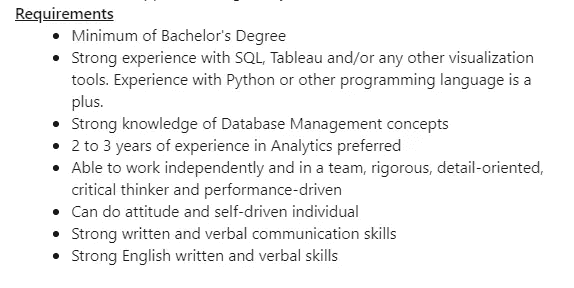

哪个公司的？

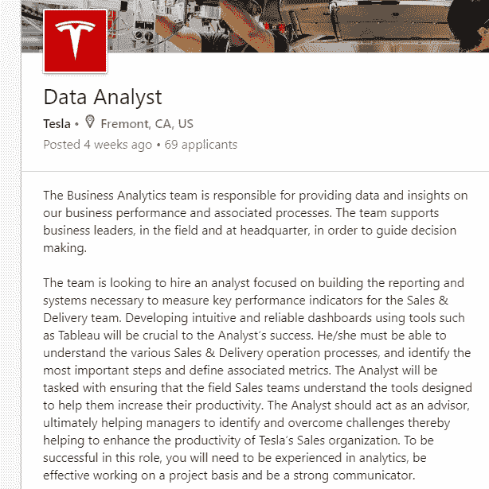

特斯拉。精通 SQL 让你有更高的机会成为许多大公司的一员。在 Linkedin 上，有超过 7100 条关于美国“SQL 数据分析师”的结果。

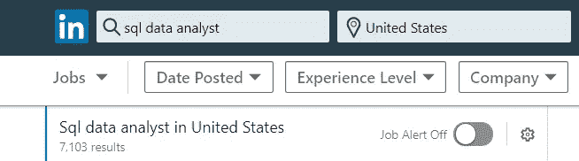

我相信这些图片已经足以证明 SQL 的重要性。凭借多年的 SQL 编码经验，我将在这里指导您如何在数据分析师级别使用 SQL。由于这篇文章是给没有任何先验知识的人看的，所以我会把一切都解释透彻。此外，我将只讨论查询和分析部分。因此，不会有 insert into/update/delete/alter table…语句。所有语句都以“Select”开头。

我们开始吧。


[Unsplash](https://unsplash.com/s/photos/sql-programming?utm_source=unsplash&utm_medium=referral&utm_content=creditCopyText) 上 [AltumCode](https://unsplash.com/@altumcode?utm_source=unsplash&utm_medium=referral&utm_content=creditCopyText) 拍摄的照片

展示的数据集来自卡格尔的学生饮酒量([链接](https://www.kaggle.com/uciml/student-alcohol-consumption))。模式名为“dataset”，表名为“student_mat”

# 基本的选择语句

要从表中查询记录，您需要知道哪个表中哪个列是必需的。因此，在每个用于查询的 SQL 语句中，您必须在语句中提供这样的信息。基本陈述是

```
SELECT * FROM dataset.student_mat;
```

这个声明有四个部分。第一部分是关键字`select`，用于从数据库中选择记录。第二部分是 select 子句，`*`。这部分是输入你要查询的列。`*`表示查询表中的所有列。第三部分是另一个关键字`from`，最后一部分是`from` 子句`dataset.student_mat`。最后一部分是输入表的名称。`dataset`是一个模式的名称。模式是表、视图等的集合。您可以将模式视为一组表，而`dataset`是这个组的名称。`student_mat`是表名。该语句末尾有一个分号`;`表示该语句结束。(尽管在一些 SQL 数据库系统中，并不要求以分号结尾，但在这里我只包括它。)我们可以将这条 SQL 语句解释为“查询模式“dataset”中表“student_mat”的所有列。”需要记住的一点是，关键字是不区分大小写的。因此`select`相当于`SELECT`或`Select`。

这个语句的结果将是这样的:

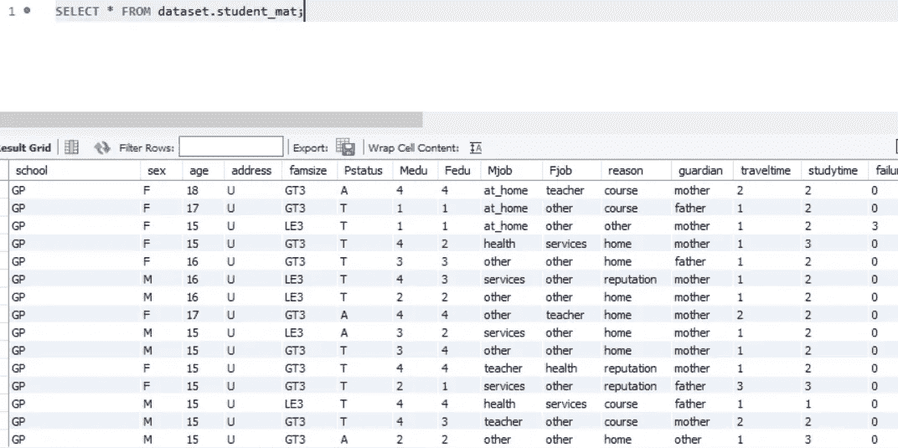

SELECT * FROM dataset . student _ mat；

如上所述，您可以用您想要的列名替换`*`。结果将只包括那些列。

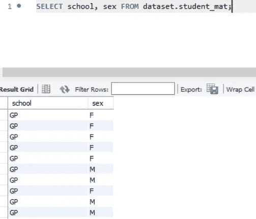

select 学校，性别 from dataset.student

# 有要求—在哪里

但是在大多数情况下，如果不是全部，您不希望查询表中的所有记录。您希望查询符合特定条件的记录。然后我们需要扩展 SQL 语句。`where`是你需要包含在语句中的内容。例如，我们希望查询学校是 GP 的表中的所有列。我们可以把前面的陈述扩展到

```
select * from dataset.student_mat **where school = 'GP';**
```

`where`是表示查询条件的关键字。`where`条款`school = 'GP'`是代表“学校等于‘GP’”的标准。。注意`GP`是用单引号引起来的。这对单引号对于作为标准值的字符串是必需的。如果标准值是数字，则没有引号，如下所示

```
select * from dataset.student_mat where age = 18;
```

结果将只包括符合条件的记录。

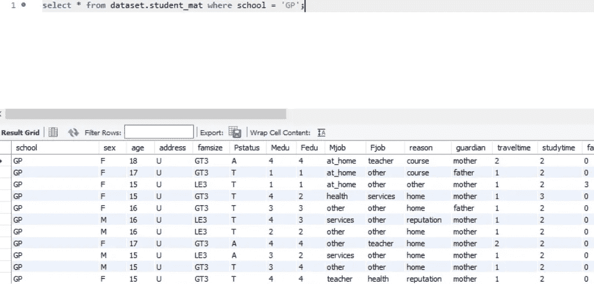

select * from dataset.student_mat 其中 school = ' GP

如果需要同时满足一个以上的标准，您可以用连接词`and`进一步扩展`where`子句。

```
select * from dataset.student_mat where school = 'GP' and sex = 'F';
```

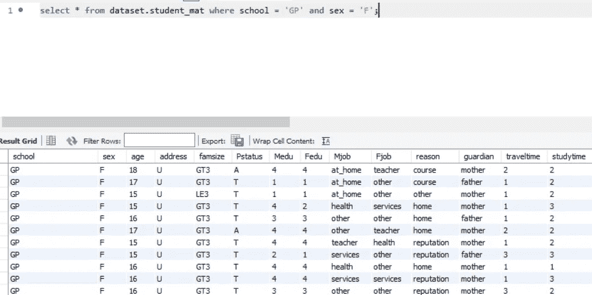

select * from dataset.student_mat 其中 school = 'GP '，sex = ' F

以上示例选择学校等于“GP”且性别等于“F”的记录。但是如果我们想要选择一个列不等于某个值的记录呢？那你应该改用`!= or <>`。在大多数数据库系统中，它们是等价的。个人比较喜欢`!=`。

```
select * from dataset.student_mat where school = 'GP' and sex != 'F';
```

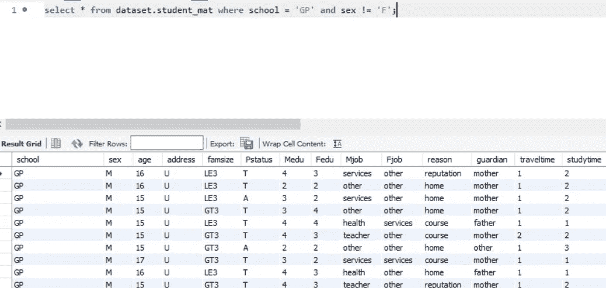

select * from dataset.student_mat 其中 school = 'GP '和 sex！= ' F

此外，如果您想要查询满足任一条件的记录，您可以使用连接词`or`而不是`and`。


select * from dataset.student_mat 其中 school = 'GP '或 sex！= ' F

如果您想要过滤具有多个标准值的列，而不是逐个创建并用`and`连接它们，您可以使用`in`来包含一列的所有标准值。

```
select * from dataset.student_mat where Mjob in ('health','other');
```

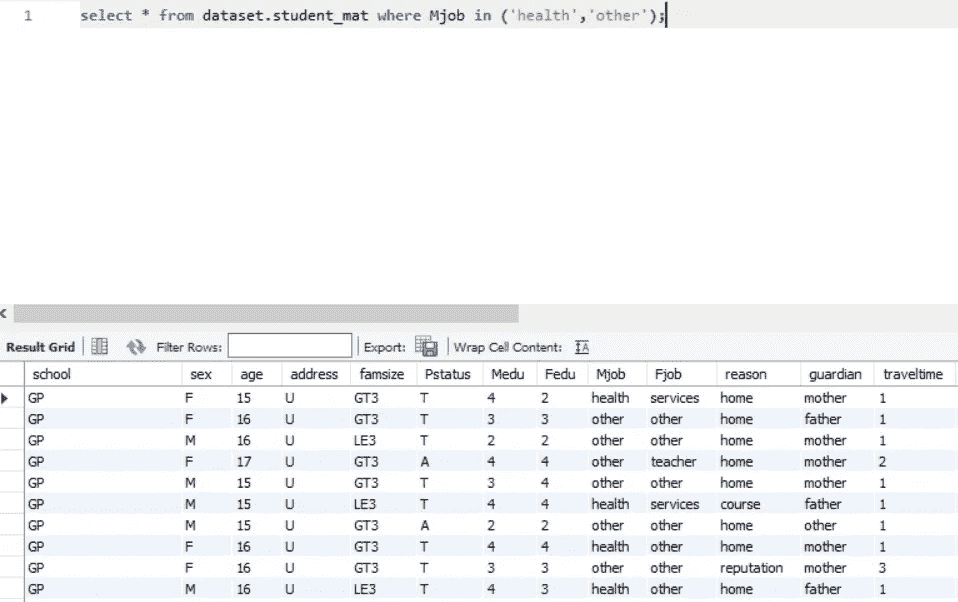

select * from dataset . student _ mat where Mjob in(' health '，' other ')；

对于数值标准值，除了使用`=`和`!=`外，还可以使用其他运算符`>, <, >= and <=`来构建标准。

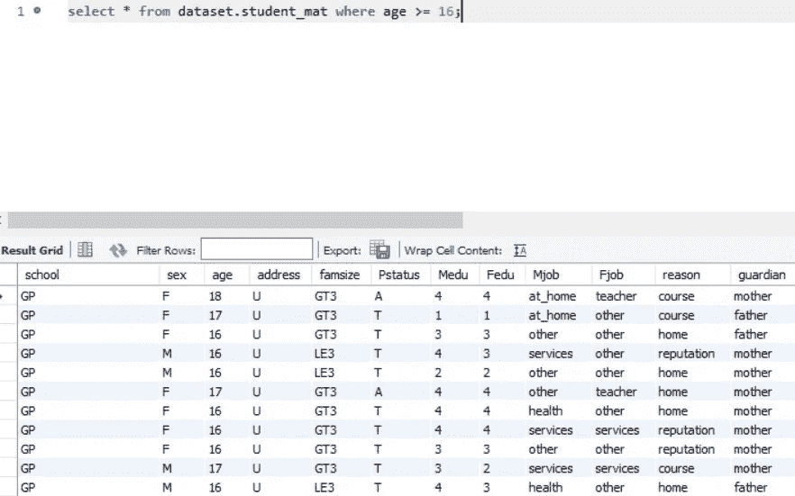

select * from dataset.student_mat 其中年龄> = 16；

您可能已经注意到，关键字可以用来将 SQL 语句分解成不同的部分。并且使用这些关键字的顺序受到限制。不能将`from`放在`select`之前或`where`之后。

下面显示了一个更复杂的标准条件的例子。

```
select * from dataset.student_mat where ((school = 'GP' and sex = 'F') or (school = 'MS' or age <18));
```

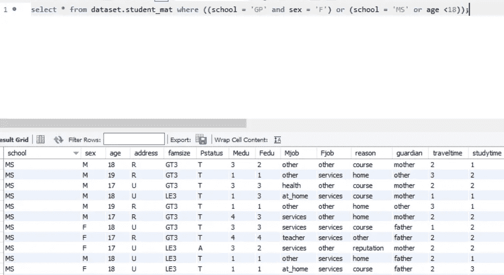

select * from dataset . student _ mat where((school = ' GP ' and sex = ' F ')or(school = ' MS ' or age < 18))；

但是，在某些情况下，您不能或没有提供准确的条件字符串值。相反，您希望使用特定的模式来过滤列，比如以特定的字符作为开头。然后您可以使用带有通配符的`like`操作符。通配符有两种类型，`%`和`_`。(在 Microsoft Access 中，它使用`*`和`?`。)与其解释如何使用`%`和`_`，我觉得不如直接去举例说明如何使用。

```
select * from dataset.student_mat where Mjob like 'o%';
```

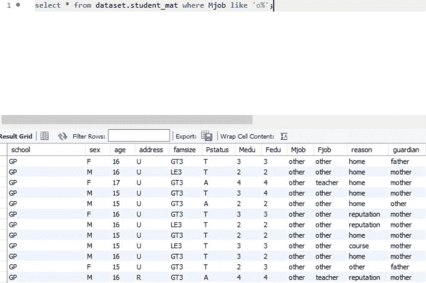

select * from dataset.student_mat 其中 Mjob like ' o %

在这个例子中，`where`子句是`Mjob like 'o%'`。`%`指一个、多个或空字符。该`where`子句表示选择 Mjob 列中值以“o”开头的所有记录，不管字母“o”后面有多少个或是否有任何字符。

```
select * from dataset.student_mat where Mjob like '%her';
```

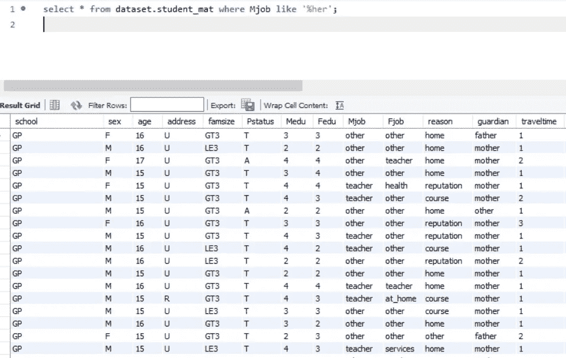

select * from dataset.student_mat 其中 m job like“% her”；

然后在这个例子中`Mjob like ‘%her’`过滤值以‘她’结尾的记录。所以“其他”和“教师”都包括在选择中。

此外，您可以将`%`放在字符中间，以便包含具有特定开始和结束字符的值。

一旦你理解了`%`，那么就很容易理解如何使用`_`。`%`和`_`的区别在于`_`只代表一个字符，而`%`代表一个、多个甚至空字符。

```
select * from dataset.student_mat where Mjob like 'o_h_r';
```

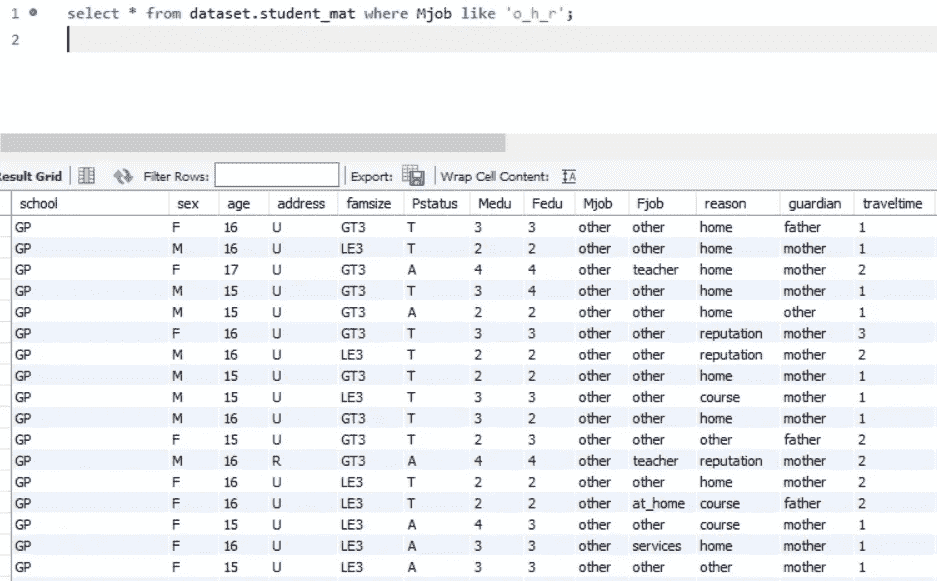

select * from dataset.student_mat 其中 Mjob like ' o _ h _ r

# 聚合-分组依据

SQL 的另一个常见应用是执行数据分析。我们更多的是在数据分组后进行数据分析。例如，您可能想知道表中每个学校的记录数，或者想知道每个性别的平均年龄。此时，您需要在 SQL 语句中包含`group by`。例如，如果您想知道每个学校的记录数量，分组级别是`school`，因此您必须在 SQL 语句中包含`group by school`。`group by`语句跟在`where`语句后面。而且，您必须在`select`子句中包含`school`才能返回每个组的名称(在本例中是学校)。

下一步是计算每组的记录数。对于这一部分，我们需要在`select`子句中包含一个聚合函数`count`。每个聚合函数后面都有一个花括号，其中包含此类聚合的列名。既然要算学校，可以在`select`语句中包含`count(school)`。但是，对于`count`函数，不需要指定要统计哪一列，因为选择哪一列没有区别。事实上，你甚至可以输入`count(1)`来计数。

```
select school, count(school) from dataset.student_mat group by school;
```

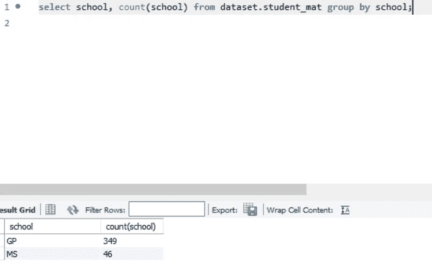

select school，count(school from dataset . student _ mat group by school；

结果显示了学校中每个组的记录数。

此外，我们可以将分组级别扩展到多个列。

```
select school, sex, count(school) from dataset.student_mat group by school, sex;
```

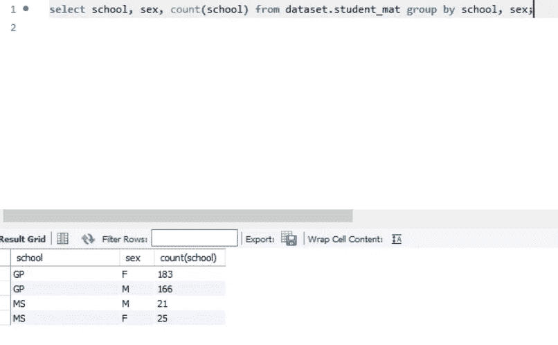

select 学校，性别，count(学校)from dataset.student_mat group by 学校，性别；

下面是您可以在`select`语句中使用的聚合函数:`count, max, min, sum, avg`。

```
select school, avg(age) from dataset.student_mat group by school;
```

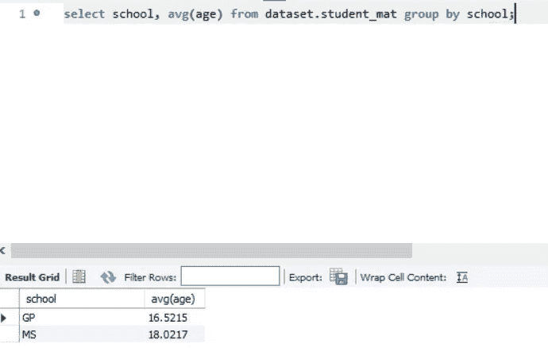

select school，avg(age)from dataset . student _ mat group by school；

# 别名—作为

正如您在前面的示例中看到的结果，平均年龄的列名变成了`avg(age)`。它仍然是可以自我解释的。但是当然，如果我们重命名这个列名就更好了。然后我们可以在`avg(age)`之后包含`as`，并给这个列取一个新名字。我们还可以修改`select`语句中其他列的名称。

```
select school as school_name, avg(age) as average_age from dataset.student_mat group by school;
```

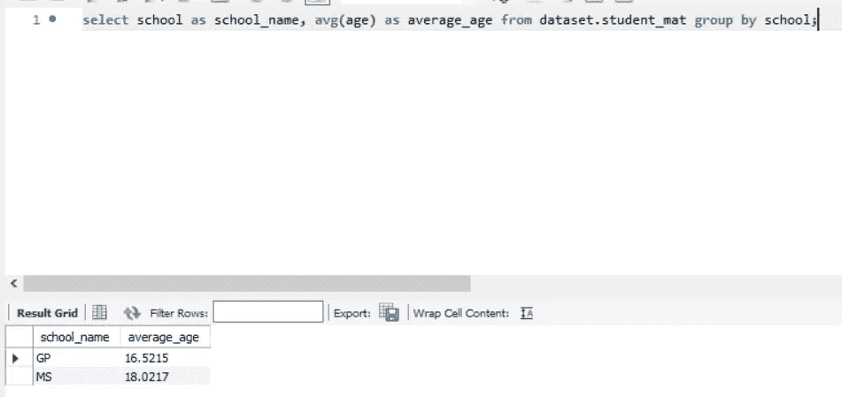

select school 作为 school_name，avg(age)作为 average _ age from dataset . student _ mat group by school；

我建议不要在列名中包含空格，因为这只会在您在`select`语句中进一步选择该列时带来麻烦。

# 排名—排序依据

`order by`语句帮助您按照一列或多列的升序或降序对返回的数据进行排序。默认顺序是升序，因此不需要指定。如果要按降序排序，必须在`order by`语句中的列名后面加上`desc`。

```
select school as school_name, sex, count(school) as num_count 
from dataset.student_mat group by school, sex order by school, sex desc;
```

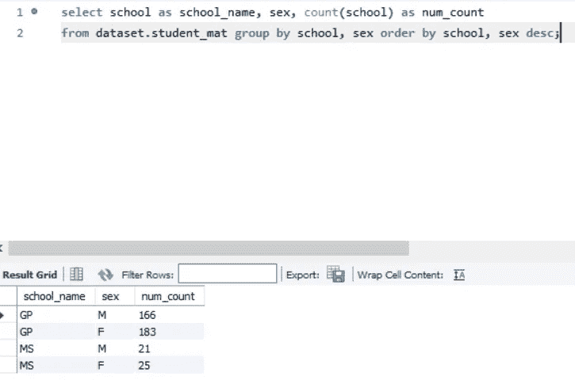

select school as school_name，sex，count(学校)as num _ count
from dataset . student _ mat group by school，sex order by school，sex desc；

`order by`语句是`order by school, sex desc`。因此，返回的结果第一个订单列`school`由于没有指定而被升序排列。然后`sex`降序排列。结果是，(GP，M)在(GP，F)之前，而(GP，F)在(MS，M)之前。

到目前为止，我已经讲述了 SQL 在查询和数据分析方面的基本用法。对于一个完全没有 SQL 经验的初学者来说，我相信这篇文章可以帮助你毫无困难地快速学习基本的 SQL 应用。请告诉我这篇文章是否对你有所帮助，或者你是否想进一步了解其他 SQL 用法，比如 join、having 或 window 函数。下次见。