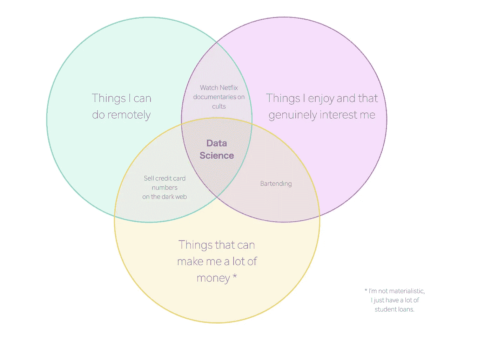

# 我从没想过我会有这种顿悟。

> 原文：<https://towardsdatascience.com/i-never-thought-i-would-have-this-epiphany-b0a4b6f86e90?source=collection_archive---------39----------------------->

## 我为什么选择数据科学。

当我发现数据科学时，我觉得这个世界一直在向我隐瞒一个奇怪的秘密。为什么没人给我发短信说，

“森林！听我说。如果你正在寻找一份职业，可以将你对重复、平凡任务的热爱(让我们面对现实吧——预处理数据很乏味，但我真的很喜欢它)与你对解释复杂主题的热爱(我是一名数学教师，曾在苹果公司担任 iOS 技术支持)结合起来，并渴望将你的技术能力用于实际上可以改变世界的项目，然后成为一名数据科学家。”

不幸的是，我没有收到这样的信息，不得不自己得出这个结论。

我最大的挣扎之一一直是试图找出我在“职业世界”中的位置。大学毕业后，我放弃了我的职业生涯，因为虽然它有技术方面(金融分析师)，但它从来没有真正的人的方面。此外，我觉得如果我把剩下的时间都花在通勤上班上，我会疯掉的。

我想要一份工作:

*   我可以利用位置独立性。
*   解决了独特而有趣的问题。
*   允许我在一段时间里做内向的自己。
*   但也给我留下了足够的空间，让我以一种有意义的方式与他人互动。
*   触及了广泛的独特而有趣的问题。
*   哦，而且薪水很高。什么？想把包包安全，没有错。

如果我列举我在寻找这个神秘职业时走过的所有兔子路，那真的会很无聊，但是让我们说这个发现来之不易。

# 好吧，酷。

所以我发现了数据科学——你不能打个响指就得到你的第一个角色(不幸的是——有人在研究这个吗？).我的兴趣是一致的，但是唉，我的技能不是。

还好！大约在同一时间，我还发现了“新兵训练营”。具体来说，我发现了 Flatiron 为期五个月的全职、完全远程数据科学训练营。

新兵训练营有不同的观点，如果我不得不猜测的话，你的观点可能与你的学习风格相对应。对于那些说“训练营毫无意义”的人来说！你可以通过网上的免费资源学到你需要的一切！!"

你 100%正确！不幸的是，为了浏览大量的材料，我需要一点结构来学习。熨斗是完美的组合，因为当我们每天上课时(不是强制性的！)和每周与我们的讲师进行交流，这或多或少是一门非常自学的课程。就像戴着保险杠去打保龄球一样。

# 课程。

总共五个月，我们涵盖了…..很多。

我们首先介绍了 SQL 和 Python，重点是 Python。我们了解了数据科学中使用的主要库(Pandas、NumPy、Seaborn、MatplotLib、ScitkitLearn)，以及如何有效地使用和导航 GitHub。

然后我们有了一个完整的统计单元！思考:A/B 测试、统计分布、概率论、线性回归等。

然后我们进入了课程的核心部分:机器学习。这对我来说是最令人兴奋的部分，当我真正开始感觉到生活很快就会变成什么样子。

在介绍了机器学习中使用的基本模型后，我们过渡到了“大数据”、深度学习和 NLP。

在整个课程中，我完成了近 200 个实验，5 个使用真实世界数据集的项目，阅读了无数关于数据科学的课程和文章，并观看了更多关于梯度下降和神经网络的视频，我不想一一列举。

总体来说？太棒了。

# 现在。

现在吗？我已经开始了这个过程中最无趣的部分:找工作。

在早期，这绝对是一个挑战。人际关系从来都不是我的强项，我肯定也在和自己的冒名顶替综合症做斗争，但我正在学会相信这个过程，相信完美的职位会出现——是的，即使是在 COVID 时代。

会的。总是这样。

感谢阅读。更多的技术文章和操作方法正在准备中。

🌲🌲🌲(森林)