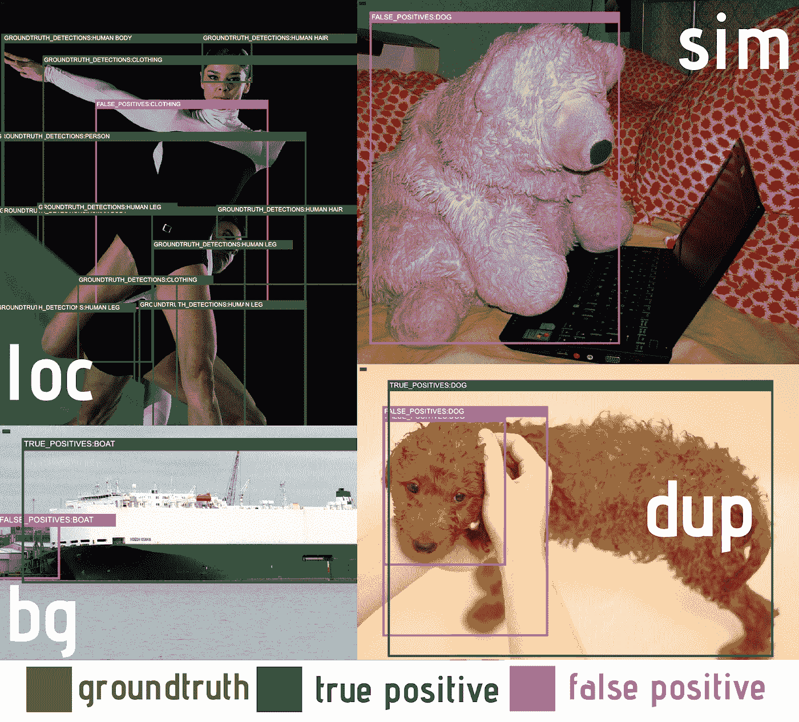
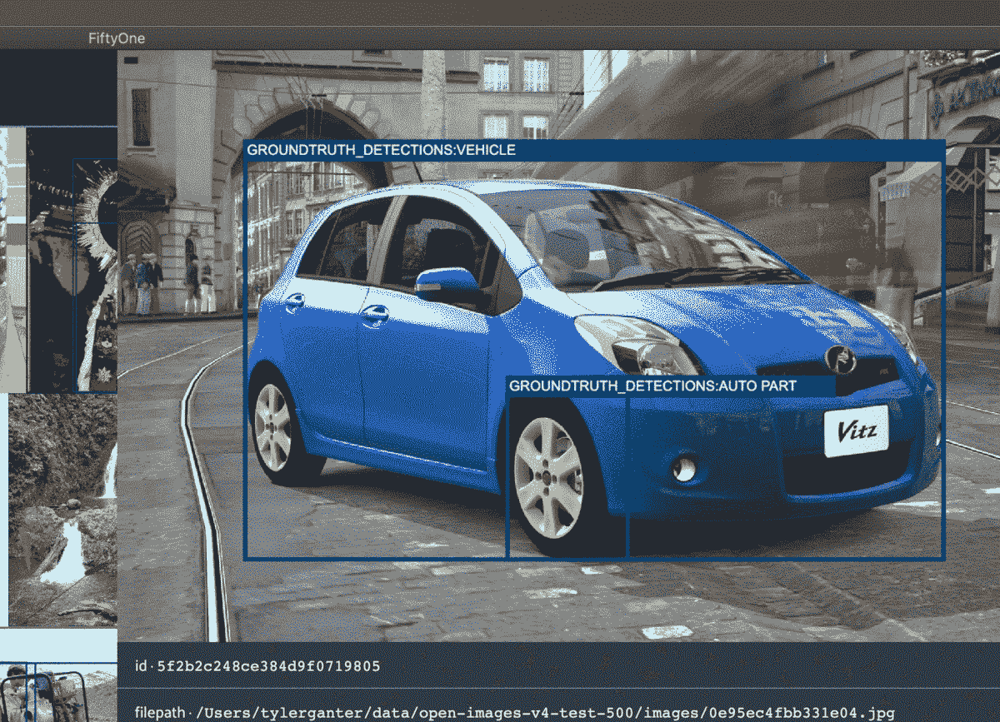
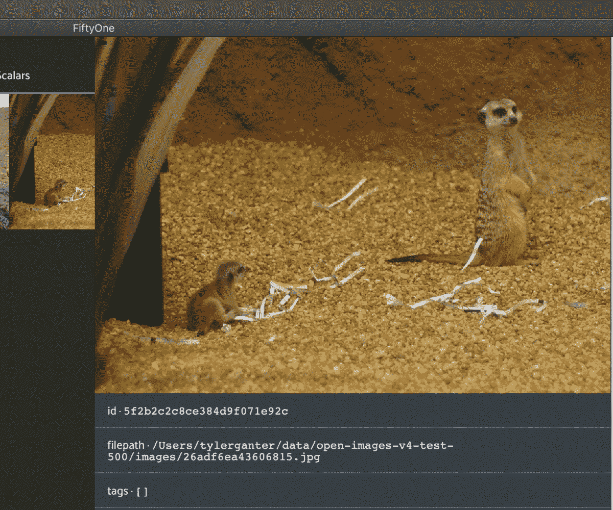
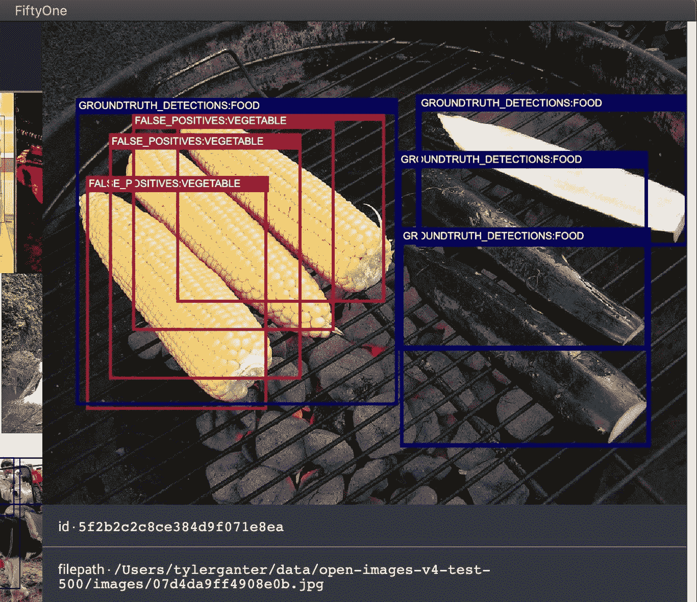
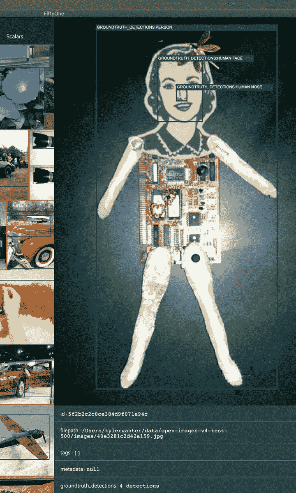
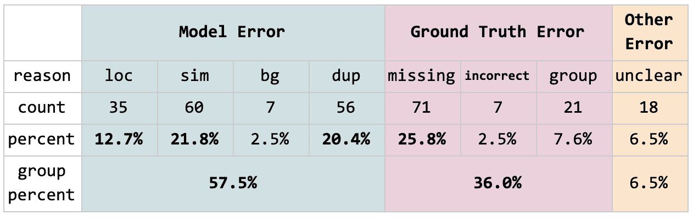

# 我对谷歌的开放图像数据集进行了错误分析，现在我有了信任问题

> 原文：<https://towardsdatascience.com/i-performed-error-analysis-on-open-images-and-now-i-have-trust-issues-89080e03ba09?source=collection_archive---------32----------------------->

## 深入分析

## 我用 SOTA 物体检测模型重新评估开放图像，结果发现超过 1/3 的假阳性是注释错误！

在[开放图像数据集](https://storage.googleapis.com/openimages/web/index.html)上由于缺少地面实况而导致假阳性的例子

# 现代基准数据集

随着在大规模数据集上训练的深度学习模型的性能不断进步，大规模数据集竞赛已经成为最新和最伟大的计算机视觉模型的试验场。从 MNIST(只有 70，000 张 28x28 像素图像的数据集)成为事实上的标准的时代开始，我们作为一个社区已经走过了漫长的道路。为了训练更复杂的模型来解决更具挑战性的任务，新的、更大的数据集应运而生:ImageNet、COCO 和谷歌的 Open Images 是最受欢迎的。

但即使在这些庞大的数据集上，顶级模型的性能差异也在缩小。 [2019 开放图像检测挑战赛](https://www.kaggle.com/c/open-images-2019-object-detection/leaderboard)显示，前五名团队在[平均精度](https://medium.com/@jonathan_hui/map-mean-average-precision-for-object-detection-45c121a31173)(地图)中的差距不到 0.06。对于 COCO 来说就更少了。

毫无疑问，我们的研究团体在开发创新的新技术以提高模型性能方面做出了贡献，但模型只是图片的一半。最近的发现越来越清楚地表明，另一半——数据——至少起着同样重要的作用，甚至可能更大。

就在今年…

*   …谷歌和 DeepMind [的研究人员重新评估了 ImageNet](https://syncedreview.com/2020/06/23/google-deepmind-researchers-revamp-imagenet/) ，他们的发现表明，最近的发展甚至可能没有找到有意义的概括，而只是过度适应了 ImageNet 标签程序的特质。
*   …麻省理工学院[在一篇论文揭露了 8000 万张图片中的一部分包含种族主义和厌恶女性的诽谤之后，已经对这个微小的图片数据集](https://thenextweb.com/neural/2020/07/01/mit-removes-huge-dataset-that-teaches-ai-systems-to-use-racist-misogynistic-slurs/)进行了横向绘制。
*   …分别来自斯坦福和谷歌的 Jo 和 Gebru】认为需要通过类比更成熟的数据归档程序，将更多注意力放在数据收集和注释程序上。
*   …来自加州大学伯克利分校和微软[的研究人员进行了一项研究](https://openaccess.thecvf.com/content_CVPRW_2020/html/w56/Rao_Quality_and_Relevance_Metrics_for_Selection_of_Multimodal_Pretraining_Data_CVPRW_2020_paper.html)表明，当使用自我监督的预训练时，人们可以通过关注第三个轴*数据本身*，而不是关注网络架构或任务/损失选择，来实现下游任务的收益。套用一句话:关注数据不仅是一个好主意，在 2020 年这还是一个新颖的想法！

这是该领域的两位领导者对此的看法:

*   *“在构建实际系统的过程中，通常有更多的人工错误分析和更多的人类洞察力进入这些系统，这比深度学习研究人员有时愿意承认的要多。”* —吴恩达
*   “*与数据*融为一体”——安德烈·卡帕西在[他关于训练神经网络的热门文章](http://karpathy.github.io/2019/04/25/recipe/)

有多少次你发现自己要花费数小时、数天、数周的时间在数据中寻找样本？您是否对人工检查的必要性感到惊讶？或者你能想出一个比你应该相信的更多的时候吗？

计算机视觉社区开始意识到我们需要接近数据。如果我们想要行为符合预期的精确模型，光有大型数据集是不够的；它需要*正确的数据*并且需要*准确的*标记。

每年，研究人员都在争夺登上排行榜榜首的机会，而决定命运的是极其微弱的差距。但是我们真的知道这些数据集发生了什么吗？地图上 0.01 的空白有意义吗？

# 开放图像数据集上的误差分析

随着[另一个开放图像挑战](https://www.kaggle.com/c/open-images-object-detection-rvc-2020)刚刚结束，调查这个流行的基准数据集并尝试更好地理解具有高 mAP 的对象检测模型意味着什么似乎是唯一合适的。因此，我决定对一个预训练模型进行一些基本的错误分析，目的是观察数据集环境中的错误模式，而不是模型。令我惊讶的是，我发现这些错误中有很大一部分实际上并不是错误；相反，数据集注释是不正确的！

## 什么是错误分析？

误差分析是手动检查模型预测误差的过程，在评估期间识别，并记录误差的原因。你不需要看整个数据集，但至少有足够多的例子知道你在正确地逼近一个趋势；假设最少 100 个样品。打开一个电子表格，或者抓起一张纸，开始记笔记。

为什么要这么做？也许你的模型所处理的大部分图像都是低分辨率或者光线不足。如果是这种情况，向训练集添加更多高分辨率的明亮图像不太可能表现为模型准确性的显著提高。数据集的任何数量的其他定性特征都可能起作用；找出答案的唯一方法就是分析你的数据！

## 准备分析

我使用[这个快速 CNN+InceptionResNetV2](https://tfhub.dev/google/faster_rcnn/openimages_v4/inception_resnet_v2/1) 网络在[开放图像 V4](https://storage.googleapis.com/openimages/web/factsfigures_v4.html) 测试集上生成了预测。这个网络似乎是一个理想的选择，因为它是在开放图像 V4 上训练和评估的，具有相对较高的 0.58 的 mAP，并且公众可以通过 [Tensorflow Hub](https://tfhub.dev/) 轻松获得。然后我需要单独评估每张图片。

Open Images 使用[一种复杂的评估协议](https://storage.googleapis.com/openimages/web/evaluation.html)，考虑等级、分组，甚至指定已知存在和已知不存在的类别。尽管有专门支持开放图像评估的 [Tensorflow 对象检测 API](https://github.com/tensorflow/models/blob/master/research/object_detection/g3doc/challenge_evaluation.md) 可用，但需要[一些重要的代码](https://github.com/voxel51/fiftyone/blob/develop/docs/source/tutorials/open_images_eval/error_analysis/evaluation.py)来获得每张图像的评估结果。为什么这个不是原生支持的？无论如何，我最终能够准确地确定每个图像的检测是真阳性还是假阳性。

我决定过滤检测，只查看那些置信度> 0.4 的检测。这个阈值大概就是真阳性数量超过假阳性数量的点。

## 错误类型

该分析的结构受到了 2012 年的一项研究[的启发](http://dhoiem.cs.illinois.edu/projects/detectionAnalysis/)，该研究采用了两个最先进的(当时的)检测器并进行手动误差分析。Hoiem 的小组创建了诸如定位错误、语义相似对象混淆和背景误报等类别，但有趣的是没有任何与地面真实错误相关的内容！

我把误差的原因分成三组:模型误差、地面真实误差和其他误差，每一组都有一些特定的误差原因。接下来的部分定义了这些特定的错误并提供了示例，以便在我们查看错误分析的汇总结果之前提供上下文。

## 模型误差

模型误差是 Hoiem 的论文建立的一组常见误差，许多研究人员随后在他们自己的出版物中使用了这些误差。我在这里做了一个小小的修改，删除了“其他”错误，并添加了“重复”错误，这是“本地化”错误的一部分。

*   **loc:** 定位错误，即 [IoU](https://en.wikipedia.org/wiki/Jaccard_index) 低于阈值 0.5
*   语义相似对象的混淆
*   背景:与背景混淆
*   **dup:** 重复框，表示定位错误和真阳性都存在；这是从**锁定**中分离出来的一个类别，因为它被认为是一种非常常见的错误

模型误差的例子。左上:没有捕捉袖子的服装盒的定位错误。右上:与语义相似的物体混淆，因为一个填充动物被误认为是一只*狗*。左下:与背景混淆，被误认为是船。右下:两个重复的狗盒子围绕着同一只狗，定位错误。

## 地面真实误差

基本事实错误是假阳性的原因，其“错误”在于注记，而不是模型预测。如果这些被纠正，它们将被重新分配为真阳性。

*   **缺失:**基础真相框应该存在，但不存在
*   **不正确:**基本事实框存在，但标签不正确，或者在标签层次结构中不够具体
*   **组:**地面真相框应标记为组，但不是

一个**缺少基础事实**的例子，汽车的后轮清晰可见，模型检测到了它，但是由于缺少基础事实，这被错误地标记为假阳性。

一个**不正确基本事实标签**的例子；在这种情况下，基本事实标签不够具体。这些猫鼬的真实标签是*动物*，站在右边的猫鼬的预测是*食肉动物。* *食肉动物*技术上是正确的。基本事实不够具体。

**群错**的一个例子。玉米上的四个预测中的三个被正确定位并标记为*蔬菜*盒。(第四个是一个 **dup** )。然而，地面真相是围绕所有三个部分的一个单独的盒子。要修复这个注释，需要将地面真实边界框标记为一个组，或者用三个单独的框替换它，就像对右边的西葫芦所做的那样。

## 其他错误

最后，我们有**不清楚的错误**，这意味着边缘情况，预测是否正确并不明显。

*   **不清楚:**模型错误？地面真实误差？问十个不同的人，你会得到十个不同的答案

幸运的是，这一类别仅占大约 6.5%的错误，但仍然需要注意的是，当试图创建一个可以对世界上的一切进行分类的标签层次结构时，总会有像这个模型预测为*玩具*的 circuit lady 这样的边缘情况。

你认为这是一个玩具吗？一个“责任”不清的错误例子

## 汇总结果

下表显示了对总共 125，436 个测试图像中的 178 个图像子集的分析结果。

由在开放图像 V4 测试集上的快速 CNN 对象检测模型检测的 275 个假阳性边界框的误差分析的结果。

这太疯狂了。36%的假阳性其实应该是真阳性！目前还不清楚这会对 mAP 产生什么影响，因为它是一个相当复杂的指标，但是可以肯定地说，官方报告的 mAP 0.58 低估了该模型的真实性能。

最常见的错误原因是缺少基本事实注释，占所有错误的 30%以上。这是一个具有挑战性的问题。要求一个没有丢失盒子的数据集是不现实的。许多这些缺失的注释是外围对象，而不是图像的中心焦点。但是这仅仅强调了需要容易的，可能是自动化的，将通过额外一轮审查的注释的识别。还有其他的含义。外围物体一般较小；当分割成小/中/大的边界框大小时，这些缺失的注释如何影响精确度？

其他一些错误原因——特别是重复的边界框、不正确的基本事实标签和组错误——表明了标注本体和标注协议的重要性。复杂的标签层次会导致不正确的地面真实标签，尽管这项研究表明开放图像并非如此。处理组是需要仔细定义和审查的另一个复杂因素；虽然不像其他错误原因那样普遍，但 7.6%是由于应该被标记为一个组的盒子引起的，这当然不是微不足道的。最后，重复的边界框至少部分可能是扩展层次结构的副产品。在开放图像对象检测挑战中，模型的任务是为分层结构中的每个标签生成边界框。例如，对于一个包含美洲虎的图像，开放图像挑战赛希望不仅能为*美洲虎*，还能为*食肉动物*、*哺乳动物*和*动物*生成盒子。这会不会无意中导致一个模型为同一个动物生成多个 *Jaguar* 盒子？[更快的 RCNN](https://arxiv.org/abs/1506.01497) 在区域建议后应用分类作为后处理步骤。因此，如果模型被训练为它看到的每只美洲虎生成四个盒子，那么这四个盒子有时获得相同的分类标签就不足为奇了。

# 下一步是什么？

如果这些基本事实错误得到纠正，开放图像排行榜会发生什么变化？这如何影响我们对什么策略最有效的理解？

应该注意的是，这些误差不仅仅是统计噪声。与 DeepMind 团队分析 ImageNet 的发现类似，开放图像中的注释错误也存在模式。例如，缺少人脸注释是误报的一个非常常见的原因，而树周围的边界框通常应该被标记为组，但实际上却不是。

这篇文章的目的不是批评开放图像的创造者——相反，这个数据集及其相应的挑战催生了巨大的成就——而是揭示了一个可能阻碍进步的盲点。这些流行的开放数据集的影响是深远的，因为它们经常被用作微调/迁移学习的起点。此外，如果流行的数据集受到注释正确性的困扰，那么在检查我们自己的数据集时，我们很可能会遇到同样的问题。但我肯定不是凭经验说的……*咳咳*

我们正处于重心转移的最前沿，数据本身被理所当然地认为与基于数据的模型同等重要，甚至更重要！也许我们会看到更小、更仔细管理的数据集越来越受欢迎，或者对主动或半监督学习等方法的需求越来越多，这些方法允许我们自动化和扩展注释工作。无论哪种方式，一个关键的挑战将是创建基础设施来管理动态数据集，这些数据集的规模会增长，并根据人类和机器学习模型的反馈而发展。这个新生的话题有很大的潜力！

# 可视化对象检测数据集

为了进行这项错误分析研究，我使用了 [Voxel51](https://voxel51.com/) 的数据可视化工具 [FiftyOne](https://voxel51.com/fiftyone/) ，这是一个 Python 包，可以非常容易地加载数据集，并通过代码和可视化应用程序交互式搜索和探索它们。下面是我在这项研究中执行错误分析时运行的 51 个代码:

想亲自探索这些数据吗？[下载到这里](https://voxel51.com/downloads/fiftyone/tutorials/open-images-v4-test-500.zip)！

想要在开放图像上评估自己的模型吗？[试试这个教程](https://voxel51.com/docs/fiftyone/tutorials/open_images_evaluation.html)！

想了解有关检查可视化数据集的最佳实践的更多信息吗？[看看这个帖子](https://medium.com/voxel51/visualizing-object-detections-9d0ed766297c)！

# 参考

[1] L. Beyer 等人，[我们对 ImageNet 的使用结束了吗？](https://arxiv.org/abs/2006.07159) (2020)

[2] V. Prabhu 和 A Birhane，[大型图像数据集:计算机视觉得不偿失的胜利？](https://arxiv.org/abs/2006.16923) (2020)

[3] E. Jo 和 T. Gebru，[来自档案的教训:在机器学习中收集社会文化数据的策略](https://arxiv.org/abs/1912.10389) (2020)，公平、问责和透明度会议

[4]R . Rao 等人，[多模态预训练数据选择的质量和相关性度量](https://openaccess.thecvf.com/content_CVPRW_2020/html/w56/Rao_Quality_and_Relevance_Metrics_for_Selection_of_Multimodal_Pretraining_Data_CVPRW_2020_paper.html) (2020)，计算机视觉和模式识别会议(CVPR)研讨会

[5] D. Hoiem 等人，[物体检测器的错误诊断](http://dhoiem.cs.illinois.edu/projects/detectionAnalysis/) (2012)，欧洲计算机视觉会议(ECCV)

[6] S. Ren 等，[更快的 R-CNN:利用区域提议网络实现实时目标检测](https://arxiv.org/abs/1506.01497) (2015)，神经信息处理系统进展(NeurIPS)