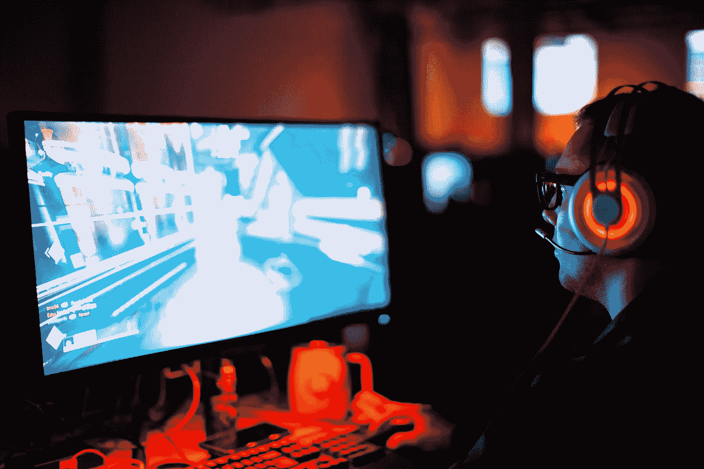
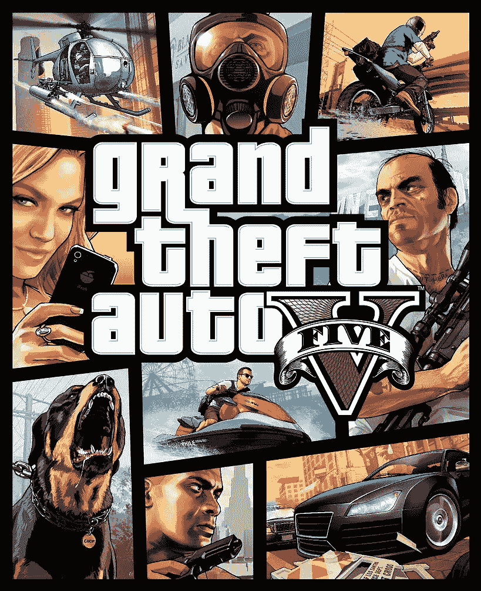

# 视频游戏如何为人工智能应用提供优质数据

> 原文：<https://towardsdatascience.com/i-play-video-games-but-not-for-entertainment-c20d28d998bf?source=collection_archive---------47----------------------->

## 当视频游戏被用作改善人工智能和机器学习应用的工具时

照片由[肖恩·多](https://unsplash.com/@everywheresean?utm_source=unsplash&utm_medium=referral&utm_content=creditCopyText)在 [Unsplash](https://unsplash.com/?utm_source=unsplash&utm_medium=referral&utm_content=creditCopyText) 上拍摄

我过去一直认为电子游戏只是为了好玩，从来没有认为它们只是另一种娱乐形式。

在进入最终改变我想法的过程之前，我想给你简单介绍一下我自己和我的工作。我是一名 AI 研究生研究员。我真的很喜欢从事对人们生活有直接影响的研究项目。话虽如此，我目前正在研究一种基于人工智能的计算机视觉解决方案，旨在帮助**的盲人满足他们最重要的日常需求之一，即在环境中导航，而不会受伤或遇到障碍。**

我不打算在这里完全解释我的项目，但我试图指出我在这个过程中遇到的最大问题，以及使用视频游戏如何帮助了我。

## 数据就是一切

几个月前，当我开始了解这个话题时，我不知道为这个问题开发一个安全的解决方案有多麻烦。但在所有的困难中，最不幸的是缺乏高质量的数据集。

提到的导航系统应该在户外环境中工作(主要在人行道上)，并且没有人行道场景的数据集。特别是当我们在谈论人工智能和机器学习应用时，无论你的算法有多棒，你的方法有多聪明，当没有足够的高质量数据时，一切都失败了。

因此，我需要某种数据集来工作，过了一段时间，我开始考虑自己收集所有需要的数据。然后我面临两个大问题:

1.  我单独收集这个数据集所需的时间总量
2.  对大量数据进行**注释和标记**的成本

这些问题大到足以让我去想一个替代方案。几天后，我已经阅读了许多论文，这些论文大多是关于无人驾驶汽车或为无人机或机器人建造的导航系统的，我一直注意到这些论文中有一个共同的模式。他们中的大多数人都经历过和我一样的问题，他们的解决方案是使用**模拟**而不是处理真实世界的数据。使用模拟器，基本上可以零成本、快速地生成大量数据。

有很多用于开发自动驾驶汽车的模拟器，例如:

*   卡拉模拟器
*   AirSim(微软)
*   Udacity 汽车模拟器
*   深度驱动
*   Unity SimViz
*   TORCS(开放式赛车模拟器)

以及大量用于开发机器人导航系统的室内环境模拟器和数据集(又名具体化人工智能):

*   人居 AI(脸书)
*   迈诺斯
*   吉布森
*   复制品
*   MatterPort3D

## 视频游戏比开源模拟器好得多

尽管存在所有这些模拟器，我的问题仍然存在。上述开源模拟器都不适合我的用例。我需要一个超级真实的城市环境模拟，一些看起来完全像现实的东西，除了在高预算的商业游戏中，我在任何地方都找不到。我在 **GTA V** 中找到了我需要的一切，这是过去十年中发布的最好的开放世界动作冒险游戏之一。

照片可在 GTA Fandom Wiki:【https://gta.fandom.com/wiki/Grand_Theft_Auto_V? file=CoverArt-GTAV.png

这 3 篇论文研究了 GTA V 和类似的游戏，以提取有价值的数据集。它们为从商业游戏中提取数据的过程提供了有价值的见解。

*   为数据而玩[1]
*   为基准而战[2]
*   来自电子游戏的自由监督[3]

通过使用这些论文提供的解决方案，我们不仅可以从游戏中提取 RGB 帧，还可以提取许多有用的基本事实，如实例分割、语义分割、包围盒、反照率、深度图和光流。

## 从游戏中收集数据所需的工具

GitHub 上有几个开源库，您可以使用它们轻松地从 GTA V 和其他视频游戏中提取信息。以下是一些最重要的问题:

*   [Gamehook](https://github.com/philkr/gamehook)
*   [DeepGTAV](https://github.com/aitorzip/DeepGTAV)
*   [激光雷达](https://github.com/bradenhurl/DeepGTAV-PreSIL)
*   [GTAVisionExport](https://github.com/umautobots/GTAVisionExport)

除了这些工具，你还可以使用 **Renderdoc** 和 **Nvidia Nsight Graphics** 手动拦截 GPU 渲染管道，从视频游戏中提取大量有用的数据。

到目前为止，我们发现了视频游戏如何被用来合成在视觉上接近真实世界的数据。在本文的其余部分，我们将讨论机器学习领域中视频游戏的另一个重要用例。

## 使用视频游戏开发更好的机器学习算法

视频游戏不仅用于提取逼真的数据集，还用于支持最先进的机器学习算法和优化技术。

机器学习的一个领域叫做强化学习，它已经存在了很多年，当英国公司 DeepMind 开发的著名人工智能 AlphaGo 与十年来最伟大的围棋选手 Lee Sedol 先生比赛，并在 2016 年的世界锦标赛中以 4 比 1 击败他时，它变得非常受欢迎。

强化学习是一种机器学习技术，它使代理能够在交互式环境(如游戏环境)中使用来自其自身行为和经验的反馈通过试错来学习。下面是由[**Shweta Bhatt**](https://www.linkedin.com/in/shweta-bhatt-1a930b12/)**在[博客](https://www.kdnuggets.com/2018/03/5-things-reinforcement-learning.html)上发表的一篇解释**kdnuggets.com**用一种非常清晰的方式描述了游戏和强化学习的关系:**

> **一个强化学习的问题可以通过游戏得到最好的解释。让我们以吃豆人的游戏为例，代理人(吃豆人)的目标是吃掉格子里的食物，同时避开路上的鬼魂。网格世界是代理的交互环境。吃豆人因吃食物而获得奖励，如果被鬼杀死(输掉游戏)则受到惩罚。州是吃豆人在网格世界中的位置，总的累积奖励是吃豆人赢得游戏。**

**强化学习与游戏的关联是如此不可避免，以至于许多行业巨头，如 DeepMind、微软、OpenAI 和 Unity，都已经开发了自己的开源游戏环境，以便为该领域做出贡献。这些是由这些公司开发的四种流行环境:**

*   ****DeepMind 实验室:**[https://deep mind . com/blog/article/open-sourcing-deep mind-Lab](https://deepmind.com/blog/article/open-sourcing-deepmind-lab)**
*   ****马尔默项目:**[https://www . Microsoft . com/en-us/research/Project/Project-Malmo/](https://www.microsoft.com/en-us/research/project/project-malmo/)**

**微软研究院 Youtube 频道**

*   ****OpenAI 健身房:【https://gym.openai.com/】T22****
*   ****Unity ML-Agents:**【https://unity3d.com/machine-learning】T2**

## **游戏产业有如此多的潜力**

**人工智能正在快速进化和进步。在当今世界，尽管几十个行业都有难以置信的海量数据，但人们比以往任何时候都更需要高质量的数据。在计算机视觉领域，对于视频游戏和精确模拟环境可以部分提供的数据仍然有巨大的需求。游戏行业每天都在变得越来越先进，想想它能为人工智能行业带来什么样的进步是非常有趣的。**

**[1]https://arxiv.org/abs/1608.02192**

**[2][https://arxiv.org/abs/1709.07322](https://arxiv.org/abs/1709.07322)**

**[3][http://open access . the CVF . com/content _ cvpr _ 2018/papers/Krahenbuhl _ Free _ Supervision _ From _ CVPR _ 2018 _ paper . pdf](http://openaccess.thecvf.com/content_cvpr_2018/papers/Krahenbuhl_Free_Supervision_From_CVPR_2018_paper.pdf)**