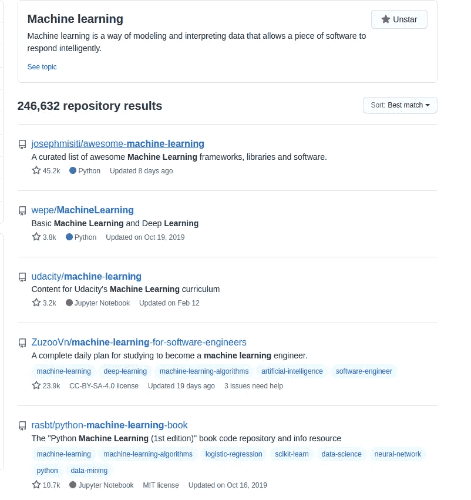
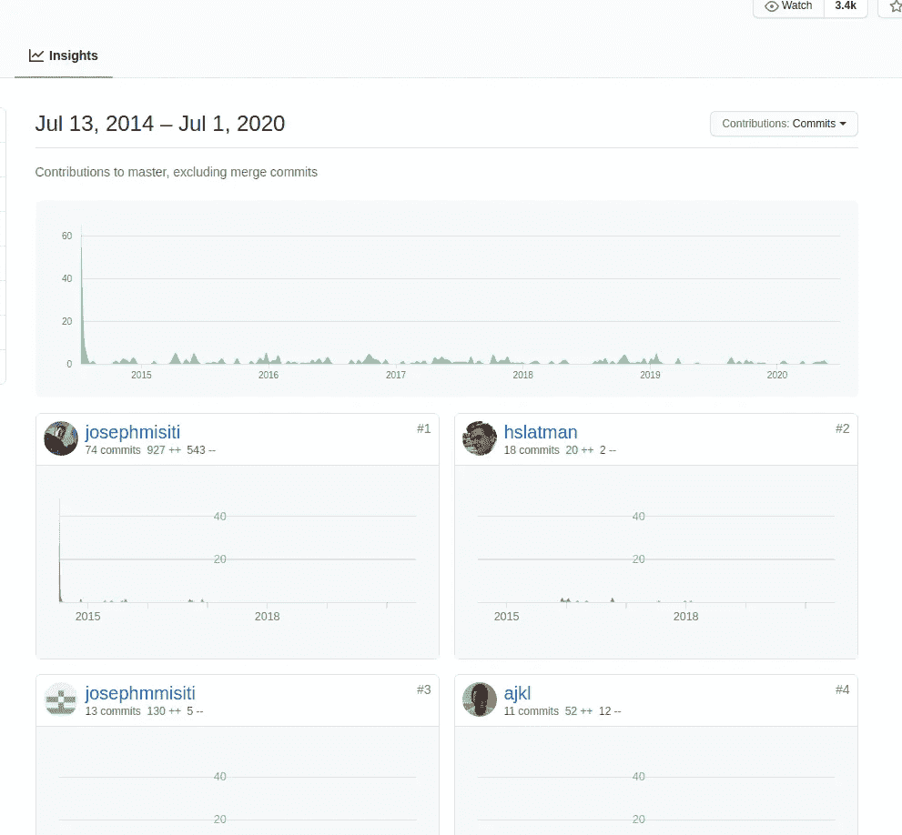
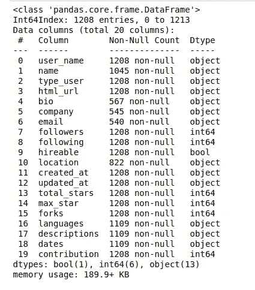
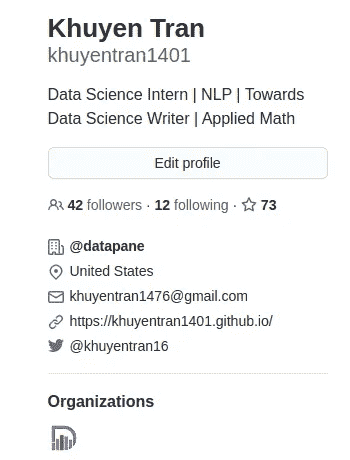
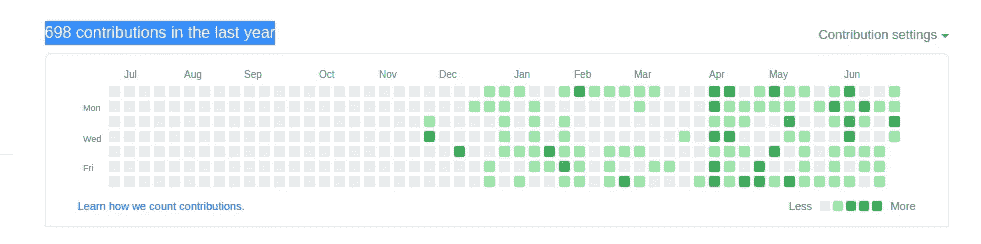
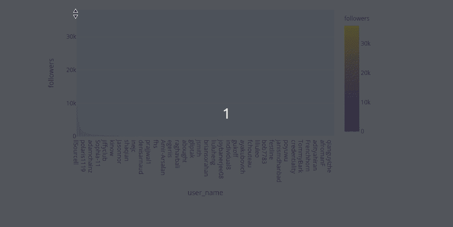
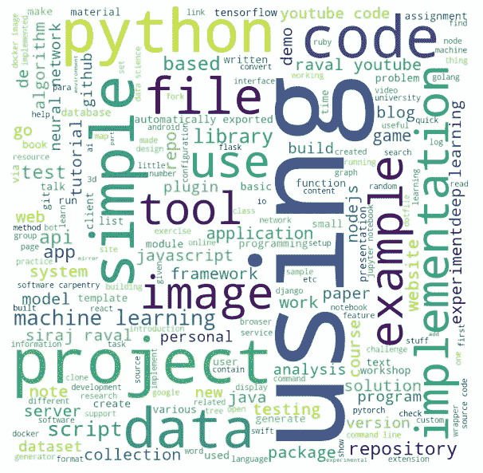

# 我收集了超过 1k 的顶级机器学习 Github 配置文件，这就是我的发现

> 原文：<https://towardsdatascience.com/i-scraped-more-than-1k-top-machine-learning-github-profiles-and-this-is-what-i-found-1ab4fb0c0474?source=collection_archive---------2----------------------->

## 从 Github 上的顶级机器学习档案中获得见解

# 动机

在 Github 上搜索关键词“机器学习”时，我找到了 246632 个机器学习知识库。由于这些是机器学习领域的顶级知识库，我希望这些知识库的所有者和贡献者是机器学习方面的专家或有能力的人。因此，我决定提取这些用户的个人资料，以获得对他们的背景和统计数据的一些有趣的见解。


马库斯·温克勒在 [Unsplash](https://unsplash.com?utm_source=medium&utm_medium=referral) 上的照片

在 GitHub repo 中，您可以随意使用本文的代码:

[](https://github.com/khuyentran1401/Data-science/tree/master/visualization/github) [## 数据科学/可视化/大师 khuyentran1401 的 github 数据科学

### 此时您不能执行该操作。您已使用另一个标签页或窗口登录。您已在另一个选项卡中注销，或者…

github.com](https://github.com/khuyentran1401/Data-science/tree/master/visualization/github) 

# 我的刮痧方法

## 工具

为了刮，我使用三种工具:

*   [美汤](https://www.crummy.com/software/BeautifulSoup/bs4/doc/)提取机器学习标签下所有知识库的 URL。Beautiful Soup 是一个 Python 库，它使得从网站上抓取数据变得极其容易。如果你不知道美人汤，我在这篇文章中写了一篇如何用美人汤刮痧的教程。

[](https://medium.com/analytics-vidhya/detailed-tutorials-for-beginners-web-scrap-movie-database-from-multiple-pages-with-beautiful-soup-5836828d23) [## 详细的初学者教程:网络刮电影数据库从多个页面与美丽的汤

### 你可能听说过美味的汤。但是如果你想访问的数据的标签不具体，你会怎么做…

medium.com](https://medium.com/analytics-vidhya/detailed-tutorials-for-beginners-web-scrap-movie-database-from-multiple-pages-with-beautiful-soup-5836828d23) 

*   [PyGithub](https://pygithub.readthedocs.io/en/latest/introduction.html) 提取用户的信息。PyGithub 是一个使用 [Github API v3](http://developer.github.com/v3) 的 Python 库。有了它，你可以管理你的 [Github](http://github.com/) 资源(仓库、用户档案、组织等)。)来自 Python 脚本。
*   [请求](https://requests.readthedocs.io/en/master/user/quickstart/)提取关于存储库的信息以及到贡献者简档的链接。

## 方法

我收集了搜索中弹出的前 90 个存储库的所有者和前 30 名贡献者



通过删除重复的以及像 [udacity](https://github.com/udacity) 这样的组织的概要文件，我获得了一个 1208 个用户的列表。对于每个用户，我收集了 20 个数据点，如下所示

```
new_profile.info()
```



具体来说，前 13 个数据点就是从这里获得的



其余数据点从用户的**库(不包括分叉库)中获得:**

*   `total_stars`是所有储存库的恒星总数
*   `max_star`是所有存储库中最大的星
*   `forks`是所有仓库的分支总数
*   `descriptions`是来自所有存储库的用户的所有存储库的描述
*   `contribution`是去年内的捐款数



# 将数据可视化

## 条形图

清理完数据，就到了好玩的部分:数据可视化。将数据可视化可以让我们对数据有更多的了解。我使用 Plotly 是因为它容易创造互动的情节

因为粉丝数低于 100 的用户有长尾效应，所以图表很难看到。我们可以放大图表的最左边部分，以便更好地查看图表。



我们可以看到，llSourcell (Siraj Raval)获得了大多数的关注者(36261)。下一个用户获得的关注者大约是 llSourcell 的 1/3(12682)。

我们可以做进一步的分析，以确定前 1%的用户有多少比例的追随者

```
>>> top_n = int(len(top_followers) * 0.01)12>>> sum(top_followers.iloc[0: top_n,:].loc[:, 'followers'])/sum(top_followers.followers)0.41293075864408607
```

1%的顶级用户获得 41%的关注者！

与其他数据点如`total_stars, max_star, forks`的模式相同。为了更好地查看这些列，我们将这些特征的 y 轴更改为**对数刻度。** `contribution`的 y 轴不变。

这些图表类似于 Zipf 定律，在某些数据集中的统计分布，例如语言语料库中的单词，其中某些单词的频率与它们的排名成反比。

例如，英语中最常见的单词是*“the”，*它在典型的文本中出现的时间约为十分之一，尽管它不如其他单词重要。

我们在其他排名中也经常看到齐夫定律，比如各县市的人口排名、收入排名、买书人数排名等等。现在我们在 Github 数据中再次看到这种模式。

## 相互关系

但是这些数据点之间有什么关系呢？他们之间有很强的关系吗？我使用`scatter_matrix`来获得这些数据点之间相关性的大图。

数据点倾向于聚集在左下轴周围，因为大多数用户的数据点都在这个范围内。之间有很强的正相关关系

*   最大星数和总星数(0.939)
*   叉数(来自他人)和星总数(0.929)
*   分叉的数量和追随者的数量(0.774)
*   关注者数量和明星总数(0.632)

## 语言

顶级机器学习用户最喜欢的语言有哪些？Python，Jupyter 笔记本，C，R 的百分比是多少？我们可以用柱状图来找出答案。为了更好地了解最流行的语言，我们删除了低于 10 的语言

从上面的条形图中，我们可以看到机器学习用户中的语言排名:

*   计算机编程语言
*   Java Script 语言
*   超文本标记语言
*   Jupyter 笔记本
*   壳等等

## 可雇佣的

我们使用[牛郎星](https://altair-viz.github.io/)来显示将自己列为可雇佣的用户的百分比

## 位置

为了了解用户在世界上的位置，我们的下一个任务是可视化用户的位置。我们将使用 31%显示其位置的用户提供的位置。从从 df 中提取位置列表开始，用`geopy.geocoders.Nominatim`定位它们

然后用 [Plotly 的 scatter_geo](https://plotly.com/python-api-reference/generated/plotly.express.scatter_geo.html) 创建地图！

放大以查看所有用户位置的更多详细信息。

## 描述和简历的文字云

我们的数据还包括用户的 bios 以及他们的存储库的所有描述。我们将用这些来回答问题:他们的主要关注点和背景是什么。

生成单词云可以让我们对单词及其在描述和 bios 中的使用频率有一个大致的了解。使用 Python 创建单词云也不会比使用 W [ordCloud 更容易！](https://amueller.github.io/word_cloud/)



用 bio 制作单词云


这些关键词看起来像我们期望从机器学习用户那里看到的。

## 分享你的发现

我们一直在收集清单上的地块。是时候创建一个报告并分享你的发现了！Datapane 是这方面的理想工具。

现在，我们已经在一个由 [Datapane](https://datapane.com/khuyentran1401/reports/finding_ec7c3531/) 主持的网站上拥有了我们在这篇文章中创建的所有情节，并准备分享！

# 结论

数据是从机器学习关键字中的前 90 个最佳匹配储存库的用户和贡献者处获得的。因此，这些数据并不能保证聚集 Github 中所有顶尖的机器学习用户。

但是我希望你可以用这篇文章作为指南或灵感来收集你自己的数据并将其可视化。你很可能会对你的发现感到惊讶。当你能用你的知识分析你周围的事物时，数据科学是有影响力的和有趣的。

我喜欢写一些基本的数据科学概念，并尝试不同的算法和数据科学工具。你可以在 LinkedIn 和 T2 Twitter 上与我联系。

星[这个回购](https://github.com/khuyentran1401/Data-science)如果你想检查我写的所有文章的代码。在 Medium 上关注我，了解我的最新数据科学文章，例如:

[](/how-to-organize-your-data-science-articles-with-github-b5b9427dad37) [## 如何用 Github 组织你的数据科学文章

### 被新信息淹没？现在，您可以轻松地跟踪文章并为其创建自定义注释

towardsdatascience.com](/how-to-organize-your-data-science-articles-with-github-b5b9427dad37) [](/introduction-to-datapane-a-python-library-to-build-interactive-reports-4593fd3cb9c8) [## Datapane 简介:构建交互式报表的 Python 库

### 创建精美报告并与您的团队分享分析结果的简单框架

towardsdatascience.com](/introduction-to-datapane-a-python-library-to-build-interactive-reports-4593fd3cb9c8) [](/how-to-create-interactive-and-elegant-plot-with-altair-8dd87a890f2a) [## 如何用 Altair 创建交互式剧情

### 在 5 行简单的 Python 代码中利用您的数据分析

towardsdatascience.com](/how-to-create-interactive-and-elegant-plot-with-altair-8dd87a890f2a) [](/how-to-leverage-visual-studio-code-for-your-data-science-projects-7078b70a72f0) [## 如何在数据科学项目中利用 Visual Studio 代码

### 直到发现一种新的有效方法，我们才意识到我们是多么低效

towardsdatascience.com](/how-to-leverage-visual-studio-code-for-your-data-science-projects-7078b70a72f0) [](/how-to-learn-non-linear-separable-dataset-with-support-vector-machines-a7da21c6d987) [## 如何用支持向量机学习非线性数据集

### 支持向量机简介及其在非线性数据集上的应用

towardsdatascience.com](/how-to-learn-non-linear-separable-dataset-with-support-vector-machines-a7da21c6d987)