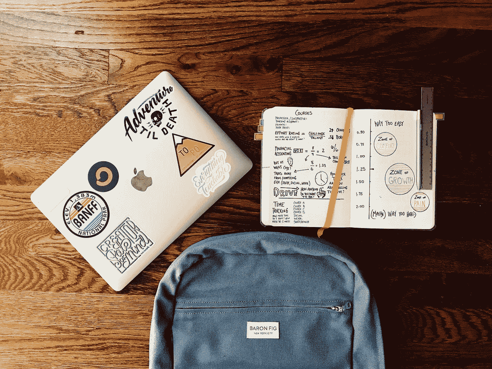

# 我跳过大学自学数据科学

> 原文：<https://towardsdatascience.com/i-skipped-college-to-teach-myself-data-science-eb23fb6ed137?source=collection_archive---------36----------------------->

## 六个月的自学比三年的学位课程教会了我更多

由 [Unsplash](https://unsplash.com/s/photos/college?utm_source=unsplash&utm_medium=referral&utm_content=creditCopyText) 上的 [Element5 数码](https://unsplash.com/@element5digital?utm_source=unsplash&utm_medium=referral&utm_content=creditCopyText)拍摄

几个月前，我决定学习数据科学。为了做到这一点，**我翘了整整一学期的数据科学专业课。**

# 背景

选专业的时候，想挑一个毕业后能保证工作的学科。

大约在这个时候，数据科学开始成为一种炒作。《哈佛商业评论》称之为“21 世纪最性感的工作”

当时全国只有一两所大学开设数据科学专业，我报了其中一所。

就像其他追求这个专业的人一样，我很兴奋。我要学习站在新兴技术前沿的必要技能！

不幸的是，事情并不完全是这样。

# 真是一团糟

里卡多·维亚纳在 [Unsplash](https://unsplash.com/s/photos/mess?utm_source=unsplash&utm_medium=referral&utm_content=creditCopyText) 上的照片

课程进行了两年，我意识到我实际上没有学到任何东西。

因为我们是第一批数据科学学生，所以大学的数据科学系似乎还没有建立起来。

讲师对这门学科知之甚少甚至一无所知，作业都是从教科书上抄来的，课堂结构也不合理。

结果，我们没有一个人在数据科学的任何方面有坚实的基础。

即使在我完成了整整一学期的机器学习(并在班上获得 A)后，我对所教的主题也几乎没有掌握。

当我的朋友(也是优等生)**在完成整个学期后问我“监督学习”是什么意思时，我们对这个主题的理解是多么贫乏。**

两年后，我意识到，除非我做点什么，否则我不会拥有为就业市场增值所需的技能。很快。

# 创造我自己的学习道路

照片由 [Aaron Burden](https://unsplash.com/@aaronburden?utm_source=unsplash&utm_medium=referral&utm_content=creditCopyText) 在 [Unsplash](https://unsplash.com/s/photos/learn?utm_source=unsplash&utm_medium=referral&utm_content=creditCopyText)

我当时在读全日制大学，并参加了几个俱乐部活动。我也在周末兼职做家教。

然而，这一切在几个月前政府实施全国封锁时停止了。

突然间，我有了空闲时间。很多。

我决定利用这段时间自学数据科学。我开始时没抱什么期望，因为我怀疑自己是否有能力抓住我需要学习的话题。

我几乎没有编程经验，也不了解任何数据科学主题。

我不得不从头开始。

我从一门名为“***Python for Data Science and Machine Learning boot camp***”的课程开始，这门课程教会了我 Python 中数据科学的基础知识。这门课程激发了我对数据科学的兴趣。演讲者的热情感染了我。

很长时间以来，我第一次真正感觉到自己好像在学习一些东西。

我意识到，通过网上可用的资源，我可以自学所有我必须知道的东西。

我花了大约 7-8 个小时观看在线课程、阅读和做项目。通过反复试验，我创造了一条适合我的[学习路径](/how-to-learn-data-science-in-2020-7cec75fb2ea5?source=your_stories_page---------------------------)。

## 我在一个月里学到的东西比我在两年的学位课程中学到的还多。

一个月后，宣布我们将在大学开设网络课程。

这占据了我一天的大部分时间，我几乎没有时间自学或做自己的项目。由于这些课没什么帮助，我决定干脆不上了。

然而，我的一些讲师对出勤率要求非常严格。

他们中的一个举报我缺了两周的课，为此我出示了一份诊断书。

我还是觉得上课不值得我花时间，就在手机上安装了微软团队 app，每天一边上课，一边自学自己的材料。

然后我会熬夜完成我的大学作业、期中考试和考试。尽管从来没有去上课，我做作业没有问题，因为我已经自学了所有这些东西。

我这样做了几个月，完成了整个学期，一节课也没上。

# 学习如何学习

马特·拉格兰在 [Unsplash](https://unsplash.com/s/photos/college?utm_source=unsplash&utm_medium=referral&utm_content=creditCopyText) 上拍摄的照片

自学的时候，没有考试考你，没有竞争，没有人一起学。

这使得坚持下去变得困难，尤其是对于我们这些习惯了学校和大学环境的人来说。

我们大多数人学习通过考试，取得好成绩，在班上名列前茅。我们在这种情况下茁壮成长，因为有最后期限的临近，有学习的需要。

## 自学教会了我如何为了学习而学习。

我的学习是由好奇心推动的，没有别的。

我会花几个小时盯着电脑屏幕，试图修复损坏的代码。在学习和完成大学作业后，我会在早上 9 点睡觉。

我能坚持下去的唯一原因是我很好奇，渴望了解更多。我喜欢从事新项目，学习使用新工具。

我受到高级数据科学家的启发，他们自学并创建了自己的学习路径，并希望跟随同样的脚步。这种动力让我坚持下去。

# 结果呢

在短短几个月的自学中，我自学的东西比我想象的要多得多。

我创建了各种各样的[数据分析项目](/the-bechdel-test-analyzing-gender-disparity-in-hollywood-263cd4bcd9d)，为初学数据科学家制作了[教程](https://medium.com/datadriveninvestor/tableau-tutorial-for-beginners-43483adf719)，从零开始建立了自己的[作品集网站](https://natassha.github.io/natasshaselvaraj/)，得到了一份[数据科学实习](/data-science-projects-that-will-get-you-the-job-805065e7260)。

这几个月为我打开了许多新的大门，我终于觉得我喜欢我所做的事情。

当然，还有很多我不知道的，前面的路还很长。我渴望在工作中学习新的东西。

本文到此为止！

如果您希望过渡到数据科学或“进入该领域”，只要知道这样做永远不会太晚！你只需要有纪律，每天留出一些时间来学习新的东西。