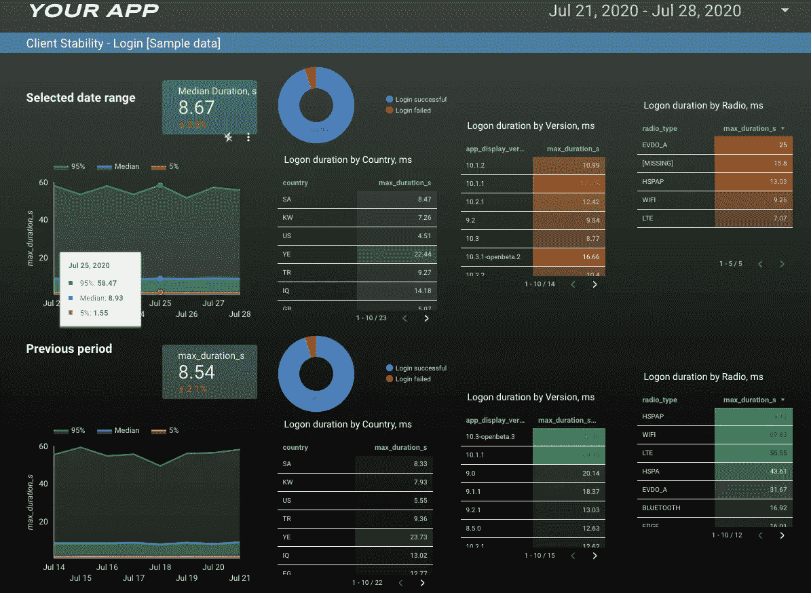
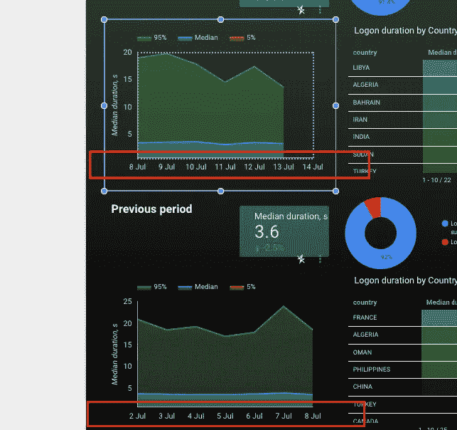
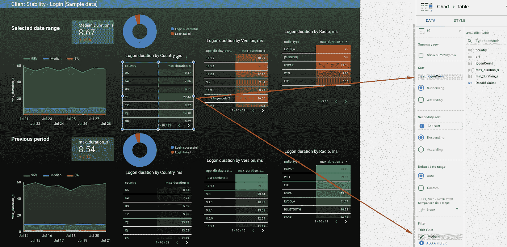

# 我不再使用 Firebase 仪表盘。我自己建了一个。

> 原文：<https://towardsdatascience.com/i-stopped-using-firebase-dashboards-ive-built-my-own-instead-299631185b41?source=collection_archive---------20----------------------->

## 你如何解释火基数字？以下是答案。包括整洁的模板以及用于 BigQuery 分析的示例 Firebase 数据集。

我经常对我在 [Firebase](http://firebase.google.com) 中看到的东西感到困惑。背后的数据是什么？

现在我在 Google Data Studio 中使用 Firebase Crashlytics 和性能数据，因为它帮助我更好地了解我的用户。

Crashlytics 仪表板

> 如果你愿意，你可以复制 [**模板**](https://datastudio.google.com/u/0/reporting/f9e5d294-2a28-4ce0-bd4b-c5b969041784/page/aYYXB/preview) 。包括所有样本数据集。如果你在 BigQuery 中也需要它们，请告诉我，我会将它们作为公共数据集共享。

如何使用 Data Studio 模板

如何在 Google Data Studio 中使用 Firebase Crashlytics 数据？如何使用 Firebase 性能数据计算平均登录时间？

如果您使用 Firebase 来跟踪 iOS 或 Android 客户端版本中的性能和崩溃，您可能希望使用这些数据创建一个自定义仪表板。这篇文章是关于如何在 BigQuery 和 Google Data Studio 中使用 Firebase Crashlytics 和性能数据集来构建这样的东西:

碰撞分析数据

**您可能想要显示以下内容:**

*   猛撞
*   无崩溃用户(计数)，所选时间段与之前时间段。
*   崩溃事件(计数)，所选时间范围与先前时间范围。
*   所选月份中前 3 名崩溃的列表(打开和关闭)
*   所选月份中关闭的前 3 个崩溃列表(必须仍然关闭)

**或您的应用性能数据:**

登录统计，例如:

*   登录次数中位数；月平均值和显示时间段与上一时间段的线形图
*   前十个国家/地区当月的登录时间中位数与上月相比；按用户数量排序
*   前三个应用版本的月登录时间中位数与上月相比；按用户数量排序
*   月登录成功/失败百分比—饼图。

首先推荐看这篇[文章](https://firebase.googleblog.com/2018/11/using-google-data-studio-with-crashlytics.html)。它解释了如何连接到 Firebase 并将数据提取到 BigQuery 中。

# 火灾数据库数据提取

如果您已经设置了 Firebase 与 **BigQuery** 的集成，您应该准备好以下数据集:

所以现在您可以在这些表上运行查询。

我们将使用这两个工具在 Google Data Studio 中创建自定义报告。

# Google data studio 模板

我使用了来自谷歌数据工作室的标准谷歌广告模板。我觉得它看起来不错，我根据自己的需要稍微做了些改动。

# 下载报告模板

如果您想打开演示报告并下载我创建的模板:

1.  如果你没有谷歌账户，你可以[创建一个](https://accounts.google.com/Login)。
2.  点击这个[链接](https://datastudio.google.com/reporting/f9e5d294-2a28-4ce0-bd4b-c5b969041784/preview)。
3.  单击使用模板。

# 第 1 页

让我们开始构建我们的仪表板。

**平均登录时长**

图一。数据集配置

前两个小部件使用相同的数据集，并显示**中值**登录时间。

**示例**

假设在我们的性能数据中，我们有以下登录持续时间记录

ntile(4)

因此函数`NTILE(4) OVER (PARTITION BY COUNTRY_NAME ORDER BY duration)`将根据行排序将数据分成 4 个存储桶，并返回分配给每一行的从 1 开始的存储桶编号。存储桶中的行数最多相差 1。

类似地，如果我们使用 NTILE(100 ),它会将数据分成 100 个桶。例如，50 块第一持续时间记录将表明所有登录的持续时间的 50%小于第 50 块中的该第一持续时间记录。

点击阅读更多官方谷歌文档[。](https://cloud.google.com/bigquery/docs/reference/standard-sql/functions-and-operators#ntile)

**让我们使用这些知识创建一个自定义数据集来计算我们需要的图块的最小和最大登录时间。**

转到谷歌数据工作室，添加新的数据源，然后选择自定义查询，并插入下面的 SQL。不要忘记启用日期参数。

如果您用实际日期替换@DS_END_DATE 和@DS_START_DATE，并在 BigQuery 中运行整个脚本，它将给出以下结果:

这足以使用**面积图创建小部件。**增加 **dt** 为尺寸，增加**瓦**为分解尺寸，如图 1 所示。上方的数据集配置[。](https://cdn-images-1.medium.com/max/2560/1*eOJv6ZP6SDBe1w4D7AvRtQ.png)

让我们创建一个数据集来显示相同的小部件，但是是上一个时间段的。

示例:

我们将使用来自 **login_ios.sql** 的 SQL，并简单地添加一些参数转换，以获得基于所选报告日期的先前日期范围:

只需在设置中选择“数据范围”,即可完成:

如何显示以前日期的数据

**现在，让我们按国家、应用版本和收音机类型添加登录时长。**

我决定为每个小部件添加单独的数据集将是最好的，因为我们已经有了`tile`细目，可能需要使用它作为过滤器。

我使用 logonCount 按照登录次数对结果表小部件进行排序，并过滤到中间间隔。

如何使用中值滤波器

以类似的方式添加数据集`login_ios_version.sql`和`login_ios_radio.sql`，并将它们添加到右边的小部件中。

对于下面的小部件，添加带有修改日期参数的新数据集，就像我们在`login_ios_previous.sql`做的那样

登录持续时间

对于包含成功登录百分比的饼图，创建另一个自定义数据集:

是否使用滤镜由你决定。

完成了。您可以为您的 Android 数据添加额外的页面。只需复制数据集，将 IOS 性能表替换到 ANDROID 即可。

# 第二页。崩溃。

崩溃和受影响的用户

让我们在 google Data Studio 中创建一个自定义数据集`crashlytics_ios.sql`，我们将统计`is_fatal`标志等于`true`的崩溃事件。

以类似的方式，使用 pd 中的`previous_start_dt` 和`previous_end_dt`为下面的小部件创建另一个数据集，但只是为之前的时间段创建。

这个表格小部件使用相同的数据集`crashlytics_ios.sql` ，只是显示了`issue`对`events`和`users`的计数:

按问题标题列出的崩溃

**无崩溃用户**

让我们创建一个自定义数据集来显示无崩溃用户的百分比。

为此，我们将使用 firebase `analytics`数据集，如 Goggle 文档的[示例 7](https://firebase.google.com/docs/crashlytics/bigquery-export#example_7_number_of_users_impacted_by_a_crash_issue_broken_down_by_country) 所示。

无碰撞用户

让我们创建名为`crashes :`的数据集

如果您在 BigQuery 中运行它，结果将是这样的:

用参数处理程序替换日期，并在 Google Data Studio 中创建一个自定义数据集。

# 第二页写完了！

感谢阅读！

请记住，真正的客户端应用程序可以生成大量数据！确保在您的脚本中使用分区来降低 BigQuery 成本，并遵循本文[中的 Google 最佳实践。](https://medium.com/@mshakhomirov/5-tips-for-building-a-better-dashboard-with-google-data-studio-and-bigquery-e8569a3f567b)

如果你有任何问题让我知道。

# 推荐阅读:

[**Google 的 Firebase 查询示例**:https://Firebase . Google . com/docs/crashlytics/big query-export](https://firebase.google.com/docs/crashlytics/bigquery-export)