# 我给 10 所不同学校的 300 名商科学生教授应用人工智能。

> 原文：<https://towardsdatascience.com/i-taught-applied-ai-to-300-business-students-in-10-different-schools-3860431b968e?source=collection_archive---------73----------------------->

## 我学到的关于如何从教学上接近人工智能的 15 课。

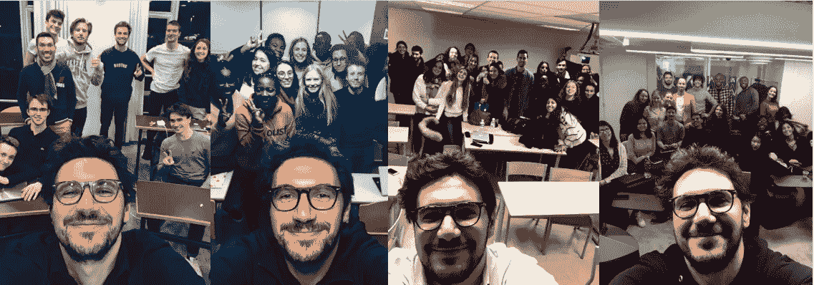

在过去的一年里，我有幸在法国给各种商科学生教授应用人工智能。

对没有数学/统计学背景的人来说，教授人工智能比看起来更困难。

但这是迄今为止最有趣的话题。

它涉及如此广泛和众多的方面，对于未来的商业领袖来说，从经济的角度来看，当然也从伦理和哲学的角度来看，都是至关重要的，所以试图获取这门学科的精髓并教授它是非常令人着迷的。

我想我比我的学生学到了更多，我决定分享我的发现。

我也调查了其中的 100 个。

这篇文章有一个教学目标，这些课程实际上可以应用于任何类型的主题，而不是专门针对人工智能。

# 1.学生首先需要明白为什么要听你说的话。

我上了 10 节不同的课。我有机会 A/B 测试我的开场白。

你猜怎么着，当我用最简单的解释开始课程，告诉他们为什么需要关注这门课程时，他们更加投入了。至少在最初的 5 分钟里。前 5 分钟决定了你整个课程的剩余时间。

你知道他们说什么，你永远没有第二次机会留下第一个好印象。嗯，是真的。

对于人工智能，介绍是这样的:

*   谁觉得他今天用了 AI？→及时吸引他们的问题
*   对于没用过的人来说，AI 是什么？→尝试测量温度
*   如果我告诉你，如果你用手机，你很可能用的是 AI，你会怎么说？→ AI 无处不在，而他们不知道这件事，它一定很重要..

上钩了。

# 2.学生首先需要明白为什么要听你的。

嘿，你是谁？你在跟我说什么？

信任就是一切，如果他们相信你能胜任他们感兴趣的话题，他们可能会想继续听下去。

# 3.总是回到主题的基础知识

我们为什么要创造人工智能？从根本上引出什么是 AI？这导致了什么是创新呢？

创新总是以扩展人类属性为目标。

从书到网络。

扩展人性的一面。

赋予人类超能力。

那么，我们试图赋予人工智能什么样的超能力呢？

提示:它在 AI 这个词里..

一旦我们知道我们正试图通过赋予机器像人类一样思考和行动的能力来扩展我们的智力，我们就可以试图理解它背后的“如何做”。

# 4.逆向工程是终极教学技能

> 从客户需求开始，一直到技术的后端，史蒂夫·乔布斯

从应用程序开始，向后追溯到理论。

# 5.使用“系统设计”方法分解概念

实际上，系统设计是软件工程中最重要的技能之一，它主要考虑如何构建复杂的产品。

当你想到架构时，你会想到结构和过程。

事实证明，我们所知道的大多数事情都可以被设计成生活中的三个阶段:

输入→系统→输出

这是一个我如何把 4 和 5 结合起来的例子。

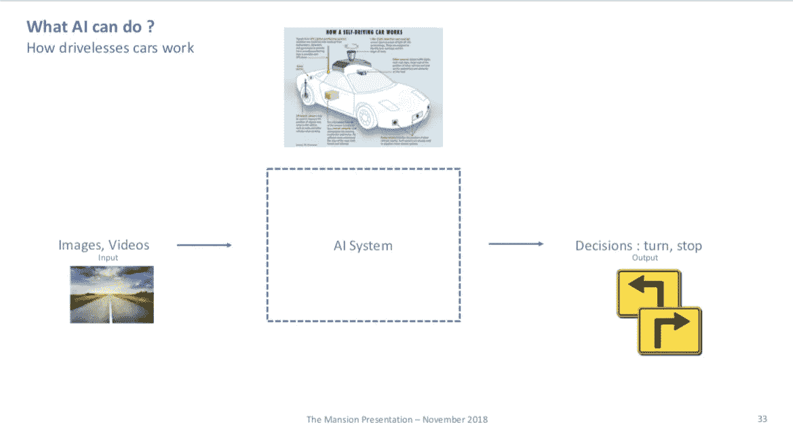

然后你通过问正确的问题来解构这个系统。

## 1.学会开车意味着什么？

从根本上说，这是关于观察和预测。

## **2。我们如何看待和预测？**

我们需要学习如何去做。

## 3.机器是如何学习的？

机器学习部分来了。

最后:

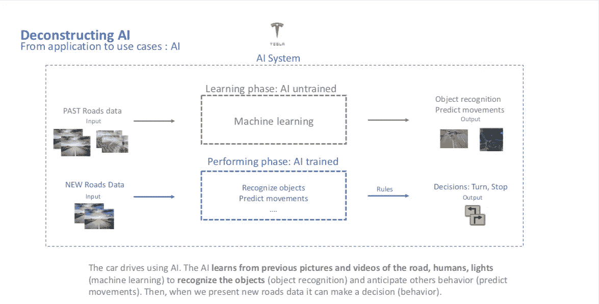

导致以下结果的示例:

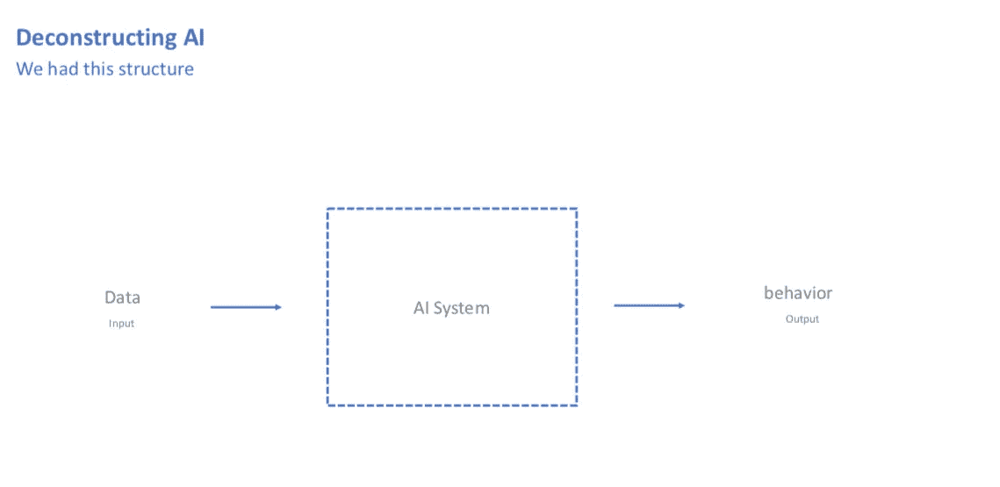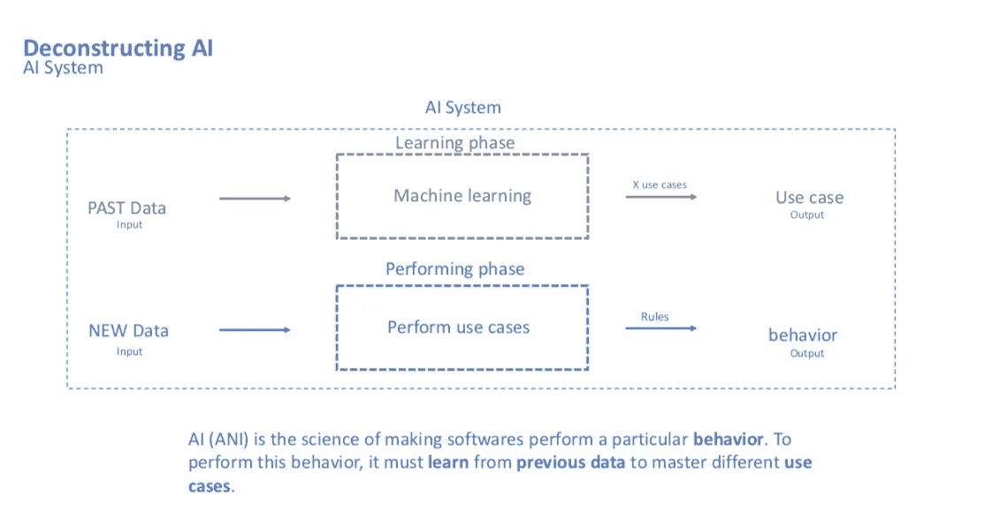

# 6.尽可能多地使用隐喻

将一个众所周知的概念应用到你的专业领域。

例如人工智能，我想到的一个有用的比喻和比较概念是:

建筑:为了建造房子(你的产出)，你需要水泥和石头等原材料(你的数据)，你需要水泥搅拌车等工具(你的算法和框架)，你需要仔细的指导方针(你的模型)来遵循计划。

你可以把它应用到烹饪、学习和更多的活动中…

# 7.点对点学习是必须的

我成对设计案例研究，而不是分组。结果证明效率要高得多。

# 8.邀请专家进行实时企业案例研究

大师班在这一点上给了我很大的启发。

没有什么比真正的世界级专家给你的应用科学课程带来实用性更有效的了。

# 9.基于交叉学习经验，创建原创的应用案例研究

我开设了一门课程，内容是从国际象棋到人工智能的商业策略，从扑克到人工智能决策，我们能从中吸取什么。

这似乎引起了共鸣。

# 10.基于跨格式经验创建原创应用案例研究

我曾经围绕鲨鱼池表演设计过责任案例研究。学生们非常着迷。

游戏、视频、辩论、运动都是强有力的学习刺激物。

例如，谷歌人工智能提供了有用的实验来测试现场教室中的人工智能工具。

例如，麻省理工学院关于人工智能伦理的道德机器是一个强大的参与工具。

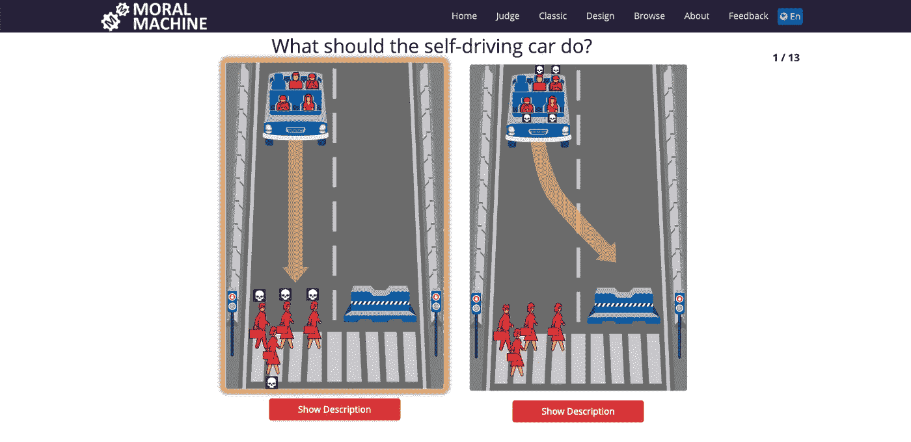

# 10.与他们共建内容

从白板开始。

提问。

继续前进。

用他们的答案从头开始建立部分。

# 11.实验可能会失败，但从长远来看是有益的

尝试新的教学方法。

你唯一的限制是你的想象力。

有时学生不会参与，但它将永远教你为什么。

# 12.尽可能多地总结和重复

每 30 分钟，我会花 1 分钟来总结到目前为止学到的东西。

学生们非常欣赏这一点。

特别是当你的课程是自下而上建立的，你需要理解接下来会发生什么。

# 13.教授内容，尤其是解决你提出的问题的思维框架

商科学生并不想让他们的问题得到答案。他们想知道在任何情况下如何回答。

我发现一个特别有用的练习是陈述一个极其宽泛和开放的问题:人工智能将如何影响社会？

他们必须想出答案，然后发现如果那样说就没那么容易了。

他们需要一个思维框架。

这是我提供的答案:

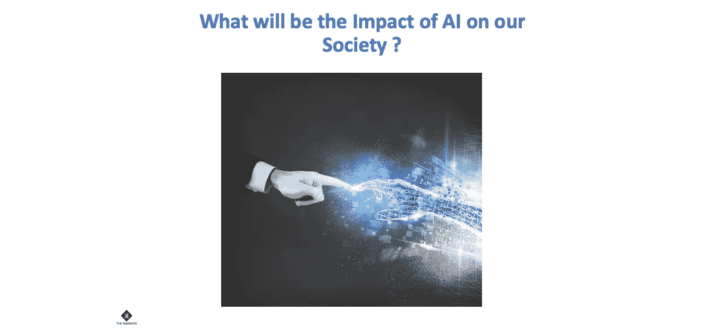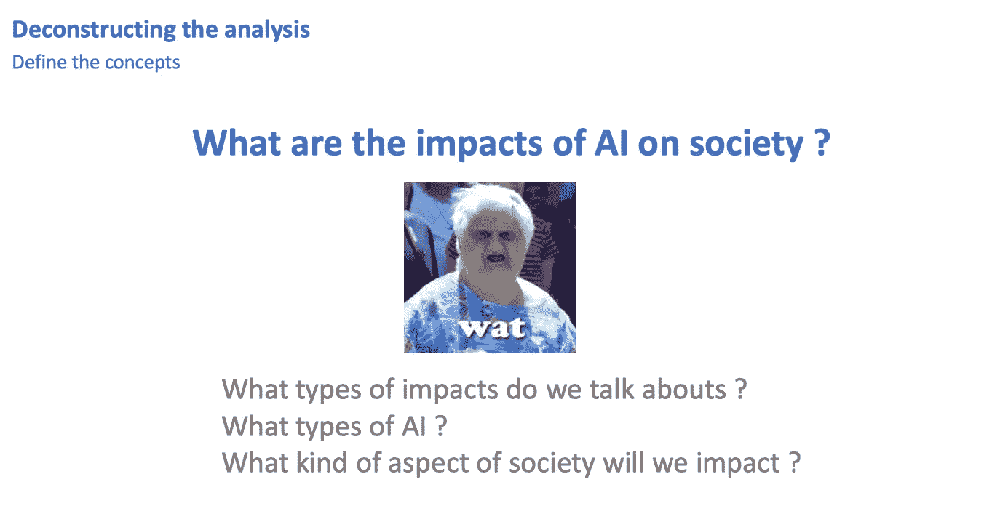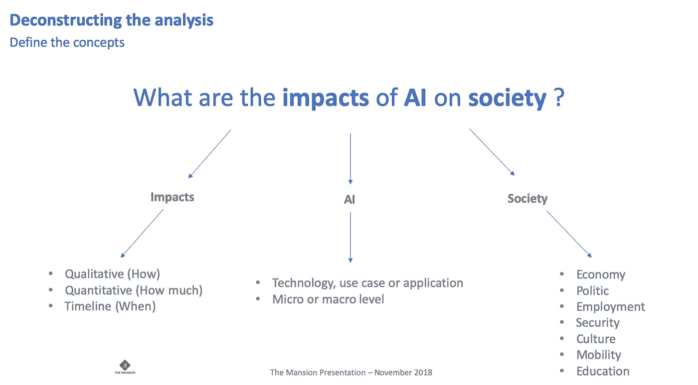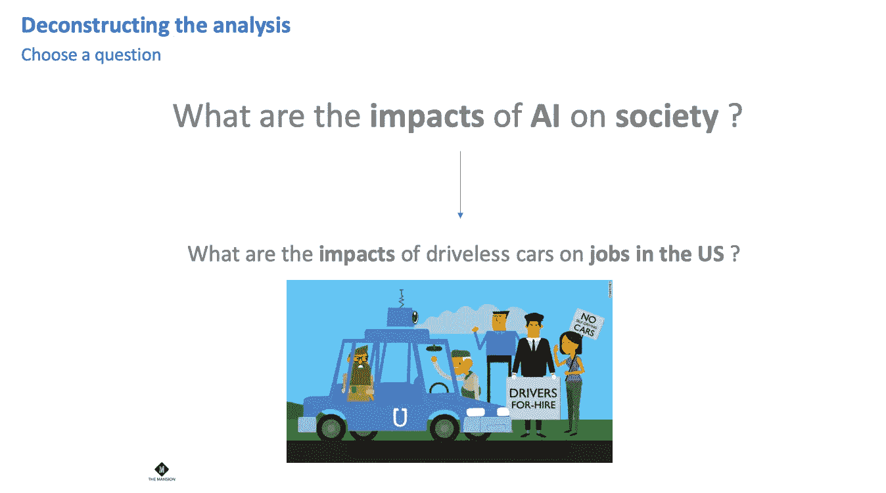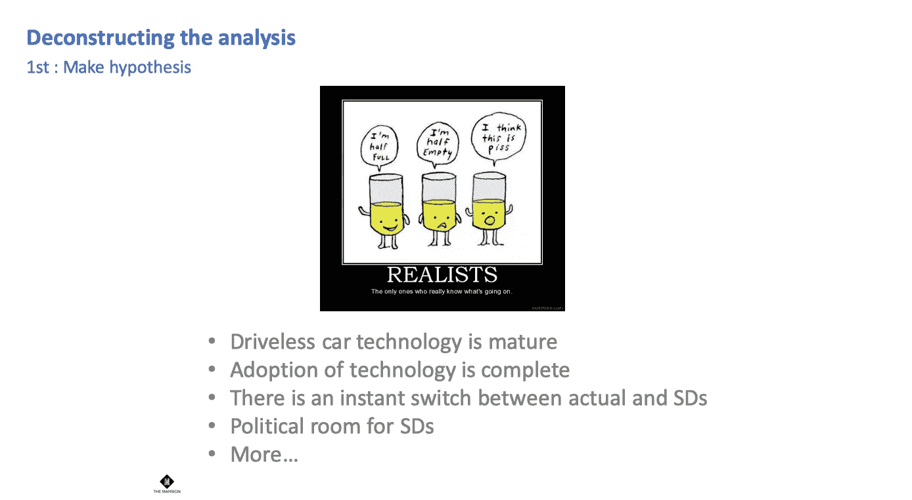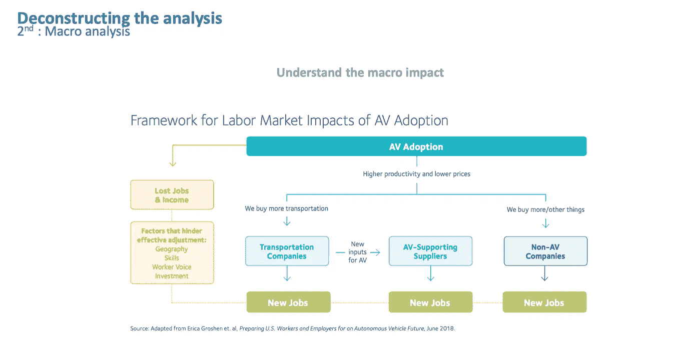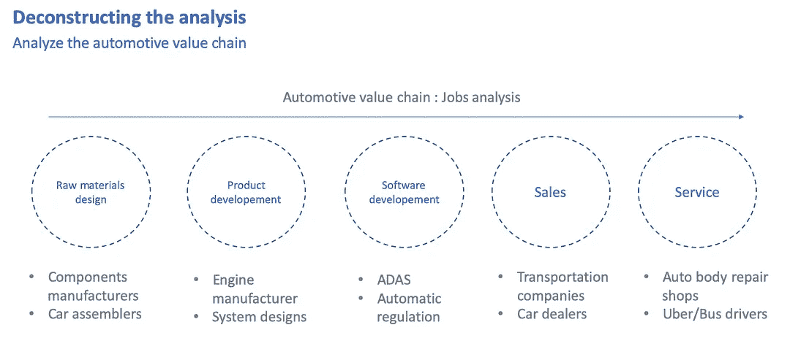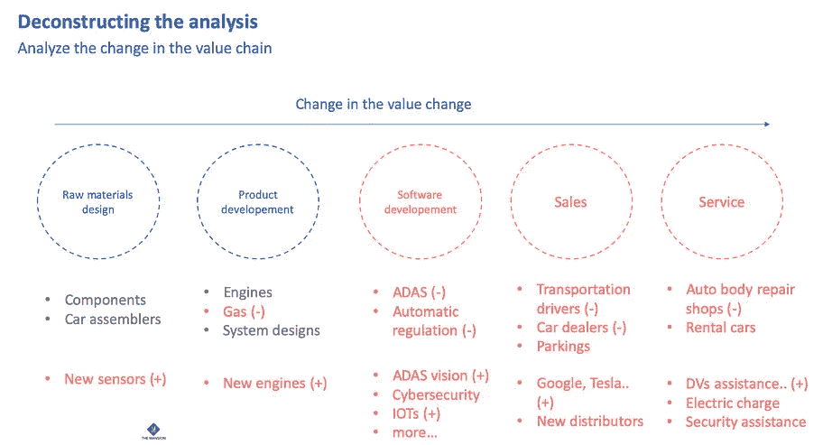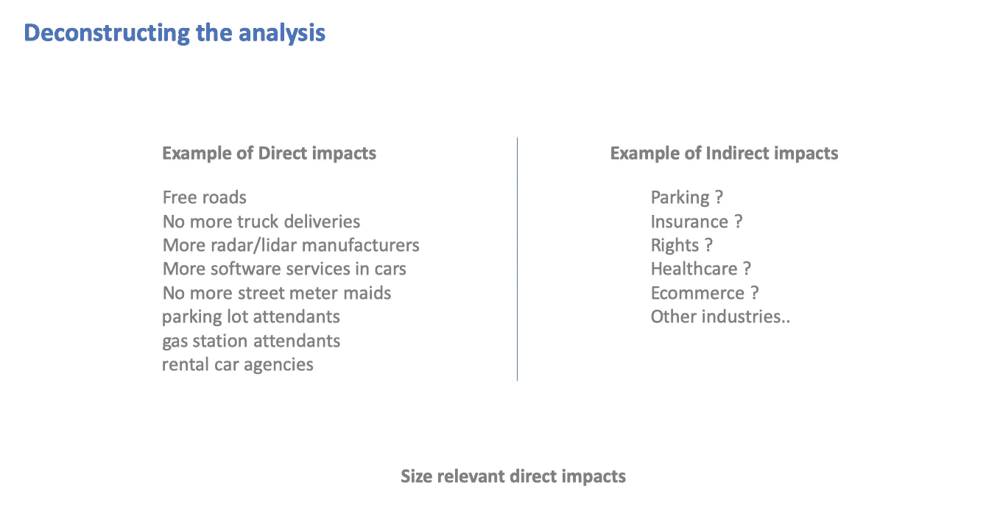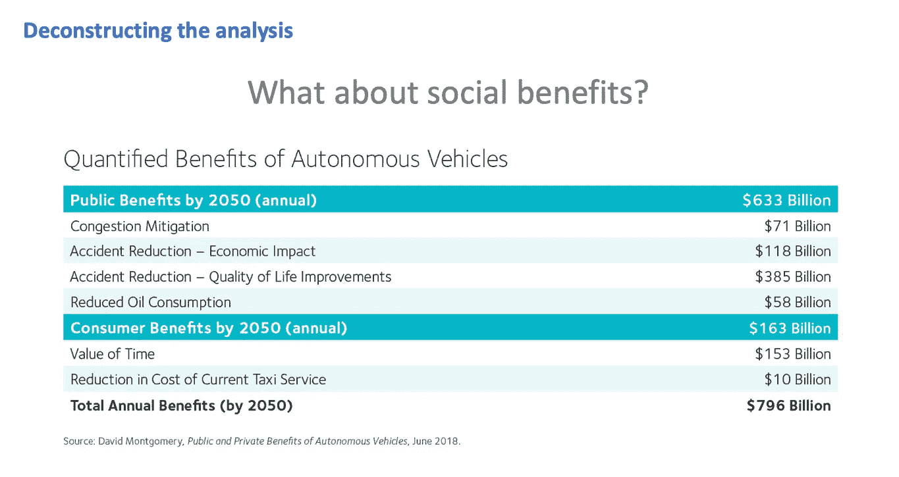

# 14.尝试建立内在动机

我没有设置等级。

他们不喜欢它，我也不喜欢。

首先，试着找出他们为什么想听你说话。

# 15.每次都要感谢他们。

如果可以的话，直呼他们的名字。

始终声明他们的问题是真正相关的。

如果可以的话，在小组学习之前尝试一对一的高质量会议。

*感谢您读到这里，欢迎随时和我连线* [*Linkedin*](https://www.linkedin.com/in/eytanmessika/) *来聊聊 AI。*