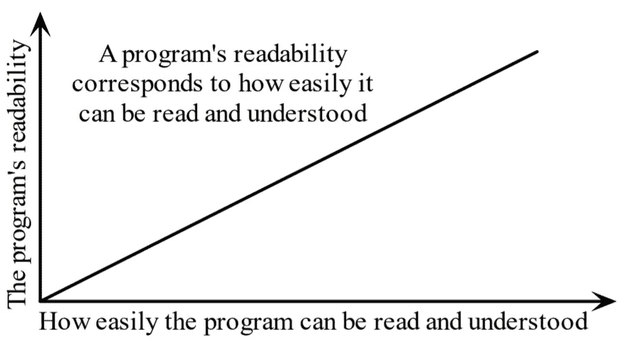
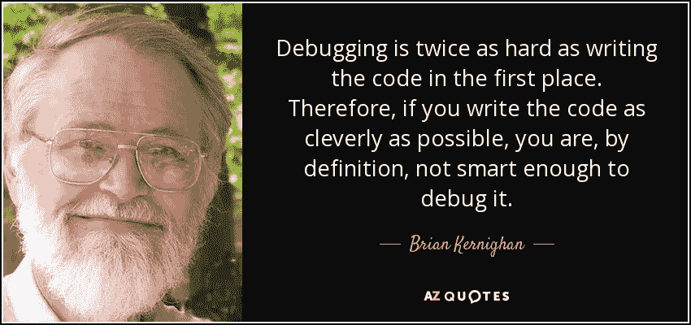

# 在发现这些技巧之前，我一直以为自己在掌握 Python

> 原文：<https://towardsdatascience.com/i-thought-i-was-mastering-python-until-i-discovered-these-tricks-e40d9c71f4e2?source=collection_archive---------0----------------------->

## Python 最佳实践和技巧将使您快速高效地编码


阿尔瓦罗·雷耶斯在 [Unsplash](https://unsplash.com/?utm_source=unsplash&utm_medium=referral&utm_content=creditCopyText) 上拍摄的照片

Python 是最受初学者欢迎的编程语言之一，这使它成为世界各地学校中教授最广泛的语言。

但是，学习 Python 并不是一件容易的事情。要开始，你首先需要找到到达那里的最佳在线方式，这本身就很难。有成千上万不同的 Python 课程和教程，都声称是最好的。

诚然，光是练习是不完美的，但完美的练习才是。这意味着你需要确保你总是遵循最佳的编码实践(评论你的代码，使用正确的语法，等等)。)，否则你很可能会养成坏习惯，这会损害你未来的代码行。

> *“一个通用的约定提供了所有的可维护性、清晰性、一致性，以及良好编程习惯的基础。它没有做的是坚持让你违背自己的意愿去跟随它。那是 Python！”*
> 
> *——Tim Peters 关于 comp.lang.python，2001 年 6 月 16 日*

在本文中，我将给出我的 10 大技巧来帮助你快速有效地用 Python 编码。

# 1.可读性很重要

> 程序必须写给人们阅读，并且只是附带地给机器执行。
> 
> [**哈尔·阿伯尔森**](https://www.azquotes.com/author/38260-Hal_Abelson)

首先，遵循一些编程惯例，尽量让你的程序易读。编程惯例是经验丰富的程序员在编写代码时遵循的惯例。没有比无视习俗更快的方式来表明你是一个*新手了。其中一些约定是特定于 **Python** 的；其他的被所有语言的计算机程序员使用。*

**

*从本质上来说，可读性是一种特性，它规定了另一个人理解你的代码的某些部分有多容易(而不是你！).*

*举个例子，我不习惯用垂直对齐来写，也不习惯用开始定界符来对齐函数的参数。*

```
*# No, to avoid: 
func = long_function_name(var_one, var_two,
       var_three, var_four)#Yes, 
func = long_function_name(var_one, var_two,
                          var_three, var_four)*
```

*看看 Python 代码的[风格指南中的其他例子，决定什么看起来最好。](https://www.python.org/dev/peps/pep-0008/)*

*我们经常做的另一件重要的事情是模仿我们以前看过或写过的程序，这就是为什么我们接触可读程序在学习编程中很重要。*

# *2.避免无用的条件*

*通常，一个长的 ***if & elif & …else*** 条件是代码需要重构的标志，这些条件会让你的代码变得冗长且难以解读。有时它们可以很容易地被取代，例如，我曾经这样做过:*

```
*def f():
    if condition:
    	return True
    else:
    	return False*
```

*这太蠢了。该函数返回一个布尔值，那么为什么要首先使用 if 块呢？正确的做法应该是:*

```
*def f():
	return condition*
```

*在一个[黑客排名](https://www.hackerrank.com/dashboard)的挑战中，给你一年，你必须写一个函数来检查这一年是否是闰年。在公历中，识别闰年必须考虑三个标准:*

*   *一年可以被 4 整除，是闰年，除非:*
*   *一年可以被 100 整除，它不是闰年，除非:*
*   *年份也能被 400 整除。然后就是闰年了。*

*所以在这个挑战中，忘记***if***和 ***elses*** 只做以下事情:*

```
*def is_leap(year):
    return year % 4 == 0 and (year % 400 == 0 or year % 100 != 0)*
```

# *3.充分使用空白*

*   *不要混用制表符和空格*
*   *函数之间的换行*
*   *两个类之间的换行符*
*   *在字典中的**"、"**、列表、元组、参数列表中的参数后和字典中的 **":"** 后添加一个空格，但不在前面。*
*   *在赋值和比较周围加空格(列表中的参数除外)*
*   *左/右括号或参数列表前没有空格。*

```
*def function(key, value=0):
    """Return a dictionary and a list..."""
    d = {key: value}
    l = [key, value]
    return d, l*
```

# *4.文档字符串和注释*

*   *Docstrings =如何使用代码*
*   *注释=为什么(rational)和代码如何工作*

*文档字符串解释了如何使用代码:*

*   *解释一个功能的目的，即使它对你来说是显而易见的，因为它对其他人来说不一定是显而易见的。*
*   *描述预期的参数、返回值和引发的异常。*
*   *如果该方法与单个调用者强耦合，则提及调用函数。*

*注释解释了代码维护者的需求。例子包括给自己的注释，例如:*

> *# !！！BUG: …*
> 
> *# !！！修复:这是一个黑客*
> 
> *# ?？？为什么会在这里？*

*写好的文档串和好的注释是你的责任，所以要经常更新它们！进行更改时，确保注释和文档字符串与代码一致。*

*你会发现一个详细的 **PEP** 专用于 Docstring:[**【Docstring Conventions】**](https://www.python.org/dev/peps/pep-0257/)*

# *5.变量和赋值*

*在其他编程语言中:*

```
*c = a
a = b
b = c*
```

*在 Python 中，最好在一行代码中使用赋值:*

```
*b, a = a, b*
```

*你可能已经看过了，但你知道它是如何工作的吗？*

*   *逗号是构建元组的语法。*
*   *右边创建一个元组(元组打包)。*
*   *元组是左边的目标(元组解包)。*

*其他示例:*

```
*>>> user =['Jan', 'Gomez', '+1-888-222-1546']
>>> name, title, phone = user
>>> name
'Jan'
>>> title
'Gomez'
>>> phone
'+1-888-222-1546'*
```

*在结构化数据的循环中有用(上面的变量**用户**已被保留):*

```
*>>> people = [user, ['German', 'GBT', 'unlisted']]
>>> for (name, title, phone) in people:
...      print (name, phone)
...
Jan +1-888-222-1546
German unlisted*
```

*也可以反过来做，只要确保左右两边的结构相同即可:*

```
*>>> jan, (gname, gtitle, gphone) = people
>>> gname
'German'
>>> gtitle
'GBT'
>>> gphone
'unlisted'
>>> jan
['Jan', 'Gomez', '+1-888-222-1546']*
```

# *6.列表连接和联接*

*让我们从字符串列表开始:*

```
*colors = ['red', 'blue', 'green', 'yellow']*
```

*我们想把这些链连接在一起，形成一条长链。特别是当子字符串的数量很大时，请避免这样做:*

```
*result = ''
for s in colors:
    result += s*
```

*它非常慢。它使用大量的内存和性能。总和将被累加、存储，然后移动到每个中间步骤。*

*相反，请这样做:*

```
*result = ''.join(colors)*
```

***join ()** 方法一次性完成整个拷贝。当你只处理几个字符串的时候，没什么区别。但是要养成以最佳方式构建链的习惯，因为有了成百上千条链，它将真正发挥作用。*

*下面是一些使用 **join ()** 方法的技巧。如果您想要一个空格作为分隔符:*

```
*result = ' '.join(colors)*
```

*或者逗号和空格:*

```
*result = ', '.join(colors)*
```

*为了造一个语法正确的句子，我们希望每个值之间都有逗号，除了最后一个值，我们更喜欢用“或”。拆分列表的语法完成了剩下的工作。 **[: -1]** 返回除最后一个值之外的所有内容，我们可以用逗号将最后一个值连接起来。*

```
*colors = ['red', 'blue', 'green', 'yellow']
print ('Choose', ', '.join(colors[:-1]), \
      'or', colors[-1])>> Choose red, blue, green or yellow*
```

# *7.测试真实条件*

*对于布尔值，利用 Python 既优雅又快捷:*

```
*# Do this :     # And not this :
if x:             if x == True:
   pass                  pass# Do this :     # And not this :
if items:         if len(items) != 0:
    pass                pass# and especially not that :
        if items != []:
               pass*
```

# *8.尽可能使用枚举*

****枚举*** 函数获取一个列表并返回对(index，item):*

```
*items = ['zero', 'one', 'two', 'three']
>>> print list(enumerate(items))
[(0, 'zero'), (1, 'one'), (2, 'two'), (3, 'three')]*
```

*需要使用列表来显示结果，因为 ***enumerate*** 是一个惰性函数，仅在被请求时才一次生成一个项目(一对)。for 循环需要这样的机制。 ***打印*** 不一次取一个结果，但必须拥有要显示的全部信息。因此，在使用 print 之前，我们自动将生成器转换为列表。*

*因此，使用下面的循环要好得多:*

```
*for (index, item) in enumerate(items):
    print (index, item)# compared to :              # And :
index = 0                     for i in range(len(items)):
for item in items:                    print (i, items[i])
    print (index, item)
    index += 1*
```

*带**枚举**的版本比另外两个版本更短更简单。一个展示枚举函数返回迭代器的例子(生成器是迭代器的一种)*

# *9.列表理解*

*传统方式用**表示**和**表示**:*

```
*new_list = []
for item in a_list:
    if condition(item):
        new_list.append(fn(item))*
```

*使用列表理解:*

```
*new_list = [fn(item) for item in a_list if condition(item)]*
```

*列表内容清晰而直接。如果条件 在同一个 listcomp 内，但超出两个或三个，或者条件比较复杂，那么循环 和 ***可以有几个 ***，建议您使用通常的 ***循环*** 。*******

例如，从 0 到 9 的方块列表:

```
>>> [n ** 2 for n in range(10)]
[0, 1, 4, 9, 16, 25, 36, 49, 64, 81]
```

前一个列表中的奇数列表:

```
>>> [n ** 2 for n in range(10) if n % 2]
[1, 9, 25, 49, 81]
```

另一个例子:

```
>>>   [(x, y) for x in (1, 2, 3, 4) if x % 2 == 0 
       for y in ['a', 'b'] if y == 'b']
[(2, 'b'), (4, 'b')]
```

# 10.生成器表达式

让我们对小于 100 的数字的平方求和:

```
# With a loop :
total = 0
for num in range(1, 101):
    total += num * num
```

我们也可以使用 ***sum*** 函数，它通过构建正确的序列来更快地完成这项工作。

```
# With a list comprehension :
total = sum([num * num for num in range(1, 101)])# With a generator expression :
total = sum(num * num for num in xrange(1, 101))
```

生成器表达式类似于列表理解，除了在它们的计算中，它们是懒惰的。Listcomps 在一次传递中计算整个结果，并将其存储在一个列表中。必要时，生成器表达式一次计算一个值。当序列非常长，并且生成的列表只是一个中间步骤而不是最终结果时，这特别有用。

例如，如果我们必须对几十亿个整数的平方求和，我们将达到一个列表理解的内存饱和，但是生成器表达式不会有任何问题。不过，这需要一段时间！

```
total = sum(num * num for num in range(1, 1000000000))
```

语法上的区别是 listcomps 有方括号，而生成器表达式没有。生成器表达式有时需要括号，所以您应该总是使用它们。

简而言之:

*   当预期结果是列表时，使用**列表理解**。
*   当列表只是一个中间结果时，使用**生成器表达式**。



来源:[https://www.azquotes.com/quote/669106](https://www.azquotes.com/quote/669106)

# 结论

在本文中，我介绍了一些学习 Python 编程的最佳技巧。如果你真的想成为一名程序员或者在你的技能中增加一项编码技能，学习 Python 是一个很好的起点。在网上寻找高质量的 Python 培训，并开始了解如何用 Python 编程。我建议您在学习更难的概念之前，先通过互动课程学习基础知识。

你不应该把学习过程加快太多，否则你可能会错过重要的信息。记笔记，确保定期复习，并尽可能多地练习编写代码。

与像你一样学习的同事联系，当你有问题时不要害怕提问。当别人有问题时帮助他们可以是一个很好的回顾，使用别人的代码是学习新事物的好方法。

如果你做到了这一切，没有什么可以阻止你！你还在等什么？现在就开始用 Python 编程！