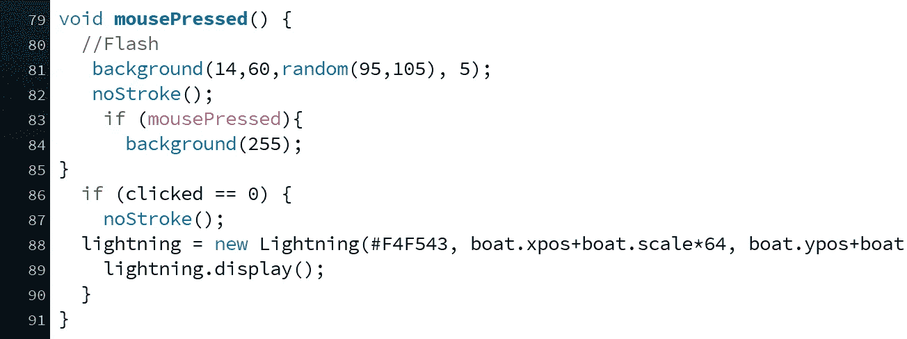

# 我用代码创造了动画。以下是方法。

> 原文：<https://towardsdatascience.com/i-used-code-to-create-animation-heres-how-a7c7cd88fccd?source=collection_archive---------15----------------------->

## 在处理过程中执行简单的 Java 代码，创建有趣、娱乐和有用的动画。


[KOBU 社](https://unsplash.com/@kobuagency?utm_source=unsplash&utm_medium=referral&utm_content=creditCopyText)在[Unsplash](https://unsplash.com/s/photos/animation?utm_source=unsplash&utm_medium=referral&utm_content=creditCopyText)【1】上的照片。

# 目录

1.  介绍
2.  处理
3.  编码
4.  例子
5.  摘要
6.  参考

# 介绍

从我的文章中，你会学到两个要点:

> 1.处理软件平台是什么。
> 
> 2.如何执行代码来创建一个娱乐性和美观的动画？

你不需要成为一个专业的程序员或软件开发人员来创建令人敬畏的可视化。在本教程和大纲中，有几种方法可以展示用一点点代码和一点点处理技巧可以做些什么。本文中的所有原则也可以应用于可视化数据科学计划。最终，你将能够呈现一个动人的动画；一张信息图、一幅有趣的漫画或一个具有强大视觉效果的故事。通过使用易于理解的可视化和动画，该工具可用于将复杂的数据科学结果解释为非技术用途。

*本文中的例子具体展示了一艘帆船在海洋上穿过雷暴。类似于 Excel、Tableau 或 Google Data Studio 的图表、图形和地图也可以在处理中执行。要了解有关处理的更多信息，请阅读下面的内容，以及对所用代码的进一步解释和更多代码的参考资料。最后，如果你想跳到最后的动画，请点击视频。*

# 处理



当您单击鼠标来激活灯光时，创建一个动作的示例代码。作者截图[2]。

[Processing](https://processing.org/)【3】是一个没有多少人听说过的软件，但是非常有价值，当然，使用起来也很有趣。它被认为是一个为独特的可视化编码的素描本。这些视觉效果甚至可以被认为是艺术，因为代码是由用户一行一行地编写的，创作的数量是无穷无尽的。主要由 Java 代码组成，用户创建相互继承的编程类和 voids，这将最终创建移动和动画的形状。

> Processing 和 Java 的伟大之处在于，使用这个工具，你不需要成为一个专业的数据科学家或软件工程师。

因为它是**开源的**，这意味着有大量可用的信息和代码，你可以在他们的网站上找到模板、教程和想法，让你可以制作相同的可视化和动画。一旦您也习惯了它，并从中学习，您就可以添加自己的代码并创建个性化的输出来共享。

# 编码


由[欧文·史密斯](https://unsplash.com/@mr_vero?utm_source=unsplash&utm_medium=referral&utm_content=creditCopyText)在[Unsplash](https://unsplash.com/s/photos/animation?utm_source=unsplash&utm_medium=referral&utm_content=creditCopyText)【4】上拍摄。

> 如果您对代码本身感兴趣，请阅读这里；如果没有，继续滚动，看看成品是什么样子，以及可用的模板和例子的信息。

**闪电动画**

我将在这里概述本文最终可视化中使用的一个类。闪电级是一个黄色的动画形状，将在这场暴雨中击中船只。它是一个包含对象的颜色、位置和形状坐标的类。如您所见，有几个顶点，它们是 X 和 Y 坐标的位置，最终充当闪电形状的轮廓。你用同样的颜色填充灯光轮廓，这样它看起来完全是实心的。下面的代码[6]创造了闪电的形状:

```
class Lightning {
color c;
float xpos;
float ypos;Lightning(color tempc, float tempxpos, float tempypos) {
c = tempc;
xpos = tempxpos;
ypos = tempypos;
}void display(){
beginShape();
noStroke();
fill(c);vertex(xpos+246, 0);
vertex(xpos+145, ypos-285);
vertex(xpos+172, ypos-269);
vertex(xpos+54, ypos-184);
vertex(xpos+89, ypos-178);
vertex(xpos, ypos);vertex(xpos+112, ypos-187);
vertex(xpos+94, ypos-191);
vertex(xpos+210, ypos-278);
vertex(xpos+189, ypos-291);
vertex(xpos+300, 0);
endShape(CLOSE);
endShape(CLOSE);
}
}
```

上面的代码指的是一个特定的形状，但是，有一个特定的模板或格式，你可以按照它来开发你的第一个简单的动画。通常的代码模板是:

*   *空设置()-形状的尺寸*
*   *void draw() —背景的颜色*

还有其他几个独特的处理部分，比如鼠标点击，这意味着当你点击鼠标*时，这个 X 动画*就会出现。

# 例子

为了找到大量的例子来练习，OpenProcessing 在他们的网站上编辑了一个独特的列表。

这个[代码](https://gist.github.com/mprzybyla123/c082cc34a6fc177a145b8f3b4d8871fa)【6】是用来创建视频中动画的一些代码。它非常全面，但对于学习如何包含不同的颜色、形状和动画是一种有益的方式。

最终产品。下面是动画[7]。执行代码后，或'*击中 play* '，帆船将在暴雨中开始移动，随后由于雷击在船上造成一些损坏，并将继续在水面上向右移动，也变得更靠近移动的风车:

加工最终的[动画](https://www.youtube.com/watch?v=p7jQWiDElSk)。作者视频[7]。

# 摘要

起初，处理看起来令人生畏，但是通过使用代码样本、示例和教程，您可以学习制作几乎任何您想要的动画。无论是抽象艺术、图表、类似漫画的动画，还是在暴风雨中航行的船只，处理都允许用户表达他们的创造力。像 Tableau 这样的工具是可视化的领跑者，这个软件被证明是一个独特的技能集，你可以将其作为简历、教育或工作的一部分，特别是作为一名数据科学家甚至软件工程师。我希望你觉得这篇文章有趣，谢谢你的阅读！如有疑问，欢迎在下方评论。

# 参考

[1]照片由 [KOBU 机构](https://unsplash.com/@kobuagency?utm_source=unsplash&utm_medium=referral&utm_content=creditCopyText)在[Unsplash](https://unsplash.com/s/photos/animation?utm_source=unsplash&utm_medium=referral&utm_content=creditCopyText)(2018)上拍摄

[2] M.Przybyla，处理截屏，(2020 年)

[3] [加工](https://processing.org/)，(2020)

[4]Irvan Smith 在 [Unsplash](https://unsplash.com/s/photos/animation?utm_source=unsplash&utm_medium=referral&utm_content=creditCopyText) 上拍摄的照片，(2018)

[5] [打开处理](https://www.openprocessing.org/browse/#)，(2020)

[6] M.Przybyla，[要点](https://gist.github.com/mprzybyla123/c082cc34a6fc177a145b8f3b4d8871fa)，(2020)

[7] M.Przybyla，[动画](https://www.youtube.com/watch?v=p7jQWiDElSk)，(2020)