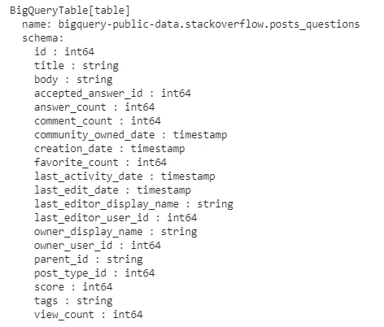
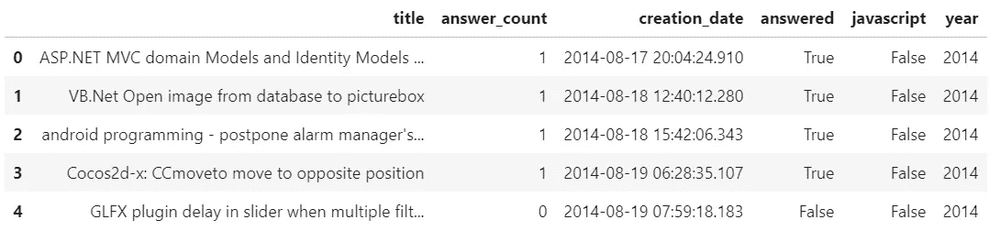
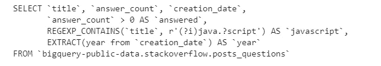
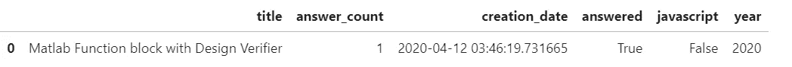

# Ibis:用于开发和生产的 Python 数据分析框架

> 原文：<https://towardsdatascience.com/ibis-a-framework-to-tie-together-development-and-production-code-588d05e07d11?source=collection_archive---------32----------------------->

## Ibis 通过统一的 API 将开发和生产阶段结合在一起。


由[亚历克斯·维根](https://unsplash.com/@alwig64?utm_source=medium&utm_medium=referral)在 [Unsplash](https://unsplash.com?utm_source=medium&utm_medium=referral) 上拍摄的照片

训练完你的机器学习模型后，你想投入生产。一旦您的模型被提供并准备好进行预测，您可能需要在将收到的数据发送到模型之前对其进行预处理。这可能是某种类型的要素工程或数据清理，但无论是什么，通常都会使用标准数据框来完成，一次一个样本。

然而，当您仍处于开发阶段时，您正在处理更大的数据，可能有数百万个训练样本或更多。在这种情况下，使用常规数据帧(例如熊猫)会太慢。所以你求助于其他工具，比如 Spark，BigQuery 等。

这就存在一个潜在的问题:这些工具有不同的 API。对于 Spark，它将是 big Spark 的 DataFrame API 对于 BigQuery，应该是 SQL。诸如此类。要点是:这段代码不同于您将在生产中使用的代码。从长远来看，维护两个不同的代码库并不是一个好主意。

有解决这一困境的办法。例如，使用谷歌的数据流，它可以完全消除它，因为数据流可以在训练和预测时使用。另一个解决方案涉及 **TensorFlow Extended** ，它的创建正是为了解决深度学习应用的这个问题。或者，您可以尝试尽可能多地提取核心功能，并使其可由定型代码和预测代码重用。

这些解决方案都不完美，尽管 Ibis 也不完美，但这是一个有趣的提议，因为它从另一个角度处理问题，因此在这个领域非常独特。

Ibis 提议的是一个用于数据操作的 api，以及一个核心引擎，它将根据后端把这个高级 api 翻译成低级代码。因此，如果我们使用一个 **pandas** 后端，Ibis 将翻译成 pandas python 代码。如果我们使用一个 **BigQuery** 后端，Ibis 将转换成 SQL。用户使用 Ibis api 编写代码，只是在训练和预测之间交换后端。

目前，Ibis 支持相当多的后端:pandas、Spark、BigQuery、PostgreSQL、sqlite 等等。在项目健康方面，有一些正在进行的提交和问题，尽管它不是有史以来最活跃的项目。熊猫的创造者韦斯·麦金尼几年前是一名投稿人，但现在不是了。

让我们看一个具体的例子，因为我是 BigQuery 的粉丝，所以我就从它开始。我将使用`stackoverflow`公共数据集，特别是`posts_questions`表。

安装必备组件:

```
pip install ibis-framework 
pip install ibis-framework[bigquery]
```

为了连接到 BigQuery，我使用一个凭证文件:

```
from google.cloud import bigquery 
from google.oauth2.service_account import Credentials credentials = Credentials.from_service_account_file('path_to_file') client = bigquery.Client(credentials=credentials,
                         project=credentials.project_id )
```

然后连接到表:

```
import ibis conn = ibis.bigquery.connect(project_id=credentials.project_id,
                             credentials=credentials ) table = conn.table('posts_questions', 
                   database='bigquery-public-data.stackoverflow')
```

我们可以`print(table)`:



现在，我们可以进行一些简单的数据操作(例如，创建新列):

```
projection = table['title', 'answer_count', 'creation_date'] projection = projection.mutate(
          year=projection.creation_date.year(),
          javascript=projection.title.re_search('(?i)java.?script'),
          answered=projection.answer_count > 0)
```

此时，实际上没有从 BigQuery 中检索到任何行。Ibis 只构建了内部执行图。

要实际执行查询:

```
res = projection.head().execute() 
res
```



您会注意到，在上面的代码中，我只要求我的投影的头部，所以我只得到 5 行返回，但是我可以很容易地在整个表上运行查询。为了好玩，我们可以编译我们的投影，并查看 Ibis 为我们生成的代码:

```
ibis.bigquery.compile(projection)
```



漂亮！

再过几个月，我们就可以投入生产了。这意味着，我们需要对小熊猫数据帧进行完全相同的预处理。

没问题:

```
import pandas as pd 
from datetime import datetime df_local = pd.DataFrame({
    'title': ['Matlab Function block with Design Verifier'],  
    'answer_count': [1],
    'creation_date': [datetime.now()]
})
```

Ibis 连接到本地数据框的方式如下:

```
conn = ibis.pandas.connect({'data': df_local}) 
projection = conn.table('data')
```

下面是我们在 BigQuery 上使用的几乎完全相同的代码:

```
projection = projection.mutate(
    year=projection.creation_date.year(),
    javascript=projection.title.re_search('(?i)java.?script'),   
    answered=projection.answer_count > 0) projection.execute()
```



美妙之处在于:我们没有被 BigQuery 所困，甚至没有被熊猫所困。例如，我们可以轻松地切换 sqlite(在磁盘上和/或内存中)或 Spark，而不需要对我们的代码库做任何修改。最后，值得一提的是，Ibis 支持所有典型的数据处理操作:聚合、过滤、连接、应用用户定义的函数等。

*结论:Ibis 是一个非常有趣的项目，值得一看。我希望看到更多关于它的活动，如果时间允许的话，也可以做出贡献，但同时，我会毫不犹豫地使用它，或者向任何寻求统一培训和生产数据处理代码的人推荐它。*

# 感谢阅读！

**链接:**

*   宜必思首页:[https://docs.ibis-project.org/index.html](https://docs.ibis-project.org/index.html)
*   如果你想看代码或者投稿:[https://github.com/ibis-project/ibis](https://github.com/ibis-project/ibis)