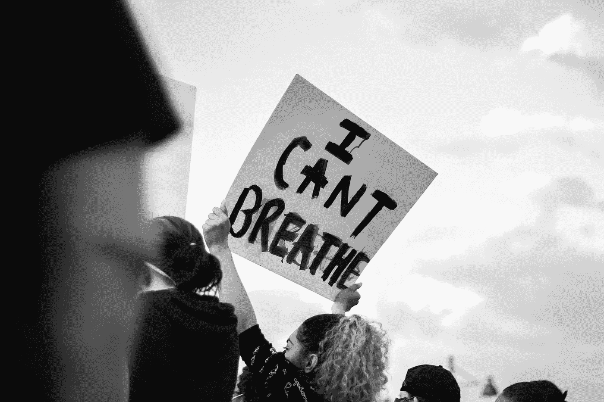

# 为了追求正义和种族平等，IBM 不再提供面部识别技术。

> 原文：<https://towardsdatascience.com/ibm-no-longer-offers-facial-recognition-technology-in-pursuit-of-justice-and-racial-equity-134aca27c2a?source=collection_archive---------62----------------------->

## 机器反映了训练它们的人的“编码凝视”——优先权、偏好和偏见。

鸣谢:[@ Cooper _ baumgartner](https://unsplash.com/@cooper_baumgartner)via[Unsplash](https://unsplash.com/photos/lZsbDaUAaA4)

> “我们认为，现在是时候就国内执法机构是否应该以及如何使用面部识别技术展开全国性对话了。”
> 
> —阿文德·克里斯纳(IBM 首席执行官)

IBM 将不再提供、开发或研究通用面部识别技术。首席执行官 Arvind Krishna [向国会](https://www.ibm.com/blogs/policy/facial-recognition-susset-racial-justice-reforms/)发表了关于有偏见的系统的内在危险的演讲，引用了对“大规模监控、种族貌相[和]侵犯基本人权和自由”的担忧。

这种奥威尔式的技术需要改革。以人工智能为燃料的自动化有助于确定谁被解雇、雇用、晋升、获得贷款或保险，甚至一个人要在监狱里呆多久。州和地方警察部门有他们自己的先进的面部识别系统，这些系统在很大程度上是不受监管的，并且已经被证明会对少数种族和少数民族造成不成比例的影响。

[截至 2016 年](https://www.perpetuallineup.org/)，每两个美国成年人中就有一个在执法人脸识别网络中。至少有四分之一的州或地方警察局可以选择通过他们或其他机构的系统进行人脸识别搜索，这影响了美国 1.17 亿人。这些系统并不是天生中立的:它们反映了那些有能力塑造人工智能的人的“优先事项、偏好和偏见——编码的目光”。

机器受到人类视觉的偏见。与其他人相比，算法在分析黑色和棕色身体时表现更差，并且错误识别 POC 的可能性高达 [100 倍。根据麻省理工学院和斯坦福大学发表的一项研究，这些偏见的存在是因为算法被输入了训练数据](https://www.washingtonpost.com/technology/2019/12/19/federal-study-confirms-racial-bias-many-facial-recognition-systems-casts-doubt-their-expanding-use/)[超过 77%的男性和 83%的白人](https://news.mit.edu/2018/study-finds-gender-skin-type-bias-artificial-intelligence-systems-0212)。当面部识别程序搜索面部照片数据库时，POC(特别是年轻的黑人男性)在可能的匹配中出现过多。即使算法被输入公平的数据来纠正有偏见的训练，现有刑事司法系统中面部识别的 [**使用可能只会复制黑人和棕色人种社区的过度监管**](https://www.yesmagazine.org/social-justice/2020/04/16/privacy-facial-recognition/) **。**

2018 年初，IBM 软件在分析性别和肤色方面的固有偏见受到了严格审查。《性别阴影:商业性别分类中的交叉准确性差异》一书的作者发现，在分析包含深色皮肤女性的图像时，存在较高的误差，而对浅色皮肤男性的分析结果最为准确。在多年试图提高准确性和减少边际结果的偏差后，IBM 决定终止该软件，这样州和联邦机构就不能再滥用该技术了。私营公司终于开始采取措施把人放在利润之上。但是这就够了吗？

[高级记分卡](https://www.perpetuallineup.org/findings#scorecard)告知普通消费者具体的州和联邦机构表现，但忽略了关于[种族偏见](https://www.perpetuallineup.org/findings/racial-bias)的具体指标。在分配和获利之前，我们需要更好地理解人工智能如何促成系统性种族主义和偏见的循环。我敦促你们在发布算法或软件系统之前，考虑一下新兴技术是如何反映编码凝视的。

> “我们冒着失去民权运动和妇女运动在机器中立的错误假设下取得的成果的风险。我们必须要求增加透明度和问责制。”
> 
> — [性别差异](http://gendershades.org/overview.html)

# 你能做些什么来保持消息灵通？

*   跟随[米米·奥诺哈](http://mimionuoha.com/)，布鲁克林的艺术家、研究员和技术专家调查数据收集的社会含义。她的工作使用文本、代码、性能和对象来探索缺失的数据以及人们被抽象、表现和分类的方式。
*   与半机械人妈妈(又名[戴安娜·努塞拉](http://www.kresgeartsindetroit.org/portfolio-posts/diana-j-nucera))保持同步。她是一名组织者和艺术家，她的工作重点是开发受欢迎的教育材料，使社区能够使用媒体和技术来调查、阐明和开发应对挑战的有远见的解决方案。她的音乐和激光表演创造了连接故事、振奋灵魂和提升我们集体科技意识的机会。
*   看看这篇关于人工智能的文章。
*   考虑向[为未来而战](https://www.banfacialrecognition.com/)捐款，这是一个非营利性的草根倡导组织，旨在组织禁止不公正的面部识别技术。

阅读一些技术文献:

*   [数学毁灭武器:大数据如何加剧不平等并威胁民主](https://www.amazon.com/Weapons-Math-Destruction-Increases-Inequality/dp/0553418831/ref=sr_1_1?crid=UFKVC2JELBI1&dchild=1&keywords=weapons+of+math+destruction+cathy+o%27neil&qid=1591721351&s=books&sprefix=weapons+of+%2Cstripbooks%2C165&sr=1-1)
*   [自动化不平等:高科技工具如何描述、监管和惩罚穷人](https://www.amazon.com/Automating-Inequality-High-Tech-Profile-Police/dp/1250074312)

感谢阅读！我真的很想听到你的反馈😃。