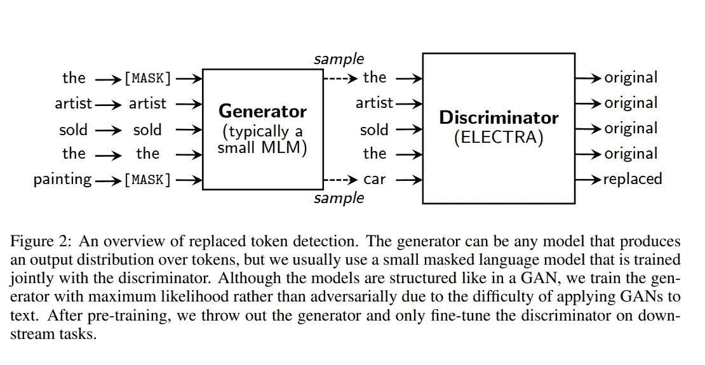
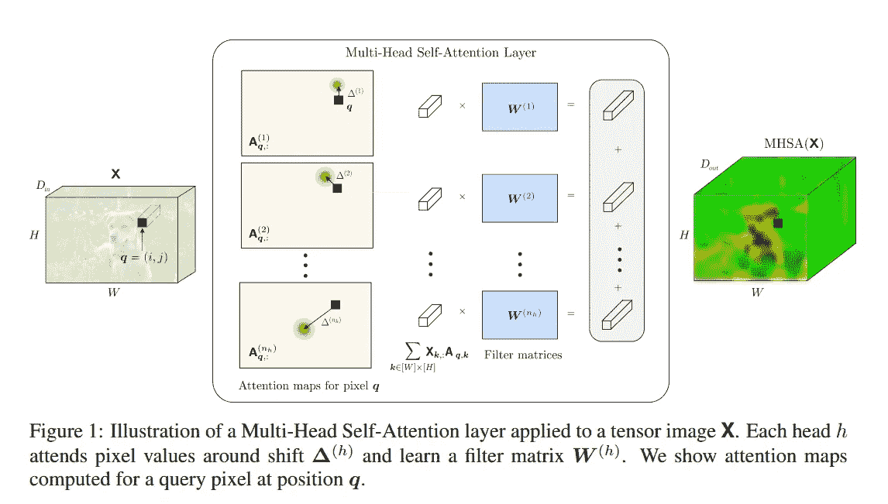
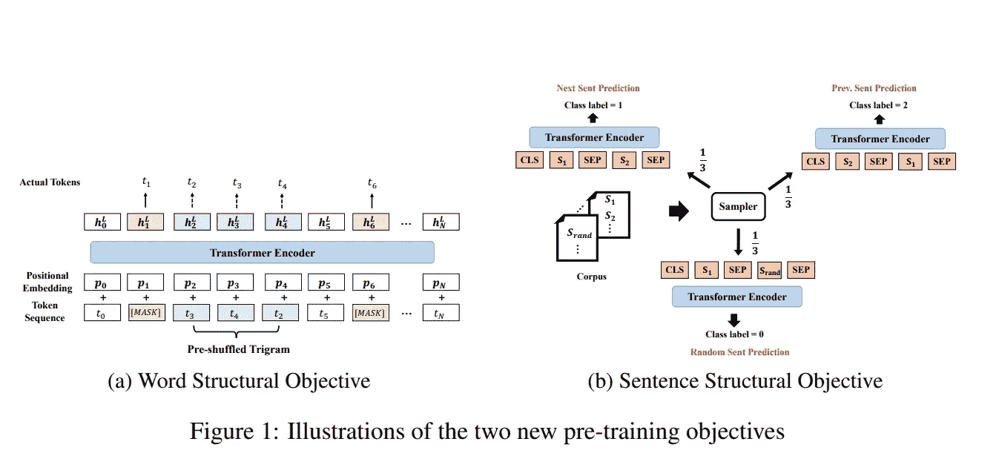

# ICLR 2020: NLP 亮点

> 原文：<https://towardsdatascience.com/iclr-2020-nlp-highlights-511deb99b967?source=collection_archive---------25----------------------->

## ICLR 2020 概述，重点关注自然语言处理(NLP)，尤其是变形金刚和 BERT 变体。

作者图片

这篇文章是我关于 ICLR 2020 的一些亮点。因为我目前的研究是自然语言处理(NLP)，所以这篇文章将重点关注这一领域。但是，计算机视觉、量子启发算法、通用深度学习方法等。也会提到。

这也是我在 Medium 上的第一篇帖子，所以我也很乐意联系并听取社区的反馈！

# 1.关于 ICLR 2020

从主网站[https://iclr.cc/](https://iclr.cc/):

https://iclr.cc/ ICLR 标志(来源:)

**学习表征国际会议(ICLR)** 是专业人士的顶级聚会，致力于促进人工智能的表征学习分支，但通常被称为深度学习

ICLR 是顶级的国际人工智能会议之一，与 NIPS 和 ICML 齐名。其中一个区别是，ICLR 的主要关注点是深度学习。

参与者可以来自许多背景，“从 **学术和工业研究人员，到企业家和工程师，到研究生和博士后。”**

审查过程是双盲和开放式审查，即作者和审查者在审查过程中互不认识，所有审查和作者的回应都可以公开查看。

[所有资料均可在 ICLR 虚拟页面上访问](https://iclr.cc/virtual_2020/index.html)

[带有 ICLR 2020 代码的文件](https://paperswithcode.com/conference/iclr-2020-1)

# 2.技术趋势

我的主要兴趣是自然语言处理(NLP)，所以我将把重点放在这个领域。

**答:热门话题:**

*   **变形金刚和预先训练好的语言模型仍然是非常热门的话题。**自从“注意力是你所需要的全部”( [Vaswani 等人，2017](https://arxiv.org/abs/1706.03762) )和“BERT:用于语言理解的深度双向变压器的预训练”( [Devlin 等人，2018](https://arxiv.org/abs/1810.04805) )在各种 NLP 任务上取得了最先进的(SOTA)结果后，研究人员继续深入研究变压器的架构和预训练的语言模型。
*   论文可以放在**理论证明方** ( [石等，2020](https://arxiv.org/abs/2002.06622)；[布鲁纳等人，2020](https://arxiv.org/abs/1908.04211)；[云等，2019](https://arxiv.org/abs/1912.10077)； [Cordonnier 等人，2019](https://arxiv.org/abs/1911.03584) 。
*   有论文关注**提高变形金刚和预训练语言模型的任务绩效**([王等 2019](https://arxiv.org/abs/1908.04577)；[李等人，2019](https://arxiv.org/abs/1909.11299) 。
*   其他一些论文关注的是**缩小模型的**或者**减少训练的**时间([吴等，2020](https://arxiv.org/abs/2004.11886)；[兰等，2019](https://arxiv.org/abs/1909.11942)；[基塔耶夫等人，2020](https://arxiv.org/abs/2001.04451)；[克拉克等人，2020](https://arxiv.org/abs/2003.10555)； [Rae 等人，2019](https://arxiv.org/abs/1911.05507)；[范等，2019](https://arxiv.org/abs/1909.11556)；[尤等，2019](https://arxiv.org/abs/1904.00962) )。
*   传统的 **LSTM，RNN** 也得到了更深入的发掘( [Melis et al .，2019](https://arxiv.org/abs/1909.01792)；[奥尔罕等人，2019](https://arxiv.org/abs/1905.13715)；[涂等著 2019](https://openreview.net/forum?id=rkgg6xBYDH)

NLP 的许多其他主题我在这里没有涉及，所以请到网站来阅读和发现这些主题。

**b .新出现的议题:**

我发现会议中出现了几个话题:

*   **多语言/跨语言任务的语言架构和模型** ( [Karthikeyan 等人，2019](https://arxiv.org/abs/1912.07840)；[Berend 2020](https://openreview.net/forum?id=HyeYTgrFPB)；[曹等人，2020](https://arxiv.org/abs/2002.03518)；[王等，2019](https://arxiv.org/abs/1910.04708)
*   **用于计算机视觉和 NLP 的量子启发算法**([Panahi 等人，2019](https://arxiv.org/abs/1911.04975)； [Kerenidis 等人，2019](https://arxiv.org/abs/1911.01117)
*   **多模态模型** ( [苏等，2019](https://arxiv.org/abs/1908.08530) )
*   **强化学习与 NLP** 跨学科([于等，2019](https://arxiv.org/abs/1906.02768)；[克里夫特等人，2019](https://arxiv.org/abs/1909.00668)
*   **模型压缩/修剪** ( [张等，2019](https://arxiv.org/abs/1912.00120) )

# 3.思想

今年是 ICLR 第一次以虚拟方式举行，从我的角度来看，组织者做了出色的工作:接受论文的搜索引擎，论文相似性的可视化，作者和参与者的聊天论坛，缩放室等。

我有机会直接询问许多作者，也参与了 NLP 和 Huggingface(一个流行的 NLP 框架)研究人员的公共论坛。我也有机会参加公司的赞助商聊天。

Yann LeCun 和 Yoshua Bengio 关于深度学习方向的最后一次演讲也非常有见地，例如如何将 NLP 中的自我监督学习成功应用于计算机视觉，他们如何看待量子算法，神经科学思想也将是重要的。他们如何走到今天的故事也很鼓舞人心。

你可以在 [VentureBeat](https://venturebeat.com/2020/05/02/yann-lecun-and-yoshua-bengio-self-supervised-learning-is-the-key-to-human-level-intelligence/) 上读到其中一篇总结。

# 4.详情:精选论文集锦:

[**【多语伯特跨语言能力实证研究】**](https://openreview.net/forum?id=HJeT3yrtDr)

多语言模型的一个流行假设是，由于语言之间的词汇重叠，它们学习得很好。在本文中，作者发现“语言之间的词汇重叠在跨语言成功中起着微不足道的作用，而网络的深度是其中不可或缺的一部分。”(Karthikeyan 等人，2020 年)

[**ELECTRA:预训练文本编码器作为鉴别器而不是生成器**](https://openreview.net/forum?id=r1xMH1BtvB)

来源: [**ELECTRA:预训练文本编码器作为鉴别器而不是生成器**](https://openreview.net/forum?id=r1xMH1BtvB)

这篇论文为计算资源少的实体预先训练他们自己的语言模型打开了大门。特别是，作者“在一个 GPU 上训练了一个模型 4 天，在 GLUE 自然语言理解基准测试中，它的表现超过了 GPT(使用 30 倍以上的计算进行训练)。”(克拉克等人，2020 年)

*   代码可在 [Github](https://github.com/google-research/electra) 上获得。
*   ELECTRA 型号可用于[支撑面](https://huggingface.co/transformers/model_doc/electra.html)。
*   在 [Github](https://github.com/nguyenvulebinh/vietnamese-electra) 上有一个针对越南人的培训前电子小程序项目

[**关于自我注意与卷积层的关系**](https://openreview.net/forum?id=HJlnC1rKPB)

来源: [**关于自我注意与卷积层的关系**](https://openreview.net/forum?id=HJlnC1rKPB)

在 NLP 任务中成功地用基于注意力的模型取代了 RNN 之后，研究人员现在正在探索他们是否可以在卷积层和计算机视觉任务中做同样的事情。在这篇论文中，作者“证明了具有足够数量的头的多头自我关注层至少与任何卷积层一样具有表达能力。我们的数值实验表明，自我关注层与 CNN 层一样关注像素网格模式，这证实了我们的分析。(Cordornnier 等人，2019 年)

*   该代码可在 [Github](https://github.com/epfml/attention-cnn) 上获得

[**StructBERT:将语言结构融入深度语言理解的前期训练**](https://openreview.net/forum?id=BJgQ4lSFPH)

来源: [**StructBERT:将语言结构融入深度语言理解的前期训练**](https://openreview.net/forum?id=BJgQ4lSFPH)

在本文中，作者添加了两个额外的预训练任务，这些任务“在单词和句子级别利用语言结构”，并在 GLUE benchmark 中取得了 SOTA 结果。(王等，2019)

[**变压器是序列间函数的通用近似器吗？**](https://openreview.net/forum?id=ByxRM0Ntvr)

本文更多的是在理论方面。在这篇论文中，作者“证明了变换器模型可以普遍地逼近紧域上任意连续的序列间函数。”他们还证明了“固定宽度的自我注意层可以计算输入序列的上下文映射，在变压器的通用近似属性中起着关键作用。”(云等，2019)

# 关于我

我是一名 AI 工程师和数据工程师，专注于研究最先进的 AI 解决方案和构建机器学习系统。你可以在 LinkedIn 上找到我。

# 参考

瓦斯瓦尼，a。新泽西州沙泽尔；新泽西州帕马尔；Uszkoreit，j；琼斯湖；戈麦斯。凯撒大帝。；和 Polosukhin，I. 2017。你需要的只是关注。神经信息处理系统进展，5998–6008。

德夫林，j。张明伟；李，k。以及图塔诺瓦，K. 2018。Bert:用于语言理解的深度双向转换器的预训练。arXiv 预印本 arXiv:1810.04805。

变压器是序列到序列函数的通用近似器吗？." *arXiv 预印本 arXiv:1912.10077* (2019)。

《论变形金刚中的可识别性》(2020).

石，，等，“变压器的鲁棒性验证”arXiv 预印本 arXiv:2002.06622 (2020)。

科多尼尔、让·巴普蒂斯特、安德里亚斯·洛卡斯和马丁·贾吉。"自我注意和卷积层的关系." *arXiv 预印本 arXiv:1911.03584* (2019)。

把语言结构融入深层语言理解的前训练。 *arXiv 预印本 arXiv:1908.04577* (2019)。

Lee，Cheolhyoung，Kyunghyun Cho 和 Wanmo Kang。"混合:微调大规模预训练语言模型的有效正则化." *arXiv 预印本 arXiv:1909.11299* (2019)。

吴，，等。〈长短距注意的简装变压器〉。arXiv 预印本:2004.11886 (2020)。

兰，等译，《阿尔伯特:一个用于自我监督学习语言表征的简易伯特》 *arXiv 预印本 arXiv:1909.11942* (2019)。

尤，杨，等《面向深度学习的大批量优化:76 分钟训练 bert》国际学习代表会议。2019.

基塔耶夫、尼基塔、祖卡斯·凯泽和安塞姆·列夫斯卡娅。"改革家:高效的变压器." *arXiv 预印本 arXiv:2001.04451* (2020)。

伊莱克特:预先训练文本编码器作为鉴别器而不是生成器 *arXiv 预印本 arXiv:2003.10555* (2020)。

《用于长程序列模拟的压缩变压器》 *arXiv 预印本 arXiv:1911.05507* (2019)。

范、安吉拉、爱德华·格雷夫和阿曼德·朱林。"通过结构化压差按需降低变压器深度." *arXiv 预印本 arXiv:1909.11556* (2019)。

Lee，Cheolhyoung，Kyunghyun Cho 和 Wanmo Kang。"混合:微调大规模预训练语言模型的有效正则化." *arXiv 预印本 arXiv:1909.11299* (2019)。

梅利斯、加博尔、托马什·科奇斯克和菲尔·布伦松。"莫格里弗·伊斯特姆" *arXiv 预印本 arXiv:1909.01792* (2019)。

Orhan、A. Emin 和 Xaq Pitkow。“用顺序非正常动力学改进循环神经网络的记忆。” *arXiv 预印本 arXiv:1905.13715* (2019)。

涂、、何凤翔、陶大成。"理解递归神经网络中的泛化."*国际学习代表会议*。2019

多语种伯特的跨语言能力:实证研究。*国际学习代表会议*。2020.

加博尔·贝伦德。"大规模多语言稀疏单词表示."(2020 年):Azonosító-2582。

曹、史蒂文、尼基塔·基塔耶夫和丹·克莱因。"上下文单词表示的多语言对齐."arXiv 预印本:2002.03518 (2020)。

王，子瑞，等。“跨语言对齐与联合训练:一个比较研究和一个简单的统一框架。” *arXiv 预印本 arXiv:1910.04708* (2019)。

帕纳西、阿里阿克巴、塞兰·萨伊迪和汤姆·阿罗兹。" word2ket:受量子纠缠启发的节省空间的单词嵌入." *arXiv 预印本 arXiv:1911.04975* (2019)。

克伦尼迪斯，约尔达尼，乔纳斯·兰德曼和阿努帕姆·普拉卡什。"深度卷积神经网络的量子算法." *arXiv 预印本 arXiv:1911.01117* (2019)。

苏，，等。〈视觉语言表征的预训练〉。 *arXiv 预印本 arXiv:1908.08530* (2019)。

陈、于、吴和穆罕默德扎基。"基于强化学习的自然问句生成图序列模型." *arXiv 预印本 arXiv:1908.04942* (2019)。

《逻辑和$ 2 $-单纯变压器》 *arXiv 预印本 arXiv:1909.00668* (2019)。

张，马修·顺时，和布拉德利·斯塔迪。"通过雅可比谱评估对递归神经网络进行一次性剪枝." *arXiv 预印本 arXiv:1912.00120* (2019)。

余，郝楠，等。〈用奖励和多种语言玩彩票:RL 和 NLP 中的彩票〉 *arXiv 预印本 arXiv:1906.02768* (2019)。