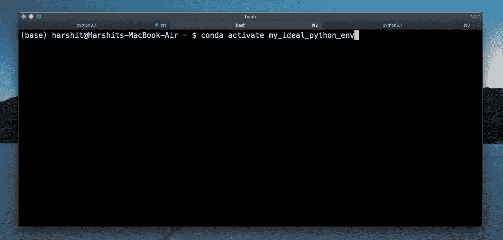
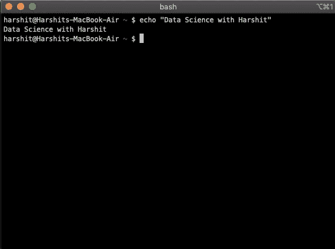

# 数据科学的理想 Python 环境设置

> 原文：<https://towardsdatascience.com/ideal-python-environment-setup-for-data-science-cdb03a447de8?source=collection_archive---------10----------------------->

## 设置 Python 环境以开始数据科学项目的指南。



视频教程带你完成这个过程。

手头有一个数据科学项目要开始吗？不确定什么是合适的 Python 机构来平滑这个过程？你不需要再深入，因为这篇文章将解决数据科学环境中的所有问题，让你在本地工作。我们将介绍在您开始从这些数据中抽离出来之前，您可能需要安装的工具、软件包或软件。

您需要开始项目的三个要素是:

1.  在你的机器上安装一个 UNIX shell 并熟悉它。
2.  **Anaconda**
3.  **Git 和 GitHub —** 使用最令人惊叹的版本控制系统来跟踪变更，并优化协作开发，从而对您的项目进行版本控制。

## **1。UNIX shell**



数据科学家或软件工程师几乎每天都在使用 UNIX shell 来完成他们过多的分析任务。

UNIX shell 对数据科学家的重要性:

在某个阶段之后，你的项目将不得不投入生产。你将在一个云计算平台上工作，比如谷歌云平台或亚马逊网络服务。几乎所有的平台都是基于 Linux 的，并且要求您使用 UNIX shell。这里有一个关于 shell 脚本的[备忘单](https://gist.github.com/LeCoupa/122b12050f5fb267e75f)。

我们将使用命令行界面来安装 anaconda、git 并执行其他操作，如启动 jupyter notebook 本地服务器、提交和推送我们对远程存储库的更改。

**MacOS 用户:**您的系统已经有了一个 Unix shell(bash)。如果没有，可以用[自制](https://docs.brew.sh/)安装。

**Windows 用户:** Windows 没有附带 UNIX shell。你可以安装 [Cygwin](https://www.cygwin.com/) ，它提供了一系列 GNU 和开源工具以及 Windows 上的其他功能。

## 2.安装 Python 和 Anaconda


蟒蛇标志

要设置您的 python 环境，您首先需要在您的机器上安装一个 python。有各种 python 发行版可用，我们需要最适合数据科学的版本。Anaconda 附带了自己的 Python 发行版，将与它一起安装。

为什么是蟒蛇？

数据科学通常需要你使用许多科学软件包，如 scipy 和 numpy，数据操作软件包，如 pandas 和 IDEs，以及交互式 [Jupyter Notebook](https://jupyter.org/index.html) 。
Anaconda 自带 conda(用于命令行界面)和 [Navigator](https://docs.anaconda.com/anaconda/navigator/) (用于图形用户界面)。它是所有这些包版本和依赖项的完美管理器。

现在，你不需要担心任何 python 包，大多数都是预装的，如果你想安装一个新的包，你可以简单地通过使用 *conda* 或 *pip* 来完成。

以下是 Anaconda[n for MAC OS 安装的分步指南:](https://docs.anaconda.com/anaconda/install/mac-os/)

 [## 在 macOS 上安装- Anaconda 文档

### 您可以使用图形化安装程序(“向导”)或命令行(“手动”)指令来安装 Anaconda

docs.anaconda.com](https://docs.anaconda.com/anaconda/install/mac-os/) 

[为 Windows 安装 Anaconda。](https://docs.anaconda.com/anaconda/install/windows/)

[为 Linux 安装 Anaconda。](https://docs.anaconda.com/anaconda/install/linux/)

【Conda 环境管理

随着您的进步，您会发现自己正在处理多个应用程序/项目。这些应用程序将依赖于不同版本的 Python/包。您将与一个团队/合作伙伴一起工作，并且可能想要标准化配置，以便他们都能够运行项目。

在这种情况下，您需要创建和配置不同的环境。

Conda 帮助了我们，它允许我们创建包含文件、包及其依赖项的独立环境，这些环境与其他环境相隔离。

## 使用 conda 环境

1.  使用 conda 创建一个名为`dswh_env`的新环境:

```
conda create --name dswh_env
```

您的环境现在已经创建，但是您现在还没有使用它。

2.使用或激活环境:

```
conda activate dswh_env
```

3.如果您想查看系统中的所有环境，请键入:

```
conda info --envs
```

4.要停用环境，请使用:

```
conda deactivate
```

## 3.安装 Git 和使用 GitHub

版本控制是程序员的福气，Git 是使用最广泛的版本控制系统。它允许我们跟踪我们的进展。我们有一个日志，记录了我们什么时候做了什么，并允许我们回到项目的前一个状态。

GitHub 是一个基于云的代码托管服务，可以帮助你跟踪你的源代码历史。如果我们想在本地跟踪我们的项目，我们不需要使用 GitHub。但是，如果你正在与一个团队合作，或者如果你想展示你的项目和技能，你可以通过把你的项目以存储库的形式发布出来，在 GitHub 上建立一个强有力的档案。

1.  下面是为您各自的机器安装 Git 的链接:

[](https://git-scm.com/book/en/v2/Getting-Started-Installing-Git) [## Git -安装 Git

### 在开始使用 Git 之前，您必须让它在您的计算机上可用。即使已经安装了，也是…

git-scm.com](https://git-scm.com/book/en/v2/Getting-Started-Installing-Git) 

2.如果您没有帐户，请在 [GitHub](https://github.com) 上创建一个帐户。

## 摘要

随着对每个组件的熟悉，您现在应该能够使用 **UNIX shell、Python & Anaconda 和 Git** 来设置您的环境。

# Harshit 的数据科学

通过这个渠道，我计划推出几个涵盖整个数据科学领域的系列。以下是你应该订阅[频道](https://www.youtube.com/channel/UCH-xwLTKQaABNs2QmGxK2bQ)的原因:

*   该系列将涵盖每个主题和副主题的所有必需/要求的高质量教程。
*   解释了为什么我们在 ML 和深度学习中做这些事情的数学和推导。
*   与谷歌、微软、亚马逊等公司的数据科学家和工程师以及大数据驱动型公司的首席执行官的播客。
*   项目和说明，以实现迄今为止所学的主题。

[](https://www.youtube.com/channel/UCH-xwLTKQaABNs2QmGxK2bQ) [## Harshit 的数据科学

### 涵盖整个数据科学课程和其他所有内容。指导了 1500 多名学生，课程…

www.youtube.com](https://www.youtube.com/channel/UCH-xwLTKQaABNs2QmGxK2bQ) 

你可以在 [LinkedIn](https://www.linkedin.com/in/tyagiharshit/) 、 [Twitter](https://twitter.com/tyagi_harshit24) 或 [Instagram](https://www.instagram.com/upgradewithharshit/?hl=en) 上与我联系(在那里我谈论健康和福祉。)

注意:在这些黑暗的时期，自我隔离为自我提升腾出了一些空间，我们可以利用这些空间来发展新的技能、爱好，并帮助未来的自己。