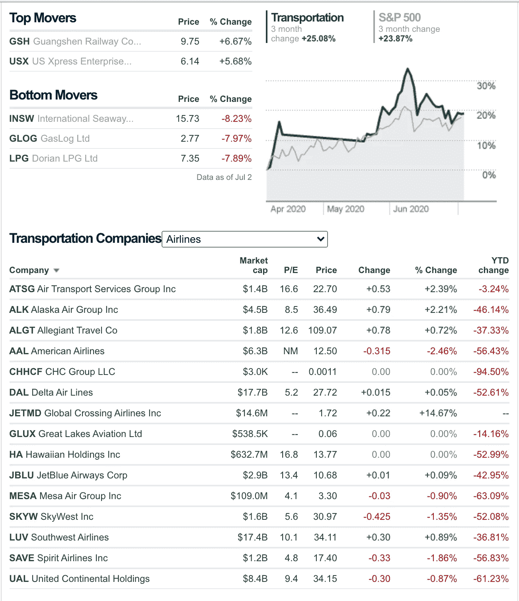
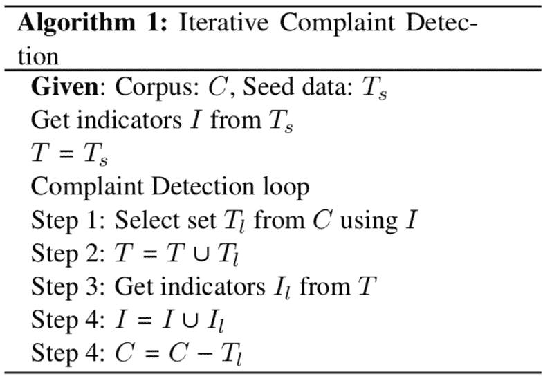
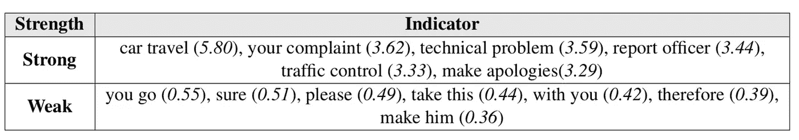
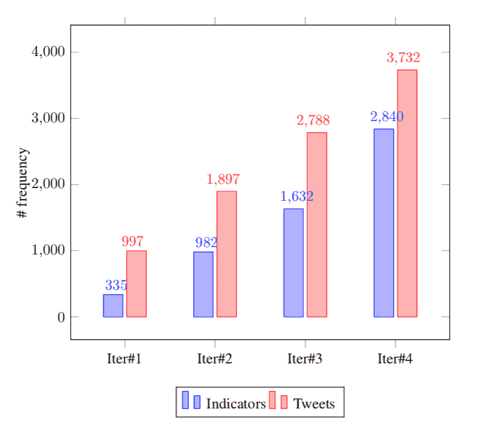
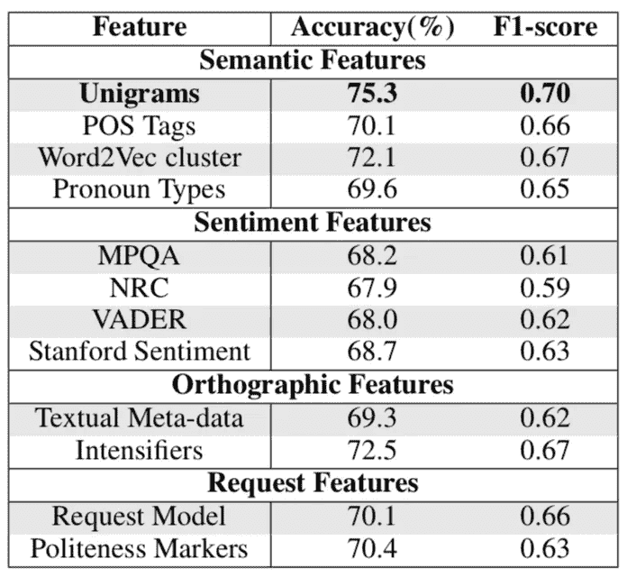

# 识别社交媒体上与投诉相关的帖子

> 原文：<https://towardsdatascience.com/identification-of-complaint-relevant-posts-on-social-media-4bc2c8b625ca?source=collection_archive---------63----------------------->

## 针对投诉检测的平台无关的半监督方法的初步工作

通过这篇博客，我旨在解释在 2020 年计算语言学协会第三届电子商务和 NLP 研讨会上接受的论文“**针对社交媒体中特定领域投诉检测的半监督迭代方法**”中所做的工作。这个顶级场所服务于研究的融合，包括但不限于计算语言学、认知建模、信息提取和语义学。这项工作是首次尝试利用分散的社交媒体景观来列出投诉和识别不满。我们通过在社交媒体平台 Twitter 上评估交通相关服务来强调我们方法的实用性。这篇文章将简要概述这项研究的动机、方法和应用。更多的技术细节可以在论文中找到。我们的团队热切期待任何关于这项工作的建议和改进。

# **动机**

社交媒体最近已经成为用户表达对各种产品和服务的意见的主要场所之一。*这些意见对于了解用户对这些服务的看法和感受极其有用*。它们对于识别潜在缺陷也很有价值，并且对于下游客户服务响应的执行至关重要。像运输和物流这样的公共部门企业受到公众舆论的强烈影响，并构成一个国家经济的一个重要方面。通常，企业依靠社交媒体来确定客户反馈和初步反应。因此，自动检测社交媒体上的用户投诉可以证明对客户和服务提供商都有利。

一名社交媒体用户向相关部门表达了他们的不满。

[拥有大量市场份额的运输相关公司。](https://money.cnn.com/data/sectors/transportation/?sector=4600&industry=4610)

传统上，列出投诉涉及社交媒体用户用他们的投诉标记相关个人。然而，有一些缺点降低了这种方法的实用性。
与其他贴有相关当局标签的帖子相比，此类帖子的出现率较低。此外，媒体平台受到冗余的困扰，帖子在重新发布之前会被重新措辞或进行结构变形。此外，大量不可避免的噪音使得很难识别可能需要立即关注的帖子。

# 我们的贡献

为了建立这样的检测系统，我们可以采用有监督的方法，这通常需要大量的标记训练样本。然而，正如我们所讨论的，标记社交媒体帖子以捕捉对特定服务的投诉是一项挑战。先前在事件检测方面的工作已经证明，简单的语言指示符(短语或 n-gram)在准确发现社交媒体中的事件方面是有用的。虽然用户投诉与事件不同，更像是一种言语行为，但我们认为类似的指标也可以用于投诉检测。为了追求这一假设，我们提出了一种半监督迭代方法来识别抱怨特定服务的社交媒体帖子。在我们的实验工作中，我们从 326 个交通投诉样本的注释集开始，经过该方法的四次迭代，我们收集了 2，840 个指标和超过 3，700 条推文。我们从最终数据集中随机抽取了 700 条推文进行注释，发现超过 47%的样本是实际的交通投诉。我们还描述了基本分类算法在这个数据集上的性能。在这样做的时候，我们还研究了不同的语言特征是如何对该领域中的监督模型的性能做出贡献的。

# 方法和途径

我们提出的方法从大量与交通相关的推文和少量带注释的投诉开始。我们使用这些标记数据来创建一组*种子*指标，以驱动我们迭代投诉检测流程的剩余部分。

## 数据收集

我们将实验集中在 2018 年 11 月至 2018 年 12 月期间。我们创建交通相关推文语料库的第一步是识别与交通领域相关的语言标记。为此，我们从交通相关的[网络论坛](https://www.theverge.com/forums/transportation) *中随机搜集了一些帖子。*这些论坛让用户讨论他们的不满，并提高对各种交通相关问题的认识。然后，我们处理这些数据，提取具有高 tf-idf 分数的单词和短语(单字、双字和三字)。然后，我们让人工注释者进一步删除重复和不相关的项目。

我们使用 Twitter 的公共流 API 来查询在所选时间范围内包含 75 个短语中任何一个的推文。然后，我们排除了非英语推文和任何少于两个令牌的推文。这导致收集了 19，300 条推文。我们将这个集合称为文集 *C* 。我们从这个集合中随机选择了 1500 条推文作为人类注释的样本。我们雇佣了两名人工注释者从这 1500 条推文中识别与交通相关的投诉。手稿中提到了注释细节。在注释者不同意的情况下，标签通过讨论来解决。分歧解决后，最终的种子数据集包含 326 个与交通相关的投诉样本。我们将这个集合称为 *Ts* 。

从精选数据集中识别为投诉相关的示例推文图像。从图像中删除个人识别信息。

## 迭代算法

图中总结了我们提出的迭代方法。首先，我们使用种子数据 *Ts* 构建一组投诉的语言指标 *I* 。然后，我们使用这些指标从语料库 *C* 中获取潜在的新投诉 *Tl* 。然后我们合并 *Ts* 和 *Tl* 来构建我们的新数据集。然后，我们使用这个新的数据集来提取一组新的指标。指标与原指标 *I* 结合，提取出下一版本 *Tl* 。这个过程一直重复，直到我们再也找不到任何新的指标。

迭代投诉检测算法。

## 提取语言指标

如算法所示，提取语言指标(n-grams)是该过程中最重要的步骤之一。这些指标对于识别最有可能是特定领域投诉的推文至关重要。我们采用两种不同的方法来提取这些指标。对于带注释的种子数据 *Ts* ，我们只选择 tf-idf 得分最高的 n 元文法。在我们的实验工作中， *Ts* 有 326 条带注释的推文。我们确定了 50 个具有最高 tf-idf 分数的 n-grams 来初始化 *I* 。一些例子包括像*问题、车站、服务、通行费、回复、故障、提供信息、司机、地区、*和*乘客这样的术语。*

当从没有注释的 *Tl* 中提取指标时，可能会出现不一定表示投诉的频繁出现的短语。这些短语可能会导致后续迭代中的概念漂移。为了避免这些离题，我们在选择指标时使用了一个**域相关性**的度量。这被定义为 n-gram 在 *Tl* 中的频率与在 *Tr* 中的频率之比。 *Tr* 是随机选择的不与 *C* 相交的 tweets 的集合。我们将 *Tr* 定义为来自不同时间范围的 5000 条推文的随机样本，而非 *C.*

我们的迭代方法在四轮中收敛，之后没有提取任何新的指标。经过四次迭代，这种方法选择了 3732 条推文，生成了 2840 个独特的指标。我们还手动检查了流程中选择的指标。我们观察到，只有域相关性分数大于 2.5 的指标被选择用于后续迭代。

一些强弱指标的例子。括号中的数字表示各自的域相关性分数。

每次迭代后收集的指标和 tweets 的频率。

我们从最终的投诉数据集 *T* 中随机选择了 700 条推文，并手动对它们进行了注释，以帮助理解质量。手稿中已经讨论了这些指导方针，并且也使用了和以前一样的注释者。注释者获得了 kappa= 0.83 的高一致分数。在解决分歧后，我们观察到 332 条推文被标记为投诉。这占了 700 条样本推文的 47.4%。这表明，我们的半监督方法选择的近一半推文是与交通相关的投诉。这在原始 seed 数据 *Ts* 中的比例要高得多，其中只有 21.7%是实际投诉。

## 系统模型化

我们进行了一系列实验，以了解我们是否可以自动建立简单的机器学习模型来检测投诉。这些实验还帮助我们评估最终数据集的质量。此外，这项实验工作还研究了不同类型的语言特征如何有助于发现社交媒体投诉。对于这些实验，我们使用 700 篇文章的注释样本作为测试数据集。我们通过从原始语料库 *C* 中选择另外 2000 个帖子来建立我们的训练数据集，并再次对它们进行注释。为了评估机器学习算法的预测强度，我们使用了各种语言特征。这些特征可以大致分为四组。

(i) **语义:**第一组特征基于简单的语义属性，例如 *n-grams、单词嵌入*和*词性标签*。

(ii) **情感:**第二组特征基于预先训练的*情感模型*或*词汇库*。

(三)**正投影**:第三组特征使用*正投影信息*，如*标签*、*用户提及*、*增强符*。

(iv) **请求**:最后一组特征再次使用与一个*请求*相关联的预训练模型或词典，这是一个密切相关的言语行为。

出于实验目的，我们对来自每个预训练模型或词典的完整推文使用了定量或归一化的分数。关于这些类型特征的先前文献的更多细节可以从该论文中获得。

## 结果

我们使用描述的每一个特征训练了用于投诉检测的逻辑回归模型。表现最好的模型基于 unigrams，准确率为 75.3%。不同情感模型的性能没有显著差异。有趣的是，观察到简单的特征，如不同代词类型的数量和加强词的数量，具有很强的预测能力。总的来说，我们观察到这里研究的大多数特征都有一些预测抱怨的能力。

与不同类型特征相关的预测准确性和 F1 值。分类器利用逻辑回归(弹性网络正则化),因为与同类产品相比，它具有最佳性能。

## 这项研究的潜在使用案例

正如所讨论的，我们所提出的架构的效用是多方面的:
(i)我们相信我们的工作可能是**改进**下游任务的第一步，这些任务与投诉相关，例如聊天机器人开发、创建自动查询解决工具或收集关于服务的低成本公众意见。(ii)我们的方法将帮助语言学家从词汇或语义的角度理解**批评和抱怨中使用的语言。
(iii)所提出的方法具有高度的**灵活性**，因为它可以根据种子数据中使用的词汇扩展到其他领域。
(iv) **架构的迭代**本质减少了人为干预，因此在训练阶段不会出现任何无意的偏差。这也使得**对帖子中随时间发生的词汇变化具有鲁棒性**。
(iv)由于它是半监督的，因此**减少了**投诉检测对大量预标记样本的依赖，并且**减轻了**监督方法中普遍存在的类别不平衡问题。**

# 结论和未来工作

作为这项工作的一部分，我们提出了一种迭代半监督方法，用于自动检测投诉。投诉解决是各种基于产品的公司的产品改进计划的重要部分；因此，我们认为，我们提出的方法可以有效地衡量公众意见的低成本评估或路由投诉到适当的平台。我们手动验证了所提出方法的有效性，并观察到在收集投诉相关推文方面有显著的改进。未来，我们的目标是部署聚类机制来隔离不同性质的事件相关推文。我们还计划使用额外的元数据上下文和 tweet 会话性质来增强系统性能。我们的团队热切地期待着关于这篇论文的任何反馈或建议。请随时联系论文的作者。我希望这篇文章能激励另一位像我这样的年轻研究人员去着手解决一个相关的社会问题，并利用人工智能和数据科学的潜力来解决这个问题。

# 相关链接

 [## 社交媒体中特定领域投诉检测的半监督迭代方法

### 摘要在本文中，我们提出了一种半监督自举方法来检测产品或服务相关的…

www.aclweb.org](https://www.aclweb.org/anthology/2020.ecnlp-1.7/)  [## MIDAS-研究/运输-投诉-检测

### 这个语料库可以免费用于研究目的。下面列出的文件提供了创建和使用…

github.com](https://github.com/midas-research/transport-complaint-detection)