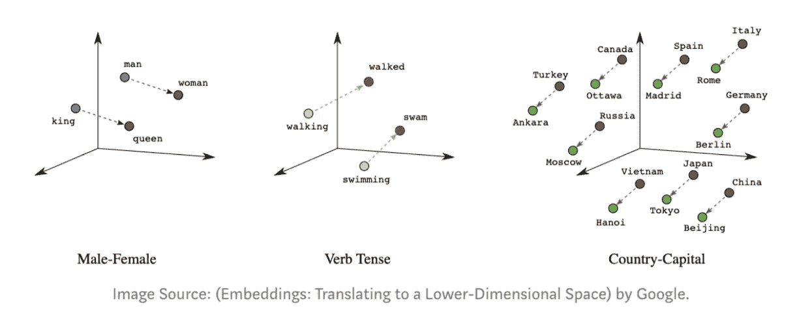
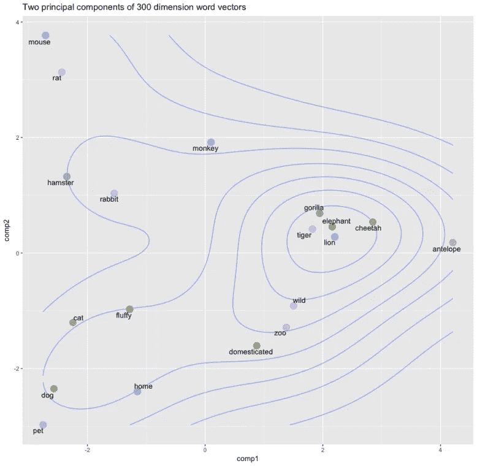
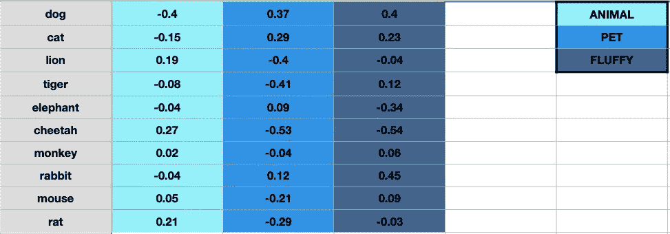
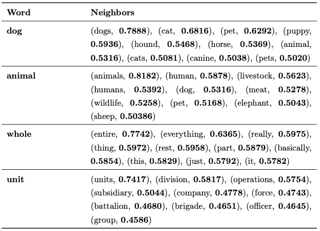

# 识别词汇语义词的关系——初学者指南

> 原文：<https://towardsdatascience.com/identification-of-lexico-semantic-word-relations-a-beginners-guide-427ed331e287?source=collection_archive---------38----------------------->

## 对我目前工作的一个虚拟介绍——识别一对给定单词之间的语义关系的本质。

当我请求你“请容忍我”的时候，你让自己做好了不得不容忍我的准备。如果你被告知“这个泰迪熊是毛绒绒的”，你的大脑会想象出一个柔软、可爱、毛茸茸的玩具，让蹒跚学步的孩子抱上床。如果你读到熊濒临灭绝，你会想到北极海冰中的北极熊。当他们在下周的新闻中告诉你冠状病毒危机让我们陷入了我们这一代人最糟糕的熊市时，你会本能地知道他们在谈论股票。

你的英语知识，以及你理解上下文依赖、词汇和句法结构以及语言细微差别的能力，有助于你区分同一个词的四种意思。你认为这是理所当然的，几乎不去想它，但是你花了很多年才获得这种能力。你直接或间接地从你的个人经历中学习。你通过在上下文、信息、行为和反应之间建立联系来学习。当你下意识地触发一组中子来交流或倾听时，神经认知反应的级联反应是一个奇迹。所有这些再加上你的遗传天赋，让语言对你来说毫不费力。

另一方面，理解人类语言对计算机来说是个难题。不像你和我，计算机没有像我们一样进行语言训练的特权。甚至编程语言也不由它们直接解释——它们首先被转换成低级机器语言。真正的*机器码*仅仅是一串原始的，通常是二进制的(1 和 0)数据。虽然人类获得了分析、处理、推断和交流的能力，但对于计算机来说，从人类语言中挑选出来的任何单词都是难以理解的胡言乱语，直到它接受了足够的训练来理解这种语言。

这项任务是教机器像我们一样理解语言，这被称为自然语言处理或 NLP。NLP 是人工智能的一个分支，它本身是许多其他子问题的保护伞。这类问题的日常例子有搜索、语音识别、翻译、摘要、问答等。但是所有这些都回避了一个问题——如果计算机除了 1 和 0 什么也不懂，它们怎么能理解人类语言的复杂性呢？

# 单词向量—以数字的形式表示单词

考虑一个空间，其中所有的英语单词都是基于它们的语义特征来填充的。这个想象的空间是这样的，共享相似描述或概念的词共享相似的空间属性。例如,“猫”和“狗”这两个词会非常接近，因为猫的概念和狗的概念非常相似。两者都是四足动物，是可爱宠物的家养品种。对于意义不相似但代表相同概念的单词，单词相对于彼此的位置概括了这种关系。在语义空间中,“国王”与“王后”的相对位置类似于“男人”与“女人”或“男孩”与“女孩”之间的相对位置，因为在所有三种情况下分隔单词的定义概念是相同的——性别。

在下面的语义空间示例中，您可以看到狮子、老虎、猎豹和大象等动物的向量非常接近。这很直观，因为它们经常在相似的上下文中被讨论；例如，这些动物很大，是野生的，而且有潜在的危险——事实上，描述性的单词“野生”与这组动物非常接近。

由于单词最纯粹的形式无法被计算机解释，我们通过将单词固有的概念和思想映射到每个单词的一组代表性数字来简化它们。这些数字集由“神经网络”(一种算法)以代数方式生成或“学习”，被称为“单词向量”。这些词向量具有跨词集合捕获关于语义关系和句法结构的信息的能力。生成单词向量的方法建立在 Firth(1957)*分布假设*的基础上，该假设陈述:

> *“从一个人所交的朋友，你就可以知道他说了什么。”*

换句话说，**拥有相似语境的单词往往有相似的意思**。

词向量可以有任意维数，尽管标准数通常是 50、100 或 300。这些维度中的每一个都代表一个意义或一个抽象概念，其程度取决于该词在该特定维度上的数字权重。这里有一个例子来说明这一点。考虑一个只有十个单词(而不是几百万个)的词典，想象我们的单词向量是三维的(而不是三百个)。

在上图中，为了更好的理解，我们假设每个维度都有一个明确定义的含义，而不是一个抽象的概念。例如，如果你想象第三维度代表“蓬松度”的概念，那么每个单词在那个维度上的权重代表它与那个概念的关系有多密切。让兔子拥有最高的蓬松系数 0.45 是完全合理的。这是对单词向量的相当大的简化，因为维度在现实中并不具有如此明确定义的含义，但这是一种有用且直观的方式来让你理解单词向量维度的概念。我们不会深入研究神经网络如何学习单词嵌入的数学细节，因为这将涉及到线性代数的漫长弯路。但是现在你知道了驱动数学的基本思想。

# 词汇关系解析

我目前的研究工作集中在一个叫做词汇关系消解的问题上。词汇关系是一种文化上认可的关联模式，存在于一种语言的词汇项(一个词、一个词的一部分或一串词)之间。例如，“打开”和“关闭”之间的词汇关系是反义关系，而“关闭”和“关闭”是通过同义关系连接的。其他不对称的词汇语义关系包括上下义关系(如电话←→监视器)、上下义关系(如电话→扬声器电话)或部分义关系(如电话→话筒)等

识别给定单词对之间的语义关系的确切性质是至关重要的，并且形成了所有其他 NLP 应用(问答、摘要、语音识别等)的基础。)就是我上面提到的。

过去已经提出了几种方法来区分一对单词之间的多种语义关系。但是，这仍然是一项艰巨的任务，尤其是在区分某些关系时。(例如同义和同义)。

# 研究工作—补丁、注意、长方体

为了解决这个问题，我们的工作提出研究在特定单词的邻域中引入相关单词，并测量它对单词关系的预测准确性的影响。我们最初的假设是，如果每个单词被固定数量的相邻单词(或“补丁”)的单词向量所增强，则可以获得改进的性能。

存在许多相似性度量来说明链接两个单词的词汇语义关系。在我们的例子中，我们使用余弦相似性度量，它在过去被证明对于各种语义关系是成功的。简单地说，余弦相似性是一种用于确定两个实体有多相似度量。我们以直接的方式将余弦相似性扩展到面片。两个块之间的相似性是它们各自块中所有单词之间的一对一余弦相似性度量的集合。

下一步包括将补丁转换为学习输入，因为尽管我们可以在大脑中绘制和可视化补丁，但计算机需要具体的数字数据来理解它。将每个单词的 300 维单词向量与小块中所有单词的 300 维单词向量进行比较，并且为每次比较提供单个相似性得分。实际上，我们取 600 个值(两个单词各取 300 个)并借助余弦相似度将其简化为一个。如果我们将邻居的数量设置为 10，那么我们将得到 10×10 次比较，从而得到 100 个相似性值。这些值一起形成“片内相似度表”。下面给出了四个不同补丁及其补丁内分数的例子。

人们决定，除了在片内保持概念中心性*之外，在*片之间保持关系中心性*也是有意义的。重要的是要认识到，只有两个补丁中的某些单词可能是决定两个单词是否处于词汇语义关系的核心。如果两个补丁共享对两个概念都很重要的一组紧密语义相关的单词，那么决策过程在直觉上应该更可靠。*

然而，我们最初的发现表明，直接引入邻词并没有带来改善。我们认为这主要是由于战略变化导致的概念中心性的丧失。如果通过并列两个补丁而不是两个单词来评估单词关系，那么对原始单词的关注可能会被削弱。

下一个合乎逻辑的步骤是根据单词向量在概念中的中心地位来权衡它们。为此，我们引入了一种基于 PageRank 算法的**注意力机制**(这是谷歌用于网络搜索的算法之一。PageRank 是为了衡量网站页面的重要性而开发的)。我们用它来分配一个权重的中心性的每个词的邻居在补丁。一个单词在补丁中越重要，它得到的分数就越高。这些分数然后被用作邻居的相应单词向量表示的注意力权重。该机制的目标是基于补丁中每个词向量的重要性分数来提高我们的系统的预测能力。我们发现，当与正确的架构结合部署时，注意力调整补丁支持了我们的模型，并对先前的结果给予了显著的推动。我将不得不涉足非常技术性的领域来解释架构的细节，所以，现在，我们将省去那些细节。

事实上，与非补丁基线方法相比，二元分类(在两个关系之间做出决定)的平均改进可以达到 10.6%，多类分类(在两个以上关系之间做出决定)的平均改进可以达到 8%。就目前情况而言，我们认为，如果我们构建一个长方体，我们可能会获得更好的结果，其中两个单词的单词向量不是折叠成单个相似度值，而是通过仅将它们从 600 维压缩到 300 维来更大程度地保留。(我们通过取两个向量之间的点积来实现。两个 300 维向量的点积产生新的 300 维向量)。我们在长方体上的结果很有希望，并且在我们以前的基线上表现出了增强的性能。然而，在被称为对其前身的彻底升级之前，该模型还需要通过更多的测试。我们的下一步是将我们的结果与试图解决同样问题的模型进行比较。无论结局如何，我一定会在博客上更新我们的进展。

至于一般的 NLP，毫无疑问，我们仍然需要几十年，或者最多几年，才能设计出像我们一样说话和交流的人工智能。今天训练一台计算机完成最简单的任务所需的数据量是巨大的。就数据表示的质量而言，我们既没有达到顶峰，也没有足够的计算能力来将基于当前数据表示训练的模型扩展到特定范围之外。

然而，回想起来，对我来说，有一点数学知识、足够的计算能力和对编程语言的相当熟悉，就可以教一个完全无生命的物体理解我们人类的语言，这永远不会停止疯狂。当你想到它的时候，它是相当超现实的。​

*这篇博文基于 Nesrine Bannour 和 Houssam Akhmouch 在 gal Dias 教授的指导下所做的工作。*

***您可以访问我的页面*** [***这里***](https://karanpraharaj.github.io) ***。你可以关注我的推特*** [***这里***](https://twitter.com/IntrepidIndian) ***。***