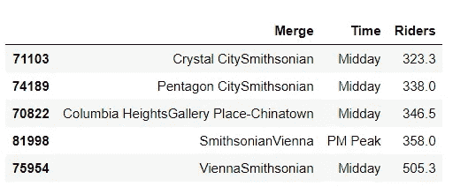

# 使用华盛顿 DC 地铁数据确定有利可图的广告位置

> 原文：<https://towardsdatascience.com/identify-profitable-advertising-locations-using-washington-dc-metro-data-a03c5c4fc18f?source=collection_archive---------59----------------------->

## [深入分析](https://towardsdatascience.com/in-depth-analysis/home)

## 使用 Python 中的骑手脚步数据进行简单分析


感谢:大卫·TRAN/SHUTTERSTOCK

在 DC 的华盛顿生活了一年，我开始意识到 WMATA 地铁是这个充满活力的城市的生命线。地铁网络庞大，在整个车管所区域连接良好。当我第一次搬到没有汽车的首都时，我经常跳上地铁四处走动。我一直喜欢坐火车旅行，因此不出所料，地铁成了我探索这座美丽城市最喜欢的方式。在旅途中，我经常注意到地铁站台上、自动扶梯/电梯附近、地铁车厢内等地方的产品广告。对地铁乘客数据的良好分析将有助于广告商识别哪些地铁站在什么时间最繁忙，从而增加广告曝光。我偶然发现了这个免费的数据集，并决定深入研究它。在本文中，我将向您介绍我的分析。

***第一步:导入必要库***

```
import pandas as pd
import numpy as np
import seaborn as sns
import matplotlib.pyplot as plt
import warnings
warnings.filterwarnings("ignore")
```

***第二步:读取数据***

让我们称我们的熊猫数据帧为“df_metro ”,它将包含原始数据。

```
df_metro = pd.read_csv("DC MetroData.csv"
```

***第三步:目测数据帧的数据和长度***

```
df_metro.head()
```


```
df_metro.columns
```


```
len(df_metro)
```


***第四步:检查不同列下的不同值***

让我们检查一下“时间”列中的唯一值是什么

```
df_metro['Time'].value_counts().sort_values()
```


“日”列中的唯一值如下:

```
df_metro['Day'].value_counts().sort_values()
```


下一步是分析几个问题。

# Q1。有哪些热门的出入口？

按降序排列的每个地铁站的不同记录计数将告诉我们哪些是受欢迎的入口和出口。

```
df_metro['Entrance'].value_counts().sort_values(ascending=False).head()
```


```
df_metro['Exit'].value_counts().sort_values(ascending=False).head()
```


热门地点似乎是

1.  **画廊区-唐人街:**主要景点有首都一号竞技场(吸引大量人群观看体育赛事和音乐会)、餐馆、酒吧等。
2.  雾谷:该地区的政府办公楼使其成为一个受欢迎的通勤目的地
3.  五边形城市:距离华盛顿市中心的国家广场仅 2 英里，这使得该地区成为酒店和企业的热门地点。
4.  **杜邦环岛:**位于该地区的国际使馆
5.  联合车站:长途旅行者的重要地点
6.  地铁中心:一个受欢迎的市中心位置
7.  托腾堡的地铁站是绿色、黄色和红色线路的热门换乘点

**要点:**广告商应该瞄准上述乘客流量高的热门地铁站，以最大限度地吸引买家的注意力。

# Q2。在一周的不同日子/时间，乘客量是什么样的？

这可以通过简单地绘制不同日期和时间的骑手数据来回答。我们将利用 seaborn 库来创建这个。

```
sns.set_style("whitegrid") 
ax = sns.barplot(x="Day", y="Riders", hue="Time",
             data = df_metro,
             palette = "inferno_r")
ax.set(xlabel='Day', ylabel='# Riders')
plt.title("Rider Footfall on different Days/Times")
plt.show(ax)
```


**外卖:**地铁是城市中工作通勤的热门选择，因此，正如所料，工作日期间乘客流量最高，尤其是在早高峰和晚高峰期间。计划推出新产品的公司应该瞄准这些时段，以吸引消费者的注意力并引起他们的兴趣。对于周末期间的广告机会，最有吸引力的时间段似乎是中午，紧随其后的是下午高峰。

# Q3。在一个典型的工作日期间有什么繁忙的路线？

为了分析这个问题，我们将考虑在任何给定的地铁站超过 500 名乘客的客流量。首先，我们将创建一个数据帧“busy_routes ”,其中包含关于超过 500 名乘客的路线的数据。其次，我们将过滤该数据帧，使其仅包含“AM 峰值”的数据。第三，我们将对过滤后的输出进行排序。

```
busy_routes = weekday[weekday['Riders']>500][['Merge', 'Time', 'Riders']]
peak_am = busy_routes.query('Time=="AM Peak"')
peak_am.sort_values('Riders').tail()
```


对“PM 峰值”重复相同的步骤。

```
peak_pm = busy_routes.query('Time=="PM Peak"')
len(peak_pm)
peak_pm.sort_values('Riders').tail()
```


**外卖:**我们看到，上午高峰期间客流量大的路线与下午高峰期间客流量大的路线相同，如西福尔斯教堂—法拉古西，维也纳—法拉古西，Shady Grove —法拉古北。这告诉我们，这些是受欢迎的工作通勤路线，因为人们在上午高峰期间去法拉格特工作，在下午高峰期间返回他们在维也纳/瀑布教堂/Shady Grove 的家。广告商应该瞄准这些高流量的通勤路线，以最大化他们的广告和产品植入。

# **Q4。周末最受欢迎的地铁路线是什么？**

让我们执行一个类似于工作日的分析。由于我们在这里处理周末数据，我们将考虑客流量超过 200 人的地铁站。

```
saturday = df_metro[df_metro['Day']=='Saturday']
busy_routes_sat = saturday[saturday['Riders']>200][['Merge', 'Time', 'Riders']]
busy_routes_sat.sort_values('Riders').tail()
```


```
sunday = df_metro[df_metro['Day']=='Sunday']
busy_routes_sun = sunday[sunday['Riders']>200][['Merge', 'Time', 'Riders']]
busy_routes_sun.sort_values('Riders').tail()
```



**要点:**史密森尼是一个非常受游客和城市居民欢迎的目的地，因为它有几个博物馆，并且靠近白宫、国会大厦、国家纪念碑、战争纪念馆等。我们的分析告诉我们，人群在中午从水晶城、五边形城、维也纳、弗兰科尼亚前往史密森尼博物馆，在下午高峰返回。这些人群中大多数是有孩子的年轻家庭，这是公司推出针对包括儿童在内的年轻人群的产品的理想受众。

# Q5。作为一名广告客户，我应该在深夜锁定哪些位置？

我们将做一个与上面类似的分析，以确定哪些地铁站是深夜投放广告的理想场所。对于“深夜”,我们将考虑客流量超过 50 人的地铁站。

```
late_night = df_metro[df_metro['Day']=='Late Night']
busy_routes_latenight = late_night[late_night['Riders']>50][['Merge', 'Time', 'Riders']]
busy_routes_latenight.sort_values('Riders').tail()
```


**外卖:**我们看到，深夜，乘客们从热门地点乘坐地铁，如画廊广场、克拉伦登、杜邦环岛和 U 街，夜生活热闹非凡。因此，想要吸引这部分人群(通常是较年轻的人群)的广告商应该潜在地瞄准这些地铁站来抓住最大的注意力。

**结束语:**这个数据集相当简单，因此，我们没有花太多时间清理和争论数据。有了给定的数据，我们就能找到最佳点，确保广告商的钱得到最大的回报。感谢阅读！