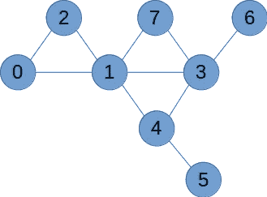
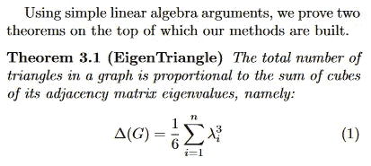

# 在无向图中识别良好连接的用户

> 原文：<https://towardsdatascience.com/identify-well-connected-users-in-a-social-network-19ea8dd50b16?source=collection_archive---------45----------------------->

## 该出版物主要讲述如何使用无向图和 Scipy 的稀疏矩阵实现(首席运营官)来存储数据，并通过计算三角形来分析用户连接。


艾莉娜·格鲁布尼亚克在 [Unsplash](https://unsplash.com?utm_source=medium&utm_medium=referral) 上的照片

我最近发现，我的一位前雇主有一个类似于脸书的社交网络，因此有大量数据迫不及待地需要分析。社交网络相当成熟，发展良好，最重要的是，也使用了很多。所以我决定更详细地研究一下关系数据。

在浏览网页的时候，我发现了一个让“计算连接质量”成为一个可行且有趣的任务的方法。这里的关键词是数三角形。这似乎是一个很好的方法，通过检查他们与第三方有多少关系来找到关系良好的用户。为了使这一点更具体，让我们做一个简单的例子。

> **甲认识乙，乙认识丙**。简单，没有三角形，因此不是我们要寻找的。
> 
> **A 认识 B** ，**B 认识 C** ，**C 认识 A** 。嗯，这正是我们要找的，因为我们在这里看到，这三个人在这个星座中最多有 2 个联系。因此，最大连接数。



无向示例图

```
graph = np.array([
    [0,1,1,0,0,0,0,0],
    [1,0,1,1,1,0,0,1],
    [1,1,0,0,0,0,0,0],
    [0,1,0,0,1,0,1,1],
    [0,1,0,1,0,1,0,0],
    [0,0,0,0,1,0,0,0],
    [0,0,0,1,0,0,0,0],
    [0,1,0,1,0,0,0,0]
])

from numpy import linalg
w,v = linalg.eig(graph)
w,v

round(np.sum(w**3) / 6,1)
```

卡内基梅隆大学【1】发表的一篇论文中关于矩阵中三角形计数的有趣实践。本文已经提供了非常容易理解的伪代码片段——但是，我们稍后将研究另一种方法。Charalampos E. Tsourakakis(卡内基梅隆大学)提出了一种经过广泛测试的精确方法(95%+)，通过“特征值的立方之和”来计算网络中的三角形。



C. E .措拉基斯的“特征三角形”

在常规的英语措辞中，我们是在计算一个无向图中三角形的总数，其中 lambda 表示第 I 个特征值。为了得到三角形的数目，我们需要特征值立方的和。请注意除以 6。这可以从一个三角形包含的三个节点中推导出来，由于我们将每个三角形计为 2，因此我们需要乘以分母，我们将在下面进一步找到这个“神奇的 6”。

如果你是那些“特征人”中的一员(笑话来自麻省理工学院的吉尔伯特·斯特朗教授[2])，我很确定上面的等式对你来说很有趣。根据 Tsourakakis 的说法，我们需要以下面陈述的形式提供数据。给定的 pseudo 和 Python 代码需要计算/创建邻接矩阵(“图”)和计算所有 Iλ:

对于你的计算机程序来说，这是一个非常简单的任务:

```
# a few lines implementing (1) from above
from numpy import linalg

def return_eig_triang(graph):
  w,v = linalg.eig(graph)
  w,v
  no_of_triangles = round(np.sum(w**3) / 6,1)
  return no_of_triangles # total triangles in the matrix
```

因此，我们现在看到的图形示例中共有 3 个三角形，这与我们在图表中看到的完全匹配。有三个三角形 *(0，1，2)* 、 *(1，3，4)* 和 *(1，3，7)* ，因此与用户 *5* 或 *6* 相比，用户 *0，1，2，3，4，7* 看起来连接得相当好。

现在让我们转到一个更随机的问题，我们之前没有调整数据，以观察特定的输出。为此，让我们创建一个人工稀疏数据集。我从可能有 20 个用户的数据集中选择了一个简单的随机样本——实际上这当然要多得多，因此我们将考虑一个通过坐标寻址的稀疏矩阵，尽管这对于我们的人工数据集来说不是必需的。

```
# create sparse dataset
connections_list = []

for i in range(31):
    connections = np.random.choice(21,2) # obviously, repeated values are likely, let's see whether we get triangles too..
    connections_list.append(list(connections))

print(connections_list)
```

现在我们可以检查我们的随机数据——请注意，我们也将坚持我们的第一个较小的例子来证明这个过程是可行的。在上面的几行中，我们创建了一些随机的连接。如果我们观察到(8，7)和(16，8)，我们将希望得到另一个(16，7)对，以便得到一个三角形。注意，用户不能和自己做朋友！

*random* 函数创建的内容如下——乍一看，我认为我们可以使用它(重复是好的，必须避免自引用):

```
[[2, 3], [18, 3], [14, 10], [2, 10], [3, 12], [10, 11], [19, 16], [7, 2], [6, 0], [14, 9], [11, 5], [12, 3], [19, 8], [9, 0], [4, 18], [12, 19], [10, 4], [3, 2], [16, 6], [7, 3], [2, 18], [10, 11], [8, 18], [2, 10], [19, 1], [17, 3], [13, 4], [2, 0], [17, 2], [4, 0], [1, 17]]
```

当首先检查两个坐标 X 和 Y 中的模式值时，我们得到与该模式同时出现的值 *{2，3，7，17}* 。查找这些值的查询很简单，我们只需检查每个列表的元素[0]或[1]是否等于我们的模式 *(X == 2) | (Y == 2)* 。因为我们打算将稀疏数据存储在各自的数据结构中，所以让我们继续讨论稀疏矩阵。为了这个目的，我创建了一个快速剪辑来支持你的理解。

```
# adding coordinates symmetrically
x,y = [],[]

for element in connections_list:
    xi = element[0]
    yi = element[1]

    x.append(xi)
    x.append(yi) # make symmetric
    y.append(yi)
    y.append(xi) # make symmetric

# create 'one' entries for the coo matrix
vals = np.ones(len(x))

# numpy(scipy.sparse)
from scipy.sparse import coo_matrix
m = coo_matrix((vals,(x,y)))
```

现在看来，三角形很可能出现在之前给出的集合中。以便在更大的范围内对特定行的三角形进行计数(其中每行代表*X【index _ number】*)—这与我们第一种方法不同，在第一种方法中，我们对所有三角形进行计数！—我们需要另一个方程来评估这个结果。

很长一段时间我都没能解决这个问题，但是当我做一些练习时，我发现了一个非常好的解决方案，它是由非常受赞赏的 Richard Vuduc 教授提出的[3](加州大学伯克利分校，佐治亚理工学院)。在寻找三角形的任务中，我借用了一种线性代数方法，这种方法我可以从 Vuduc 教授的一本出色的笔记本中学到。

首先，我们创建矩阵的点积(其中 M 和 M.T 总是相等的)。这将计算从一个用户到另一个用户的所有连接。正如我们将看到的，也有一些“过数”。当点积最终被初始矩阵 m 的成对乘法“掩盖”时，这些将消失

多么优雅的解决方案！

```
# dot & pairwise multiplication
# = connection count + "masking"

M = (m.dot(m)) * m
```

在最后一步，最终我们能够获得连接良好的用户，我们将计算每个用户的三角形数。请注意，任何给定的数字都不能被认为是“人 m 有 n 个三角形”，但结果可以排序，这将允许您识别最佳或最少连接的用户。

*备注:如前所述，如果我们把所有的连接加起来，然后用这个数除以我们的 6 ( 1/3 代表三角形，1/2 代表我们把三角形数为 2)，我们将再次看到三角形连接的总数。*

正如已经从获得的模式值中假设的，与用户 2 的连接最有可能导致三角形，这也可以在我们的示例数据中观察到。高三角形值用星号突出显示:

```
# obtaining "triangle-values" is easy:
np.sum(M.toarray(), axis=1)
```

```
user:  0 	Triangle value:  [[66.]]
user:  1 	Triangle value:  [[26.]]
user:  2 	Triangle value:  [[**187.**]] *****
user:  3 	Triangle value:  [[**167.**]] *****
user:  4 	Triangle value:  [[69.]]
user:  5 	Triangle value:  [[13.]]
user:  6 	Triangle value:  [[22.]]
user:  7 	Triangle value:  [[70.]]
user:  8 	Triangle value:  [[30.]]
user:  9 	Triangle value:  [[24.]]
user:  10 	Triangle value:  [[**127.**]] *****
user:  11 	Triangle value:  [[59.]]
user:  12 	Triangle value:  [[71.]]
user:  13 	Triangle value:  [[15.]]
user:  14 	Triangle value:  [[34.]]
user:  15 	Triangle value:  [[0.]]
user:  16 	Triangle value:  [[15.]]
user:  17 	Triangle value:  [[77.]]
user:  18 	Triangle value:  [[93.]]
user:  19 	Triangle value:  [[39.]]
```

从这个例子中我们可以得出:与三角形相关的值确实具有相对较高的值，但是我们还需要考虑额外的**简单连接也会增加我们的整体值**。这尤其可以在非三角形和三角形的情况下 *10* 和 *17* 中观察到。

正如我前面提到的，我们将再次查看我们的起始示例，以确保我们的结果是可信的。由于用户 1 是 3 个整体三角形的一部分，我们当然希望这个用户有最高的分数。将完全相同的步骤应用于我们的第一个小型数据集的结果证实了我们的预期，并显示了以下内容:

```
user:  0 	Triangle value:  2
user:  1 	Triangle value:  6
user:  2 	Triangle value:  2
user:  3 	Triangle value:  4
user:  4 	Triangle value:  2
user:  5 	Triangle value:  0
user:  6 	Triangle value:  0
user:  7 	Triangle value:  2
```

我希望我能为您提供一个小而有用的例子，说明如何识别无向图中的连通项，并使用稀疏矩阵来存储和处理数据。我很想听听，你是如何将这种逻辑应用到其他话题上的。下次见

[1]charalappos e . Tsourakakis，大型真实网络中三角形的快速计数:算法和法则

[2]https://www.youtube.com/watch?麻省理工学院 Gilbert Strang 教授 v=cdZnhQjJu4I

Richard Vuduc 教授，CSE 6040，https://cse6040.gatech.edu/fa17/details/