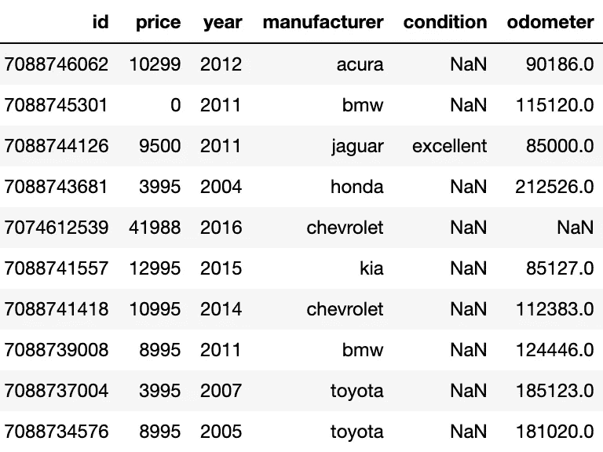
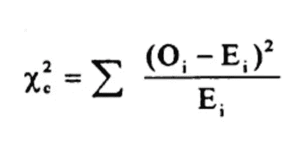
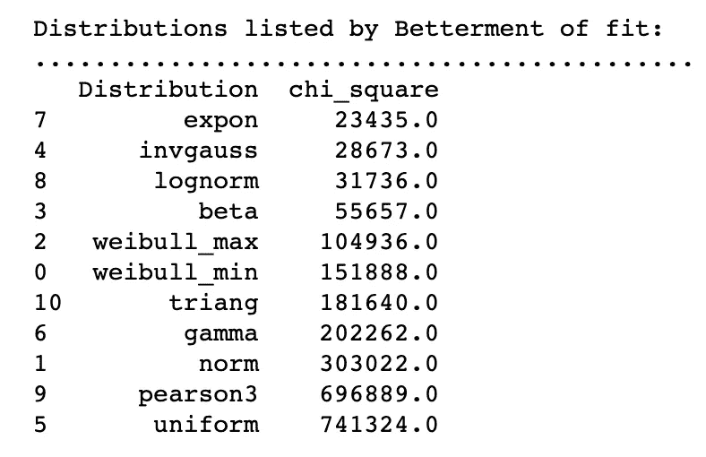
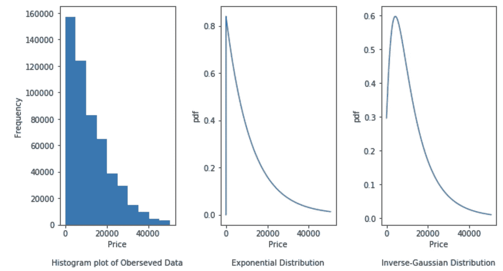
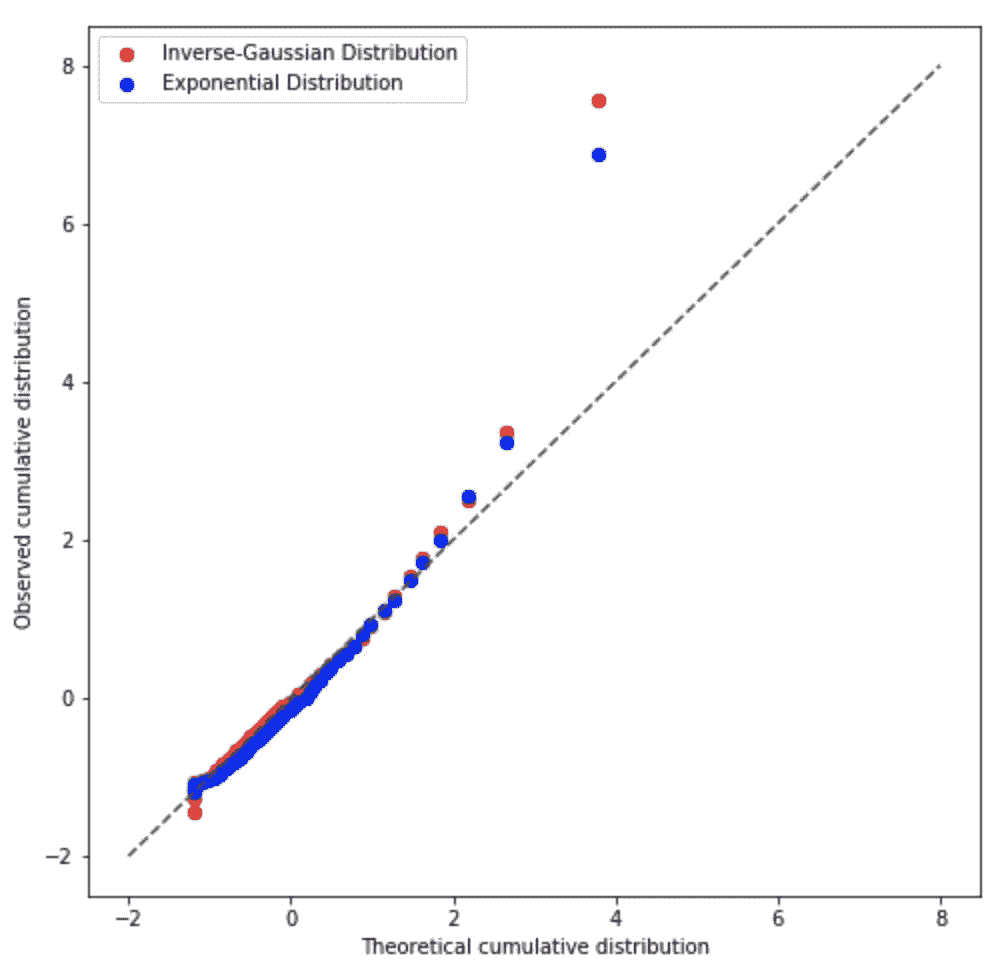
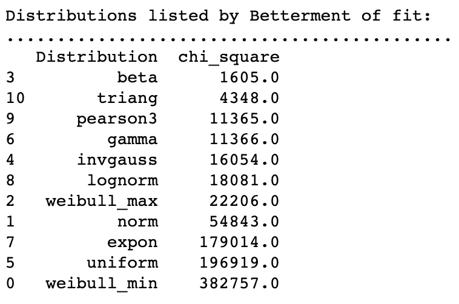
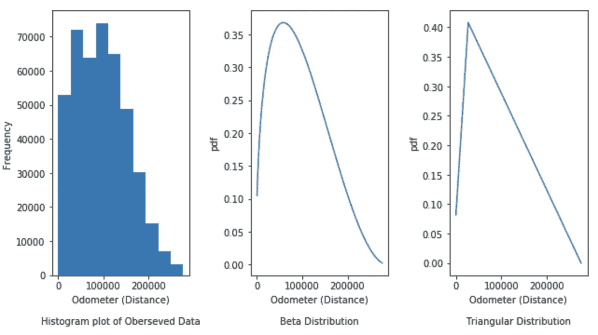
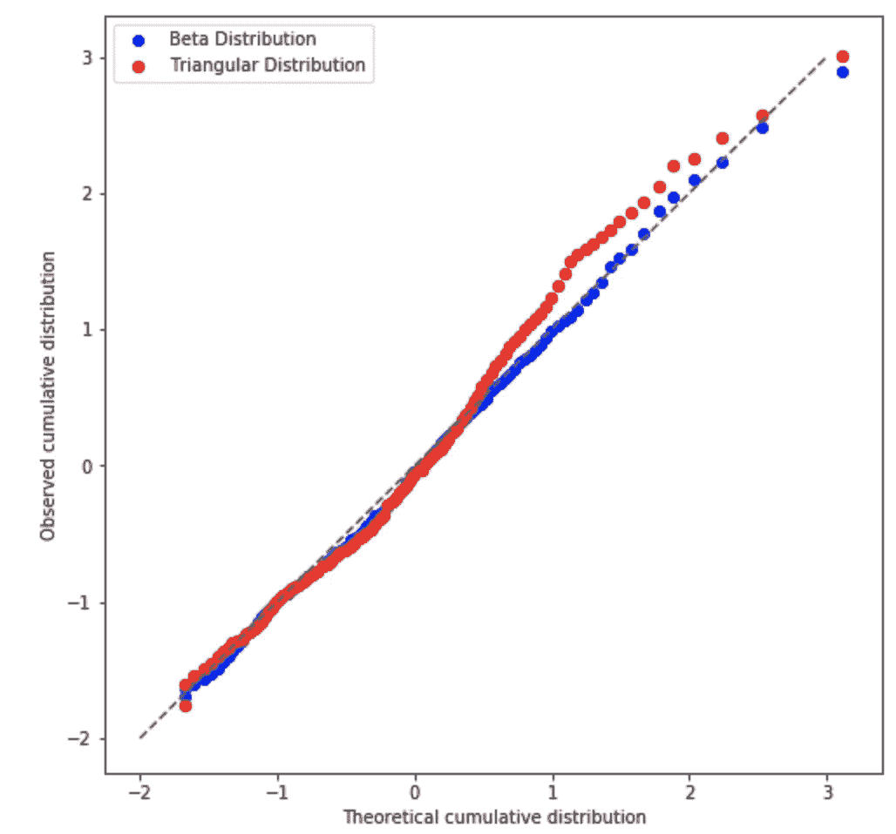

# 确定数据的分布

> 原文：<https://towardsdatascience.com/identify-your-datas-distribution-d76062fc0802?source=collection_archive---------2----------------------->

## 你的分布假设正确吗？让我们找出它。


卢克·切尔在 [Unsplash](https://images.unsplash.com/photo-1551288049-bebda4e38f71?ixlib=rb-1.2.1&ixid=eyJhcHBfaWQiOjEyMDd9&auto=format&fit=crop&w=1650&q=80) 上的照片

每天我们都会遇到各种数据，如传感器数据、销售数据、客户数据、流量数据等。此外，根据用例的不同，我们会进行各种处理，并在上面尝试几种算法。您是否想过这些关于您的数据的问题:

> 你的数据是什么样的？
> 
> 你对它的价值有信心吗？极值‘x’出现的可能性有多大？
> 
> 您应用的算法可能会对数据分布做出一些假设，这些假设是正确的吗？
> 
> 数据分布会随着时间或特殊季节而变化吗？

数据分布是一个列出数据可能取的所有值的函数。它可以是一个[连续的](https://en.wikipedia.org/wiki/List_of_probability_distributions#Continuous_distributions)或[离散的](https://en.wikipedia.org/wiki/List_of_probability_distributions#Discrete_distributions)数据分布。几种已知的标准概率分布函数提供了实验中不同可能结果出现的概率。一些[众所周知的概率分布](https://en.wikipedia.org/wiki/List_of_probability_distributions)有[正态](https://en.wikipedia.org/wiki/Normal_distribution)、[对数正态](https://en.wikipedia.org/wiki/Log-normal_distribution)、[β](https://en.wikipedia.org/wiki/Beta_distribution)、[γ](https://en.wikipedia.org/wiki/Gamma_distribution)等。其具有标准形式。

> 但是，挑战在于现实世界的数据可能不遵循任何众所周知的概率分布。在这种情况下，我们可以近似最可能的概率分布，并检查其拟合优度。

通过这篇博客，我打算强调了解你的数据和近似它的概率分布的好处。我还将展示如何做到这一点的实际例子，并测量拟合分布与观察分布的拟合优度。博客中使用的数据集是 [*Kaggle 的二手车数据集*](https://www.kaggle.com/austinreese/craigslist-carstrucks-data) *。这篇博文中用到的代码可以从* [*这里*](https://github.com/samread81/Distribution-Fitting-Used_Car_Dataset) *下载。*

# 了解数据潜在概率分布的优势

## 1.良好实践

一旦开始处理数据，了解数据是一个很好的习惯。许多算法，如线性回归，假设变量遵循特定的分布。不符合假设的成本有时会很高。

## 2.附加置信区间

知道了底层的概率分布，我们就可以找到它的[概率密度函数](https://en.wikipedia.org/wiki/Probability_density_function)。这有助于我们将置信区间与数据可能取值的范围联系起来。我们也可以求出极值出现的概率。

## 3.记录分布如何随着时间的推移或在特殊事件/季节中发生变化

分布有参数。有了这些参数，我们可以跟踪分布如何随着时间的推移或在特定的季节/事件中发生变化。

## 4.众所周知的统计特性

标准概率分布具有众所周知的统计特性，这简化了我们的工作。我们可以用几个参数来解释数据及其行为。

# 近似数据分布

对于这篇博客，我将使用 [Kaggle 二手车数据集](https://www.kaggle.com/austinreese/craigslist-carstrucks-data)。我们将尝试近似各种变量的分布，并检查其拟合优度。我过滤掉了几列。让我们来看看数据:



二手车数据集的几行

> Id:识别车辆的唯一标识符
> 
> 价格:车辆的销售价格
> 
> 年份:制造年份
> 
> 制造商:汽车的品牌
> 
> 状况:汽车状况
> 
> 里程表:里程表读数表示行驶的距离

数据集有 539K 条记录。我们将尝试识别/近似'*价格'*和'*里程表'*变量的分布。

# 近似“价格”的概率分布函数

[Python 的 Scipy 库](https://docs.scipy.org/doc/scipy/reference/stats.html)允许估计 200+分布的参数。此外，拟合优度可以通过各种度量来测试，如[卡方统计](https://en.wikipedia.org/wiki/Reduced_chi-squared_statistic)、[科尔莫戈罗夫-斯米尔诺夫测试](https://en.wikipedia.org/wiki/Kolmogorov%E2%80%93Smirnov_test)、 [QQ 图](https://en.wikipedia.org/wiki/Q%E2%80%93Q_plot)等。

## 卡方统计

> 根据 Adam Hayes[的博客](https://www.investopedia.com/contributors/53677/)，卡方(χ2)统计是一种测试，用于衡量预期与实际观察数据(或模型结果)的对比情况。用于计算卡方统计的数据必须是随机的、原始的、互斥的、来自独立变量的、来自足够大的样本的。例如，投掷一枚硬币 100 次的结果符合这些标准。[[[Source invest opedia](https://www.investopedia.com/terms/c/chi-square-statistic.asp)]]
> 
> 卡方统计的公式如下-



χ2 统计量的计算公式([公式复制自](https://www.investopedia.com/terms/c/chi-square-statistic.asp))

> 其中 c 是[自由度](https://en.wikipedia.org/wiki/Degrees_of_freedom_(statistics))，O 是观察值，E 是期望值。

文章链接

[](https://www.investopedia.com/terms/c/chi-square-statistic.asp) [## 卡方统计定义

### 卡方(χ 2)统计是一种测试，用于衡量期望值与实际观察到的数据(或模型…

www.investopedia.com](https://www.investopedia.com/terms/c/chi-square-statistic.asp) 

一定要看看我关于卡方统计测试的博客来决定打赌的赢家。

[](https://medium.com/analytics-vidhya/whos-right-the-manager-or-the-restuarant-owner-aaa9b92e153f) [## 统计数据决定赢家的力量

### 谁是对的？经理还是餐馆老板？

medium.com](https://medium.com/analytics-vidhya/whos-right-the-manager-or-the-restuarant-owner-aaa9b92e153f) 

## 科尔莫戈罗夫-斯米尔诺夫试验

俗称 K-S 检验，用于检验观察分布与理论分布的[拟合优度](https://en.wikipedia.org/wiki/Goodness_of_fit)。

这里有一篇关于这个话题的文章。

[](https://www.tutorialspoint.com/statistics/kolmogorov_smirnov_test.htm) [## 统计学— Kolmogorov Smirnov 检验

### 该测试用于必须在观察到的样本分布和…之间进行比较的情况

www.tutorialspoint.com](https://www.tutorialspoint.com/statistics/kolmogorov_smirnov_test.htm) 

## QQ 图

根据[维基百科](https://en.wikipedia.org/wiki/Q%E2%80%93Q_plot)，QQ 图是一种通过绘制两个概率分布的分位数来比较它们的图形方法。

*这里有一个关于 QQ plots 的有趣的 StatQuest 视频*

[Josh Starmer](https://www.youtube.com/channel/UCtYLUTtgS3k1Fg4y5tAhLbw)在 QQ-plots 上发布的 StatQuest 视频

通过足够好的复习，我们都可以开始我们的主要任务分配拟合。

我们将尝试使用以下分布来估算' *price'* ,看看哪种分布在卡方统计方面表现最佳-

```
dist_names = [‘weibull_min’,’norm’,’weibull_max’,’beta’,
              ‘invgauss’,’uniform’,’gamma’,’expon’,   
              ‘lognorm’,’pearson3',’triang’]
```

为了得到稳定的结果，我去除了极端的异常值(两端各 1%的数据)。拟合分布:

Python 代码使用 Scipy 库来适应发行版

拟合分布和检查拟合优度

基于卡方统计的不同分布拟合和拟合优度检验

按拟合优度排序的输出如下所示:



就拟合优度而言，前两种分布是[指数分布](https://en.wikipedia.org/wiki/Exponential_distribution)和[逆高斯分布](https://en.wikipedia.org/wiki/Inverse_Gaussian_distribution)

这两种分布的参数是:

```
**Parameters of Exponential Distribution**
<scipy.stats._continuous_distns.expon_gen object at 0x12abd2390>
(loc = -1.19, scale = 1.19)
where Lambda = 1/scale**Parameters of Inverse Gaussian Distribution** <scipy.stats._continuous_distns.invgauss_gen object at 0x12ac90c50>
(mu = 0.45, loc = -1.64, scale = 3.61)
```

> 除分布参数外， [Scipy 库](https://docs.scipy.org/doc/scipy/reference/stats.html)还提供 loc 和 scale 参数。Loc 参数将分布移动适当的量，Scale 参数根据需要拉伸分布。

[](https://docs.scipy.org/doc/scipy/reference/stats.html) [## 统计函数(scipy.stats) — SciPy v1.4.1 参考指南

### 这个模块包含了大量的概率分布以及不断增长的统计函数库。

docs.scipy.org](https://docs.scipy.org/doc/scipy/reference/stats.html) 

让我们想象一下结果:

```
fig, axes = plt.subplots(nrows=1, ncols=3, figsize=(9, 5))# Histogram Plot of Observed Data
axes[0].hist(y)#Exponential Distribution Fitting
axes[1].plot(y,expon.pdf(y_std,-1.19, 1.19))#Inverse-Gaussian Distribution Fitting
axes[2].plot(y,invgauss.pdf(y_std,0.45, -1.64, 3.61))fig.tight_layout()
```



观察数据和拟合分布

> 这两种分布都表现得相当不错。指数分布比逆高斯分布略胜一筹。卡方统计也表明了同样的情况。

让我们也分析一下 QQ 的情节



QQ 情节

> 这两个发行版都做得相当好。在近似“价格”数据方面，指数略优于逆高斯。

# “里程表”概率分布函数的近似

我们将尝试使用以下分布对'*里程表'*'进行近似，并查看哪种分布在卡方统计方面表现最佳-

```
dist_names = [‘weibull_min’,’norm’,’weibull_max’,’beta’,
              ‘invgauss’,’uniform’,’gamma’,’expon’,   
              ‘lognorm’,’pearson3',’triang’]
```

为了得到稳定的结果，我去除了极端的异常值(两端各 1%的数据)。拟合分布:

Python 代码使用 Scipy 库来适应发行版

拟合分布和检查拟合优度

基于卡方统计的不同分布拟合和拟合优度检验

按拟合优度排序的输出如下所示:



拟合优度排名前 2 的分布是[贝塔](https://en.wikipedia.org/wiki/Beta_distribution)和[三角分布](https://en.wikipedia.org/wiki/Triangular_distribution)。然而，卡方统计中的差异非常大，Beta 似乎是明显的赢家。

这两种分布的参数是:

```
**Parameters of Beta Distribution**
<scipy.stats._continuous_distns.beta_gen object at 0x12abb72d0>
(a = 1.51, b = 2.94, loc = -1.71, scale = 5.02)**Parameters of Triangular Distribution** <scipy.stats._continuous_distns.triang_gen object at 0x12acf4050>
(c = 0.12, loc = -1.79, scale = 4.90)
```

> 除了分布参数之外， [Scipy 库](https://docs.scipy.org/doc/scipy/reference/stats.html)还提供了 loc 和 scale 参数。Loc 参数将分布移动适当的量，Scale 参数根据需要拉伸分布。

[](https://docs.scipy.org/doc/scipy/reference/stats.html) [## 统计函数(scipy.stats) — SciPy v1.4.1 参考指南

### 这个模块包含了大量的概率分布以及不断增长的统计函数库。

docs.scipy.org](https://docs.scipy.org/doc/scipy/reference/stats.html) 

让我们想象一下结果:



观察数据和拟合分布

> 贝塔分布比三角分布表现好得多。从视觉上看，其清晰的卡方统计数据也表明了这一点。

让我们也分析一下 QQ 的情节



QQ 情节

> QQ 图也清楚地表明，Beta 分布很好地逼近了“里程表”(距离)数据。

# 结论

在这篇博文中，我介绍了在分析数据或对数据应用算法之前了解数据的优势。了解/逼近数据的概率分布也有助于我们使用其统计属性，并为其可能取值附加置信区间。我还介绍了如何使用 Python 实现这一点，并介绍了各种度量标准来检查拟合度。使用的 Kaggle 数据集可以从[这里](https://www.kaggle.com/austinreese/craigslist-carstrucks-data)下载。项目的代码可以从[这里](https://github.com/samread81/Distribution-Fitting-Used_Car_Dataset)下载。

> 如果你有任何疑问，请联系我。我很想知道你是否有一些有趣的问题要解决，并认为近似数据的概率分布会有所帮助。

***我的 Youtube 频道获取更多内容:***

[](https://www.youtube.com/channel/UCg0PxC9ThQrbD9nM_FU1vWA) [## 阿布舍克·蒙戈利

### 嗨，伙计们，欢迎来到频道。该频道旨在涵盖各种主题，从机器学习，数据科学…

www.youtube.com](https://www.youtube.com/channel/UCg0PxC9ThQrbD9nM_FU1vWA) 

> ***关于作者-:***
> 
> Abhishek Mungoli 是一位经验丰富的数据科学家，拥有 ML 领域的经验和计算机科学背景，跨越多个领域并具有解决问题的思维方式。擅长各种机器学习和零售业特有的优化问题。热衷于大规模实现机器学习模型，并通过博客、讲座、聚会和论文等方式分享知识。
> 
> 我的动机总是把最困难的事情简化成最简单的版本。我喜欢解决问题、数据科学、产品开发和扩展解决方案。我喜欢在闲暇时间探索新的地方和健身。在 [**中**](https://medium.com/@mungoliabhishek81) 、**[**Linkedin**](https://www.linkedin.com/in/abhishek-mungoli-39048355/)**或**[**insta gram**](https://www.instagram.com/simplyspartanx/)**关注我，查看我[以前的帖子](https://medium.com/@mungoliabhishek81)。我欢迎反馈和建设性的批评。我的一些博客-********

*   ******每个数据科学家都应该避免的 5 个错误******
*   ******[以简单&直观的方式分解时间序列](/decomposing-a-time-series-in-a-simple-and-intuitive-way-19d3213c420b?source=---------7------------------)******
*   ******[GPU 计算如何在工作中真正拯救了我？](https://medium.com/walmartlabs/how-gpu-computing-literally-saved-me-at-work-fc1dc70f48b6)******
*   ******信息论& KL 分歧[第一部分](/part-i-a-new-tool-to-your-toolkit-kl-divergence-5b887b5b420e)和[第二部分](/part-2-a-new-tool-to-your-toolkit-kl-divergence-736c134baa3d)******
*   ******[使用 Apache Spark 处理维基百科，创建热点数据集](/process-wikipedia-using-apache-spark-to-create-spicy-hot-datasets-1a59720e6e25)******
*   ******[一种基于半监督嵌入的模糊聚类](/a-semi-supervised-embedding-based-fuzzy-clustering-b2023c0fde7c)******
*   ******[比较哪种机器学习模型表现更好](/compare-which-machine-learning-model-performs-better-4912b2ed597d)******