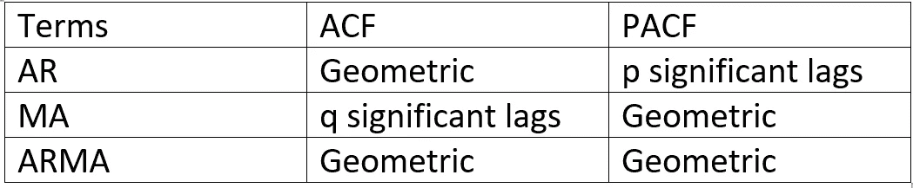
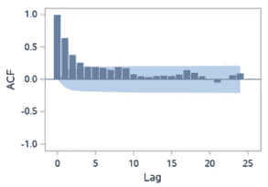
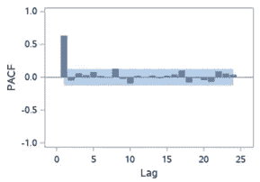
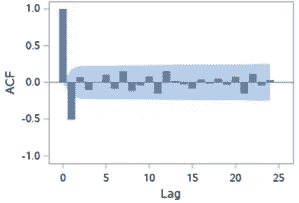
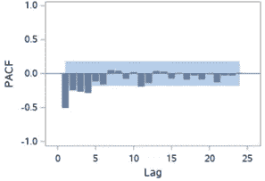
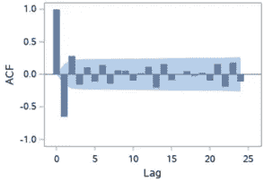
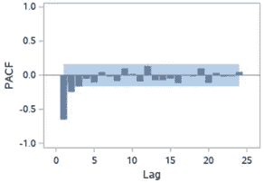

# 时间序列分析:使用 ACF 和 PACF 图识别 AR 和 MA

> 原文：<https://towardsdatascience.com/identifying-ar-and-ma-terms-using-acf-and-pacf-plots-in-time-series-forecasting-ccb9fd073db8?source=collection_archive---------1----------------------->

尼克·崇在 [Unsplash](https://unsplash.com?utm_source=medium&utm_medium=referral) 上的照片

选择候选的**自回归移动平均** (ARMA)模型用于时间序列分析和预测，理解序列的**自相关函数** (ACF)和**偏自相关函数** (PACF)图对于确定 AR 和/或 MA 项的顺序是必要的。虽然 ACF 和 PACF 没有直接规定 ARMA 模型的顺序，但这些图可以帮助理解顺序，并提供一个模型可以很好地适合时间序列数据的想法。在这篇文章中，我主要分享了我在理解 ACF、PACF 图以及它们在选择 ARMA 模型阶数时的重要性方面的经验。

**ACF 图**是时间序列与其滞后值之间相关系数的条形图。简而言之:ACF 解释了给定时间序列的现值如何与过去(1 个单位的过去，2 个单位的过去，…，n 个单位的过去)的值相关联。在 ACF 图中，y 轴表示相关系数，而 x 轴表示滞后次数。假设，y(t-1)， *y(t)，y(t-1)，…。y(t-n)* 是一个时间序列在 *t，t-1，…，t-n，*时刻的值，那么 lag-1 值就是 *y(t)* 和 *y(t-1)* 之间的相关系数，lag-2 就是 *y(t)* 和 *y(t-2)* 之间的相关系数，以此类推。

**PACF** 是偏自相关函数，解释了序列和滞后本身之间的偏相关性。简单地说，PACF 可以用线性回归来解释，我们从 *y(t-1)，y(t-2)，*和*y(t-3)*【2】预测 *y(t)* 。在 PACF，我们将 *y(t)* 和 *y(t-3)* 中未被 *y(t-1)* 和 *y(t-2)* 预测的“部分”关联起来。

**通过 ACF 和 PACF 图识别 AR 和 MA 订单:**

假设时间序列是平稳的，如果不是，那么我们可以执行序列的变换和/或差分，以将序列转换为平稳过程。一旦序列稳定下来，我们就可以绘制 ACF 图和 PACF 图来确定 ARMA 模型中 AR 项和 MA 项的阶数。有时，仅 AR 项或 MA 项就足以对流程建模。表 1 解释了如何根据 ACF 和 PACF 选择 AR 和 MA 术语[1]:

表 1:基于 ACF 和 PACF 的 AR 和 MA 术语

ACF 和 PACF 图应一起考虑，以确定该过程。对于 AR 过程，我们预计 ACF 曲线将逐渐下降，同时 PACF 在 p 显著滞后后将急剧下降。为了定义 MA 过程，我们期望从 ACF 和 PACF 图中得到相反的结果，这意味着:ACF 应该在某个 q 数量的滞后之后显示急剧下降，而 PACF 应该显示几何或逐渐下降的趋势。另一方面，如果 ACF 和 PACF 曲线都表现出逐渐下降的模式，那么 ARMA 过程应该被考虑用于建模。

图 1 和 2 示出了给定平稳时间序列数据的 ACF 和 PACF。ACF 显示出逐渐降低的趋势，而 PACF 在一个滞后之后立即降低。因此，图表表明 AR (1)模型将适用于时间序列。

图 1:时间序列的自相关函数

图 2:时间序列的部分自相关函数

图 3 和图 4 分别示出了平稳时间序列的 ACF 和 PACF。ACF 和 PACF 图表明，MA (1)模型将适用于时间序列，因为 ACF 在 1 个滞后之后切割，而 PACF 显示出缓慢下降的趋势。

图 3:时间序列的自相关函数

图 4:时间序列的部分自相关函数

图 5 和图 6 显示了另一个平稳时间序列数据 ACF 和 PACF。ACF 和 PACF 都显示缓慢衰减(逐渐降低)。因此，ARMA (1，1)模型将适用于该系列。再次观察 ACF 图:它在两个显著滞后之后急剧下降，这表明 MA (2)将是该过程的良好候选模型。因此，我们应该对该过程使用 ARMA (1，1)和 MA (2)进行试验，然后根据 AIC(赤池信息标准)等性能指标选择最佳模型。

图 5:时间序列的自相关函数

图 6:时间序列的部分自相关函数

总之，理解 ACF 和 PACF 图对于确定 AR 和 MA 项的顺序以选择合适的候选模型是必要的。

我还写了一篇文章，讨论如何为真实世界的时间序列数据选择最佳的 ARIMA 模型。你可以点击链接阅读:

 [## 现实世界的时间序列数据分析和预测

### 应用 ARIMA 模型预测时间序列数据

towardsdatascience.com](/a-real-world-time-series-data-analysis-and-forecasting-121f4552a87) 

另一个有趣的阅读- [**如何在预处理步骤中避免数据泄露**](https://medium.com/mlearning-ai/experimental-setting-in-machine-learning-how-to-deal-with-data-leakage-48169c48c347)

# 阅读马苏姆的每一个故事(以及媒体上成千上万的其他作家)。

你的会员费将直接支持和激励你所阅读的作家。你还可以在媒体上看到所有的故事—【https://masum-math8065.medium.com/membership】

****读书快乐！****

**参考**

**[1]https://rinterested.github.io/statistics/arima.html**

**[2][https://r studio-pubs-static . S3 . Amazon AWS . com/19198 _ ABA 6 db cabd 0748159 E3 f 395 cc 02 c0f 0 c . html](https://rstudio-pubs-static.s3.amazonaws.com/19198_aba6dbcabd0748159e3f395cc02c0f0c.html)**