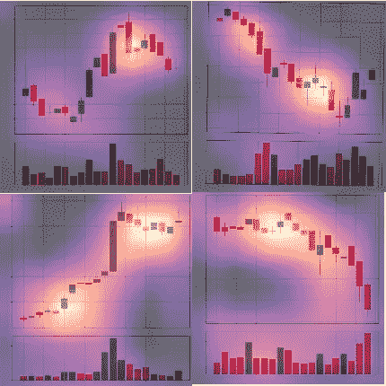

# 使用深度学习识别烛台模式

> 原文：<https://towardsdatascience.com/identifying-candlestick-patterns-using-deep-learning-b7d706726874?source=collection_archive---------2----------------------->

## 在蜡烛图上训练一个神经网络，然后用它来识别蜡烛图上的模式

使用下述方法生成的一些热图(图片由作者提供)。

最近我完成了一个非常有趣的项目，其中我试图使用深度学习来识别大型印度股票图表上的烛台模式，结果非常有趣！这个博客是一个教程，这样你就可以自己尝试这个迷人的“实验”。

> 我称之为“实验”,是为了强调这是一个实验，并明确表示你不应该根据这里给出的内容做出任何财务决策！

简言之，我们将执行以下步骤(使用 python):

*   使用 python 库 nsepy 收集多只股票的每日历史股票数据。
*   将数据转换成蜡烛图。
*   根据特定方向的百分比运动(收盘价),给蜡烛图贴上“上升”或“下降”的标签。
*   在数据上训练深度学习模型。
*   获取感兴趣的区域(基于激活值)并使用热图对其进行可视化。

你可以在这里找到包含这个项目[的 Jupyter 笔记本的 GitHub repo。随着我们的发展，我们将需要以下库:](https://github.com/shaan2909/Deep-Learning-for-Candle-Stick-Patterns-Identification)

*   nsepy
*   熊猫
*   numpy
*   matplotlib
*   法斯泰

我将一段一段地解释代码。所以让我们开始吧！

在上面这段代码中，我们定义了获取历史股票数据并为其绘制蜡烛图的函数。简要概述:

*   函数“获取数据”将股票代码、开始和结束日期作为输入，给出一个包含股票数据的 Pandas 数据帧。
*   函数“plot_candles”(最初是由 Daniel Treiman 编写的，我对它做了一些小的改动)接收熊猫数据帧并输出一个蜡烛图。

很抱歉输出这么长，但我希望如此，以便让您了解代码是如何工作的。

在以上部分，我们将完成以下步骤:

*   使用“获取数据”功能获取历史股票数据(过去两年)。
*   根据未来五天的走势，决定一个特定的图表是应该分类为“上涨”还是“下跌”。
*   创建一个 20 天的蜡烛图。
*   将蜡烛图保存到各自的文件夹中(向上/向下)。
*   对许多不同的股票重复上述步骤。

我们现在完成了数据收集；开始训练模型吧！

在上面这段代码中，我们正在设置数据，以便我们可以使用它来训练深度学习模型。我们正在完成以下任务:

*   为模型定型设置批量大小。
*   将数据分成训练和验证数据集。
*   对数据应用扩充(以减少过度拟合)。

现在开始训练模型吧！

我们在上面训练了一个深度学习模型(在验证集上的准确率接近 62 %)。我们所做的更详细的概述如下:

*   使用迁移学习，以适当的学习速率在我们的图表上训练预训练的神经网络。
*   增加了我们图像的尺寸(之前的训练周期是 224 乘 224，然后我们增加到 352 乘 352)
*   再次使用迁移学习，以适当的学习速率在新的较大图像上训练先前的网络。

在我们的验证数据集上，我们获得了近 62 %的准确率！

现在，我们将创建热图，突出显示使用激活的神经网络感兴趣的区域。让我们这样做吧！

我们完成了上一节中的以下步骤:

*   创建了一个要分析的所有图表的列表(这些图表被高度准确地预测)。
*   从上面的列表中获得一个特定的图像，并将其传输到 GPU。
*   在向前传递以获得激活的过程中，使用钩子钩住模型。
*   使用 matplotlib 激活创建热图。
*   保存了热图。

瞧啊。我们设法训练了一个神经网络，并用它来识别蜡烛图中的模式。

> **我想再次强调，请不要使用此处给出的任何内容来做出任何财务决定！**

希望你喜欢看这个博客，
谢谢你一直读到最后！

附注
如有任何问题或建议，请随时通过 [LinkedIn](https://www.linkedin.com/in/shaan-shah-88085819b/) 与我联系。

P.P.S.
我已经生成了许多烛台图表的热图，如果你想看看它们，请随时联系 [me](https://www.linkedin.com/in/shaan-shah-88085819b/) 。